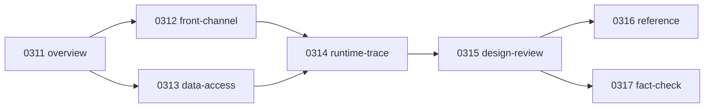

# 문서맵

## 1. 목적

이 문서는 `old` 문서와 현재 루트 기준본의 대응 관계를 촘촘하게 보여주는 맵이다.

원칙은 아래와 같다.

- 읽기는 루트 `0311~0317`을 우선한다
- `old`는 과거 조사본/세부 근거 보존용으로만 본다
- 하나의 old 문서가 여러 기준본으로 분해될 수 있다

## 2. 기준본 읽기 경로

## 3. index

- `0310.index/01.README.md`
  - 메인 탐색 흐름
- `0310.index/02.문서맵.md`
  - old -> 기준본 매핑
- `0310.index/03.약어-용어집.md`
  - 약어, 클래스명, 파일군, 대표 사례 색인

## 4. overview 매핑

### old
- `old/0311.overview/01.DevOn-vs-Struts1.md`
- `old/0311.overview/02.DevOn-Architecture-overview.md`
- `old/0311.overview/03.DevOn-Tree-구성요소.md`

### 기준본
- `0311.overview/01.Framework-개요.md`
  - 전체 구조를 4층으로 정리한 첫 진입 문서
- `0311.overview/02.DevOn-vs-Struts1.md`
  - Struts1과 DevOn 차이 요약
- `0311.overview/03.Architecture-overview.md`
  - 요청 흐름 기준 아키텍처 요약
- `0311.overview/04.Tree-구성요소.md`
  - 추적 트리 관점 정리

### 대응 해석
- old `Architecture-overview`의 큰 그림은
  - `01.Framework-개요.md`
  - `03.Architecture-overview.md`
  로 분해됐다.
- old `Tree-구성요소`의 추적 관점은
  - `04.Tree-구성요소.md`
  로 정리됐다.

## 5. front-channel 매핑

### old
- `old/0312.front-channel/01.MiplatformConverter.md`
- `old/0312.front-channel/02.ServiceProxy-Interceptor-Dispatch.md`
- `old/0312.front-channel/03.Command-Navigation-PC-EC-UC.md`
- `old/0312.front-channel/04.DataSource-ServiceProxy-ExecutionChain.md`

### 기준본
- `0312.front-channel/01.Front-Channel-개요.md`
  - front channel 전체 체인 요약
- `0312.front-channel/02.Command-Navigation-Dispatch.md`
  - `.mhi -> navigation -> command -> PC/UC/EC`
- `0312.front-channel/03.ServiceProxy-Interceptor.md`
  - service proxy, service spec, stack 요약
- `0312.front-channel/04.Miplatform.md`
  - MiPlatform request/convert/response 요약

### 대응 해석
- old `MiplatformConverter` 문서는
  - `04.Miplatform.md`
  로 수렴된다.
- old `ServiceProxy-Interceptor-Dispatch` 문서는
  - `03.ServiceProxy-Interceptor.md`
  로 압축됐다.
- old `Command-Navigation-PC-EC-UC` 문서는
  - `02.Command-Navigation-Dispatch.md`
  로 재정리됐다.
- old `DataSource-ServiceProxy-ExecutionChain` 문서는
  - front 성격은 `01.Front-Channel-개요.md`
  - infra 성격은 `0313.data-access/04.Connection-Pool-TX.md`
  로 나뉘었다.

## 6. data-access 매핑

### old
- `old/0313.data-access/01.DAO-DataAccess-TX-JDBC-Pool.md`
- `old/0313.data-access/02.Connection-Pool-TX-내부동작.md`
- `old/0313.data-access/03.XML-Query-내부동작.md`

### 기준본
- `0313.data-access/01.Data-Access-개요.md`
  - 전체 DB 접근 구조 첫 진입
- `0313.data-access/02.LCommonDao-LQueryMaker.md`
  - `LCommonDao`, `LQueryMaker`, query path 규칙
- `0313.data-access/03.XML-Query-실행구조.md`
  - query path -> xmlquery -> SQL 준비
- `0313.data-access/04.Connection-Pool-TX.md`
  - DataSource, pool, tx 해석

### 대응 해석
- old `DAO-DataAccess-TX-JDBC-Pool`의 큰 그림은
  - `01.Data-Access-개요.md`
  - `02.LCommonDao-LQueryMaker.md`
  로 나뉘었다.
- old `XML-Query-내부동작`은
  - `03.XML-Query-실행구조.md`
  로 정리됐다.
- old `Connection-Pool-TX-내부동작`은
  - `04.Connection-Pool-TX.md`
  로 정리됐다.

## 7. runtime-trace 매핑

### 기준본만 존재하는 문서
- `0314.runtime-trace/00.트레이스-읽는순서.md`
- `0314.runtime-trace/01.MD_ORD01001P-실행체인.md`
- `0314.runtime-trace/02.HP_DMS02204M-실행체인.md`
- `0314.runtime-trace/03.EdiMngmPC-분기구조.md`

### 의미
- 이 문서들은 old의 개념 설명을 실제 화면 추적으로 내려서 닫기 위해 만든 기준본이다.
- overview/front/data-access 문서에서 설명한 구조가 실제로 어떻게 쓰이는지 보여준다.

## 8. design-review 매핑

### old
- `old/0315.design-review/01.설계평가-단순화가이드.md`

### 기준본
- `0315.design-review/01.설계평가-요약.md`
  - 한 장 요약
- `0315.design-review/02.설계평가-상세.md`
  - `LQueryMaker`, 대표 화면 3종까지 포함한 상세 평가

### 대응 해석
- old 설계평가 문서는
  - `요약`
  - `상세`
  두 문서로 나뉘었다.

## 9. reference 매핑

### old
- `old/0316.reference/01.devon-framework.jar-심층분석.md`

### 기준본
- `0316.reference/00.reference-읽는순서.md`
  - reference 진입 안내
- `0316.reference/01.Reference-가이드.md`
  - 언제 reference를 보는지 정리
- `0316.reference/02.devon-framework.jar.md`
  - jar/API 기준 최소 요약

## 10. fact-check

### 기준본만 존재하는 문서
- `0317.fact-check/00.fact-check.md`

### 의미
- 구조 문서를 읽을 때 반복적으로 헷갈리는 포인트를
  - 확정 사실
  - 미확인 사실
  - 오해하기 쉬운 표현
  으로 분리한 문서다.

## 11. 사용 원칙

1. 설명은 루트 기준본으로 읽는다.
2. 세부 근거나 과거 서술은 `old`에서 확인한다.
3. 확정/미확인 구분이 필요하면 `0317.fact-check`를 본다.
4. 용어가 헷갈리면 `0310.index/03.약어-용어집.md`를 본다.
