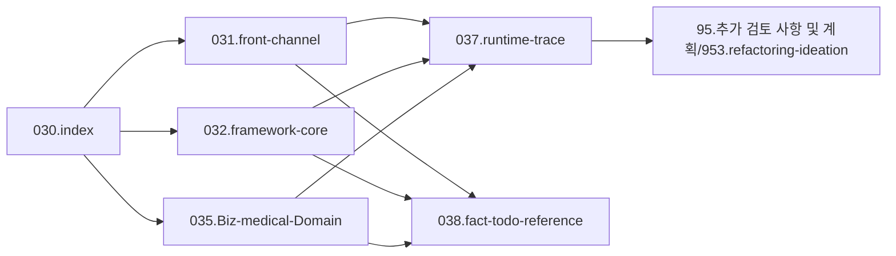

# 03.analysis_results 운영 규칙

## 1. 목적

이 문서는 `03.analysis_results` 전체에 공통 적용할 상위 구조와 운영 원칙을 정리한 기준 문서다.

이 폴더는 단순 산출물 저장소가 아니라 다음 목적을 가진 분석 지식베이스로 본다.

- 번호 체계로 depth와 분류가 보이는 구조 유지
- 기준본, 근거, 미확인, 아이데이션을 분리해 정보 혼선 방지
- 기술 분석과 업무/도메인 분석을 같이 다룰 수 있는 책장 구조 유지
- 후속 작업자가 `README`만 보고도 읽는 순서와 진입점을 잡을 수 있게 운영

## 2. 최종 상위 구조

```text
03.analysis_results/
├─ 030.index/
├─ 031.front-channel/
├─ 032.framework-core/
├─ 033.platform-services/
├─ 035.Biz-medical-Domain/
├─ 037.runtime-trace/
├─ 038.fact-todo-reference/
└─ 95.추가 검토 사항 및 계획/953.refactoring-ideation/
```

## 3. 상위 폴더 역할

### 3.1 `030.index`

전체 허브 폴더다.

주요 역할:
- 운영규칙
- 문서맵
- 약어-용어집
- 읽는순서
- process journey
- Tech Stack 개요/분석로드맵

즉 `030`은 기술 문서로 내려가기 전에 업무 맥락과 탐색 경로를 먼저 보여주는 출발점이다.

### 3.2 `031.front-channel`

사용자와 가장 가까운 프론트 진입 구조를 다룬다.

주요 대상:
- MiPlatform
- JSP
- Dataset
- MiplatformConverter
- 화면 XML
- UI 이벤트
- `mhi` 호출 진입부
- Navigation과 Command의 프론트 쪽 연결
- 리포팅 툴의 화면/출력 접점

실제 유지보수는 화면, 버튼, 탭, transaction, `.mhi`에서 시작되는 경우가 많으므로 이 축을 앞에 둔다.

### 3.3 `032.framework-core`

DevOn 중심의 서버 코어 실행 구조를 다룬다.

주요 대상:
- DevOn Framework
- Command
- Navigation
- Interceptor
- ServiceProxy
- PC / UC / EC
- XML Query
- LCommonDao
- LQueryMaker
- JDBC / TX / Pool
- Batch / Rule engine 중 DevOn 실행 구조에 직접 묶이는 부분

운영 기준은 단순하다.

- DevOn 자체 구조인가
- DevOn이 시스템 요청/서비스/데이터 접근을 어떻게 수행하는가

이 질문에 답하는 문서는 `032`에 둔다.

### 3.4 `033.platform-services`

DevOn 외부 또는 DevOn 바깥 경계에 붙는 솔루션, 패키지, 플랫폼 서비스를 다룬다.

주요 대상:
- 인증/보안 솔루션
- 공통 연동 솔루션
- 외부 라이브러리
- 공통 인프라성 패키지
- DevOn 자체라기보다 외부 솔루션/패키지로 보는 기술

운영 기준:
- DevOn 내부 구조라면 `032`
- 그 외 솔루션/패키지라면 `033`

### 3.5 `035.Biz-medical-Domain`

의료/병원 업무 맥락에서 기술을 해석하는 도메인 폴더다.

주요 대상:
- patient journey
- 사용자/부서 journey
- EMR
- PACS
- EDI
- 보험심사
- 외래/입원/응급 등 의료업무 흐름
- 의료 특화 솔루션 분석 문서

이 폴더는 기술이 없는 폴더가 아니다.
오히려 의료업무와 기술이 만나는 지점을 다루는 업무-기술 교차 폴더다.

예:
- `EDViewer`는 기술적으로 여러 축에서 언급될 수 있지만, 솔루션 분석 기준본은 의료 특화 솔루션으로 보아 `035`에 둔다.

### 3.6 `037.runtime-trace`

실제 화면/업무 기준 실행체인을 다루는 사례 문서 전용 폴더다.

주요 대상:
- `UI -> mhi -> command -> PC/UC/EC -> xmlquery`
- 대표 화면 추적 문서
- trace 템플릿

`037`은 도메인 책장이 아니라 사례 추적 책장이다.
하나의 trace가 `031`, `032`, `033`, `035`를 동시에 건드릴 수 있으므로 독립 유지한다.

### 3.7 `038.fact-todo-reference`

검증, 미확인, 참고 근거를 관리하는 운영 폴더다.

주요 대상:
- fact-check
- 미확인 항목
- 후속 조사 목록
- reference
- jar / API / 설정 파일 근거

기준본에 추측을 섞지 않기 위해 이 축을 분리한다.

### 3.8 `95.추가 검토 사항 및 계획/953.refactoring-ideation`

개선 아이디어와 리팩토링 판단을 모으는 폴더다.

주요 대상:
- 리팩토링 타겟
- 개선 아이디어
- 비교 분석
- 우선순위
- 구조 개선안 초안

## 4. 핵심 분류 기준

### 4.1 `031`과 `032`

- `031.front-channel`은 사용자와 가까운 프론트 진입 구조
- `032.framework-core`는 DevOn 중심의 서버 실행 코어

즉 화면/transaction/mhi/프론트 이벤트는 `031`, DevOn 내부 실행 구조는 `032`로 본다.

### 4.2 `032`와 `033`

- `032.framework-core` = DevOn
- `033.platform-services` = 그 외 솔루션 및 패키지

이 경계를 기준으로 분류한다.

예:
- `LCommandEngine`, `LServiceProxy`, `LCommonDao` -> `032`
- `MagicSSO`, `OpenSAML`, `Lucy`, `Rexpert`, `Quartz`, `Axis` -> `033`

### 4.3 `033`과 `035`

같은 기술이라도 중심 질문에 따라 위치가 달라질 수 있다.

- 솔루션/패키지 관점 설명 -> `033`
- 의료업무/병원업무 맥락 설명 -> `035`

예:
- `EDViewer` 배포 바이너리/접점 설명은 `033`에서 언급 가능
- `EDViewer` 솔루션 분석 기준본은 `035`에 둔다

### 4.4 `035`와 `037`

- `035`는 도메인 책장
- `037`는 사례 추적 책장

trace 문서는 여러 기술/도메인을 동시에 가로지르므로 `035` 안으로 흡수하지 않는다.

## 5. 번호 규칙

### 5.1 depth 표현

- 번호는 폴더 depth를 드러내는 수단으로 사용한다.
- 상위는 `030 ~ 039`를 사용한다.
- 하위 폴더는 같은 규칙을 유지하되, 폴더 번호 중심으로 구조를 읽을 수 있어야 한다.

### 5.2 파일명 규칙

- 4depth 이하의 파일은 넘버링 없이 제목 중심으로 작성할 수 있다.
- 번호는 가능한 한 폴더 구조에 집중한다.
- 파일명은 의미가 바로 읽히는 제목을 우선한다.

## 6. 문서 상태 규칙

### 6.1 기준본

- 각 상위 폴더의 현재 문서는 기준본이다.
- 실사용자는 기준본을 먼저 읽는다.

### 6.2 old / archive

- 과거 조사본은 삭제하지 않는다.
- 필요하면 `old` 또는 `archive`로 분리해 보존한다.
- 다만 기준본과 기본 읽기 경로는 분리한다.

### 6.3 fact / todo / reference

- 확정 사실은 기준본에 올린다.
- 미확인 항목은 `038`에 남긴다.
- 근거 확인용 자료도 `038`에서 관리한다.

## 7. 문장 규칙

### 7.1 확정 문장

코드, 설정, jar, API 문서 등으로 직접 확인한 내용만 확정 문장으로 쓴다.

### 7.2 미확정 문장

직접 확인이 부족하면 반드시 아래 표현을 쓴다.

- `미확인`
- `추정`
- `가능성`
- `현재 기준으로는 ... 해석이 가장 안전하다`

### 7.3 피해야 할 표현

- 근거 없이 단정하는 문장
- 감정적 평가를 사실처럼 쓰는 문장
- 과거 문서의 추정을 현재 사실처럼 재사용하는 문장

## 8. 링크 규칙

1. 각 문서는 가능하면 상위/하위 문서로 이동하는 링크를 가진다.
2. `030.index`는 모든 주요 축으로 내려가는 링크를 가진다.
3. `037.runtime-trace` 문서는 `031`, `032`, `035`, `039`로 다시 올라가는 링크를 가진다.
4. 용어집이 필요한 문서는 서두에 용어집 링크를 둔다.

## 9. 추천 읽기 순서



## 10. 최종 목표

`03.analysis_results`는 아래 상태를 목표로 운영한다.

- `030`에서 전체 맥락과 읽는 순서를 잡을 수 있다.
- `031~033`에서 기반기술을 분해해 읽을 수 있다.
- `035`에서 의료업무/도메인 맥락을 읽을 수 있다.
- `037`에서 실제 사례 추적을 닫을 수 있다.
- `038`에서 확정 사실과 미확인 항목을 분리해 관리할 수 있다.
- `039`에서 개선 아이디어를 기준본과 분리해 축적할 수 있다.

