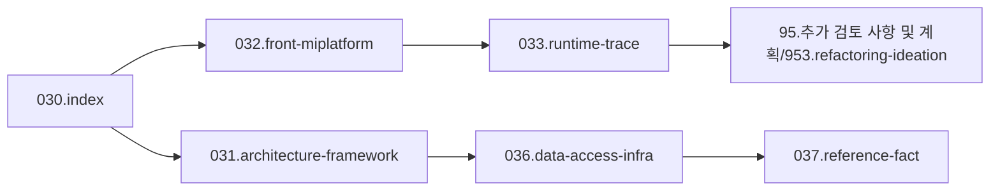

# 03.analysis_results 재배치 초안

## 1. 목적

이 문서는 현재 `03.analysis_results` 구조를 바탕으로, 실제 유지보수 흐름에 더 맞는 재배치 방향을 제안하는 초안이다.

핵심 판단은 다음과 같다.

- 실제 유지보수 착수점은 `Front / MiPlatform / 화면 Transaction / .mhi / navigation` 쪽이 더 많다.
- 따라서 `Miplatform` 축은 아키텍처 하위 항목이 아니라 독립된 최우선 축으로 올리는 것이 맞다.
- 기존 조사 결과는 버리지 않고, 번호 체계 안에서 역할을 다시 분리하는 것이 좋다.

## 2. 현재 구조

현재 확인된 `03.analysis_results` 하위 폴더:

- `030.patient-journey`
- `031.Architecture - Framework`
- `032.Architecture - Miplatform`
- `034.Architecture - EMR_viewer`
- `038.Architecture - MISC`
- `95.추가 검토 사항 및 계획/953.refactoring-ideation`

현재 상태의 장점:
- 주제는 이미 꽤 잘 분리돼 있다.
- `031`, `032`, `034`, `039-1`은 각각 독립 가치가 있다.

현재 상태의 한계:
- `030`이 patient-journey라서 index 역할이 없다.
- `031`과 `032`의 경계가 유지보수 관점에서는 더 뚜렷해야 한다.
- runtime trace 성격 문서가 `031`, `039-1`, 루트 문서에 흩어질 가능성이 크다.

## 3. 제안 구조

번호는 `030~039` 범위를 유지하면서, 실제 역할을 아래처럼 두는 것이 적절하다.

```text
03.analysis_results/
├─ 030.index/
├─ 031.architecture-framework/
├─ 032.front-miplatform/
├─ 033.runtime-trace/
├─ 034.architecture-emr-viewer/
├─ 035.business-domains/
├─ 036.data-access-infra/
├─ 037.reference-fact/
├─ 038.misc/
└─ 95.추가 검토 사항 및 계획/953.refactoring-ideation/
```

## 4. 각 폴더의 역할

### 030.index
- 전체 README
- 운영 규칙
- 문서맵
- 용어집
- 읽는 순서

### 031.architecture-framework
- DevOn 전체 구조
- front/data-access/tx를 포함한 아키텍처 해설
- 현재 `031`의 핵심 역할 유지

### 032.front-miplatform
- 실제 유지보수 시작점
- MiPlatform XML 화면
- 화면 이벤트
- Transaction 호출
- `.mhi`
- navigation
- command
- dataset / converter
- JSP/브라우저 진입과의 연결

### 033.runtime-trace
- 대표 화면/업무 실행체인 전용
- UI -> mhi -> command -> PC/UC/EC -> xmlquery
- 실제 trace 문서의 수용처

### 034.architecture-emr-viewer
- EDViewer/EMR viewer 전용 축
- 외부 바이너리, OCX, 뷰어 호출 구조
- 별도 기술축이라 독립 유지가 맞음

### 035.business-domains
- `az`, `md`, `hp`, `sp` 등 업무 도메인별 정리
- patient journey, 업무 흐름, 도메인 특성 문서 수용

### 036.data-access-infra
- LCommonDao
- LQueryMaker
- XML Query
- JDBC / TX / Pool
- 설정 기반 infra 해설

### 037.reference-fact
- jar/API/reference
- fact-check
- 근거 확인용 문서

### 038.misc
- 아직 축으로 확정되지 않은 잡다한 분석
- 추후 승격 전 임시 보관처

### 95.추가 검토 사항 및 계획/953.refactoring-ideation
- 리팩토링 타겟
- 개선안
- 구조 비교
- 화면별 개선 아이디어

## 5. 핵심 강조점

이 재배치안의 핵심은 `032.front-miplatform`을 전면에 세우는 것이다.

이유:

1. 실제 유지보수 요청은 보통 화면/버튼/탭/Transaction에서 시작한다.
2. 추적도 `UI -> mhi -> navigation -> command`로 먼저 들어간다.
3. Dataset shape, converter, command 입출력 구조 문제는 DB까지 내려가기 전에 이미 발생한다.
4. 큰 화면일수록 Front/MiPlatform 쪽 복잡도가 유지보수 비용의 절반 이상을 차지한다.

즉 `032`는 보조 폴더가 아니라, 유지보수 착수용 핵심 폴더가 되어야 한다.

## 6. 추천 운영 순서



실제 읽기 순서는 아래가 적절하다.

1. `030.index`
2. `032.front-miplatform`
3. `033.runtime-trace`
4. `031.architecture-framework`
5. `036.data-access-infra`
6. `037.reference-fact`
7. `95.추가 검토 사항 및 계획/953.refactoring-ideation`

즉 실제 유지보수 흐름을 반영하면 `Front -> Trace -> Framework/Data` 순이 더 자연스럽다.

## 7. 적용 원칙

- 기존 문서는 바로 이동하지 않는다.
- 먼저 현재 문서를 새 체계에 매핑한다.
- 루트 설명 문서를 새 체계로 만들고, 실제 이동은 그 다음에 한다.
- old/보존본은 반드시 유지한다.


