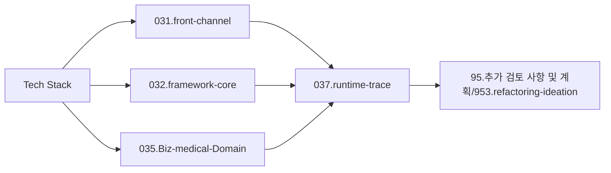

# Tech-Stack-분석로드맵

## 1. 목적

이 문서는 `03.analysis_results`에서 기술 스택을 어떤 순서로 분석할지 정리한 로드맵이다.

## 2. 우선순위

1. `031.front-channel`
   - MiPlatform, 화면 이벤트, `mhi`, Dataset, JSP
2. `032.framework-core`
   - DevOn, Command, Navigation, ServiceProxy, XML Query, TX/Pool
3. `035.Biz-medical-Domain`
   - EMR, EDI, 보험심사, patient journey, 의료 특화 솔루션
4. `033.platform-services`
   - 보안, 인증, 공통 연동, 외부 솔루션/패키지
5. `037.runtime-trace`
   - 대표 화면과 업무의 실제 실행체인
6. `95.추가 검토 사항 및 계획/953.refactoring-ideation`
   - 구조 개선, 리팩토링 우선순위

## 3. 읽는 순서

## 4. 메모

- 기술 스택 문서는 목록과 분석을 분리한다.
- 목록은 `Tech-Stack-개요.md`, 해석과 읽는 순서는 이 문서에서 관리한다.
- 미확인 기술은 `038.fact-todo-reference`로 보낸다.

