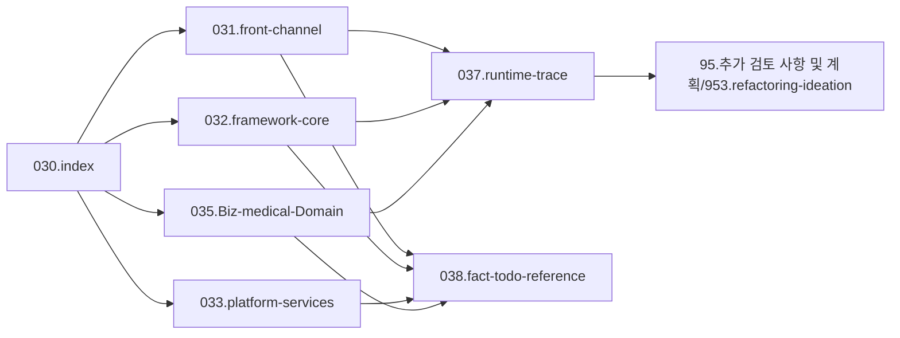

# 030.index

## 1. 목적

이 폴더는 `03.analysis_results` 전체의 허브다.

여기서 먼저 다음을 잡는다.
- 전체 운영 규칙
- 문서맵
- 약어/용어
- 읽는 순서
- 업무 여정 프리뷰
- Tech Stack 목록과 분석 로드맵

즉 `030.index`는 기술 문서로 바로 내려가기 전에, 문제공간과 탐색 순서를 먼저 잡는 출발점이다.

## 2. 상위 구조

## 3. 폴더 구성

- `0301.운영규칙 및 문서맵`
  - 운영 규칙, 문서맵, 재배치 계획
- `0303.약어-용어집`
  - 약어, 클래스명, 파일군, 대표 command/PC/EC
- `0304.읽는순서`
  - 상황별 탐색 순서
- `0305.process journey`
  - 환자 여정, 사용자/부서 여정 프리뷰
- `0307.Tech Stack`
  - 기술 목록과 단계별 분석 로드맵

## 4. 먼저 볼 문서

1. [운영규칙.md](./0301.%EC%9A%B4%EC%98%81%EA%B7%9C%EC%B9%99%20%EB%B0%8F%20%EB%AC%B8%EC%84%9C%EB%A7%B5/%EC%9A%B4%EC%98%81%EA%B7%9C%EC%B9%99.md)
2. [문서맵.md](./0301.%EC%9A%B4%EC%98%81%EA%B7%9C%EC%B9%99%20%EB%B0%8F%20%EB%AC%B8%EC%84%9C%EB%A7%B5/%EB%AC%B8%EC%84%9C%EB%A7%B5.md)
3. [약어-용어집.md](./0303.%EC%95%BD%EC%96%B4-%EC%9A%A9%EC%96%B4%EC%A7%91/%EC%95%BD%EC%96%B4-%EC%9A%A9%EC%96%B4%EC%A7%91.md)
4. [읽는순서.md](./0304.%EC%9D%BD%EB%8A%94%EC%88%9C%EC%84%9C/%EC%9D%BD%EB%8A%94%EC%88%9C%EC%84%9C.md)
5. [Tech-Stack-개요.md](./0307.Tech%20Stack/Tech-Stack-%EA%B0%9C%EC%9A%94.md)
6. [Tech-Stack-분석로드맵.md](./0307.Tech%20Stack/Tech-Stack-%EB%B6%84%EC%84%9D%EB%A1%9C%EB%93%9C%EB%A7%B5.md)

## 5. 폴더별 의미

- `031.front-channel`
  - MiPlatform, JSP, Dataset, `mhi`, 화면 이벤트, 프론트 진입 구조
- `032.framework-core`
  - DevOn 자체 구조와 서버 코어 실행 체인
- `033.platform-services`
  - DevOn 외부 솔루션, 보안/인증, 공통 연동, 공통 서비스 패키지
- `035.Biz-medical-Domain`
  - 의료업무와 도메인 맥락에서 해석하는 솔루션과 업무 흐름
- `037.runtime-trace`
  - 실제 사례 추적 문서
- `038.fact-todo-reference`
  - 사실 확인, 미확인 항목, 근거 자료
- `95.추가 검토 사항 및 계획/953.refactoring-ideation`
  - 개선안, 리팩토링 우선순위

## 6. 운영 기준

- `030`은 허브로만 사용한다.
- 기준본은 각 상위 폴더에서 관리한다.
- 미확인 정보는 `038`로 보낸다.
- 개선안은 `039`로 분리한다.
- old 자료는 `old Data`에서 직접 보존한다.

