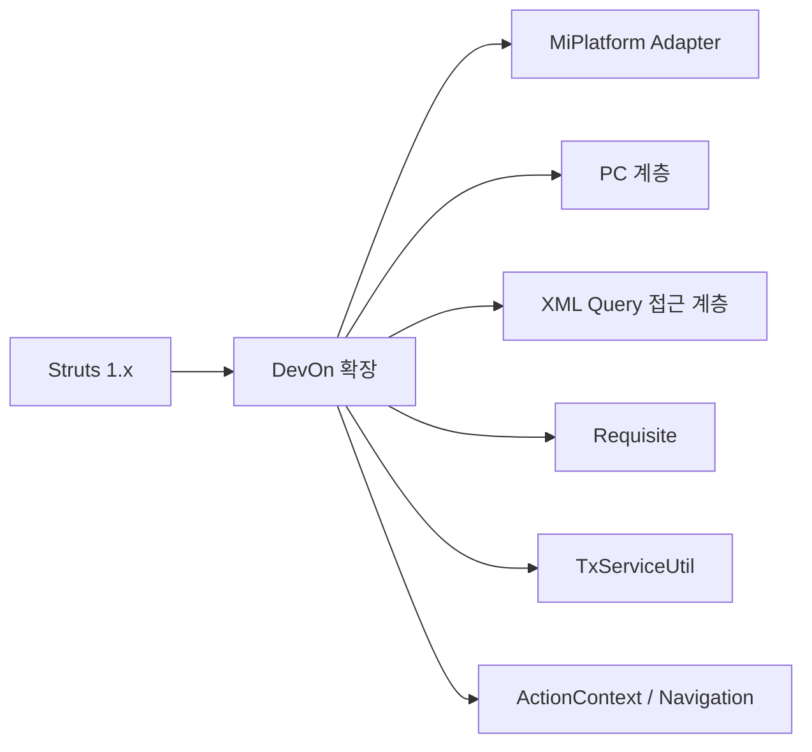

# DevOn Framework의 독창성 분석

> Struts 1.x를 기반으로 하면서도 MiPlatform 연동과 엔터프라이즈 특화를 위해 추가된 DevOn만의 독창적 기능
> 주의: 본문에는 아키텍처 설명용 가상 코드가 포함됩니다. 현재 백업셋에서 직접 확인된 항목은 `MiplatformServlet`, `GeneralServlet`, `MiplatformRequest/Response/Converter`, `AbstractMiplatformCommand`, `devon-framework.xml`, `requisite.xml` 기준입니다.

---

## 개요

**DevOn = Struts 1.x + MiPlatform 연동 + 엔터프라이즈 확장**

DevOn은 Struts 1.x의 아키텍처를 따르면서도, 다음의 독창적 기능을 추가했습니다:

| 구분 | Struts 1.x | DevOn의 독창성 |
|------|------------|----------------|
| **View 연동** | JSP | **MiPlatform Dataset 연동** |
| **비즈니스 계층** | Action + Service | **Process Component (PC)** |
| **데이터 접근** | JDBC / DAO | **XML Query 기반 접근 계층** |
| **검증** | ActionForm.validate() | **Requisite (선언적 검증)** |
| **트랜잭션** | 수동 관리 | **TxServiceUtil (선언적 트랜잭션)** |
| **데이터 변환** | 수동 | **MiplatformConverter (자동 변환)** |

### 한눈 구조도



---

## 1. MiPlatform 연동 계층 (가장 핵심적인 독창성)

### 1.1 Dataset ↔ LData/LMultiData 변환

Struts 1.x는 JSP와 HTML Form을 사용하지만, DevOn은 MiPlatform의 Dataset을 사용합니다. 이를 위해 **자동 데이터 변환 계층**을 구현했습니다.

```java
// DevOn의 독창적 변환 로직
public class MiplatformConverter {

    // MiPlatform Dataset → DevOn LMultiData 변환
    public static LMultiData convertToLMultiDataWithJobType(Dataset ds) {
        LMultiData mData = new LMultiData("convertedMultiData");

        for (int rowIdx = 0; rowIdx < ds.getRowCount(); rowIdx++) {
            // 행 상태 확인 (CUD)
            String rowType = ds.getRowStatus(rowIdx);
            String jobType = "";

            if (rowType.equalsIgnoreCase("INSERT")) {
                jobType = "C";  // Create
            } else if (rowType.equalsIgnoreCase("UPDATE")) {
                jobType = "U";  // Update
            }

            // _CUD 필드로 작업 유형 표시
            mData.add("_CUD", jobType);

            // 행 데이터 변환
            setMultiDataset(ds, rowIdx, mData, isOrder, usid);
        }

        // 삭제된 행 처리
        int delCount = ds.getDeleteRowCount();
        for (int rowIdx = 0; rowIdx < delCount; rowIdx++) {
            mData.add("_CUD", "D");  // Delete
            setDeleteMultiDataset(ds, rowIdx, mData);
        }

        return mData;
    }

    // DevOn LMultiData → MiPlatform Dataset 변환
    public static Dataset convertToDataset(LMultiData mData) {
        Dataset ds = new Dataset();
        // ... 변환 로직
        return ds;
    }
}
```

**독창성:**
- MiPlatform의 Dataset을 DevOn의 LData/LMultiData로 자동 변환
- **CUD 상태** (_CUD 필드)를 통해 생성/수정/삭제 구분
- 클라이언트-서버 간 데이터 형식 불일치 문제 해결

### 1.2 MiplatformRequest / MiplatformResponse

```java
// MiPlatform 요청을 처리하는 DevOn의 독창적 클래스
public class MiplatformRequest {
    private PlatformRequest platformRequest;

    public void receiveData() throws Exception {
        // MiPlatform 프로토콜 파싱
        platformRequest.receiveData();

        // VariableList 추출 (파라미터)
        variableList = platformRequest.getVariableList();

        // DatasetList 추출 (데이터셋)
        datasetList = platformRequest.getDatasetList();
    }

    public LData getParamData() {
        // VariableList → LData 변환
        return convertVariableListToLData(variableList);
    }
}

public class MiplatformResponse {
    public void addDataset(String name, LMultiData data) {
        // LMultiData → Dataset 변환
        Dataset dataset = MiplatformConverter.convertToDataset(data);
        platformResponse.addDataset(dataset);
    }
}
```

**독창성:**
- MiPlatform의 바이너리/XML 프로토콜을 자동 파싱
- Servlet 계층과 비즈니스 계층 사이의 **어댑터** 역할

---

## 2. Process Component (PC) 계층

### 2.1 EJB 대체 구조

Struts 1.x는 Action이 직접 Service/DAO를 호출하지만, DevOn은 **Process Component (PC)** 계층을 추가했습니다.

```
Struts 1.x:
Action → Service → DAO → DB

DevOn:
Command → PC (Process Component) → XML Query 접근 계층 → DB
          ↓
      TxServiceUtil (트랜잭션)
```

```java
// DevOn의 독창적 PC 계층
public class LoginPC {

    public LMultiData validateUser(String username, String password) {
        // XML Query 실행
        LMultiData result = /* XML Query 실행 계층 예시 */ null;
            "app/emp/login.xml",  // XML 파일 경로
            "retrieveUserInfo",    // 쿼리 이름
            paramData            // 파라미터
        );

        return result;
    }
}

// Command에서 PC 호출
public class LoginUserCMD extends AbstractMiplatformCommand {
    public void execute() {
        // TxServiceUtil을 통해 PC 획득
        LoginPC pc = (LoginPC) TxServiceUtil.getNTxService("az.bizcom.LoginPC");

        // PC 호출
        LMultiData result = pc.validateUser(username, password);

        // 결과 반환
        platformResponse.addDataset("ds_Result", result);
    }
}
```

**독창성:**
- **EJB Session Bean을 대체**하는 경량 비즈니스 계층
- XML Query와 직접 연결된 단순한 구조
- 트랜잭션 관리를 TxServiceUtil로 위임

### 2.2 TxServiceUtil (선언적 트랜잭션)

```java
// DevOn의 독창적 트랜잭션 관리
public class TxServiceUtil {

    public static Object getNTxService(String serviceName) {
        // 트랜잭션 매니저 생성
        TransactionManager txManager = /* 설정 기반 transaction manager 예시 */ null;

        try {
            txManager.begin();

            // PC 호출
            Object result = invokePC(serviceName);

            txManager.commit();
            return result;

        } catch (Exception e) {
            txManager.rollback();
            throw e;
        } finally {
            txManager.release();
        }
    }
}
```

**독창성:**
- EJB의 선언적 트랜잭션을 **POJO 환경에서 구현**
- 트랜잭션 경계를 XML이 아닌 **유틸리티 클래스**로 관리

---

## 3. XML Query (개념 모델)

### 3.1 SQL을 XML로 분리

Struts 1.x는 주로 DAO 클래스에 SQL을 하드코딩하지만, DevOn은 **XML 파일로 SQL을 완전히 분리**했습니다.

```xml
<!-- devonhome/xmlquery/app/emp/login.xml -->
<?xml version="1.0" encoding="EUC-KR"?>
<queries>
    <query name="retrieveUserInfo">
        <statement>
            SELECT USER_ID, USER_NAME, DEPT_CODE
            FROM USER_MASTER
            WHERE USER_ID = ${usid}
              AND PASSWORD = ${passwd}
              AND USE_YN = 'Y'
        </statement>
    </query>

    <query name="updateLoginTime">
        <statement>
            UPDATE USER_MASTER
            SET LAST_LOGIN_TIME = SYSDATE
            WHERE USER_ID = ${usid}
        </statement>
    </query>
</queries>
```

```java
// PC에서 XML Query 사용
public class LoginPC {
    public LMultiData validateUser(LData input) {
        // SQL이 아닌 XML 쿼리 이름으로 실행
        LMultiData result = /* XML Query 실행 계층 예시 */ null;
            "app/emp/login",
            "retrieveUserInfo",
            input
        );
        return result;
    }
}
```

**독창성:**
- SQL과 Java 코드 **완전 분리**
- ${parameter} 문법으로 파라미터 바인딩
- DB 변경 시 XML만 수정하면 됨

### 3.2 LMultiData 결과 매핑

```java
// 결과를 자동으로 LMultiData로 변환
LMultiData result = /* XML Query 실행 계층 호출 */ null;

// 사용
String userName = result.getString(0, "USER_NAME");
String deptCode = result.getString(0, "DEPT_CODE");
```

**독창성:**
- ResultSet → LMultiData 자동 매핑
- MiPlatform Dataset과 호환되는 데이터 구조

---

## 4. Requisite (선언적 검증)

### 4.1 XML 기반 입력값 검증

Struts 1.x는 ActionForm의 validate() 메소드를 사용하지만, DevOn은 **XML 기반 선언적 검증**을 구현했습니다.

```xml
<!-- devonhome/conf/requisite.xml -->
<requisites>
    <requisite name="LoginUser">
        <field name="usid" required="true" maxLength="20">
            <message>사용자 ID는 필수입니다.</message>
        </field>
        <field name="passwd" required="true" minLength="6">
            <message>비밀번호는 6자 이상이어야 합니다.</message>
        </field>
    </requisite>

    <requisite name="SavePatient">
        <field name="pid" required="true" type="number"/>
        <field name="name" required="true" maxLength="50"/>
        <field name="birthDate" required="true" type="date"/>
    </requisite>
</requisites>
```

```java
// Command에서 자동 검증
public abstract class AbstractMiplatformCommand {

    public AbstractMiplatformCommand() {
        // 생성자에서 자동 검증 실행
        validateByRequisite(data);
    }

    protected void validateByRequisite(LData data) throws Exception {
        // requisite.xml에서 해당 Action의 검증 규칙 로드
        Requisite requisite = RequisiteLoader.load(actionName);

        // 각 필드 검증
        for (Field field : requisite.getFields()) {
            String value = data.getString(field.getName());

            // 필수 검증
            if (field.isRequired() && (value == null || value.isEmpty())) {
                throw new ValidationException(field.getMessage());
            }

            // 길이 검증
            if (field.getMaxLength() > 0 && value.length() > field.getMaxLength()) {
                throw new ValidationException(field.getName() + " 길이 초과");
            }

            // 타입 검증
            if ("number".equals(field.getType())) {
                try {
                    Integer.parseInt(value);
                } catch (NumberFormatException e) {
                    throw new ValidationException(field.getName() + "는 숫자여야 합니다.");
                }
            }
        }
    }
}
```

**독창성:**
- Java 코드가 아닌 **XML로 검증 규칙 정의**
- Command 생성 시 **자동 실행**
- 재사용 가능한 검증 규칙

---

## 5. Interceptor Chain

### 5.1 AOP 스타일 공통 처리

Struts 1.x는 RequestProcessor를 확장해야 하지만, DevOn은 **Interceptor Chain**을 구현했습니다.

```xml
<!-- devon-framework.xml, 현재 백업셋에서 확인된 예 -->
<interceptor-stack name="defaultStack">
    <interceptor-ref name="loginCheck"/>
    <interceptor-ref name="converter"/>
    <interceptor-ref name="command"/>
</interceptor-stack>

<interceptor-stack name="notLoginCheckStack">
    <interceptor-ref name="converter"/>
    <interceptor-ref name="command"/>
</interceptor-stack>
```

```java
// Interceptor 구현 개념 예시
// 실제 백업셋에서 확인된 LoginCheckInterceptor는 LAbstractInterceptor 기반이다.
public class LoginCheckInterceptor /* conceptual */ {

    public String doIntercept(ActionInvocation invocation) throws Exception {
        // 세션 체크
        HttpSession session = LActionContext.getHttpServletRequest().getSession();
        if (session.getAttribute("userInfo") == null) {
            return "login_required";
        }

        // 다음 Interceptor 또는 Command 실행
        return invocation.invoke();
    }
}

// 주의: 아래 ConverterInterceptor는 설명용 예시다.
// 현재 백업셋에서는 ConverterInterceptor / CommandInterceptor 실파일을 직접 확인하지 못했다.
public class ConverterInterceptor /* conceptual */ {
    public String doIntercept(ActionInvocation invocation) throws Exception {
        // MiPlatform Dataset → LData 변환
        convertRequestData();

        String result = invocation.invoke();

        // LData → MiPlatform Dataset 변환
        convertResponseData();

        return result;
    }
}
```

**독창성:**
- Spring의 AOP와 유사한 **Interceptor Chain**
- 로그인 체크, 데이터 변환 등 **관심사 분리**
- 선언적으로 Interceptor 스택 정의

---

## 6. ActionContext (ThreadLocal 기반 컨텍스트)

### 6.1 요청-응답 객체 중앙 관리

```java
// 컨텍스트 관리 개념 예시
// 실제 프로젝트 import 기준 패키지는 devonframework.front.channel.context.LActionContext 이다.
public class LActionContext {

    private static ThreadLocal<Map<String, Object>> context = new ThreadLocal<>();

    // 요청-응답 객체 저장
    public static void setHttpServletRequest(HttpServletRequest req) {
        context.get().put("request", req);
    }

    public static void setHttpServletResponse(HttpServletResponse res) {
        context.get().put("response", res);
    }

    // MiPlatform 전용 객체
    public static void setMiplatformRequest(MiplatformRequest req) {
        context.get().put("mipRequest", req);
    }

    public static void setMiplatformResponse(MiplatformResponse res) {
        context.get().put("mipResponse", res);
    }

    // 어디서나 접근 가능
    public static MiplatformRequest getMiplatformRequest() {
        return (MiplatformRequest) context.get().get("mipRequest");
    }
}
```

**독창성:**
- ThreadLocal을 활용한 **요청 단위 컨텍스트**
- 파라미터 전달 없이 어디서나 Request/Response 접근
- MiPlatform 객체 전용 관리

---

## 7. Navigation (Struts 1.x의 발전)

### 7.1 계층적 설정 관리

Struts 1.x는 하나의 struts-config.xml을 사용하지만, DevOn은 **계층적 Navigation**을 구현했습니다.

```
devonhome/navigation/
├── his/                    # 병원정보시스템
│   ├── az/
│   │   ├── comnNavi.xml   # 공통업무
│   │   ├── authNavi.xml   # 인증
│   │   └── ...
│   ├── md/                 # 진료
│   ├── mr/                 # 원무
│   └── ...
├── ajax/                   # AJAX 네비게이션
└── img/                    # 이미지업무
```

```xml
<!-- az/comnNavi.xml -->
<navigation>
    <action name="RetrievePbhlCd">
        <command>nph.his.az.bizcom.cmcd.cmd.RetrievePbhlCdCMD</command>
        <interceptor>defaultStack</interceptor>
        <return>success</return>
    </action>

    <action name="SavePbhlCd">
        <command>nph.his.az.bizcom.cmcd.cmd.SavePbhlCdCMD</command>
        <interceptor>defaultStack</interceptor>
        <requisite>SavePbhlCd</requisite>
        <return>success</return>
    </action>
</navigation>
```

**독창성:**
- **업무별 분리된 Navigation 파일**
- 유지보수성 향상
- Interceptor와 Requisite을 Action별로 지정

---

## 8. 개인정보 보호를 위한 자동 마스킹

### 8.1 로깅 시 개인정보 마스킹

```java
// DevOn의 독창적 보안 기능
public abstract class AbstractMiplatformCommand {

    protected void logWrite() {
        LData data = getParamData();

        // 개인정보 필드 자동 마스킹
        String maskedData = maskPersonalInfo(data);

        // 마스킹된 데이터만 로그에 기록
        logger.info("Request Data: " + maskedData);
    }

    private String maskPersonalInfo(LData data) {
        // 주민등록번호 마스킹
        if (data.containsKey("ssn")) {
            String ssn = data.getString("ssn");
            data.setString("ssn", ssn.substring(0, 6) + "-*******");
        }

        // 핸드폰번호 마스킹
        if (data.containsKey("phone")) {
            String phone = data.getString("phone");
            data.setString("phone", phone.replaceAll("(\d{3})-(\d{3,4})-(\d{4})", "$1-****-$3"));
        }

        return data.toString();
    }
}
```

**독창성:**
- **자동 개인정보 마스킹**
- Command 생성 시 자동 실행
- 의료 시스템 특화 기능

---

## 요약: DevOn의 독창성

### 핵심 독창적 기능

| 기능 | 설명 | Struts 1.x 대비 |
|------|------|-----------------|
| **Dataset 연동** | MiPlatform Dataset ↔ LData 자동 변환 | JSP 대신 RIA 연동 |
| **Process Component** | EJB를 대체하는 경량 비즈니스 계층 | Service 대체 |
| **XML Query** | SQL을 XML로 완전 분리 | DAO 하드코딩 대체 |
| **Requisite** | XML 기반 선언적 검증 | validate() 대체 |
| **TxServiceUtil** | 선언적 트랜잭션 관리 | 수동 트랜잭션 대체 |
| **Interceptor Chain** | AOP 스타일 공통 처리 | RequestProcessor 대체 |
| **ActionContext** | ThreadLocal 기반 컨텍스트 | 파라미터 전달 감소 |
| **계층적 Navigation** | 업무별 설정 파일 분리 | 단일 파일 대체 |
| **자동 마스킹** | 개인정보 보호 로깅 | 없음 |

### DevOn이 해결한 문제

```
1. RIA(MiPlatform) 연동 문제
   → Dataset/LData 변환 계층으로 해결

2. EJB의 복잡성
   → PC (Process Component)로 경량화

3. SQL 관리 문제
   → XML Query로 SQL 분리

4. 검증 코드 중복
   → Requisite로 선언적 검증

5. 트랜잭션 관리 복잡성
   → TxServiceUtil로 단순화

6. 의료 시스템 보안 요구사항
   → 자동 개인정보 마스킹
```

### 결론

**DevOn은 Struts 1.x의 아키텍처를 기반으로 하되,**

1. **MiPlatform 연동**을 위한 데이터 변환 계층 추가
2. **EJB 없이** 엔터프라이즈 기능 구현 (PC, TxServiceUtil)
3. **선언적 설정**을 통한 생산성 향상 (Requisite, Interceptor)
4. **의료 시스템 특화** 기능 제공 (개인정보 마스킹)

**이러한 독창성으로 2000년대 중반~2010년대 한국의 엔터프라이즈 시스템 개발에서 널리 사용되었습니다.**

---

*DevOn의 독창성은 Struts 1.x의 한계를 보완하고, 당시 한국 SI 환경에 최적화된 프레임워크로 발전시킨 것입니다.*
