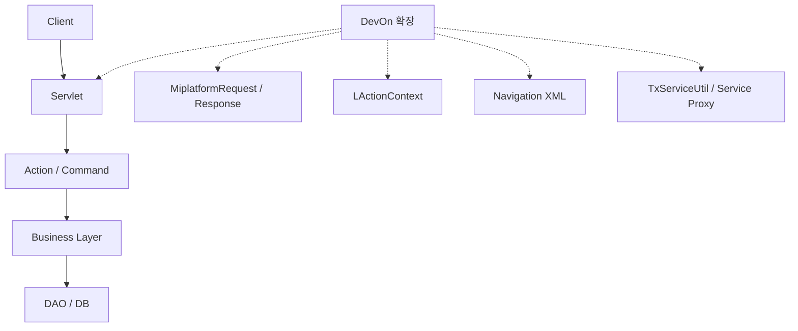
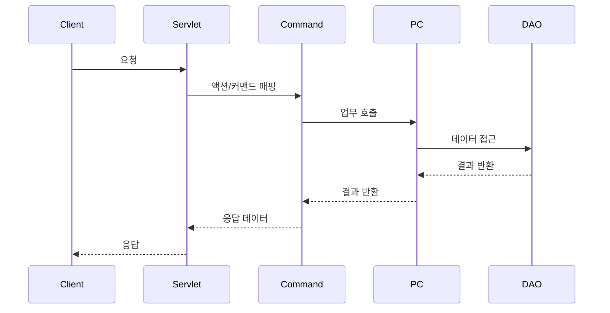

# Apache Struts 1.x 아키텍처

> DevOn Framework와의 비교를 중심으로 한 구조 분석
> 주의: 본문 예시 코드(예: JSP/forward 경로)는 설명 목적의 샘플을 포함합니다.
> 현재 백업셋 기준 DevOn 실구현 포인트는 `MiplatformServlet`, `GeneralServlet`, `MiplatformRequest`, `MiplatformResponse`, `AbstractMiplatformCommand`, `devon-framework.xml`, `requisite.xml` 입니다.
> 현재 NPH 백업셋에서는 `MiplatformServlet`이 `PlatformRequest.XML` 응답을 생성하므로, 본문의 Dataset 응답 흐름도는 프레임워크 개념 설명으로 읽는 것이 맞습니다.

---

## 1. Struts 1.x 전체 구조



```
┌─────────────────────────────────────────────────────────────┐
│                         Client                              │
│                    (Browser / JSP)                          │
└─────────────────────────────────────────────────────────────┘
                              │
                              ▼ HTTP Request (*.do)
┌─────────────────────────────────────────────────────────────┐
│                  Controller Layer                           │
│  ┌─────────────────────────────────────────────────────┐   │
│  │        ActionServlet (Front Controller)             │   │
│  │  - web.xml에서 *.do 매핑                             │   │
│  │  - struts-config.xml 로딩                            │   │
│  │  - RequestProcessor 호출                               │   │
│  └─────────────────────────────────────────────────────┘   │
└─────────────────────────────────────────────────────────────┘
                              │
                              ▼
┌─────────────────────────────────────────────────────────────┐
│                    Configuration Layer                      │
│  ┌─────────────────────────────────────────────────────┐   │
│  │           struts-config.xml                         │   │
│  │  - <action-mappings> : URL → Action 매핑            │   │
│  │  - <form-beans> : ActionForm 정의                   │   │
│  │  - <global-forwards> : 공통 포워드                  │   │
│  └─────────────────────────────────────────────────────┘   │
└─────────────────────────────────────────────────────────────┘
                              │
                              ▼
┌─────────────────────────────────────────────────────────────┐
│                    Action Layer                             │
│  ┌─────────────────────────────────────────────────────┐   │
│  │              Action (Command)                        │   │
│  │  - execute() 메소드 구현                            │   │
│  │  - 비즈니스 로직 처리                                │   │
│  │  - ActionForward 반환                               │   │
│  └─────────────────────────────────────────────────────┘   │
└─────────────────────────────────────────────────────────────┘
                              │
                              ▼
┌─────────────────────────────────────────────────────────────┐
│                    Model Layer                              │
│  ┌─────────────────────────────────────────────────────┐   │
│  │           ActionForm (DTO)                           │   │
│  │  - 화면 데이터 저장/검증                            │   │
│  │  - validate() 메소드                                │   │
│  └─────────────────────────────────────────────────────┘   │
│                                                              │
│  ┌─────────────────────────────────────────────────────┐   │
│  │           Business Logic (Service/DAO)             │   │
│  │  - Service : 비즈니스 로직                          │   │
│  │  - DAO : 데이터 접근                                 │   │
│  └─────────────────────────────────────────────────────┘   │
└─────────────────────────────────────────────────────────────┘
                              │
                              ▼
┌─────────────────────────────────────────────────────────────┐
│                    View Layer                               │
│  ┌─────────────────────────────────────────────────────┐   │
│  │              JSP (View)                              │   │
│  │  - 화면 표시                                         │   │
│  │  - JSTL/EL 사용                                      │   │
│  └─────────────────────────────────────────────────────┘   │
└─────────────────────────────────────────────────────────────┘
```

---

## 2. 핵심 구성요소

### 2.1 ActionServlet (Front Controller)

**역할**: 모든 요청의 입구

```java
// web.xml
<servlet>
    <servlet-name>action</servlet-name>
    <servlet-class>org.apache.struts.action.ActionServlet</servlet-class>
    <init-param>
        <param-name>config</param-name>
        <param-value>/WEB-INF/struts-config.xml</param-value>
    </init-param>
</servlet>

<servlet-mapping>
    <servlet-name>action</servlet-name>
    <url-pattern>*.do</url-pattern>
</servlet-mapping>
```

**DevOn과 비교**:
| Struts 1.x | DevOn |
|------------|-------|
| `ActionServlet` | `MiplatformServlet` / `GeneralServlet` |
| `*.do` 매핑 | `*.mhi` / `*.his` 매핑 |
| `struts-config.xml` 로딩 | `devonhome/navigation/*.xml` 로딩 |

---

### 2.2 struts-config.xml (설정 파일)

**역할**: URL과 Action의 매핑 정의

```xml
<?xml version="1.0" encoding="UTF-8"?>
<!DOCTYPE struts-config PUBLIC
    "-//Apache Software Foundation//DTD Struts Configuration 1.3//EN"
    "http://struts.apache.org/dtds/struts-config_1_3.dtd">

<struts-config>
    <!-- 1. Form Beans 정의 -->
    <form-beans>
        <form-bean name="loginForm"
                   type="com.example.LoginForm"/>
    </form-beans>

    <!-- 2. Global Forwards -->
    <global-forwards>
        <forward name="error" path="/error.jsp"/>
    </global-forwards>

    <!-- 3. Action Mappings (핵심) -->
    <action-mappings>
        <action path="/login"
                type="com.example.LoginAction"
                name="loginForm"
                scope="request"
                validate="true"
                input="/login.jsp">
            <forward name="success" path="/welcome.jsp"/>
            <forward name="failure" path="/login.jsp"/>
        </action>

        <action path="/logout"
                type="com.example.LogoutAction">
            <forward name="success" path="/login.jsp" redirect="true"/>
        </action>
    </action-mappings>

    <!-- 4. Message Resources -->
    <message-resources parameter="ApplicationResources"/>
</struts-config>
```

**DevOn과 비교**:
| Struts 1.x | DevOn |
|------------|-------|
| `<action-mappings>` | Navigation XML |
| `<action path="/login">` | `<action name="LoginUser">` |
| `type="LoginAction"` | `<command>xxx.LoginCMD</command>` |
| `<forward name="success">` | `<return>/welcome.jsp</return>` |
| `<form-bean>` | Dataset (MiPlatform) |

---

### 2.3 Action (Command)

**역할**: 비즈니스 로직 처리

```java
// Struts 1.x Action
public class LoginAction extends Action {

    @Override
    public ActionForward execute(ActionMapping mapping,
                                 ActionForm form,
                                 HttpServletRequest request,
                                 HttpServletResponse response)
                                 throws Exception {

        // 1. Form 데이터 추출
        LoginForm loginForm = (LoginForm) form;
        String username = loginForm.getUsername();
        String password = loginForm.getPassword();

        // 2. 비즈니스 로직 처리
        UserService service = new UserService();
        boolean isValid = service.validateUser(username, password);

        // 3. 결과에 따른 포워딩
        if (isValid) {
            request.getSession().setAttribute("user", username);
            return mapping.findForward("success");
        } else {
            request.setAttribute("error", "Invalid credentials");
            return mapping.findForward("failure");
        }
    }
}
```

**DevOn과 비교**:
```java
// DevOn Command
public class LoginUserCMD extends AbstractMiplatformCommand {

    @Override
    public void execute() throws Exception {
        // 1. Dataset 데이터 추출
        LData input = getDatasetWithJobType("ds_Input");
        String username = input.getString("usid");
        String password = input.getString("passwd");

        // 2. 비즈니스 로직 처리
        LoginPC pc = (LoginPC) TxServiceUtil.getNTxService("az.bizcom.LoginPC");
        LMultiData result = pc.validateUser(username, password);

        // 3. 결과 반환
        platformResponse.addDataset("ds_Result", result);
    }
}
```

| 구분 | Struts 1.x | DevOn |
|------|------------|-------|
| 상속 | `extends Action` | `extends AbstractMiplatformCommand` |
| 메소드 | `execute(ActionMapping, ActionForm, ...)` | `execute()` |
| 입력 데이터 | `ActionForm` | `Dataset` → `LData` |
| 출력 | `ActionForward` | `platformResponse.addDataset()` |
| 리턴 방식 | `mapping.findForward()` | Dataset에 결과 담기 |

---

### 2.4 ActionForm (DTO)

**역할**: 화면 데이터 저장 및 검증

```java
// Struts 1.x ActionForm
public class LoginForm extends ActionForm {

    private String username;
    private String password;

    // Getters/Setters
    public String getUsername() { return username; }
    public void setUsername(String username) { this.username = username; }

    public String getPassword() { return password; }
    public void setPassword(String password) { this.password = password; }

    // 검증 메소드
    @Override
    public ActionErrors validate(ActionMapping mapping,
                                  HttpServletRequest request) {
        ActionErrors errors = new ActionErrors();

        if (username == null || username.trim().length() == 0) {
            errors.add("username",
                new ActionMessage("error.username.required"));
        }

        return errors;
    }
}
```

**DevOn과 비교**:
- **Struts**: `ActionForm`이 폼 데이터를 담고 검증
- **DevOn**: `Dataset`이 데이터를 담고, `Requisite`가 검증

```xml
<!-- DevOn Requisite 검증 -->
<requisite>
    <field name="usid" required="true"/>
    <field name="passwd" required="true" minLength="6"/>
</requisite>
```

---

## 3. 실행 흐름 비교



### Struts 1.x 실행 흐름

```
1. Browser → GET /login.do
                ↓
2. ActionServlet (web.xml 매핑)
                ↓
3. struts-config.xml에서 Action 찾기
   - path="/login" → LoginAction
                ↓
4. RequestProcessor
   - FormBean 생성/바인딩
   - validate() 호출
                ↓
5. LoginAction.execute()
                ↓
6. ActionForward 반환
   - "success" → /welcome.jsp
   - "failure" → /login.jsp
                ↓
7. JSP 렌더링
```

### DevOn 실행 흐름

```
1. MiPlatform → POST /az/bizcom/authNavi/LoginUser.mhi
                ↓
2. MiplatformServlet (web.xml 매핑)
                ↓
3. Navigation XML에서 Action 찾기
   - name="LoginUser" → LoginUserCMD
                ↓
4. Interceptor Chain
   - loginCheck
   - converter
                ↓
5. LoginUserCMD.execute()
                ↓
6. platformResponse.addDataset()
                ↓
7. HTTP Response (MiPlatform Dataset)
```

---

## 4. 주요 차이점 요약

| 특징 | Struts 1.x | DevOn |
|------|------------|-------|
| **View 기술** | JSP | MiPlatform (XML) |
| **요청 패턴** | `*.do` | `*.mhi`, `*.his` |
| **설정 파일** | `struts-config.xml` | `navigation/*.xml` |
| **Form 데이터** | `ActionForm` | `Dataset` |
| **검증** | `validate()` 메소드 | `Requisite` (XML) |
| **데이터 반환** | `ActionForward` → JSP | `Dataset` → MiPlatform |
| **인터셉터** | `RequestProcessor` | `Interceptor Chain` |
| **트랜잭션** | 수동 관리 | 선언적 (XML) |

---

## 5. 결론

**DevOn = Struts 1.x + MiPlatform 연동**

- 2000년대 초반의 전형적인 **MVC 프레임워크 구조**
- XML 기반 설정 (어노테이션 없음)
- Front Controller 패턴
- Command/Action 패턴
- 현재는 **레거시**로 분류되는 아키텍처

---

*Struts 1.x는 2013년 공식 지원 종료, DevOn도 유사한 레거시 상태*
