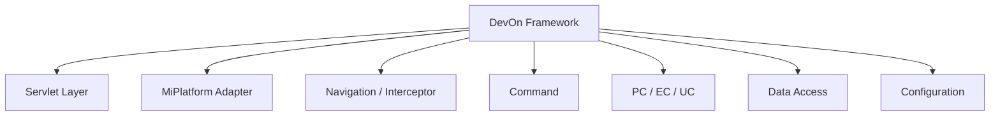
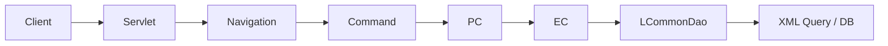

# DevOn Framework 구성요소 트리

> 전체 클래스, 컴포넌트, 설정 파일 구조
> 주의: 일부 클래스명은 아키텍처 설명용 대표 예시이며, 실제 소스와 파일명이 다를 수 있습니다.
> 현재 백업셋에서 직접 확인된 핵심 항목은 `MiplatformServlet`, `GeneralServlet`, `AbstractMiplatformCommand`, `MiplatformRequest`, `MiplatformResponse`, `MiplatformConverter`, `devon-framework.xml`, `requisite.xml` 입니다.

---

## 1. 전체 구조 개요



```
DevOn Framework
├── Servlet Layer (요청 수신)
├── MiPlatform Adapter Layer (데이터 변환)
├── Navigation Layer (라우팅)
├── Interceptor Layer (공통 처리)
├── Command Layer (컨트롤러)
├── Process Component Layer (비즈니스 로직)
├── Data Access Layer (데이터 접근)
└── Configuration Layer (설정)
```

---

## 2. 상세 트리 구조

```
devonx/nph/                                # COMMON 프로젝트
├── system/
│   ├── servlet/
│   │   ├── MiplatformServlet.java         # *.mhi 요청 처리
│   │   │   ├── doPost()                   # POST 요청 처리
│   │   │   ├── beforeCatchService()       # 요청 전처리
│   │   │   └── catchService()             # 서비스 처리
│   │   │
│   │   └── GeneralServlet.java            # *.his 요청 처리
│   │       └── doPost()
│   │
│   └── cmd/
│       └── AbstractMiplatformCommand.java  # Command 기본 클래스
│           ├── platformRequest            # MiPlatform 요청
│           ├── platformResponse           # MiPlatform 응답
│           ├── paramData                  # 파라미터 데이터
│           ├── execute()                  # 추상 메소드 (구현 필요)
│           ├── validateByRequisite()      # 입력값 검증
│           ├── logWrite()                 # 개인정보 마스킹 로깅
│           ├── getDatasetWithJobType()    # Dataset 추출
│           └── getMultiDatasetWithJobType()  # LMultiData 추출
│
├── miplatform/                            # MiPlatform 연동 계층
│   ├── MiplatformRequest.java             # MiPlatform 요청 처리
│   │   ├── receiveData()                  # HTTP 데이터 수신
│   │   ├── getVariableList()              # 파라미터 목록
│   │   ├── getDatasetList()               # Dataset 목록
│   │   └── getParamData()                 # LData로 변환
│   │
│   ├── MiplatformResponse.java            # MiPlatform 응답 처리
│   │   ├── addDataset()                   # Dataset 추가
│   │   ├── setVariable()                  # 변수 설정
│   │   └── sendData()                     # HTTP 응답 전송
│   │
│   ├── MiplatformConverter.java           # 데이터 변환 핵심
│   │   ├── convertToLMultiDataWithJobType()   # Dataset → LMultiData
│   │   ├── convertToDataset()              # LMultiData → Dataset
│   │   ├── convertVariableListToLData()   # VariableList → LData
│   │   └── convertToMiPlatformType()       # 타입 변환
│   │
│   └── PlatformRequest.java               # MiPlatform 라이브러리 래퍼
│       └── receiveData()                  # 바이너리/XML 파싱
│
├── navigation/                              # 라우팅 설정
│   └── navigation/*.xml 기반 처리
│       └── 실제 manager 클래스명은 본 백업셋에서 직접 미확인
│
├── interceptor/                             # 인터셉터
│   ├── LoginCheckInterceptor.java           # 로그인 체크 (실제 확인)
│   ├── FileUploadInterceptor.java           # 파일 업로드 (실제 확인)
│   ├── UrlPrivCheckInterceptor.java         # URL 권한 체크 (실제 확인)
│   └── 기타 인터셉터는 설정/프레임워크 내부 처리 가능성
│
├── transaction/                             # 트랜잭션
│   ├── TxServiceUtil.java                   # 트랜잭션 유틸 (실제 확인)
│   └── transaction manager 는 설정 기반
│       ├── LJDBCTransactionManager          # devon-framework.xml 확인
│       └── LJTATransactionManager           # devon-framework.xml 확인
│
├── data/                                    # 데이터 처리
│   ├── LData.java                             # 단일 데이터 객체 (Map-like)
│   │   ├── setString()
│   │   ├── getString()
│   │   ├── setObject()
│   │   └── getObject()
│   │
│   ├── LMultiData.java                        # 다중 데이터 객체 (List<LData>)
│   │   ├── add()                              # 행 추가
│   │   ├── getLData()                         # 행 조회
│   │   ├── getDataCount()                     # 행 수
│   │   └── getMetaData()                      # 메타데이터
│   │
│   ├── LMetaData.java                         # 메타데이터
│   │   └── addColumn()                        # 컬럼 정의
│   │
│   └── XML Query 실행 계층
│       ├── 현재 백업셋에서 LQueryService 실파일은 직접 미확인
│       └── 업무 코드에서는 LCommonDao 중심 호출 흔적 확인
│
├── util/                                    # 유틸리티
│   ├── LActionContext                       # 실제 import 패키지: devonframework.front.channel.context
│   │   ├── setHttpServletRequest()          # Request 저장
│   │   ├── getHttpServletRequest()          # Request 조회
│   │   ├── setMiplatformRequest()           # MiPlatform Request 저장
│   │   └── getMiplatformRequest()           # MiPlatform Request 조회
│   │
│   ├── DateUtil.java                        # 날짜 유틸
│   ├── StringUtil.java                      # 문자열 유틸
│   └── SecurityUtil.java                    # 보안 유틸 (암호화)
│
└── exception/                               # 예외 처리
    ├── LException.java                      # 기본 예외
    └── ValidationException.java             # 검증 예외


nph/his/                                    # NPH_HIS 프로젝트
├── az/                                     # 원무/공통업무
│   ├── auth/                               # 인증
│   │   └── cmd/
│   │       └── LoginUserCMD.java           # 로그인 Command
│   │
│   ├── bizcom/                             # 업무공통
│   │   └── cmcd/
│   │       ├── cmd/
│   │       │   ├── RetrievePbhlCdCMD.java  # 공통코드 조회
│   │       │   └── SavePbhlCdCMD.java      # 공통코드 저장
│   │       └── pc/
│   │           └── CmcdPC.java             # 공통코드 Process Component
│   │
│   └── user/                               # 사용자 관리
│       └── cmd/
│           └── RetrieveUserListCMD.java
│
├── md/                                     # 진료
│   └── opn/                                # 외래진료
│       └── cmd/
│           └── RetrievePatientListCMD.java
│
├── mr/                                     # 원무/수납
│
├── sp/                                     # 검사/방사선
│
└── er/                                     # 응급


nph/ecs/                                    # NPH_ECS 프로젝트
└── emr/                                    # EMR 연동
    └── ExternalDBPusher.java               # 외부 DB 연동


```

---

## 3. 설정 파일 트리

```
devonhome/                                  # DevOn 설정 루트
│
├── conf/                                   # 주요 설정
│   ├── devon.xml                           # 메인 설정
│   │   └── datasource                      # 데이터소스 정의
│   │
│   ├── devon-core.xml                      # 코어 설정
│   │
│   ├── devon-framework.xml                 # 프레임워크 설정
│   │   ├── interceptor-stack               # 인터셉터 스택
│   │   │   ├── defaultStack                # 기본 스택
│   │   │   └── defaultStack / notLoginCheckStack   # 확인된 스택 예시
│   │   └── datasource                      # JNDI 데이터소스
│   │
│   └── requisite.xml                       # 입력값 검증 규칙
│       ├── requisite name="LoginUser"
│       ├── requisite name="SavePatient"
│       └── ...
│
├── navigation/                             # 네비게이션 설정 (URL 라우팅)
│   ├── his/                                # 병원정보시스템
│   │   ├── az/
│   │   │   ├── comnNavi.xml               # 공통업무 네비게이션
│   │   │   │   ├── action name="RetrievePbhlCd"
│   │   │   │   ├── action name="SavePbhlCd"
│   │   │   │   └── action name="DeletePbhlCd"
│   │   │   │
│   │   │   ├── authNavi.xml               # 인증 네비게이션
│   │   │   │   ├── action name="LoginUser"
│   │   │   │   └── action name="LogoutUser"
│   │   │   │
│   │   │   └── userNavi.xml               # 사용자 네비게이션
│   │   │
│   │   ├── md/                            # 진료 네비게이션
│   │   ├── mr/                            # 원무 네비게이션
│   │   ├── sp/                            # 검사 네비게이션
│   │   └── er/                            # 응급 네비게이션
│   │
│   ├── mhi/                               # MiPlatform 네비게이션
│   ├── img/                               # 이미지업무 네비게이션
│   └── ajax/                              # AJAX 네비게이션
│
└── xmlquery/                              # XML 기반 SQL
    ├── app/                               # 공통
    │   ├── emp/
    │   │   ├── login.xml                  # 로그인 관련 SQL
    │   │   └── user.xml                   # 사용자 관련 SQL
    │   └── comn/
    │       └── code.xml
    │
    ├── az/                                # 원무/공통
    │   └── comn/
    │       └── cmcd.xml                   # 공통코드 SQL
    │
    ├── md/                                # 진료
    │   └── opn/
    │       └── patient.xml                # 환자 SQL
    │
    ├── mr/                                # 원무
    ├── sp/                                # 검사
    └── er/                                # 응급
```

---

## 4. 클래스 상속/구현 트리

```
java.lang.Object
│
├── javax.servlet.http.HttpServlet
│   └── devonx.nph.system.servlet.MiplatformServlet
│       ├── doPost(HttpServletRequest, HttpServletResponse)
│       ├── beforeCatchService()               # 전처리
│       └── catchService()                     # 처리
│
├── devonx.nph.system.cmd.AbstractMiplatformCommand
│   ├── platformRequest: MiplatformRequest     # 요청 객체
│   ├── platformResponse: MiplatformResponse   # 응답 객체
│   ├── paramData: LData                       # 파라미터
│   │
│   ├── AbstractMiplatformCommand()              # 생성자
│   │   ├── validateByRequisite()              # 검증
│   │   └── logWrite()                         # 로깅
│   │
│   └── execute()                              # 추상 메소드
│       ↑
│       ├── nph.his.az.auth.cmd.LoginUserCMD
│       │   └── execute()
│       │
│       ├── nph.his.az.bizcom.cmcd.cmd.RetrievePbhlCdCMD
│       │   └── execute()
│       │
│       ├── nph.his.az.bizcom.cmcd.cmd.SavePbhlCdCMD
│       │   └── execute()
│       │
│       └── [기타 Command 클래스들...]
│
├── com.tobesoft.miplatform.dataset.Dataset
│   └── 변환 → devonx.nph.data.LMultiData
│
├── devonx.nph.data.LData
│   ├── keys: Map<String, Object>              # 데이터 저장
│   ├── setString(key, value)
│   ├── getString(key)
│   └── getKeys()
│
├── devonx.nph.data.LMultiData
│   ├── dataList: List<LData>                  # 행 목록
│   ├── metaData: LMetaData                    # 메타데이터
│   ├── add(LData)                             # 행 추가
│   ├── getLData(index)                        # 행 조회
│   └── getDataCount()                         # 행 수
│
├── devonx.nph.miplatform.MiplatformRequest
│   ├── platformRequest: PlatformRequest       # MiPlatform 라이브러리
│   ├── receiveData()                          # 데이터 수신
│   ├── getVariableList()                      # 파라미터 목록
│   ├── getDatasetList()                       # Dataset 목록
│   └── getParamData()                         # LData 변환
│
├── devonx.nph.miplatform.MiplatformResponse
│   ├── platformResponse: PlatformResponse     # MiPlatform 라이브러리
│   ├── addDataset(name, LMultiData)             # Dataset 추가
│   ├── setVariable(key, value)                  # 변수 설정
│   └── sendData()                               # 응답 전송
│
└── devonx.nph.transaction.TxServiceUtil
    ├── getNTxService(serviceName)             # 서비스 획득
    ├── begin()                                  # 트랜잭션 시작
    ├── commit()                                 # 커밋
    └── rollback()                               # 롤백
```

---

## 5. 데이터 흐름 트리



```
[MiPlatform Client]
    │
    ▼ cf_Transaction("SaveUser", "/az/.../SaveUser.mhi", ...)
    │
    ▼ HTTP POST + Dataset (Binary/XML)
    │
[Servlet Layer]
    │
    ▼ MiplatformServlet.doPost()
    │
    ▼ beforeCatchService()
        │
        ├── MiplatformRequest.receiveData()     # HTTP 파싱
        ├── VariableList (파라미터)
        └── DatasetList (데이터셋)
    │
    ▼ MiplatformConverter
        │
        ├── Dataset → LMultiData 변환
        ├── _CUD 필드 추가 (C/U/D)
        └── LActionContext 저장
    │
[Navigation Layer]
    │
    ▼ navigation XML 기반 action 탐색 (manager 클래스명 미확인)
        │
        └── az/bizcom/cmcdNavi.xml
            │
            └── action name="SaveUser"
                ├── command: nph.his.az.bizcom.cmcd.cmd.SavePbhlCdCMD
                └── interceptor: defaultStack
    │
[Interceptor Layer]
    │
    ▼ Interceptor Chain
        │
        ├── LoginCheckInterceptor.doIntercept()
        ├── converter interceptor (설정 기준)
        └── command interceptor (설정 기준)
            │
            └── new SavePbhlCdCMD()
                │
[Command Layer]
    │
    ▼ AbstractMiplatformCommand 생성자
        │
        ├── platformRequest/platformResponse 획득
        ├── paramData 추출
        └── validateByRequisite()               # 입력값 검증
    │
    ▼ SavePbhlCdCMD.execute()                   # 구체적 실행
        │
        ├── getMultiDatasetWithJobType("ds_Input")
        │
        ▼ TxServiceUtil.getNTxService("az.bizcom.CmcdPC")
            │
            ├── Transaction Begin
            │
[Process Component Layer]
            │
            ▼ CmcdPC.savePbhlCd(LMultiData)
                │
                ├── 비즈니스 로직
                │
                ▼ XML Query 실행 계층 호출
                    │
[Data Access Layer]
                    │
                    ├── XML 파일 로드 (cmcd.xml)
                    ├── SQL 파싱
                    ├── ${param} 문자열 치환
                    │
                    ▼ JDBC Statement.execute()
                        │
[Database]
                        ▼ Oracle/Tibero
                            │
                    ▼ ResultSet
                        │
                    ▼ ResultSet → LMultiData 변환
                        │
[Process Component Layer]
                    ▼ PC 메소드 반환
                        │
            ▼ TxServiceUtil
                ├── Commit 또는 Rollback
                └── Transaction End
                    │
[Command Layer]
            ▼ platformResponse.addDataset("ds_Result", result)
                │
[MiPlatform Adapter Layer]
            ▼ MiplatformConverter.convertToDataset()
                │
                ├── LMultiData → Dataset 변환
                └── 컬럼 메타데이터 생성
                    │
[Servlet Layer]
    ▼ MiplatformResponse.sendData()
        │
        ▼ HTTP Response (Binary/XML)
            │
[MiPlatform Client]
    ▼ Dataset 파싱
    ▼ 화면 갱신
    ▼ 콜백 함수 실행
```

---

## 6. 설정 파일 샘플

### 6.1 devon-framework.xml
```xml
<devon-framework>
    <!-- 데이터소스 -->
    <datasource name="default">
        <jndi-name>java:comp/env/jdbc/NPHDB</jndi-name>
    </datasource>

    <!-- 인터셉터 스택: 현재 백업셋에서 확인된 값 -->
    <interceptor-stack name="defaultStack">
        <interceptor-ref name="loginCheck"/>
        <interceptor-ref name="converter"/>
        <interceptor-ref name="command"/>
    </interceptor-stack>

    <interceptor-stack name="notLoginCheckStack">
        <interceptor-ref name="converter"/>
        <interceptor-ref name="command"/>
    </interceptor-stack>
</devon-framework>
```

### 6.2 Navigation XML (az/comnNavi.xml)
```xml
<navigation>
    <action name="RetrievePbhlCd">
        <command>nph.his.az.bizcom.cmcd.cmd.RetrievePbhlCdCMD</command>
        <interceptor>defaultStack</interceptor>
    </action>

    <action name="SavePbhlCd">
        <command>nph.his.az.bizcom.cmcd.cmd.SavePbhlCdCMD</command>
        <interceptor>defaultStack</interceptor>
        <requisite>SavePbhlCd</requisite>
    </action>
</navigation>
```

### 6.3 XML Query (az/comn/cmcd.xml)
```xml
<queries>
    <query name="retrievePbhlCdList">
        <statement>
            SELECT PBHL_CD, PBHL_NM, USE_YN
            FROM PBHL_CD_MASTER
            WHERE USE_YN = 'Y'
            ORDER BY PBHL_CD
        </statement>
    </query>
</queries>
```

---

## 7. 실행 흐름 요약 트리

```
HTTP Request (*.mhi)
    │
    ▼ [Servlet Layer]
    MiplatformServlet
        │
        ▼ beforeCatchService()
            ├── MiplatformRequest.receiveData()
            └── MiplatformConverter (Dataset → LMultiData)
    │
    ▼ [Navigation Layer]
    navigation XML 기반 처리
        └── navigation/*.xml
    │
    ▼ [Interceptor Layer]
    Interceptor Chain
        ├── LoginCheckInterceptor
        ├── converter interceptor
        └── command interceptor
            │
            ▼ new Command()
                │
    ▼ [Command Layer]
    AbstractMiplatformCommand
        ├── validateByRequisite()
        ├── logWrite()
        └── execute()  ← 추상 메소드
            │
            ▼ concrete Command.execute()
                ├── getMultiDatasetWithJobType()
                │
                ▼ TxServiceUtil.getNTxService()
                    │
        ▼ [Process Component Layer]
        PC (Process Component)
            │
            ▼ XML Query 실행 계층 호출
                │
        ▼ [Data Access Layer]
        XML Query
            ├── XML 파일 로드
            ├── SQL 파싱
            ├── ${param} 치환
            └── JDBC 실행
                │
        ▼ ResultSet → LMultiData
            │
        ▼ PC 반환
            │
        ▼ Command: platformResponse.addDataset()
            │
        ▼ MiplatformConverter (LMultiData → Dataset)
            │
    ▼ [Servlet Layer]
    MiplatformResponse.sendData()
        │
        ▼ HTTP Response
```

---

## 8. 핵심 클래스 요약

| 계층 | 클래스 | 역할 |
|------|--------|------|
| **Servlet** | `MiplatformServlet` | 모든 요청의 입구 |
| **Adapter** | `MiplatformConverter` | Dataset ↔ LMultiData 변환 |
| **Adapter** | `MiplatformRequest` | MiPlatform 요청 파싱 |
| **Adapter** | `MiplatformResponse` | MiPlatform 응답 생성 |
| **Command** | `AbstractMiplatformCommand` | Command 기본 클래스 |
| **Data** | `LData` | 단일 데이터 객체 |
| **Data** | `LMultiData` | 다중 데이터 객체 |
| **Data** | `XML Query 실행 계층` | XML Query 호출 처리 |
| **Transaction** | `TxServiceUtil` | 트랜잭션 관리 |
| **Util** | `devonframework.front.channel.context.LActionContext` | ThreadLocal 컨텍스트 |

---

*이 트리는 DevOn Framework의 주요 구성요소와 실행 흐름을 보여줍니다.*
