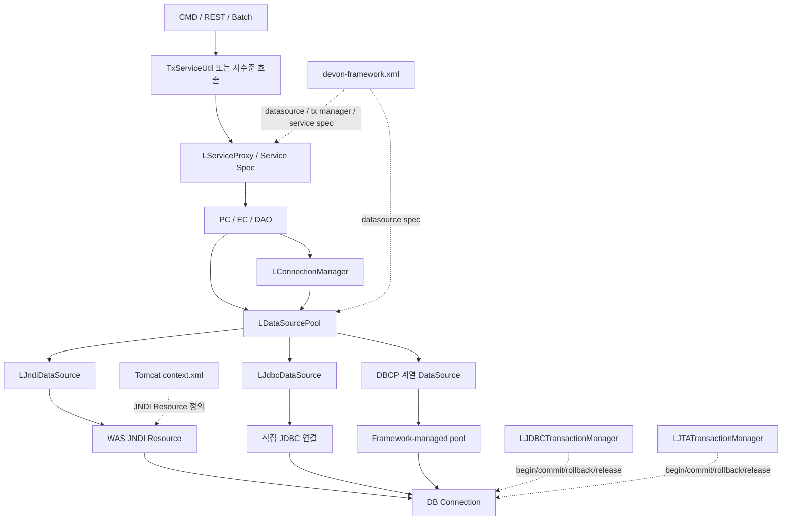
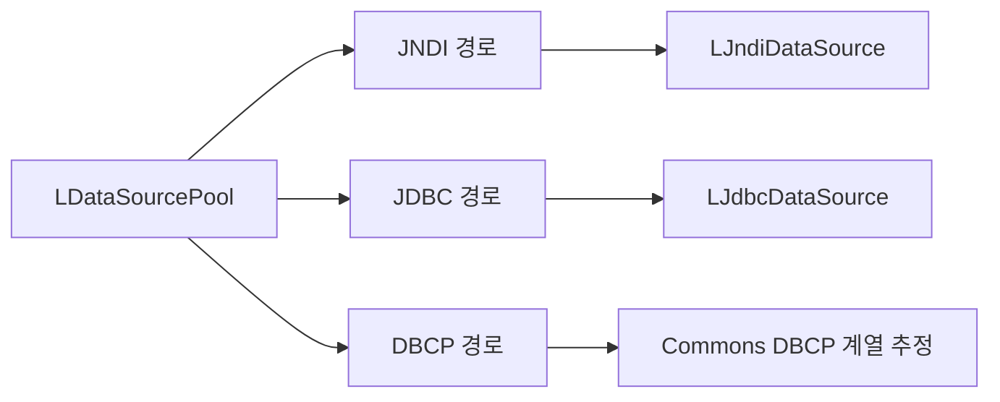
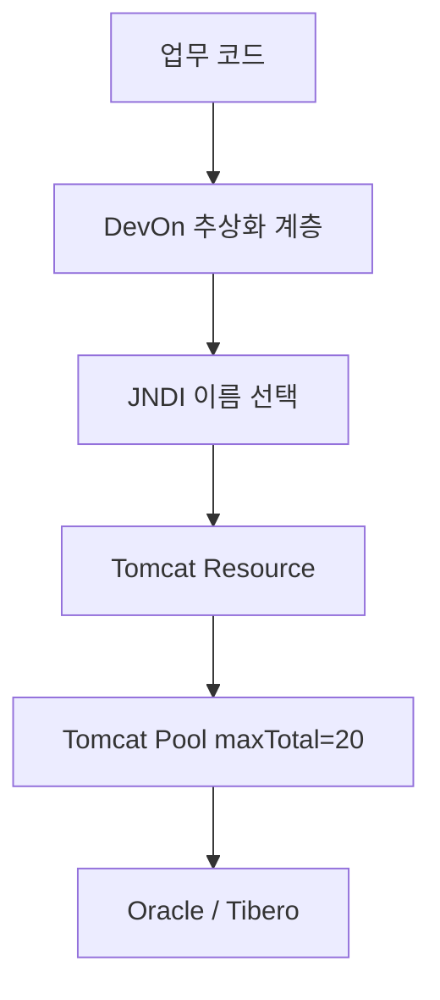
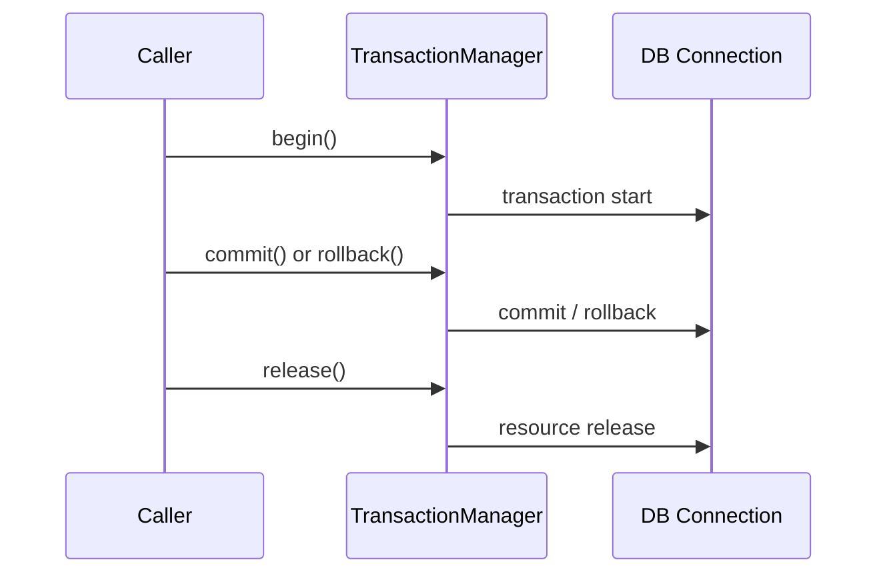
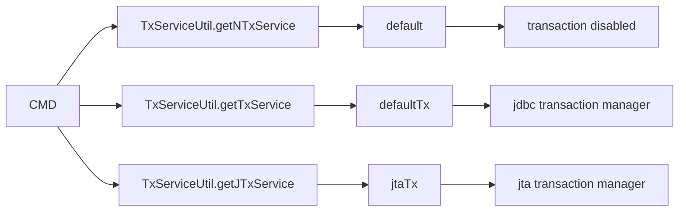

# DevOn Connection / Pool / TX 내부동작 분석

> 분석 대상:
> - `devon-framework.jar`
> - `devon-framework_api`
> - `NPH_HIS/devonhome/conf/product/devon-framework.xml`
> - `Servers/Tomcat v9.0 Server at localhost-config/context.xml`
> - `COMMON/src/devonx/nph/util/TxServiceUtil.java`
> - `NPH_HIS/src/*`, `NPH_HIS/src/nph/bat/*` 실제 사용 코드
>
> 목적:
> - Connection을 누가 만들고 누가 넘겨주는지
> - Pool을 프레임워크가 직접 가지는지, WAS를 타는지
> - Transaction이 어디서 시작되고 어디서 끝나는지
> - NPH가 실제로 어떤 방식을 주로 쓰는지

---

## 1. 한눈 요약

### 1.1 결론

현재 확인된 근거만 놓고 보면 DevOn의 DB 자원 흐름은 아래처럼 이해하는 것이 가장 안전하다.

```text
업무 코드
-> TxServiceUtil / Service Proxy
-> PC / EC / DAO
-> LConnectionManager 또는 LDataSourcePool
-> JNDI DataSource 또는 JDBC/DBCP 계열 DataSource
-> DB Connection
-> JDBC 실행
-> Transaction Manager가 commit / rollback / release
```

핵심 판단:

- **실행 계층은 JDBC 기반이다**
- **Connection 추상화 계층이 분명히 존재한다**
- **`LDataSourcePool`은 JNDI / JDBC / DBCP 3종 타입을 수용하는 범용 계층이다**
- **NPH 운영 설정은 JNDI 기반 자원 참조가 강하다**
- **Transaction은 `LJDBCTransactionManager` / `LJTATransactionManager`로 분리되어 있다**
- **실무 코드 대부분은 저수준 Connection 직접 제어보다 `TxServiceUtil` + 서비스 프록시를 더 많이 사용한다**

즉, DevOn은 "SQL을 XML로 외부화한 JDBC 프레임워크"일 뿐 아니라,
**Connection / Pool / Transaction까지 한 번 더 감싼 엔터프라이즈 실행 프레임워크**에 가깝다.

---

## 2. 분석 양식

이후 다른 계층도 같은 틀로 보면 비교가 쉬워진다.

### 2.1 권장 분석 순서

1. **역할**
   - 이 계층이 무엇을 담당하는가
2. **핵심 클래스**
   - jar / API 문서에서 어떤 클래스가 보이는가
3. **실제 설정**
   - `devon-framework.xml`, `context.xml`에서 어떻게 연결되는가
4. **실사용 코드**
   - NPH 업무 코드나 배치 코드에서 실제로 어떻게 부르는가
5. **해석**
   - 설계 의도는 무엇으로 보이는가
6. **열린 이슈**
   - 아직 확정하지 못한 부분은 무엇인가

### 2.2 이 문서에서 적용한 질문

- Connection은 누가 가져오나
- Pool은 누가 들고 있나
- Transaction은 어디서 begin / commit / rollback 하나
- JTA와 JDBC는 언제 갈라지나
- NPH는 실무에서 어떤 경로를 더 많이 쓰나

---

## 3. 전체 구조도



---

## 4. Connection 계층

### 4.1 `LConnectionManager`

API 문서에서 확인된 사실:

- 클래스: `devonframework.persistent.dao.LConnectionManager`
- 역할 설명에 `LDataSourcePool`을 이용해 Connection을 제어한다고 되어 있음
- 대표 메서드:
  - `getConnection()`
  - `getConnection(String dataSourceSpec)`
  - `closeConnection(Connection conn)`
  - `getXAResource(String dataSourceSpec)`

해석:

- `LConnectionManager`는 자체적으로 복잡한 로직을 모두 가지는 핵심 엔진이라기보다
  **업무 코드에서 쓰기 쉬운 static 진입점** 성격이 강하다.
- 실제 Connection 획득의 중심은 `LDataSourcePool` 쪽에 더 가깝다.

### 4.2 실제 사용 예시

```java
// nph.bat.sample.SqlRunningJob
conn = LConnectionManager.getConnection(dataSourceSpec);
...
conn.commit();
...
conn.rollback();
```

이 패턴은 배치나 저수준 처리에서 보인다.

즉,

- 상위 서비스 프록시를 거치지 않고
- 특정 datasource spec을 명시해
- 직접 commit / rollback을 제어해야 할 때

`LConnectionManager`가 보조 진입점으로 사용된다.

---

## 5. Pool 계층

### 5.1 `LDataSourcePool`

API 문서에서 확인된 사실:

- 클래스: `devonframework.persistent.connection.LDataSourcePool`
- `java.util.Observer` 구현
- `getInstance()` 제공
- 지원 타입 상수:
  - `JDBCTYPE`
  - `JNDITYPE`
  - `DBCPTYPE`
- 대표 메서드:
  - `getConnection()`
  - `getConnection(String dataSourceSpec)`
  - `getJDBCConnection()`
  - `getJDBCConnection(String dataSourceSpec)`
  - `getJNDIConnection()`
  - `getJNDIConnection(String dataSourceSpec)`
  - `getDBCPConnection()`
  - `getDBCPConnection(String dataSourceSpec)`
  - `getXAResource()`
  - `getXAResource(String dataSourceSpec)`
  - `freeJDBCConnection(...)`
  - `printJDBCConnStatus(...)`

API 문서 설명에서 읽히는 핵심:

- `LJdbcDataSource`, `LJndiDataSource`를 풀링하여 Connection을 제공한다
- 기본 Connection 획득 객체는 `LJdbcDataSource`일 수 있고
- 그 값은 `devon-framework.xml`로 설정 가능하다

### 5.2 구조 해석

이 계층은 단순한 "커넥션 유틸"이 아니다.



즉 DevOn은 처음부터 다음 3가지 운용 모드를 염두에 둔 것으로 보인다.

1. **JNDI 기반**
   - WAS가 가진 DataSource / Pool 사용
2. **JDBC 기반**
   - 프레임워크가 직접 JDBC Connection 처리
3. **DBCP 기반**
   - 별도 pooling 계층 사용

### 5.3 실제 사용 예시

```java
// nph.bat.common.reader.JdbcCursorReader
connection = LDataSourcePool.getInstance().getConnection();
...
connection = LDataSourcePool.getInstance().getConnection(dbSpec);
```

이 코드는 배치 reader가 직접 Connection을 꺼내는 전형적인 예시다.

해석:

- 배치 프레임워크 내부에서는 `LDataSourcePool`을 직접 호출할 정도로
  **낮은 계층 API를 노출**하고 있다.
- 즉 DevOn은 "상위 서비스 프록시만 허용하는 완전 은닉 구조"는 아니다.

---

## 6. NPH 실제 DataSource 설정

### 6.1 `devon-framework.xml`

현재 확인된 datasource spec:

| Spec | JNDI Name |
| --- | --- |
| `default` | `java:comp/env/jdbc/NPHDB` |
| `longtermdb` | `java:comp/env/jdbc/NPHDB` |
| `encdb` | `java:comp/env/jdbc/NPHENCDB` |
| `smsdb` | `java:comp/env/jdbc/NPHSMSDB` |
| `difdb` | `java:comp/env/jdbc/NPHDIFDB` |
| `emrdb` | `java:comp/env/jdbc/NPHBKDB` |
| `qcdb` | `java:comp/env/jdbc/NPHQCDB` |
| `infdb` | `java:comp/env/jdbc/NPHINFDB` |
| `gwdb` | `java:comp/env/jdbc/NPHGW` |

이 값만 봐도 NPH는 운영 수준에서 **JNDI 기반 다중 DataSource 구조**를 사용한다.

### 6.2 내부 pool 정의도 존재함

`devon-framework.xml`에는 별도로 아래 설정도 있다.

| 항목 | 값 |
| --- | --- |
| pool name | `default` |
| `max-active-connections` | `30` |
| `max-idle-connections` | `10` |
| `max-checkout-time` | `20000` |
| `wait-time` | `15000` |
| `ping-query` | `SQL SELECT 1 FROM DUAL` |
| `ping-enabled` | `false` |
| `quiet-mode` | `true` |

### 6.3 해석

여기서 중요한 점은 **JNDI 설정과 내부 pool 설정이 동시에 존재한다**는 것이다.

이 상태는 보통 아래 두 가지 해석이 가능하다.

1. 프레임워크가 원래 JDBC/DBCP/JNDI 모두 지원하도록 설계되었고
   NPH는 현재 JNDI를 주로 사용한다.
2. 프레임워크 내부에 자체 pool 옵션이 남아 있지만,
   실제 운영은 WAS JNDI 자원을 우선 사용한다.

현재 근거만으로는 2번 가능성이 더 높다.

이유:

- 각 datasource spec이 전부 `java:comp/env/...` 로 연결되어 있음
- 운영 자원 정의는 `context.xml`에도 별도로 존재함

---

## 7. WAS Pool과의 관계

### 7.1 `context.xml` 실제 자원

Tomcat 설정에서 확인된 자원 특징:

- Oracle 계열 resource 다수
- Tibero resource 1개
- 주요 자원의 `maxTotal="20"`

즉 현재 NPH 배포 환경에서는 **WAS가 실제 JNDI Resource와 pool 크기를 관리하는 흔적**이 분명하다.

### 7.2 해석



따라서 현재 NPH를 설명할 때는 이렇게 쓰는 것이 안전하다.

- **프레임워크는 Pool/DataSource 추상화 계층을 제공한다**
- **현재 NPH 실제 배포 설정은 JNDI를 통해 WAS Pool을 사용하는 형태가 강하다**

즉, "프레임워크가 pool을 아예 직접 다 들고 있다"라고 단정하면 과하고,
"WAS pool만 쓰고 프레임워크는 아무 역할이 없다"라고 해도 틀리다.

정확한 표현은:

> DevOn이 Connection/Pooled DataSource를 추상화하고,
> NPH는 그 추상화 아래에서 JNDI 기반 WAS 자원을 주로 사용한다.

---

## 8. Transaction 계층

### 8.1 확인된 클래스

- `devonframework.business.transaction.LAbstractTransactionManager`
- `devonframework.business.transaction.LTransactionManagerFactory`
- `devonframework.business.transaction.jdbc.LJDBCTransactionManager`
- `devonframework.business.transaction.jta.LJTATransactionManager`

### 8.2 공통 lifecycle

API 문서 기준 공통 메서드:

- `begin()`
- `commit()`
- `rollback()`
- `release()`

즉 DevOn의 트랜잭션 모델은 추상적으로 매우 전형적이다.



### 8.3 JDBC Transaction Manager

`LJDBCTransactionManager` API 문서 예시는 다음 흐름을 직접 보여준다.

```java
LAbstractTransactionManager manager =
    LTransactionManagerFactory.createTransactionManager("jdbc");

manager.begin();
...
manager.commit();
...
manager.rollback();
...
manager.release();
```

해석:

- 단일 JDBC Connection 기반 로컬 트랜잭션에 가깝다
- 서비스/DAO 작업을 감싼 뒤 commit / rollback / release를 수행하는 방식이다

### 8.4 JTA Transaction Manager

`LJTATransactionManager`도 같은 lifecycle을 가지며,
`devon-framework.xml`에는 아래 JTA 설정이 확인된다.

- `jndi-name = java:comp/UserTransaction`
- `context-factory = jeus.jndi.JNSContextFactory`

해석:

- JTA 경로는 애플리케이션 서버의 글로벌 트랜잭션 자원을 쓰기 위한 채널이다
- 여러 자원에 걸친 트랜잭션 가능성을 염두에 둔 설계다

---

## 9. NPH 실제 Service Transaction 연결

### 9.1 `TxServiceUtil`

실제 코드:

```java
public static Object getTxService(String className) {
    return LServiceProxy.getProxy("defaultTx", ...);
}

public static Object getNTxService(String className) {
    return LServiceProxy.getProxy("default", ...);
}

public static Object getJTxService(String className) {
    return LServiceProxy.getProxy("jtaTx", ...);
}
```

이 구조는 DevOn의 트랜잭션 선택이 **서비스 프록시 spec 이름**을 기준으로 이뤄짐을 보여준다.

### 9.2 `devon-framework.xml` service spec

확인된 service 성격:

| Service Spec | Transaction |
| --- | --- |
| `default` | `transaction-enabled=false` |
| `defaultTx` | `transaction-enabled=true`, `transaction-manager-ref=jdbc` |
| `jtaTx` | `transaction-enabled=true`, `transaction-manager-ref=jta` |

즉 `TxServiceUtil`은 이름만 편하게 감싼 유틸이고,
실제 트랜잭션 연결은 **service spec + transaction manager ref** 조합에서 결정된다.

### 9.3 해석



이 설계는 개발자가 복잡한 TransactionManager API를 직접 만지지 않도록 하면서도,
업무 단위에 따라 `무트랜잭션 / JDBC 트랜잭션 / JTA 트랜잭션`을 고를 수 있게 만든 것이다.

---

## 10. 실제 사용 패턴 비교

### 10.1 업무 화면/Command 계층

업무 Command는 대체로 아래 패턴을 따른다.

```java
LoginIFPC loginPC =
    (LoginIFPC) TxServiceUtil.getNTxService("az.bizcom.LoginPC");
```

```java
OtptMdcrPrprIFPC pc =
    (OtptMdcrPrprIFPC) TxServiceUtil.getTxService("md.opn.OtptMdcrPrprPC");
```

의미:

- 조회성 작업은 `default`
- 저장성 작업은 `defaultTx`

이렇게 구분될 가능성이 높다.

### 10.2 배치/저수준 계층

배치에서는 더 아래 레벨 API가 직접 보인다.

```java
connection = LDataSourcePool.getInstance().getConnection(dbSpec);
```

```java
conn = LConnectionManager.getConnection(dataSourceSpec);
...
conn.commit();
...
conn.rollback();
```

```java
this.jobTransaction = LTransactionManagerFactory.createTransactionManager(paramString);
```

의미:

- 배치는 service proxy보다 **직접 자원 제어**가 더 중요할 수 있다
- 그래서 Connection과 TransactionManager를 한 단계 더 낮게 다루는 코드가 존재한다

---

## 11. JDBC를 직접 쓰는가

결론은 **그렇다**.

근거:

- `LConnection`, `LPreparedStatement`, `LStatement`, `LCallableStatement` 계열 클래스가 jar에 존재
- `LConnectionManager`, `LDataSourcePool`이 `java.sql.Connection`을 직접 반환
- TransactionManager API도 JDBC Connection lifecycle과 자연스럽게 이어짐

단, "업무 코드가 무조건 raw JDBC를 직접 쓴다"는 뜻은 아니다.

정확한 설명은 다음과 같다.

> 업무 코드는 DevOn 추상화 계층을 사용하지만,
> 그 아래 실행 엔진은 결국 JDBC 기반이다.

즉 Hibernate 같은 ORM과는 철학이 다르다.

---

## 12. 다이렉트 액세스라는 표현을 어떻게 이해하면 되는가

업무 이해 중심으로 보면 "다이렉트 액세스"는 두 층위가 있다.

### 12.1 SQL 관점

- SQL이 XML Query 파일에 직접 적혀 있다
- ORM이 SQL을 자동 생성하는 구조가 아니다

이 의미에서는 **직접 SQL 제어형**이다.

### 12.2 Connection 관점

- 대부분의 업무 코드는 `TxServiceUtil`, `LCommonDao`를 통해 추상화된 접근을 한다
- 하지만 배치/저수준 코드는 `LConnectionManager`, `LDataSourcePool`, `conn.commit()`까지 직접 만진다

이 의미에서는 **상위 계층은 추상화, 하위 계층은 직접 제어 허용형**이다.

즉 DevOn은 완전히 감춘 프레임워크가 아니라,
필요하면 한 단계 아래로 내려갈 수 있는 구조다.

---

## 13. 설계 사상 추론

현재 구조에서 읽히는 설계 사상은 다음과 같다.

### 13.1 업무 개발자는 단순하게

- `TxServiceUtil`
- `LCommonDao`
- `query path`

정도만 알면 대부분의 업무 개발이 가능하도록 설계됐다.

### 13.2 인프라 계층은 선택지를 넓게

- JNDI
- JDBC
- DBCP
- JDBC TX
- JTA TX

를 동시에 품고 있다.

즉 제품 프레임워크는 **여러 WAS/배포 방식/운영 정책**에 대응하려 한 것으로 보인다.

### 13.3 SQL은 개발자가 통제

- SQL을 XML Query로 밖에 둔다
- ORM 자동 생성보다 SQL 통제권을 유지한다

이는 병원정보시스템처럼 SQL 제어가 중요한 도메인과 잘 맞는다.

### 13.4 서비스 프록시로 정책 분리

- 업무 코드는 "무슨 PC를 쓸지"만 신경 쓰고
- 트랜잭션 여부는 service spec으로 분리한다

즉 정책을 코드 한 줄로 노출하되,
구체 설정은 설정 파일에 남겨둔 구조다.

---

## 14. 현재 시점에서 안전한 설명 문장

문서/회의에서 아래처럼 설명하면 과장이나 오해가 적다.

1. DevOn의 DB 실행 엔진은 JDBC 기반이다.
2. SQL은 Java 코드가 아니라 XML Query에 있다.
3. 업무 코드는 주로 `TxServiceUtil`과 `LCommonDao` 같은 상위 추상화를 사용한다.
4. 프레임워크 내부에는 `LConnectionManager`, `LDataSourcePool`, TransactionManager 계층이 있다.
5. NPH 현재 설정은 JNDI DataSource를 통해 WAS pool을 사용하는 구성이 강하다.
6. 다만 프레임워크 자체는 JDBC/DBCP/JNDI를 모두 수용하도록 설계된 흔적이 있다.

---

## 15. 아직 남은 열린 이슈

이번 근거만으로는 아래는 아직 확정하지 않았다.

1. `LJndiDataSource`, `LJdbcDataSource` 내부 구현
   - 실제로 얼마나 얇은 wrapper인지
   - 내부 pool을 직접 가지는지

2. `DBCPTYPE` 실제 사용 여부
   - 코드 표면은 있으나 NPH 운영 설정에서 적극 사용 흔적은 아직 약함

3. JTA 실제 사용 범위
   - 설정은 분명히 있으나 업무 코드에서 `getJTxService(...)` 사용 빈도는 추가 측정 필요

4. 프레임워크 내부 pool과 WAS pool의 우선순위
   - 현재는 JNDI 우세로 보이지만 runtime precedence는 더 확인 가능

---

## 16. 다음 순서 제안

이 문서 다음으로는 아래 순서가 가장 자연스럽다.

1. `LJndiDataSource`, `LJdbcDataSource`, `LDataSourcePool` 내부 구현 추적
   - pool 소유권과 자원 반환 전략 확정
2. `LServiceProxy`와 service spec 연결 추적
   - `default`, `defaultTx`, `jtaTx`가 runtime에서 어떻게 weaving 되는지 확인
3. `front -> service -> dao -> tx` 전체 실행 체인 복원
   - 사용자가 요청한 "프레임워크 설계 사상"을 더 입체적으로 설명 가능

---

## 17. 참고 근거

- `COMMON/src/devonx/nph/util/TxServiceUtil.java`
- `NPH_HIS/src/nph/bat/sample/SqlRunningJob.java`
- `NPH_HIS/src/nph/bat/common/reader/JdbcCursorReader.java`
- `NPH_HIS/src/nph/bat/common/system/DevonTransactoinManager.java`
- `NPH_HIS/webapp/api/devon-framework_api/devonframework/persistent/connection/LDataSourcePool.html`
- `NPH_HIS/webapp/api/devon-framework_api/devonframework/persistent/dao/LConnectionManager.html`
- `NPH_HIS/webapp/api/devon-framework_api/devonframework/business/transaction/jdbc/LJDBCTransactionManager.html`
- `NPH_HIS/webapp/api/devon-framework_api/devonframework/business/transaction/jta/LJTATransactionManager.html`
- `NPH_HIS/devonhome/conf/product/devon-framework.xml`
- `Servers/Tomcat v9.0 Server at localhost-config/context.xml`
