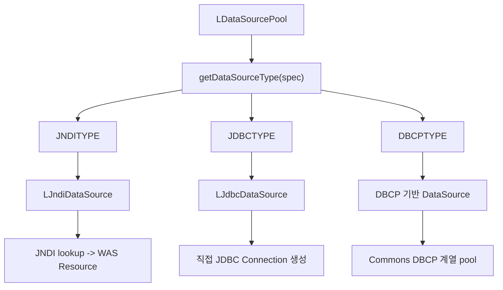
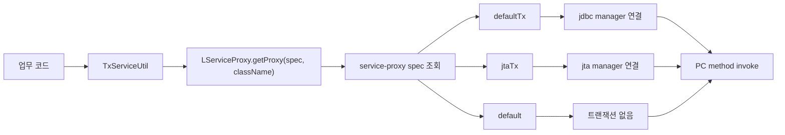
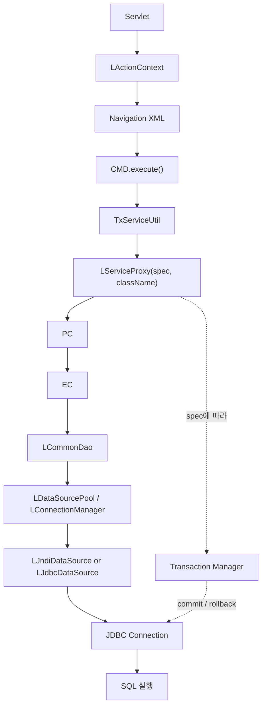

# DevOn DataSource / Service Proxy / Execution Chain 심층분석

> 분석 대상:
> - `devon-framework.jar`
> - `devon-framework_api`
> - `COMMON/src/devonx/nph/system/servlet/*`
> - `COMMON/src/devonx/nph/system/cmd/AbstractMiplatformCommand.java`
> - `COMMON/src/devonx/nph/util/TxServiceUtil.java`
> - `NPH_HIS/devonhome/conf/product/devon-framework.xml`
> - `NPH_HIS/devonhome/navigation/**/*.xml`
> - `NPH_HIS/src/**/*.java`
>
> 이번 문서의 목적:
> - `LJndiDataSource`, `LJdbcDataSource`, `LDataSourcePool`의 내부 구조를 현재 근거 범위에서 최대한 추적
> - `LServiceProxy`와 `default / defaultTx / jtaTx`가 어떻게 엮이는지 정리
> - `front -> service -> dao -> tx` 전체 실행 체인을 실제 코드 기준으로 복원

---

## 1. 한눈 요약

### 1.1 결론

현재 확보한 근거를 종합하면 DevOn의 실행 체인은 아래처럼 이해하는 것이 가장 정확하다.

```text
Servlet
-> LActionContext에 request/response 적재
-> Navigation(action -> command) 해석
-> Command execute()
-> TxServiceUtil / LServiceProxy
-> PC
-> EC
-> LCommonDao
-> LDataSourcePool / LConnectionManager
-> LJndiDataSource 또는 LJdbcDataSource
-> JDBC Connection
-> TransactionManager commit / rollback / release
```

핵심 판단:

- `LServiceProxy`는 **서비스 호출을 가로채서 위임하는 프록시 진입점**이다.
- `default`, `defaultTx`, `jtaTx`는 **트랜잭션 weaving 정책 이름**이다.
- `LDataSourcePool`은 **JNDI / JDBC / DBCP 경로를 선택하는 Connection 브로커**다.
- 현재 NPH는 **업무 흐름은 Service Proxy 중심**, **배치/저수준 흐름은 Connection 직접 제어**가 같이 존재한다.
- 현재 운영 해석으로는 **JNDI 기반 WAS 자원을 주로 쓰는 구조**가 가장 강하다.

---

## 2. 분석 양식

이번 문서는 각 계층을 아래 3단계로 나눠 본다.

1. **직접 확인**
   - 소스 / 설정 / API 문서 / jar 엔트리로 바로 확인한 사실
2. **연결 해석**
   - 여러 근거를 묶어서 읽히는 구조
3. **남은 한계**
   - 아직 소스가 없어 확정하지 못한 부분

이 방식으로 보면 “사실”과 “추론”이 뒤섞이지 않는다.

---

## 3. DataSource 내부 추적

## 3.1 직접 확인된 클래스

jar 엔트리 기준:

- `devonframework.persistent.connection.LDataSourcePool`
- `devonframework.persistent.connection.LJdbcDataSource`
- `devonframework.persistent.connection.LJndiDataSource`

API 문서 기준:

- `LDataSourcePool.html` 존재
- `LJdbcDataSource.html`, `LJndiDataSource.html`는 이번 백업셋에서 미확인

즉:

- `LJdbcDataSource`, `LJndiDataSource`는 **실존 class는 확인**
- 하지만 **동봉 API 문서나 소스는 이번 백업셋에서 미확인**

### 3.2 `LDataSourcePool`에서 직접 읽히는 구조

API 문서 기준 메서드:

- `getConnection()`
- `getConnection(String dataSourceSpec)`
- `getJDBCConnection()`
- `getJDBCConnection(String dataSourceSpec)`
- `getJNDIConnection()`
- `getJNDIConnection(String dataSourceSpec)`
- `getDBCPConnection()`
- `getDBCPConnection(String dataSourceSpec)`
- `getXAResource()`
- `getXAResource(String dataSourceSpec)`
- `freeJDBCConnection(...)`

지원 타입 상수:

- `JDBCTYPE`
- `JNDITYPE`
- `DBCPTYPE`

이 정보만으로도 다음은 확정 가능하다.

1. `LDataSourcePool`은 단일 구현이 아니라 **전략 선택 계층**이다.
2. `dataSourceSpec`에 따라 다른 datasource 경로를 탈 수 있다.
3. JTA/XA 연동을 위한 `XAResource` 노출 경로도 갖고 있다.

### 3.3 내부 구조 추론



이 그림에서 중요한 점은 `LDataSourcePool`이 단순 pooling 클래스가 아니라
**Connection 획득 정책을 선택하는 중앙 허브**라는 점이다.

### 3.4 `LJndiDataSource`와 `LJdbcDataSource`에 대해 지금 확정 가능한 범위

#### `LJndiDataSource`

현재 직접 확인:

- class 존재
- `LDataSourcePool` 문서가 JNDI 경로를 별도 메서드로 제공
- `devon-framework.xml` datasource spec 대부분이 `java:comp/env/jdbc/...`
- `context.xml`에 실제 JNDI Resource 존재

안전한 해석:

- `LJndiDataSource`는 JNDI 이름을 기준으로 DataSource를 찾아 Connection을 넘기는 adapter/wrapper 역할일 가능성이 높다.

#### `LJdbcDataSource`

현재 직접 확인:

- class 존재
- `LDataSourcePool` 문서에 기본 Connection 객체가 `LJdbcDataSource`일 수 있다는 설명 존재
- `getJDBCConnection(...)` 메서드 계열 존재

안전한 해석:

- `LJdbcDataSource`는 드라이버/URL 기반 직접 JDBC 연결 경로를 담당하는 구현체일 가능성이 높다.

### 3.5 현재 한계

직접 소스나 API 문서가 없으므로 아래는 아직 단정하지 않는다.

- `LJndiDataSource`가 lookup 결과를 캐시하는지
- `LJdbcDataSource`가 자체 pool을 강하게 가지는지
- `DBCPTYPE`이 현재 NPH에서 실제로 쓰이는지

즉, 이번 단계는 **구조와 역할 추적은 성공**, **메서드 내부 구현 디테일은 미확정** 상태다.

---

## 4. Service Proxy weaving 구조

## 4.1 `LServiceProxy`

API 문서 기준:

- 클래스: `devonframework.business.sd.LServiceProxy`
- 설명: 요청을 intercept하여 `LServiceDelegator`에 위임하는 Proxy 생성
- 메서드:
  - `getProxy(String className)`
  - `getProxy(String spec, String className)`

즉 `LServiceProxy`는 그냥 factory가 아니라,
**호출을 가로채서 다른 계층에 넘기는 service weaving 진입점**이다.

### 4.2 `TxServiceUtil`과의 연결

실제 코드:

```java
public static Object getTxService(String className) {
    return LServiceProxy.getProxy("defaultTx", ...);
}

public static Object getNTxService(String className) {
    return LServiceProxy.getProxy("default", ...);
}

public static Object getJTxService(String className) {
    return LServiceProxy.getProxy("jtaTx", ...);
}
```

여기서 읽히는 핵심:

- 개발자는 `default`, `defaultTx`, `jtaTx`의 내부를 몰라도 된다
- `TxServiceUtil`이 실무 코드의 진입점 역할을 한다
- 실제 정책 선택은 `LServiceProxy.getProxy(spec, className)` 단계에서 일어난다

### 4.3 `devon-framework.xml` service spec

실제 설정:

```xml
<service-proxy>
  <service-interceptor>devonframework.business.mediator.LNullServiceInterceptor</service-interceptor>
  <spec name="default">
    <transaction-enabled>false</transaction-enabled>
  </spec>
  <spec name="defaultTx">
    <transaction-enabled>true</transaction-enabled>
    <transaction-manager-ref>jdbc</transaction-manager-ref>
  </spec>
  <spec name="jtaTx">
    <transaction-enabled>true</transaction-enabled>
    <transaction-manager-ref>jta</transaction-manager-ref>
  </spec>
</service-proxy>
```

### 4.4 weaving 해석



즉 `default / defaultTx / jtaTx`는 단순 alias가 아니라,
**서비스 호출에 트랜잭션 정책을 입히는 weaving 포인트**다.

### 4.5 실사용 예시

조회성 로그인:

```java
LoginIFPC loginPC = (LoginIFPC) TxServiceUtil.getNTxService("az.bizcom.LoginPC");
```

저장성 외래 완료:

```java
OtptMdcrPrprIFPC otptMdcrPrprPC =
    (OtptMdcrPrprIFPC) TxServiceUtil.getTxService("md.opn.OtptMdcrPrprPC");
```

이 패턴은 매우 중요하다.

- **조회 -> `default`**
- **저장 -> `defaultTx`**
- **특수 분산 트랜잭션 -> `jtaTx` 가능**

즉 업무 코드가 트랜잭션 API를 직접 잡지 않아도,
service spec 이름만으로 정책이 바뀐다.

---

## 5. Front -> Service -> DAO -> TX 전체 체인 복원

## 5.1 Front Channel

### 서블릿 계층

실제 코드 기준:

- `MiplatformServlet extends LAbstractMiplatformServlet`
- `GeneralServlet extends LAbstractServlet`

`MiplatformServlet`에서 확인되는 흐름:

- `LActionContext.getHttpServletRequest()`
- `LActionContext.getHttpServletResponse()`
- `MiplatformRequest` 생성
- `MiplatformResponse(res, PlatformRequest.XML, "utf-8")`
- 이를 다시 `LActionContext`에 저장

즉 요청/응답은 front channel에서 먼저 공통 컨텍스트에 적재된다.

### `LActionContext`

API 문서 기준:

- `getHttpServletRequest()`
- `getHttpServletResponse()`
- `getLData()`
- `getLMultiData()`
- `setHttpServletRequest(...)`
- `setHttpServletResponse(...)`
- `setLMultiData(...)`

즉 `LActionContext`는 이 프레임워크의 **요청 단위 공유 컨텍스트**다.

## 5.2 Navigation -> Command

실제 navigation:

```xml
<action name="CheckLoginUser">
  <command>nph.his.az.bizcom.auth.cmd.CheckLoginMiCMD</command>
</action>
```

```xml
<action name="SaveOtptMdcrCmpl">
  <command>nph.his.md.opn.otptnrcr.cmd.SaveOtptMdcrCmplCMD</command>
</action>
```

즉 요청 URL은 결국:

`navigation xml -> action -> command class`

로 매핑된다.

## 5.3 Command -> Service Proxy

실제 CMD:

```java
public class CheckLoginMiCMD extends AbstractMiplatformCommand {
    public void execute() throws Exception {
        LoginIFPC loginPC = (LoginIFPC) TxServiceUtil.getNTxService("az.bizcom.LoginPC");
        LData userInfo = loginPC.retrieveUserInfo(data);
        LData lResult = loginPC.doLogin(data);
    }
}
```

```java
public class SaveOtptMdcrCmplCMD extends AbstractMiplatformCommand {
    public void execute() throws Exception {
        OtptMdcrPrprIFPC otptMdcrPrprPC =
            (OtptMdcrPrprIFPC) TxServiceUtil.getTxService("md.opn.OtptMdcrPrprPC");
    }
}
```

여기서 CMD는:

- 화면 요청을 받고
- 필요한 데이터셋을 읽고
- 어떤 PC를 어떤 트랜잭션 spec으로 부를지만 결정한다

즉 **업무 orchestration 계층**이다.

## 5.4 PC -> EC

로그인 PC:

```java
public LData doLogin(LData data) throws LException {
    LoginEC loginEC = new LoginEC();
    LData lResult = loginEC.getUserData(data);
    ...
}
```

외래 PC:

```java
public int saveOtptMdcrCmpl(LMultiData mData, LData ldata) throws LException {
    OtptRcpnInfoEC otptRcpnEC = new OtptRcpnInfoEC();
    ...
}
```

즉 PC는:

- 업무 절차
- 반복 처리
- 여러 UC/EC 조합
- 세션/부가 데이터 처리

를 담당하고,
실제 DB 접근은 더 아래 EC로 내려보낸다.

## 5.5 EC -> DAO

로그인 EC:

```java
public LData getUserData(LData input) throws LException {
    LCommonDao dao = new LCommonDao("/az/bizcom/login/retrieveUserInfo", input);
    lResult = dao.executeQueryForSingle();
    return lResult;
}
```

외래 EC:

```java
LCommonDao dao = new LCommonDao("/md/opn/hppahotpt/updateOpciStatDvsn", data);
iResult = dao.executeUpdate();
```

```java
LCommonDao dao = new LCommonDao("/md/opn/hppahotpt/updateMedWtngNum", data);
iResult = dao.executeUpdate();
```

즉 EC는:

- query path 선택
- `executeQuery`, `executeQueryForSingle`, `executeUpdate`
- DB 결과를 업무 계층으로 반환

에 집중한다.

## 5.6 DAO -> DataSource -> TX

이후는 앞선 문서에서 확인한 흐름으로 이어진다.



이 구조가 DevOn의 핵심 사상을 가장 잘 보여준다.

---

## 6. 계층별 역할 요약

| 계층 | 핵심 클래스 | 역할 |
| --- | --- | --- |
| Front | `MiplatformServlet`, `GeneralServlet`, `LActionContext` | 요청/응답 적재, 공통 실행 컨텍스트 제공 |
| Navigation | `*.xml` | URL/액션을 command에 매핑 |
| Command | `AbstractMiplatformCommand` 하위 CMD | 화면 요청 조합, 서비스 호출 orchestration |
| Service Weaving | `TxServiceUtil`, `LServiceProxy` | 트랜잭션 정책이 입혀진 proxy 생성 |
| Business | `PC`, `EC`, `UC` | 업무 절차, 규칙, 세부 조합 |
| DAO | `LCommonDao` | query path 기반 DB 실행 |
| DataSource | `LDataSourcePool`, `LJndiDataSource`, `LJdbcDataSource` | Connection 획득 경로 선택 |
| TX | `LJDBCTransactionManager`, `LJTATransactionManager` | begin / commit / rollback / release |

---

## 7. 설계 사상 해석

### 7.1 화면과 업무를 분리

- 화면 요청은 `CMD`
- 업무 조합은 `PC`
- DB 접근은 `EC + DAO`

이렇게 분리해 화면 변경이 곧 DB 로직 변경으로 번지지 않게 했다.

### 7.2 정책은 코드보다 설정에

- 업무 코드는 `getTxService`, `getNTxService` 정도만 보인다
- 실제 트랜잭션 정책은 `service-proxy spec`에서 결정된다

즉 개발자는 정책 이름만 쓰고,
정책 내용은 설정이 가진다.

### 7.3 DataSource도 추상화

- `JNDI`
- `JDBC`
- `DBCP`

를 한 프레임워크 아래 품고 있다.

이는 여러 WAS/운영환경에 대응하려는 제품 프레임워크 성격을 강하게 보여준다.

### 7.4 SQL 통제권 유지

- ORM 대신 XML Query
- DAO는 query path 기반

즉 대형 업무 시스템에서 SQL 통제권과 운영 가시성을 우선한 구조다.

---

## 8. 지금 시점에서 안전한 설명 문장

1. DevOn은 `Servlet -> Navigation -> Command -> Service Proxy -> PC -> EC -> DAO -> TX` 체인으로 동작한다.
2. `LServiceProxy`는 서비스 호출에 트랜잭션 정책을 입히는 프록시 계층이다.
3. `default`, `defaultTx`, `jtaTx`는 서비스 spec 기반 weaving 이름이다.
4. `LDataSourcePool`은 JNDI / JDBC / DBCP 중 어떤 경로로 Connection을 가져올지 선택하는 중심 계층이다.
5. NPH 현재 설정은 JNDI 기반 datasource를 통해 WAS pool을 쓰는 형태가 강하다.

---

## 9. 남은 열린 이슈

1. `LJndiDataSource`, `LJdbcDataSource`의 실제 메서드 내부 구현
   - 소스/API 문서 부재로 세부 로직은 아직 미확정
2. `LServiceProxy` 내부가 어떤 방식으로 method invocation을 intercept하는지
   - 동적 프록시인지, 별도 delegator 래핑인지 추가 확인 가능
3. interceptor stack과 service weaving의 경계
   - front interceptor와 business interceptor가 runtime에서 어디서 갈리는지 추가 분석 가능

---

## 10. 다음 순서 제안

다음은 아래 순서가 가장 효율적이다.

1. `LServiceProxy` 내부 메커니즘 추가 추적
   - `LServiceDelegator`, `service-interceptor`, mediator 계층
2. `front interceptor -> command dispatch` 상세 추적
   - login check, upload, privilege check가 command 실행 전후 어디서 붙는지
3. `PC / EC / UC` 역할 분담 규칙 문서화
   - 프레임워크 위에 NPH가 만든 업무 계층 설계 사상 정리

---

## 11. 참고 근거

- `COMMON/src/devonx/nph/system/servlet/MiplatformServlet.java`
- `COMMON/src/devonx/nph/system/servlet/GeneralServlet.java`
- `COMMON/src/devonx/nph/system/cmd/AbstractMiplatformCommand.java`
- `COMMON/src/devonx/nph/util/TxServiceUtil.java`
- `NPH_HIS/devonhome/conf/product/devon-framework.xml`
- `NPH_HIS/devonhome/navigation/mhi/az/bizcom/authNavi.xml`
- `NPH_HIS/devonhome/navigation/mhi/md/opn/otptnrcrNavi.xml`
- `NPH_HIS/src/nph/his/az/bizcom/auth/cmd/CheckLoginMiCMD.java`
- `NPH_HIS/src/nph/his/az/bizcom/auth/pc/LoginPC.java`
- `NPH_HIS/src/nph/his/az/zzaz/bizcom/auth/LoginEC.java`
- `NPH_HIS/src/nph/his/md/opn/otptnrcr/cmd/SaveOtptMdcrCmplCMD.java`
- `NPH_HIS/src/nph/his/md/opn/otptnrcr/pc/OtptMdcrPrprPC.java`
- `NPH_HIS/src/nph/his/md/zzmd/otptnrcr/ec/OtptRcpnInfoEC.java`
- `NPH_HIS/webapp/api/devon-framework_api/devonframework/business/sd/LServiceProxy.html`
- `NPH_HIS/webapp/api/devon-framework_api/devonframework/front/channel/context/LActionContext.html`
- `NPH_HIS/webapp/api/devon-framework_api/devonframework/bridge/miplatform/channel/LAbstractMiplatformServlet.html`
- `NPH_HIS/webapp/api/devon-framework_api/devonframework/persistent/connection/LDataSourcePool.html`
