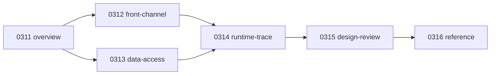

# Architecture - Framework

## 1. 목적

이 폴더는 NPH의 DevOn/Framework 구조를 현재 코드베이스 기준으로 다시 정리한 기준본이다.

- 루트 `0311~0316` 문서: 현재 정리본
- `old/031x` 문서: 이전 조사본 보존
- 원칙: 이미 확인한 사실은 유지하고, 미확인 정보는 새로 단정하지 않는다

## 2. 추천 탐색 흐름

이 폴더는 아래 순서로 읽으면 가장 오해가 적다.

1. 구조를 먼저 잡는다
   - [0311.overview/01.Framework-개요.md](../0311.overview/01.Framework-%EA%B0%9C%EC%9A%94.md)
   - [0311.overview/03.Architecture-overview.md](../0311.overview/03.Architecture-overview.md)
2. 요청 처리 구조를 본다
   - [0312.front-channel/01.Front-Channel-개요.md](../0312.front-channel/01.Front-Channel-%EA%B0%9C%EC%9A%94.md)
   - [0312.front-channel/02.Command-Navigation-Dispatch.md](../0312.front-channel/02.Command-Navigation-Dispatch.md)
3. DB 접근 구조를 본다
   - [0313.data-access/01.Data-Access-개요.md](../0313.data-access/01.Data-Access-%EA%B0%9C%EC%9A%94.md)
   - [0313.data-access/02.LCommonDao-LQueryMaker.md](../0313.data-access/02.LCommonDao-LQueryMaker.md)
   - [0313.data-access/03.XML-Query-실행구조.md](../0313.data-access/03.XML-Query-%EC%8B%A4%ED%96%89%EA%B5%AC%EC%A1%B0.md)
4. 대표 화면 추적 문서를 본다
   - [0314.runtime-trace/00.트레이스-읽는순서.md](../0314.runtime-trace/00.%ED%8A%B8%EB%A0%88%EC%9D%B4%EC%8A%A4-%EC%9D%BD%EB%8A%94%EC%88%9C%EC%84%9C.md)
5. 마지막으로 설계 평가를 본다
   - [0315.design-review/01.설계평가-요약.md](../0315.design-review/01.%EC%84%A4%EA%B3%84%ED%8F%89%EA%B0%80-%EC%9A%94%EC%95%BD.md)
   - [0315.design-review/02.설계평가-상세.md](../0315.design-review/02.%EC%84%A4%EA%B3%84%ED%8F%89%EA%B0%80-%EC%83%81%EC%84%B8.md)

## 3. 폴더별 역할

- `0311.overview`
  - 프레임워크 전체 개요, Struts 비교, 구성요소 요약
- `0312.front-channel`
  - Servlet, Navigation, Command, Interceptor, ServiceProxy, MiPlatform
- `0313.data-access`
  - LCommonDao, LQueryMaker, XML Query, Connection, Pool, TX
- `0314.runtime-trace`
  - 대표 화면/업무의 실제 실행체인
- `0315.design-review`
  - 왜 이렇게 설계됐는지, 지금 무엇이 무거운지에 대한 평가
- `0316.reference`
  - jar/API/설정 기반 참고 자료
- `old`
  - 기존 조사본. 삭제하지 않고 보존한다

## 4. 바로 볼 핵심 문서

- [0312.front-channel/02.Command-Navigation-Dispatch.md](../0312.front-channel/02.Command-Navigation-Dispatch.md)
  - `.mhi -> navigation -> command -> PC/UC/EC` 흐름
- [0313.data-access/02.LCommonDao-LQueryMaker.md](../0313.data-access/02.LCommonDao-LQueryMaker.md)
  - 왜 `LQueryMaker`가 안 보이는데 중요한지 정리
- [0314.runtime-trace/01.MD_ORD01001P-실행체인.md](../0314.runtime-trace/01.MD_ORD01001P-%EC%8B%A4%ED%96%89%EC%B2%B4%EC%9D%B8.md)
  - 가장 과밀한 대표 화면
- [0314.runtime-trace/02.HP_DMS02204M-실행체인.md](../0314.runtime-trace/02.HP_DMS02204M-%EC%8B%A4%ED%96%89%EC%B2%B4%EC%9D%B8.md)
  - 심사/후처리 계열 사례
- [0314.runtime-trace/03.EdiMngmPC-분기구조.md](../0314.runtime-trace/03.EdiMngmPC-%EB%B6%84%EA%B8%B0%EA%B5%AC%EC%A1%B0.md)
  - 분기형 PC 사례

## 5. 기준

- 확인된 코드/설정/API 문서 기반으로만 서술한다
- `old` 문서보다 루트 문서를 우선한다
- 미확인 항목은 `미확인`, `추정`, `가능성`으로만 적는다
