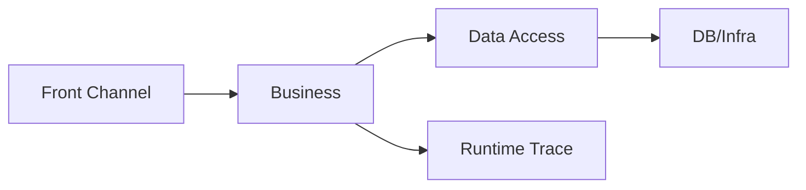

# Framework 개요

/용어는 [03.약어-용어집.md](../0310.index/03.%EC%95%BD%EC%96%B4-%EC%9A%A9%EC%96%B4%EC%A7%91.md) 를 먼저 보면 빠르다.

이 문서는 NPH의 DevOn/Framework 구조를 처음 읽는 사람이 가장 먼저 보는 기준본이다.

이 문서가 답하려는 질문은 네 가지다.

- DevOn이 무엇을 감싸는가
- 요청은 어디서 시작해 어디까지 내려가는가
- 왜 추적 비용이 큰가
- 어떤 문서를 다음에 읽어야 하는가

## 2. 한눈 요약

NPH의 Framework 구조는 크게 4층으로 보면 된다.

1. Front Channel
- Servlet
- Navigation
- Command
- Interceptor
- ServiceProxy

2. Business Layer
- PC
- UC
- EC

3. Data Access Layer
- LCommonDao
- LQueryMaker
- XML Query
- JDBC / DataSource / Transaction

4. Runtime Use Case
- 실제 화면별 실행체인
- 대표 화면: `MD_ORD01001P`, `HP_DMS02204M`, `HP_DMS01303M`

## 3. 실제로는 어떻게 읽어야 하나

- 개요만 보면 구조는 단순해 보인다.
- 실제 유지보수에서는 `.mhi -> navigation -> command -> PC/UC/EC -> xmlquery`까지 같이 봐야 한다.
- 따라서 이 폴더는 개요 문서와 실행체인 문서를 함께 읽도록 설계한다.

## 4. 핵심 해석

- 이 구조는 무질서하게 꼬인 코드라기보다, 오래된 엔터프라이즈/SI형 표준화를 강하게 적용한 구조에 가깝다.
- 다만 현재 유지보수 관점에서는 계층 수가 많고 숨은 규칙이 많아 추적 비용이 크다.
- 그래서 신규 기준본은 "추상화 설명"보다 "실제 실행 경로"를 먼저 보여주는 방향이 맞다.

## 5. 추천 읽기 순서

1. [../0312.front-channel/01.Front-Channel-개요.md](../0312.front-channel/01.Front-Channel-%EA%B0%9C%EC%9A%94.md)
2. [../0313.data-access/01.Data-Access-개요.md](../0313.data-access/01.Data-Access-%EA%B0%9C%EC%9A%94.md)
3. [../0314.runtime-trace/01.MD_ORD01001P-실행체인.md](../0314.runtime-trace/01.MD_ORD01001P-%EC%8B%A4%ED%96%89%EC%B2%B4%EC%9D%B8.md)
4. [../0314.runtime-trace/02.HP_DMS02204M-실행체인.md](../0314.runtime-trace/02.HP_DMS02204M-%EC%8B%A4%ED%96%89%EC%B2%B4%EC%9D%B8.md)
5. [../0314.runtime-trace/03.EdiMngmPC-분기구조.md](../0314.runtime-trace/03.EdiMngmPC-%EB%B6%84%EA%B8%B0%EA%B5%AC%EC%A1%B0.md)
6. [../0315.design-review/01.설계평가-요약.md](../0315.design-review/01.%EC%84%A4%EA%B3%84%ED%8F%89%EA%B0%80-%EC%9A%94%EC%95%BD.md)

## 6. 다음 문서

- 구조를 먼저 알고 싶으면
  - [03.Architecture-overview.md](./03.Architecture-overview.md)
- 컴포넌트 트리로 보고 싶으면
  - [04.Tree-구성요소.md](./04.Tree-%EA%B5%AC%EC%84%B1%EC%9A%94%EC%86%8C.md)
- Struts와 차이를 먼저 보고 싶으면
  - [02.DevOn-vs-Struts1.md](./02.DevOn-vs-Struts1.md)

## 7. 참고 원본

- `old/0311.overview/*`
- `old/0312.front-channel/*`
- `old/0313.data-access/*`

