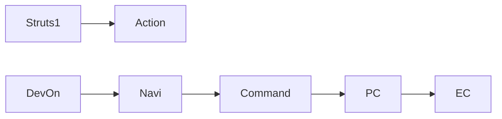

# DevOn vs Struts1

/용어는 [03.약어-용어집.md](../0310.index/03.%EC%95%BD%EC%96%B4-%EC%9A%A9%EC%96%B4%EC%A7%91.md) 를 먼저 보면 빠르다.

이 문서는 NPH에서 DevOn이 Struts1과 무엇이 같고 무엇이 다른지, 실제 유지보수에 필요한 수준으로만 정리한 기준본이다.

## 2. 구조 비교

## 3. 공통점

- 둘 다 요청을 action/command 단위로 분기한다.
- URL과 서버 처리 클래스를 연결하는 별도 설정이 있다.
- 화면 개발자 입장에서는 URL과 서버 진입점의 대응이 중요하다.

## 4. 차이점

### 4.1 Struts1에 가까운 부분

- URL -> action 매핑이라는 기본 사고방식
- interceptor/filter 유사 계층을 통한 공통 처리
- 요청 단위 진입점이 명확하다는 점

### 4.2 DevOn이 더 두꺼운 부분

- Navigation XML이 action -> command를 잡는다.
- command 뒤에 PC / UC / EC 계층이 강하게 들어간다.
- `TxServiceUtil`, `LServiceProxy`, `LCommonDao` 같은 공통 추상화가 더 두껍다.
- MiPlatform 변환 계층이 프레임워크 일부로 붙는다.

## 5. NPH에서 체감되는 차이

NPH 유지보수에서 중요한 차이는 아래다.

1. Struts1식으로 action까지만 보면 부족하다.
2. 실제 로직은 command 이후 `PC -> UC/EC -> LCommonDao -> xmlquery`까지 내려가야 보인다.
3. 즉 NPH에서는 Struts식 진입 이해만으로는 절반만 본 셈이다.

## 6. 실무 관점 요약

- Struts1은 상대적으로 얇은 웹 MVC 프레임워크로 느껴진다.
- DevOn은 웹 진입, 서비스 프록시, 트랜잭션, DAO, XML Query까지 한꺼번에 감싼 통합형 프레임워크에 가깝다.
- 그래서 표준화는 강하지만, 추적 비용도 크다.

## 7. 연결 문서

- [01.Framework-개요.md](./01.Framework-%EA%B0%9C%EC%9A%94.md)
- [03.Architecture-overview.md](./03.Architecture-overview.md)
- [../0312.front-channel/01.Front-Channel-개요.md](../0312.front-channel/01.Front-Channel-%EA%B0%9C%EC%9A%94.md)
- [../0313.data-access/01.Data-Access-개요.md](../0313.data-access/01.Data-Access-%EA%B0%9C%EC%9A%94.md)
- 참고 원본: `../old/0311.overview/01.DevOn-vs-Struts1.md`

