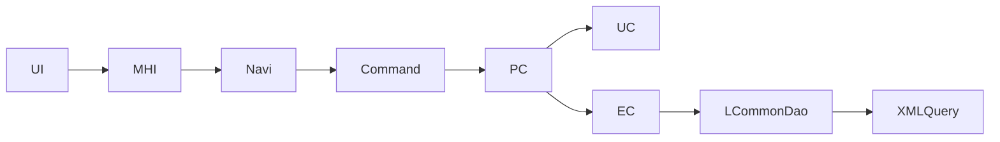

# Tree 구성요소

/용어는 [03.약어-용어집.md](../0310.index/03.%EC%95%BD%EC%96%B4-%EC%9A%A9%EC%96%B4%EC%A7%91.md) 를 먼저 보면 빠르다.

이 문서는 DevOn 구조를 "트리처럼" 볼 때 어떤 구성요소를 따라가야 하는지 정리한 기준본이다.

## 2. 추적 트리

## 3. 실제로 자주 보는 구성요소

- 화면/클라이언트
  - MiPlatform XML 화면
  - 이벤트 함수
  - Transaction 호출
- navigation
  - action 이름
  - command 클래스
  - stack 적용 여부
- command
  - `TxServiceUtil.getTxService/getNTxService`
  - 입력/출력 Dataset 정리
- PC / UC / EC
  - 시나리오 조합
  - 규칙 처리
  - query path 호출
- DAO / XML Query
  - `LCommonDao`
  - `LQueryMaker`
  - statement

## 4. 실무 팁

- 트리를 위에서 아래로만 보지 말고, 아래에서 위로도 본다.
- query path를 찾았으면 EC -> PC -> command -> 화면으로 거슬러 올라가면 더 빠르다.
- 큰 화면일수록 `UI 이벤트 -> command`와 `EC -> xmlquery`를 먼저 고정하는 편이 낫다.

## 5. 연결 문서

- [03.Architecture-overview.md](./03.Architecture-overview.md)
- [../0314.runtime-trace/01.MD_ORD01001P-실행체인.md](../0314.runtime-trace/01.MD_ORD01001P-%EC%8B%A4%ED%96%89%EC%B2%B4%EC%9D%B8.md)
- [../0314.runtime-trace/02.HP_DMS02204M-실행체인.md](../0314.runtime-trace/02.HP_DMS02204M-%EC%8B%A4%ED%96%89%EC%B2%B4%EC%9D%B8.md)
- [../0314.runtime-trace/03.EdiMngmPC-분기구조.md](../0314.runtime-trace/03.EdiMngmPC-%EB%B6%84%EA%B8%B0%EA%B5%AC%EC%A1%B0.md)
- 참고 원본: `../old/0311.overview/03.DevOn-Tree-구성요소.md`

