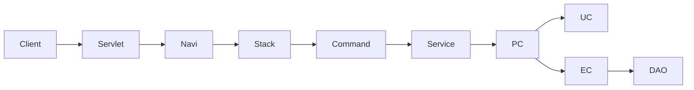
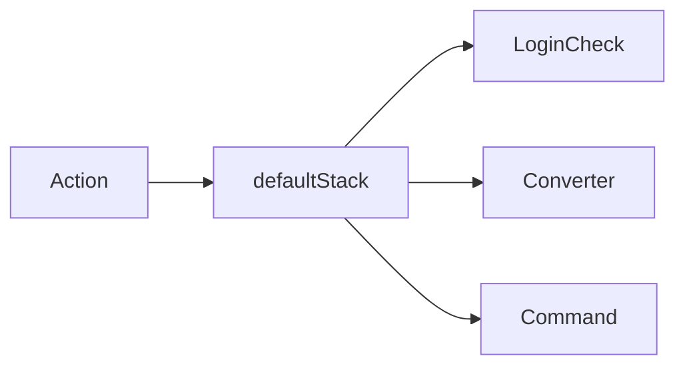

# Front Channel 개요

/용어는 [03.약어-용어집.md](../0310.index/03.%EC%95%BD%EC%96%B4-%EC%9A%A9%EC%96%B4%EC%A7%91.md) 를 먼저 보면 빠르다.

이 문서는 NPH에서 HTTP/MiPlatform 요청이 어떤 경로로 command와 business 계층까지 내려가는지 현재 확인된 사실만으로 정리한 기준본이다.

## 2. 기본 체인



```text
Client
-> Servlet
-> Navigation
-> Interceptor Stack
-> Command
-> TxServiceUtil / Service Proxy
-> PC / UC / EC
-> DAO
```

MiPlatform 요청은 입력/출력 변환 계층이 한 번 더 들어간다.


## 3. 직접 확인된 핵심 구성요소

- `MiplatformServlet`
  - MiPlatform 요청 진입점
- `LActionContext`
  - request/response와 action context를 넘기는 공통 컨텍스트
- `LCommandEngine`
  - `execute(String action)` 기반 front dispatch 엔진
- `LServiceProxy`
  - service proxy 생성 진입점
- `LServiceDelegator`
  - CGLIB `MethodInterceptor` 구현체
- `LServiceInterceptorIF`
  - `preProcess()`, `postProcess()` hook 제공
- `defaultStack`, `notLoginCheckStack`, `miUploadStack`
  - 현재 설정에서 확인된 front interceptor stack

## 4. stack 관점 요약



- `defaultStack`
  - 일반 로그인 필요 액션의 기본 stack
- `notLoginCheckStack`
  - 로그인 예외 액션에 사용
- `miUploadStack`
  - MiPlatform 파일 업로드 계열에 사용

현재 코드/설정 기준으로 stack 이름 자체보다 중요한 것은 아래 두 가지다.

1. 어떤 navigation action에 어떤 stack이 붙는가
2. 해당 action이 결국 어떤 command로 연결되는가

## 5. 실무 추적 순서

1. 화면 또는 스크립트에서 `.mhi` URL 확인
2. 대응 navigation XML 확인
3. `action name`과 `command` 확인
4. 적용 stack 확인
5. command 내부의 `TxServiceUtil.getTxService/getNTxService/getJTxService` 확인
6. PC/UC/EC로 내려가 실제 query path 또는 외부 연계 확인

## 6. 대표 예

- `MD_ORD01001P`
  - `ptmdcrNavi.xml`
  - `RetrievePtOrderCMD`, `SavePtOrderPreCMD`, `UpdateDurtCMD`
- `HP_DMS02204M`
  - `drgNavi.xml`
  - `RetrieveDrgRevwPtListCMD`
- `HP_DMS01303M`
  - `clamNavi.xml`
  - `RetrieveEdiRecvRcpnCMD`, `SaveEdiRecvRcpnCMD`

## 7. 연결 문서

- [02.Command-Navigation-Dispatch.md](./02.Command-Navigation-Dispatch.md)
- [03.ServiceProxy-Interceptor.md](./03.ServiceProxy-Interceptor.md)
- [04.Miplatform.md](./04.Miplatform.md)
- [../0314.runtime-trace](../0314.runtime-trace)
- 참고 보존본: `../old/0312.front-channel/*`

