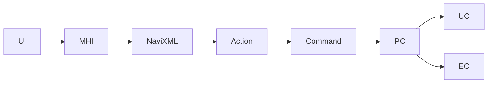
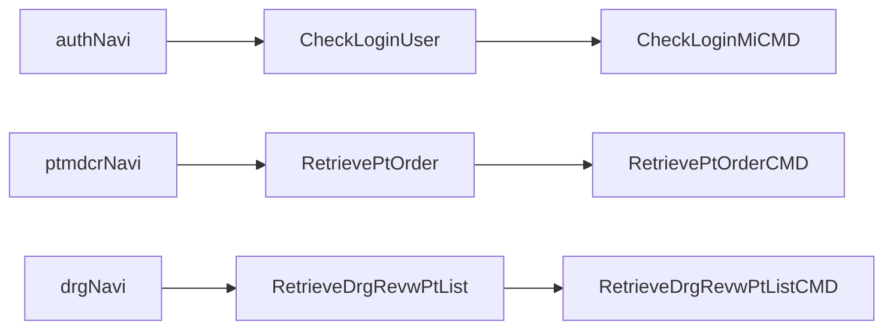
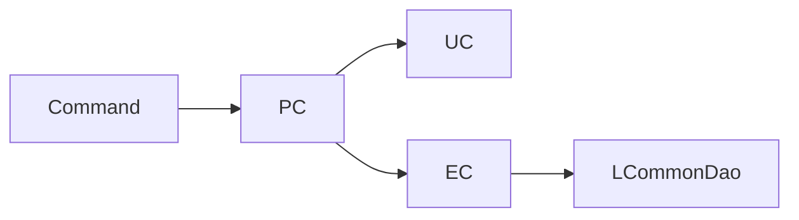

# Command Navigation Dispatch

/용어는 [03.약어-용어집.md](../0310.index/03.%EC%95%BD%EC%96%B4-%EC%9A%A9%EC%96%B4%EC%A7%91.md) 를 먼저 보면 빠르다.

이 문서는 `.mhi URL -> navigation XML -> command -> PC/UC/EC` 흐름을 실무 추적 기준으로 정리한 기준본이다.

## 2. 기본 흐름

## 3. `LCommandEngine` 해석

현재 확인된 API/jar 기준으로 `LCommandEngine`는 `execute(String action)`를 통해 action 문자열을 받아 navigation에 매핑된 command를 실행하는 front dispatch 엔진이다.

실무적으로는 이 질문만 기억하면 된다.

- 이 `.mhi`가 어떤 action으로 매핑되는가
- 그 action은 어떤 command를 실행하는가

## 4. 대표 navigation 예

- 로그인
  - `authNavi.xml`
  - `CheckLoginUser -> CheckLoginMiCMD`
- 외래 저장
  - `otptnrcrNavi.xml`
  - `SaveOtptMdcrCmpl -> SaveOtptMdcrCmplCMD`
- 처방 화면
  - `ptmdcrNavi.xml`
  - `RetrievePtOrder -> RetrievePtOrderCMD`
  - `SavePtOrderPre -> SavePtOrderPreCMD`
- 심사후처리
  - `drgNavi.xml`
  - `RetrieveDrgRevwPtList -> RetrieveDrgRevwPtListCMD`
- EDI 수신
  - `clamNavi.xml`
  - `RetrieveEdiRecvRcpn -> RetrieveEdiRecvRcpnCMD`
  - `SaveEdiRecvRcpn -> SaveEdiRecvRcpnCMD`

## 5. PC / UC / EC 역할 분담

현재 코드 기준으로 가장 안전한 해석은 아래다.

- `PC`
  - 업무 흐름 조합자
  - 여러 EC/UC 호출 순서를 묶는다
- `EC`
  - DB 접근 중심 실행자
  - `LCommonDao`를 가장 자주 직접 사용한다
- `UC`
  - 공통 업무, 외부 연계, 세션/보조 시나리오 계층

대표 예:

- `LoginPC`
  - `LoginEC`, `ComLoginUC`, `ComnCdUC` 등을 조합
- `DrgPostRevwMngmPC`
  - 심사후처리 흐름 조합
- `EdiMngmPC`
  - `samFileId + version`에 따라 query family를 선택

## 6. `urlPriv`에 대한 현재 판단

- `UrlPrivCheckInterceptor` 클래스와 설정 이름은 확인됐다.
- 하지만 현재까지 확인한 `defaultStack`, `notLoginCheckStack`, `miUploadStack`와 대표 navigation action들에서는 `urlPriv`의 기본 부착 근거를 확정하지 못했다.
- 따라서 현재 기준으로는 `정의는 확인, 기본 stack 적용은 미확인`으로 적는 것이 안전하다.

## 7. 실무 포인트

- command는 대개 로직의 종착점이 아니라 business 계층 진입점이다.
- 화면 문제를 보더라도 command 클래스만 보고 끝내면 안 된다.
- command 아래에서 어떤 PC/UC/EC가 호출되는지를 같이 봐야 한다.

## 8. 연결 문서

- [01.Front-Channel-개요.md](./01.Front-Channel-%EA%B0%9C%EC%9A%94.md)
- [03.ServiceProxy-Interceptor.md](./03.ServiceProxy-Interceptor.md)
- [../0314.runtime-trace](../0314.runtime-trace)
- 참고 보존본: `../old/0312.front-channel/03.Command-Navigation-PC-EC-UC.md`

