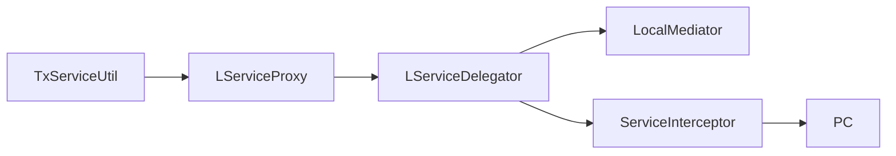
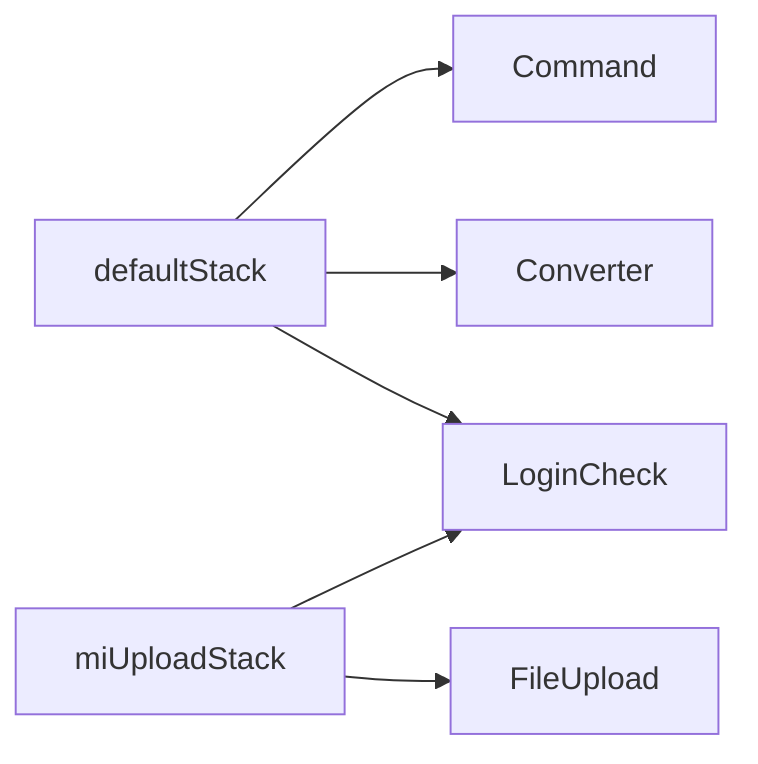

# ServiceProxy Interceptor

/용어는 [03.약어-용어집.md](../0310.index/03.%EC%95%BD%EC%96%B4-%EC%9A%A9%EC%96%B4%EC%A7%91.md) 를 먼저 보면 빠르다.

이 문서는 `LServiceProxy`, `LServiceDelegator`, service-interceptor, front interceptor stack을 현재 확인된 범위로 정리한 기준본이다.

## 2. service proxy 계층

직접 확인된 구성요소:

- `LServiceProxy`
  - service proxy 생성 진입점
- `LServiceDelegator`
  - CGLIB `MethodInterceptor`
- `LServiceInterceptorIF`
  - `preProcess()`, `postProcess()` hook 제공
- `LNullServiceInterceptor`
  - 기본 service-interceptor 구현

해석:

- business 코드는 직접 PC/EC를 new 해서 호출하기보다
- `TxServiceUtil -> LServiceProxy -> LServiceDelegator` 경로로 proxy를 거쳐 들어간다
- 이 구조는 트랜잭션과 공통 정책 weaving을 위해 존재한다

## 3. service spec

현재 문서화에 안전한 spec 이름:

- `default`
- `defaultTx`
- `jtaTx`

실무 해석:

- `getNTxService()`
  - 비트랜잭션 또는 기본 local 호출 계열
- `getTxService()`
  - JDBC transaction 계열
- `getJTxService()`
  - JTA 계열

## 4. front interceptor stack

현재 확인된 주요 stack:

- `defaultStack`
- `notLoginCheckStack`
- `miUploadStack`

현재 확인된 실제 interceptor 클래스:

- `LoginCheckInterceptor`
- `UrlPrivCheckInterceptor`
- `FileUploadInterceptor`

## 5. 적용 사례

- `mhi/global.xml`, `his/global.xml`
  - 기본 stack 규칙의 기준점
- `authNavi.xml`
  - 로그인 예외 흐름 확인용
- `fileMgrNavi.xml`
  - 업로드 stack 확인용

## 6. 해석

이 구조는 당시 기준으로는 꽤 전형적인 엔터프라이즈 설계다.

- 장점
  - 공통 정책 강제
  - 트랜잭션 정책 통합
  - 서비스 호출 방식 일관화
- 단점
  - 어디서 무슨 정책이 붙는지 바로 안 보임
  - 신규 유지보수자가 stack, spec, command를 동시에 따라가야 함

## 7. 연결 문서

- [01.Front-Channel-개요.md](./01.Front-Channel-%EA%B0%9C%EC%9A%94.md)
- [02.Command-Navigation-Dispatch.md](./02.Command-Navigation-Dispatch.md)
- [../0313.data-access/04.Connection-Pool-TX.md](../0313.data-access/04.Connection-Pool-TX.md)
- 참고 보존본: `../old/0312.front-channel/02.ServiceProxy-Interceptor-Dispatch.md`

