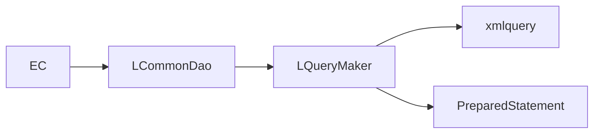
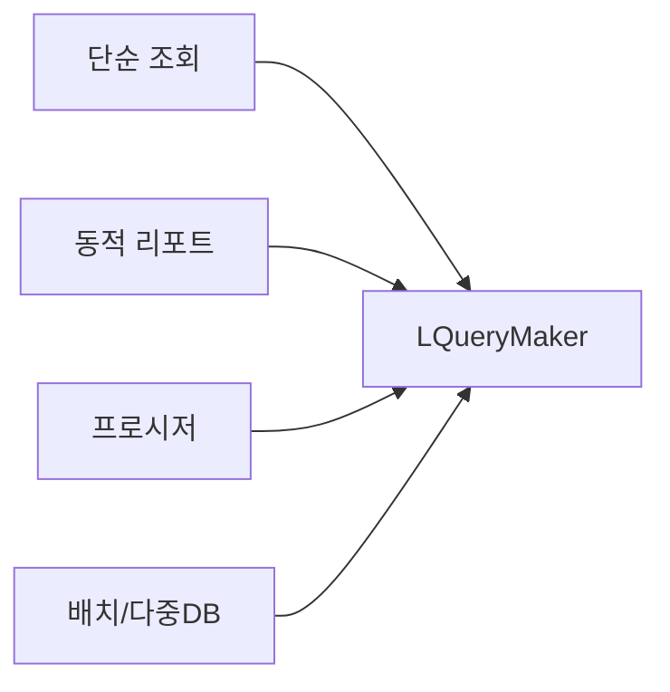

# LCommonDao LQueryMaker

/용어는 [03.약어-용어집.md](../0310.index/03.%EC%95%BD%EC%96%B4-%EC%9A%A9%EC%96%B4%EC%A7%91.md) 를 먼저 보면 빠르다.

이 문서는 `LCommonDao`와 `LQueryMaker`의 관계를 현재 코드, jar, API 문서 기준으로 정리한 기준본이다.

## 2. 역할 분담



- `LCommonDao`
  - NPH 업무 코드에서 직접 보이는 DAO 표면 API
- `LQueryMaker`
  - `LCommonDao` 내부에서 SQL 해석/변환을 담당하는 helper
- `xmlquery/*.xml`
  - 실제 SQL statement 저장소

## 3. 직접 확인된 사실

- NPH 소스에서는 `LCommonDao`가 광범위하게 보인다.
- `LQueryMaker`는 `devon-framework.jar`와 API 문서에서 실존이 확인된다.
- `LCommonDao.class` 실행 경로에서는 아래 호출이 확인된다.
  - `resolveSQL(...)`
  - `resolveRawSQL(...)`
  - `getQuery()`
  - `getQueryArgument()`
  - `getFetchSize()`
  - `isSetMetadata()`

즉 `LQueryMaker`는 단순 보조 유틸이 아니라 `LCommonDao` 실행 내부 엔진으로 보는 것이 맞다.

## 4. 왜 NPH 소스에서는 잘 안 보이는가

- 설계 의도 자체가 `LCommonDao`를 공개 표면 API로 두고
- `LQueryMaker`를 내부 helper로 감추는 형태에 가깝다.
- 그래서 업무 개발자는 `new LCommonDao("/path", data)`와 `executeQuery/executeUpdate`만 보고 작업할 수 있었다.

## 5. 왜 이런 계층이 필요했을 가능성이 큰가



현재 근거만으로도 아래 정도는 안전하게 말할 수 있다.

1. 단순 조회/수정
2. 동적 리포트/다중 statement 선택
3. 프로시저 호출
4. 배치/다중 DB spec
5. fetch size / metadata / preview query 같은 부가 기능

이런 요구를 `LCommonDao` 하나의 표면 API로 감추려면 내부 엔진이 필요하다. `LQueryMaker`는 그 역할에 가깝다.

## 6. query path 규칙

```text
/a/b/c/queryId
-> devonhome/xmlquery/a/b/c.xml
-> statement name="queryId"
```

실제 사례:

- `/app/pat/homepage/doLogin`
  - `xmlquery/app/pat/homepage.xml`
- `/md/ord/mdmdhtord/RetrievePtOrder`
  - `xmlquery/md/ord/mdmdhtord.xml`
- `/hp/dms/hpdmhdmbs/retrieveDrgRevwPtList`
  - `xmlquery/hp/dms/hpdmhdmbs.xml`

## 7. 현재 판단

- `LQueryMaker`는 NPH 업무 코드의 직접 사용 API는 아니다.
- 하지만 NPH가 광범위하게 사용하는 `LCommonDao` 내부에서 실제로 호출되므로, 런타임 내부에서는 핵심 구성요소다.
- 따라서 문서에서는 독립 주제보다 `LCommonDao 내부 엔진`으로 설명하는 것이 적절하다.

## 8. 연결 문서

- [01.Data-Access-개요.md](./01.Data-Access-%EA%B0%9C%EC%9A%94.md)
- [03.XML-Query-실행구조.md](./03.XML-Query-%EC%8B%A4%ED%96%89%EA%B5%AC%EC%A1%B0.md)
- [../0315.design-review/02.설계평가-상세.md](../0315.design-review/02.%EC%84%A4%EA%B3%84%ED%8F%89%EA%B0%80-%EC%83%81%EC%84%B8.md)
- 참고 보존본: `../old/0313.data-access/01.DAO-DataAccess-TX-JDBC-Pool.md`

