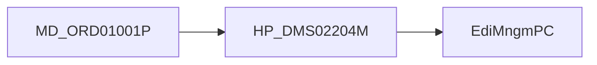

# 트레이스 읽는순서

/용어는 [03.약어-용어집.md](../0310.index/03.%EC%95%BD%EC%96%B4-%EC%9A%A9%EC%96%B4%EC%A7%91.md) 를 먼저 보면 빠르다.

이 문서는 `0314.runtime-trace`의 세 문서를 어떤 순서로 읽으면 좋은지 정리한 짧은 안내문이다.

## 2. 추천 순서

1. [01.MD_ORD01001P-실행체인.md](./01.MD_ORD01001P-%EC%8B%A4%ED%96%89%EC%B2%B4%EC%9D%B8.md)
   - 가장 과밀한 대표 화면
   - `.mhi -> command -> PC/UC -> EC -> xmlquery`가 가장 복합적으로 보인다
2. [02.HP_DMS02204M-실행체인.md](./02.HP_DMS02204M-%EC%8B%A4%ED%96%89%EC%B2%B4%EC%9D%B8.md)
   - 조회형처럼 보이지만 심사 후처리 도메인 파일군이 함께 묶인 사례
3. [03.EdiMngmPC-분기구조.md](./03.EdiMngmPC-%EB%B6%84%EA%B8%B0%EA%B5%AC%EC%A1%B0.md)
   - 분기형 PC가 왜 생겼는지 보여주는 사례

## 3. 세 문서의 차이

| 문서 | 핵심 특징 | 중점 포인트 |
|------|-----------|-------------|
| `MD_ORD01001P` | 과밀 화면 | 시나리오 과적재, 다중 query family |
| `HP_DMS02204M` | 심사/후처리형 | 조회 화면처럼 보여도 도메인 파일군이 두꺼움 |
| `EdiMngmPC` | 분기형 PC | 파일유형/버전 분기를 화면 밖으로 밀어낸 구조 |

## 4. 상위 문서로 돌아가기

- 개요로 돌아가려면
  - [../0311.overview/01.Framework-개요.md](../0311.overview/01.Framework-%EA%B0%9C%EC%9A%94.md)
- front-channel로 돌아가려면
  - [../0312.front-channel/02.Command-Navigation-Dispatch.md](../0312.front-channel/02.Command-Navigation-Dispatch.md)
- data-access로 돌아가려면
  - [../0313.data-access/02.LCommonDao-LQueryMaker.md](../0313.data-access/02.LCommonDao-LQueryMaker.md)
- 설계평가로 돌아가려면
  - [../0315.design-review/02.설계평가-상세.md](../0315.design-review/02.%EC%84%A4%EA%B3%84%ED%8F%89%EA%B0%80-%EC%83%81%EC%84%B8.md)

