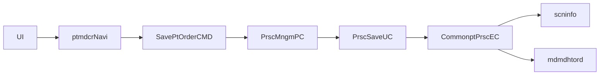

# MD_ORD01001P 실행 체인 복원

## 1. 문서 목적

이 문서는 `MD_ORD01001P` 화면의 대표 저장/DUR 경로를 실제 코드 기준으로 `화면 -> navigation -> CMD -> PC/UC -> EC -> query path -> xmlquery`까지 닫기 위한 참고 문서다.

범위는 다음 두 경로에 집중한다.

- `/md/ord/ptmdcrNavi/SavePtOrder.mhi`
- `/md/ord/ptmdcrNavi/UpdateDurt.mhi`

## 2. 상위 구조에서 이 문서를 읽는 위치

- 이 문서는 [../0311.overview/03.Architecture-overview.md](../0311.overview/03.Architecture-overview.md)의 실제 사례다.
- front dispatch 설명은 [../0312.front-channel/02.Command-Navigation-Dispatch.md](../0312.front-channel/02.Command-Navigation-Dispatch.md)를 먼저 보면 빠르다.
- DAO/XML Query는 [../0313.data-access/02.LCommonDao-LQueryMaker.md](../0313.data-access/02.LCommonDao-LQueryMaker.md), [../0313.data-access/03.XML-Query-실행구조.md](../0313.data-access/03.XML-Query-%EC%8B%A4%ED%96%89%EA%B5%AC%EC%A1%B0.md)와 같이 읽는 것이 좋다.

## 3. 왜 이 문서를 따로 두는가

`MD_ORD01001P`는 단순 조회 화면이 아니다.

- 처방 저장
- 규칙 점검
- DUR 점검
- DUR 이력 저장/변경
- 사유 미입력 보정

이 다섯 단계가 한 화면에서 이어진다. 그래서 상위 개요 문서만으로는 실제 동작이 잘 안 보인다.

또한 `LQueryMaker.html` 과 `class-use/LQueryMaker.html`을 같이 보면 다음 점이 분명해진다.

- `LQueryMaker.html`
  - `resolveSQL`, `resolveRawSQL`, `getQuery`, `getQueryArgument`, `getFetchSize`, `isSetMetadata` 같은 내부 SQL 준비 기능을 보여준다
- `class-use/LQueryMaker.html`
  - 공개 연결점이 사실상 `LCommonDao.getQueryMaker()`, `setQueryMaker(LQueryMaker)`뿐임을 보여준다

즉 `MD_ORD01001P`의 업무 소스는 `LQueryMaker`를 직접 호출하지 않지만, 실제 SQL 준비는 `LCommonDao` 내부의 `LQueryMaker`가 맡는 구조다.

## 4. 핵심 흐름

## 5. 화면 레벨 확인값

- 화면 XML:
  - `NPH_HIS/webapp/ui/MD/ORD/MD_ORD01001P.xml`
- 대표 URL:
  - `/md/ord/ptmdcrNavi/SavePtOrder.mhi`
  - `/md/ord/ptmdcrNavi/UpdateDurt.mhi`
- 저장 시 입력 Dataset:
  - `ds_Ordr=ds_Ordr`
  - `ds_OrdrDur=ds_OrdrDur`
- 저장 시 출력 Dataset:
  - `ds_FirstDis=ds_FirstDis`
  - `ds_RuleResult=ds_RuleResult`
- DUR 보정 시 입력 Dataset:
  - `ds_OrdrDur=ds_OrdrDur`
  - `ds_FirstDis=ds_FirstDis`

## 6. navigation -> CMD

- navigation 파일:
  - `NPH_HIS/devonhome/navigation/mhi/md/ord/ptmdcrNavi.xml`
- action 매핑:
  - `SavePtOrder` -> `nph.his.md.ord.ptmdcr.cmd.SavePtOrderCMD`
  - `UpdateDurt` -> `nph.his.md.ord.ptmdcr.cmd.UpdateDurtCMD`

`SavePtOrderCMD`

- `TxServiceUtil.getTxService("md.ord.PrscMngmPC")`
- `prscMngmPC.savePtOrder(mData)`
- DUR 경로에서는 `prscMngmPC.savePtOrderDur(mDurData)`도 호출

`UpdateDurtCMD`

- `TxServiceUtil.getTxService("md.ord.ZzzPrscMngmPC")`
- 동시에 `CommonptPrscEC`를 직접 사용해
  - `saveDurt(...)`
  - `updateDurt(...)`
  - `updateDurChckDvsn(...)`
  을 수행하는 보정/정리 경로가 존재

## 7. PC / UC / EC 역할 분담

### 7.1 PC

`PrscMngmPC`

- 처방 저장 흐름의 상위 오케스트레이터
- `savePtOrder(...)`에서 `PrscSaveUC`로 위임
- 행상태(`CREATE/UPDATE/DELETE`) 분기와 공통 처방 EC 호출이 매우 많음

### 7.2 UC

`PrscSaveUC`

- `MD_ORD01001P`의 실제 저장 규칙을 많이 품고 있는 UC
- `registPrsc(...)`
  - 일반 처방 저장 경로
- `durPrsc(...)`
  - DUR 점검/규칙점검 연동 경로
- 소스 주석과 코드에서 `/md/ord/scninfo/retrieveRuleCheck`를 반복 참조

`PrscCheckDurUC`

- DUR 점검/재전송/사유 처리 보조 UC
- `retrieveDurSendCheck`
- `retrieveDurPidCheck`
- `saveDurt`
- `updateDurt`
- 소스 주석에 `UpdateDurtCMD를 참고해라...`가 직접 남아 있음

### 7.3 EC

`CommonptPrscEC`

이 화면에서 실제 query path로 내려가는 대표 메서드는 아래와 같다.

- `retrieveDurSendCheck(data)`
  - `/md/ord/scninfo/retrieveDurSendCheck`
- `retrieveDurPidCheck(data)`
  - `/md/ord/scninfo/retrieveDurPidCheck`
- `retrieveRuleCheck(data)`
  - `/md/ord/scninfo/retrieveRuleCheck`
- `saveDurt(data)`
  - `/md/ord/scninfo/saveDurt`
- `updateDurt(data)`
  - `/md/ord/scninfo/updateDurt`
- `retrievePrscList(data)`
  - `/md/ord/mdmdhtord/retrievePrscList`

## 8. query path -> xmlquery 매핑

### 8.1 DUR/규칙 점검 계열

xmlquery 파일:

- `NPH_HIS/devonhome/xmlquery/md/ord/scninfo.xml`

확인된 statement:

- `saveDurt`
- `updateDurt`
- `retrieveDurSendCheck`
- `retrieveDurPidCheck`
- `retrieveRuleCheck`

### 8.2 처방 목록/기본 주문 계열

xmlquery 파일:

- `NPH_HIS/devonhome/xmlquery/md/ord/mdmdhtord.xml`

확인된 statement:

- `RetrievePtOrder`
- `RetrievePtOrderPreOtpt`
- `RetrievePtOrderStat`
- `RetrievePtOrderPreAutoCopy`
- `retrievePtOrderPreSbstCd`
- `retrievePrscList`

## 9. 다시 올라갈 문서

- 구조 요약으로 돌아가려면
  - [../0311.overview/01.Framework-개요.md](../0311.overview/01.Framework-%EA%B0%9C%EC%9A%94.md)
- dispatch 기준으로 다시 보려면
  - [../0312.front-channel/02.Command-Navigation-Dispatch.md](../0312.front-channel/02.Command-Navigation-Dispatch.md)
- DAO/XML Query 기준으로 다시 보려면
  - [../0313.data-access/02.LCommonDao-LQueryMaker.md](../0313.data-access/02.LCommonDao-LQueryMaker.md)
  - [../0313.data-access/03.XML-Query-실행구조.md](../0313.data-access/03.XML-Query-%EC%8B%A4%ED%96%89%EA%B5%AC%EC%A1%B0.md)
- 설계평가와 연결해서 보려면
  - [../0315.design-review/02.설계평가-상세.md](../0315.design-review/02.%EC%84%A4%EA%B3%84%ED%8F%89%EA%B0%80-%EC%83%81%EC%84%B8.md)

