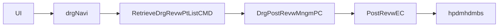

# HP_DMS02204M 실행 체인 복원

## 1. 문서 목적

이 문서는 `HP_DMS02204M` 화면의 실제 조회 체인을 `화면 -> navigation -> CMD -> PC -> EC -> query path -> xmlquery` 기준으로 닫기 위한 문서다.

## 2. 상위 구조에서 이 문서를 읽는 위치

- 이 문서는 [../0311.overview/03.Architecture-overview.md](../0311.overview/03.Architecture-overview.md)의 심사/후처리 계열 사례다.
- front dispatch는 [../0312.front-channel/02.Command-Navigation-Dispatch.md](../0312.front-channel/02.Command-Navigation-Dispatch.md)를 같이 보면 된다.
- XML Query는 [../0313.data-access/03.XML-Query-실행구조.md](../0313.data-access/03.XML-Query-%EC%8B%A4%ED%96%89%EA%B5%AC%EC%A1%B0.md)와 연결해서 보는 것이 좋다.

## 3. 대표 진입 경로

- 화면 URL: `/hp/dms/drgNavi/RetrieveDrgRevwPtList.mhi`
- navigation: `devonhome/navigation/mhi/hp/dms/drgNavi.xml`
- action: `RetrieveDrgRevwPtList`
- command: `nph.his.hp.dms.drg.cmd.RetrieveDrgRevwPtListCMD`
- service 진입: `TxServiceUtil.getNTxService("hp.dms.DrgPostRevwMngmPC")`

## 4. PC -> EC

### 4.1 PC

`DrgPostRevwMngmPC`

- `retrieveDrgRevwPtList(data)`는 `PostRevwEC.retrieveDrgRevwPtList(data)`로 위임한다
- 같은 PC 안에 `ROW_STATUS_CREATE`, `ROW_STATUS_UPDATE`, `ROW_STATUS_DELETE` 분기가 다수 존재한다
- 즉 조회 전용 PC라기보다, 심사 후처리 업무를 함께 품은 PC다

### 4.2 EC

`PostRevwEC`

- `retrieveDrgRevwPtList(data)`
  - query path: `/hp/dms/hpdmhdmbs/retrieveDrgRevwPtList`
- 같은 EC 안에 아래 계열도 함께 존재한다
  - `saveDrgPostRevw`
  - 다수 `update*`
  - 다수 `delete*`

## 5. query path -> xmlquery

- xmlquery 파일: `devonhome/xmlquery/hp/dms/hpdmhdmbs.xml`
- 확인된 statement:
  - `retrieveDrgRevwPtList`
  - `saveDrgPostRevw`
  - 다수 `update*`
  - 다수 `delete*`

## 6. 해석

- `HP_DMS02204M`는 화면만 보면 조회 중심이다.
- 하지만 실제로는 `hpdmhdmbs.xml`이라는 큰 도메인 파일군의 일부를 사용한다.
- 그래서 당시 구조가 `command -> PC -> EC -> xmlquery`로 짜인 이유는, 조회/저장/후처리를 하나의 심사 도메인 파일군으로 통제하려는 의도였다고 보는 편이 맞다.

## 7. 다시 올라갈 문서

- 개요로 돌아가려면
  - [../0311.overview/01.Framework-개요.md](../0311.overview/01.Framework-%EA%B0%9C%EC%9A%94.md)
- command 흐름으로 돌아가려면
  - [../0312.front-channel/02.Command-Navigation-Dispatch.md](../0312.front-channel/02.Command-Navigation-Dispatch.md)
- data-access로 연결하려면
  - [../0313.data-access/03.XML-Query-실행구조.md](../0313.data-access/03.XML-Query-%EC%8B%A4%ED%96%89%EA%B5%AC%EC%A1%B0.md)
- 구조 평가와 연결하려면
  - [../0315.design-review/02.설계평가-상세.md](../0315.design-review/02.%EC%84%A4%EA%B3%84%ED%8F%89%EA%B0%80-%EC%83%81%EC%84%B8.md)
