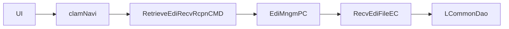

# EdiMngmPC 분기구조 분석

## 1. 문서 목적

이 문서는 `EdiMngmPC`가 왜 두꺼운 분기형 PC로 보이는지, 그리고 왜 당시 프레임워크 구조가 실제로 필요했을 가능성이 큰지 코드 기준으로 정리한 문서다.

## 2. 상위 구조에서 이 문서를 읽는 위치

- 이 문서는 [../0311.overview/03.Architecture-overview.md](../0311.overview/03.Architecture-overview.md)의 EDI/분기형 사례다.
- command 흐름은 [../0312.front-channel/02.Command-Navigation-Dispatch.md](../0312.front-channel/02.Command-Navigation-Dispatch.md), `LCommonDao/LQueryMaker`는 [../0313.data-access/02.LCommonDao-LQueryMaker.md](../0313.data-access/02.LCommonDao-LQueryMaker.md)와 같이 보는 것이 좋다.

## 3. 핵심 결론

`EdiMngmPC`는 단순 조회 PC가 아니다.

- command는 얇다
- 실제 복잡도는 `EdiMngmPC`의 `samFileId + version` 분기에 있다
- 최종 query 실행은 `RecvEdiFileEC`의 `LCommonDao(sQuery + "/retrieveEdiRecvRcpn" + version, data)`로 수렴한다

즉 이 구조는 `괜히 복잡하게 만든 것`이라기보다, 파일유형/버전별 EDI 수신 포맷 차이를 화면 밖으로 밀어내기 위한 구조에 가깝다.

## 4. 진입 체인

- 화면 URL:
  - `/hp/dms/clamNavi/RetrieveEdiRecvRcpn.mhi`
  - `/hp/dms/clamNavi/SaveEdiRecvRcpn.mhi`
- navigation:
  - `clamNavi.xml`
- command:
  - `RetrieveEdiRecvRcpnCMD` -> `TxServiceUtil.getNTxService("hp.dms.EdiMngmPC")`
  - `SaveEdiRecvRcpnCMD` -> `TxServiceUtil.getTxService("hp.dms.EdiMngmPC")`
- PC:
  - `EdiMngmPC`
- EC:
  - `RecvEdiFileEC`

## 5. 실제 분기 규칙

기본 접두는 아래처럼 시작한다.

- `String sQuery = "/hp/dms/";`

그 다음 `samFileId`와 `version`에 따라 실제 query 파일군이 결정된다.

### 5.1 대표 분기 예

- `F020_1`
  - 기본 파일군: `hpdmhf201`
  - 버전 분기: `073`, `074`, `079`, `082`, `083`, `085`, `088`
- `F040_2`
  - 기본 파일군: `hpdmhf402`
  - 버전 분기: `071`, `072`, `073`, `074`, `083`, `085`, `079`, `088`
- `F060_4`
  - 기본 파일군: `hpdmhf604`
  - 버전 분기: `074`, `079`, `083`, `085`, `089`, `091`
- `I010`
  - 기본 파일군: `hpdmhi010`
  - 버전 분기: `old`, `070`
- `N020_1`
  - 기본 파일군: `hpdmht201`

## 6. PC -> EC -> query path

`EdiMngmPC.retrieveEdiRecvRcpn(data)`는 내부에서 `sQuery`를 조립한 뒤 아래 형태로 EC를 호출한다.

- `recvEdiFileEC.retrieveEdiRecvRcpn(data, sQuery, version)`

`RecvEdiFileEC` 쪽 실제 실행은 아래로 수렴한다.

- `new LCommonDao(sQuery + "/retrieveEdiRecvRcpn" + version, data)`

즉 최종 query path는 이런 식으로 만들어진다.

- `/hp/dms/hpdmhf201/retrieveEdiRecvRcpn073`
- `/hp/dms/hpdmhf402/retrieveEdiRecvRcpn071`
- `/hp/dms/hpdmhf604/retrieveEdiRecvRcpn089`
- `/hp/dms/hpdmhi010/retrieveEdiRecvRcpn070`
- `/hp/dms/hpdmht201/retrieveEdiRecvRcpn`

## 7. xmlquery 파일군

실제 `xmlquery`에는 동일한 statement family가 매우 넓게 퍼져 있다.

- `hpdmhf201.xml`
- `hpdmhf202.xml`
- `hpdmhf204.xml`
- `hpdmhf402.xml`
- `hpdmhf403.xml`
- `hpdmhf604.xml`
- `hpdmhi010.xml`
- `hpdmht201.xml`
- `hpdmht204.xml`
- 그 외 다수

## 8. 해석

이 코드를 보면 `EdiMngmPC`는 보기 싫게 두꺼운 PC가 맞다. 다만 이유 없는 두꺼움은 아니다.

이 PC가 흡수하고 있는 것은 다음이다.

- EDI 파일유형 차이
- 수신 포맷 버전 차이
- 일부 파일군의 후처리 차이
- 저장/조회 command 분리
- 동일한 `LCommonDao` 표면 API로의 수렴

즉 이 구조가 없었다면 복잡도는 아래 중 하나로 퍼졌을 가능성이 높다.

- 화면 스크립트
- 여러 command 클래스
- EC 레벨의 난잡한 if 분기
- query 파일명을 직접 조합하는 중복 코드

## 9. 다시 올라갈 문서

- 개요로 돌아가려면
  - [../0311.overview/01.Framework-개요.md](../0311.overview/01.Framework-%EA%B0%9C%EC%9A%94.md)
- command 구조로 돌아가려면
  - [../0312.front-channel/02.Command-Navigation-Dispatch.md](../0312.front-channel/02.Command-Navigation-Dispatch.md)
- `LCommonDao/LQueryMaker`로 연결하려면
  - [../0313.data-access/02.LCommonDao-LQueryMaker.md](../0313.data-access/02.LCommonDao-LQueryMaker.md)
- 설계 평가와 연결하려면
  - [../0315.design-review/02.설계평가-상세.md](../0315.design-review/02.%EC%84%A4%EA%B3%84%ED%8F%89%EA%B0%80-%EC%83%81%EC%84%B8.md)
