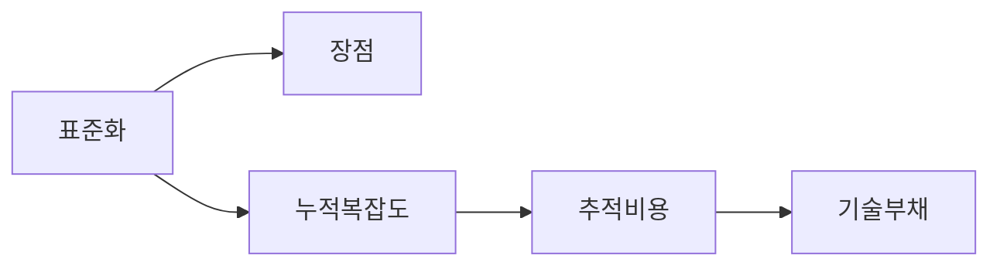
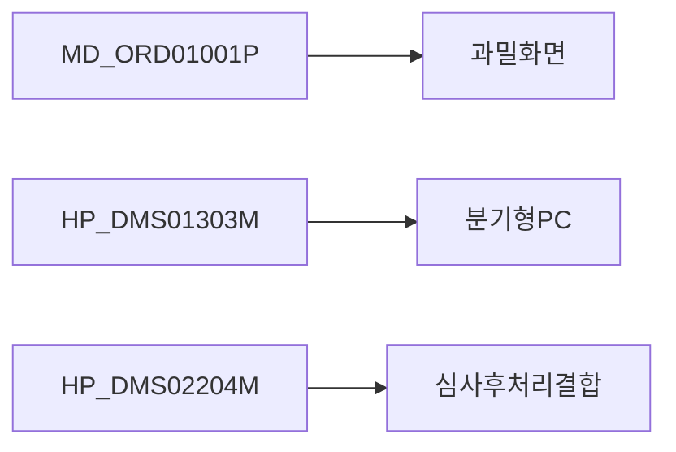

# 설계평가 요약

/용어는 [03.약어-용어집.md](../0310.index/03.%EC%95%BD%EC%96%B4-%EC%9A%A9%EC%96%B4%EC%A7%91.md) 를 먼저 보면 빠르다.

이 문서는 DevOn/Framework 구조를 현재 유지보수 관점에서 flat하게 평가한 기준본이다.

## 2. 평가 요약

- 설계 의도는 분명하다.
  - 표준화
  - 공통 정책 강제
  - SQL 외부화
  - 트랜잭션/권한/변환 공통화
- 다만 현재 기준으로는 추상화 비용이 크다.
  - 계층이 많다.
  - 역할 경계가 완전히 깔끔하지 않다.
  - 실제 동작을 보려면 파일을 많이 따라가야 한다.

## 3. 가장 중요한 판단

- 이 구조를 `무능해서 나온 설계`로 단정하는 건 과하다.
- 더 정확히는 `당시에는 필요했던 표준화 구조가 장기 운영 속에서 무거운 기술부채로 바뀐 상태`에 가깝다.

## 4. 왜 이런 구조가 생겼나

현재 코드와 설정을 종합하면 프레임워크가 해결하려던 문제는 비교적 분명하다.

1. 화면 요청 표준화
2. DB 접근 표준화
3. SQL 외부화
4. 트랜잭션/데이터소스 중앙관리
5. MiPlatform 채널 대응

즉 당시에는 `여러 팀이 같은 방식으로 개발하게 만드는 것`이 중요했을 가능성이 크다.

## 5. 화면 3종 기준 차이

- `MD_ORD01001P`
  - 문제의 본체는 화면 과밀 + 시나리오 과적재
- `HP_DMS01303M`
  - 문제의 본체는 분기형 PC + EDI 포맷 다양성
- `HP_DMS02204M`
  - 문제의 본체는 심사 도메인 로직이 조회 흐름과 같은 파일군에 묶인 점

셋을 모두 `프레임워크가 무겁다`로만 설명하면 틀린다. 각각 무거운 이유가 다르다.

## 6. 연결 문서

- [02.설계평가-상세.md](./02.%EC%84%A4%EA%B3%84%ED%8F%89%EA%B0%80-%EC%83%81%EC%84%B8.md)
- [../0314.runtime-trace](../0314.runtime-trace)
- 참고 보존본: `../old/0315.design-review/01.설계평가-단순화가이드.md`

