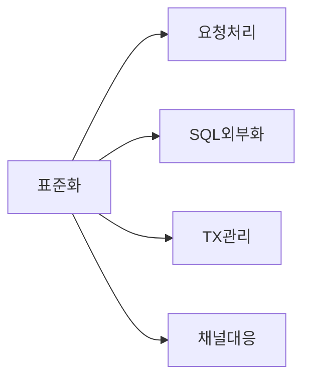
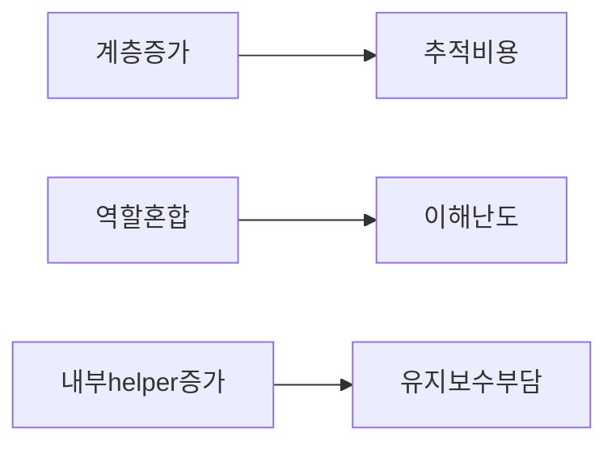
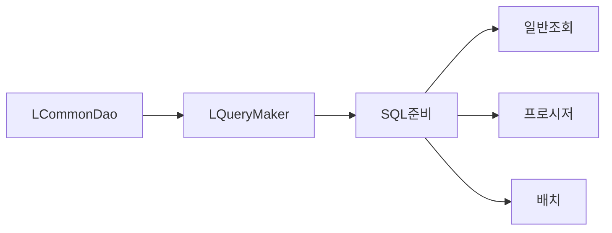

# 설계평가 상세

## 1. 목적

이 문서는 DevOn 구조를 현재 유지보수 관점에서 조금 더 자세히 평가한 기준본이다.

## 2. 좋았던 점

- 공통 처리 표준화
- SQL 외부화
- 트랜잭션과 권한 정책 중앙화
- 여러 화면/업무에 동일한 개발 패턴 적용 가능
- `LCommonDao` 하나로 조회/수정/프로시저/배치 경로를 어느 정도 공통화

## 3. 문제점

- 계층이 많아 추적 비용이 높다.
- PC / UC / EC 역할이 코드상 완전히 깨끗하게 분리되지는 않는다.
- 내부 helper가 많아 신규 유지보수자가 전체 구조를 잡기 어렵다.
- screen, command, PC, EC, xmlquery, tx 설정이 여러 파일에 흩어진다.

## 4. `LQueryMaker`를 어떻게 봐야 하나

현재 확인된 사실을 기준으로 보면 `LQueryMaker`는 쓸데없는 잔재로 보기 어렵다.

- `LCommonDao` 내부에서 실제 호출된다.
- 단순 조회만이 아니라 동적 리포트, 프로시저, 배치/다중 DB spec 같은 상황을 버티는 내부 엔진 역할이 강하다.
- 즉 업무 코드에 직접 안 보인다는 이유로 비핵심이라고 보면 오해가 생긴다.

더 정확한 평가는 이렇다.

- 전면 노출 비중: 낮음
- 런타임 내부 중요도: 높음

## 5. flat한 판단

- 이 구조는 무능해서 나온 구조로 단정하기 어렵다.
- 하지만 현재 기준으로는 과복잡하고 무겁다.
- 즉 설계 의도는 있었고, 결과적으로는 기술부채도 크다.

## 6. 대표 사례 해석

### 6.1 `MD_ORD01001P`

- 문제의 핵심은 `LQueryMaker` 자체보다 화면에 너무 많은 사용자 시나리오가 한 번에 실린 점이다.
- 조회, 전처방, 자동복사, DUR, CPS 보조 흐름이 한 화면에 같이 들어가 있다.
- 그래서 프레임워크 추적 비용이 특히 크게 느껴진다.

### 6.2 `HP_DMS01303M`

- 핵심은 `EdiMngmPC` 같은 분기형 PC 구조다.
- `samFileId + version`에 따라 query family가 갈라진다.
- 이때 프레임워크 계층은 복잡도를 숨기는 데 도움도 되지만, 동시에 분기 추적을 어렵게 만든다.

### 6.3 `HP_DMS02204M`

- 조회형 화면처럼 보이지만 심사 후처리 파일군과 결합되어 있다.
- `PostRevwEC -> hpdmhdmbs.xml` 같이 도메인 규칙이 xmlquery family 안에 같이 들어가 있어 화면 구조가 두꺼워진다.

## 7. 현재 기준 권장 읽기

1. `0311.overview`
2. `0312.front-channel`
3. `0313.data-access`
4. `0314.runtime-trace`
5. 다시 이 문서

이 순서가 가장 오해가 적다.

## 8. 연결 문서

- [01.설계평가-요약.md](./01.%EC%84%A4%EA%B3%84%ED%8F%89%EA%B0%80-%EC%9A%94%EC%95%BD.md)
- [../0313.data-access/02.LCommonDao-LQueryMaker.md](../0313.data-access/02.LCommonDao-LQueryMaker.md)
- [../0314.runtime-trace](../0314.runtime-trace)
- 참고 보존본: `../old/0315.design-review/01.설계평가-단순화가이드.md`
