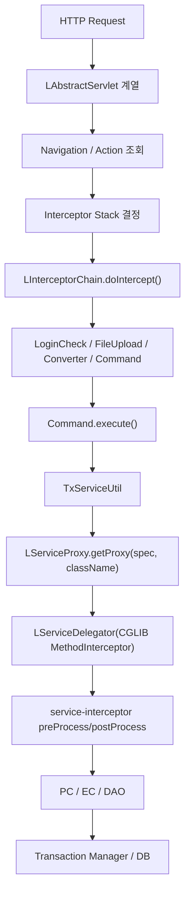
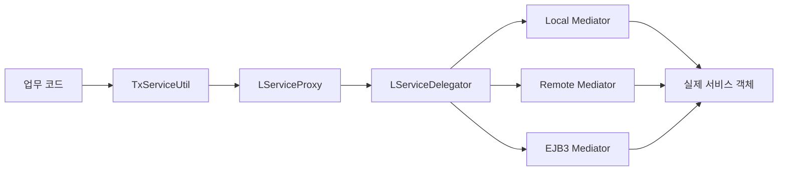
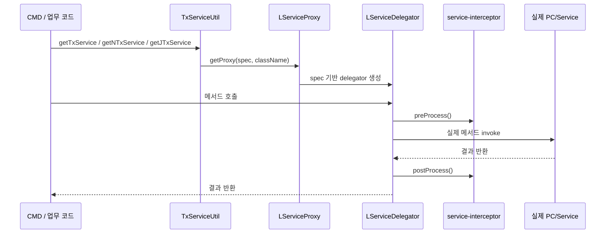
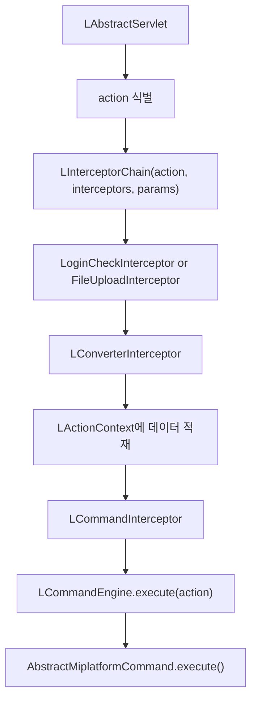
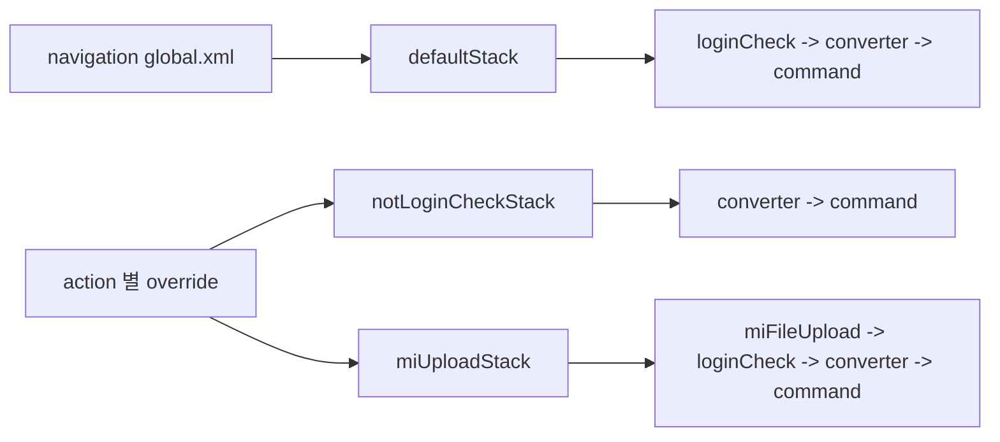
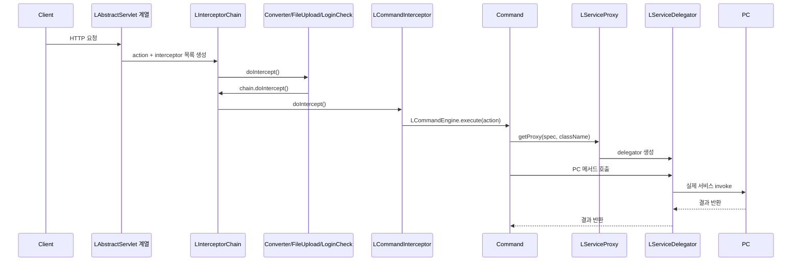

# DevOn Service Proxy / Interceptor / Dispatch 심층분석

> 분석 대상:
> - `devon-framework.jar`
> - `devon-framework_api`
> - `NPH_HIS/devonhome/conf/product/devon-framework.xml`
> - `NPH_HIS/devonhome/navigation/**/*.xml`
> - `COMMON/src/devonx/nph/system/servlet/*`
> - `COMMON/src/devonx/nph/system/cmd/AbstractMiplatformCommand.java`
> - `COMMON/src/devonx/nph/util/TxServiceUtil.java`
> - `NPH_HIS/src/nph/his/core/interceptor/*.java`
>
> 목적:
> - `LServiceProxy`, `LServiceDelegator`, `service-interceptor`, mediator 계층 추적
> - `front interceptor -> command dispatch` 체인 추적
> - `defaultStack`, `notLoginCheckStack`, `miUploadStack`가 실제로 어디서 붙는지 확인

---

## 1. 한눈 요약

### 1.1 결론

현재 확인된 근거를 기준으로 DevOn의 요청 처리 체인은 아래처럼 이해하는 것이 가장 안전하다.



핵심 판단:

- front channel은 **인터셉터 체인 기반**
- service layer는 **CGLIB 프록시 기반**
- `defaultStack`, `notLoginCheckStack`, `miUploadStack`는 **navigation XML에서 action 단위로 선택**
- `default`, `defaultTx`, `jtaTx`는 **service proxy spec 단위의 트랜잭션 weaving**

즉 DevOn은 화면 진입과 서비스 호출 모두에 “가로채기 계층”을 둔 구조다.

---

## 2. 분석 양식

이번 문서는 아래 세 질문으로 정리했다.

1. front channel에서 누가 request를 받아 command까지 보내는가
2. service 호출에서 누가 proxy를 만들고 정책을 입히는가
3. 설정 파일에서 그 둘이 어디서 붙는가

---

## 3. Service Proxy 메커니즘

## 3.1 직접 확인된 클래스

API 문서 / jar 기준:

- `LServiceProxy`
- `LServiceDelegator`
- `LNullServiceInterceptor`
- `LServiceInterceptorIF`

### 3.2 `LServiceProxy`

API 문서에서 확인된 사실:

- `getProxy(String className)`
- `getProxy(String spec, String className)`
- 설명상 service 요청을 intercept하여 `LServiceDelegator`로 넘기는 proxy 생성

즉 `LServiceProxy`는 단순 factory가 아니라
**호출 정책이 들어간 서비스 프록시 생성기**다.

### 3.3 `LServiceDelegator`

API 문서에서 확인된 사실:

- `net.sf.cglib.proxy.MethodInterceptor` 구현
- 생성자: `LServiceDelegator(String spec)`
- 메서드:
  - `intercept(...)`
  - `getLocalMediator()`
  - `getRemoteMediator()`
  - `getEJB3Mediator()`

이 점이 중요하다.

`LServiceDelegator`는 단순 위임자가 아니라,
**CGLIB method interception으로 서비스 메서드 호출을 가로채는 핵심 클래스**다.

### 3.4 mediator 계층 해석

`getLocalMediator`, `getRemoteMediator`, `getEJB3Mediator`가 보인다는 것은
service proxy 아래에 다시 mediator 계층이 있다는 뜻이다.

안전한 해석:

- 로컬 호출
- 리모트 호출
- EJB3 호출

같은 실행 대상을 mediator 계층에서 선택할 수 있게 설계된 것으로 보인다.



### 3.5 `service-interceptor`

현재 `devon-framework.xml`에서 확인된 설정:

```xml
<service-proxy>
  <service-interceptor>devonframework.business.mediator.LNullServiceInterceptor</service-interceptor>
  ...
</service-proxy>
```

`LNullServiceInterceptor` API 문서에서 확인된 사실:

- `LServiceInterceptorIF` 구현
- `preProcess()`
- `postProcess()`

즉 service 호출 전후에 끼워 넣을 hook가 구조적으로 존재한다.

다만 현재 NPH는 이름 그대로 **아무것도 하지 않는 기본 interceptor**를 쓰는 상태다.

### 3.6 Service Proxy 전체 흐름



---

## 4. Service spec과 트랜잭션 weaving

현재 설정:

```xml
<spec name="default">
  <transaction-enabled>false</transaction-enabled>
</spec>
<spec name="defaultTx">
  <transaction-enabled>true</transaction-enabled>
  <transaction-manager-ref>jdbc</transaction-manager-ref>
</spec>
<spec name="jtaTx">
  <transaction-enabled>true</transaction-enabled>
  <transaction-manager-ref>jta</transaction-manager-ref>
</spec>
```

실무 코드:

```java
TxServiceUtil.getNTxService(...)
TxServiceUtil.getTxService(...)
TxServiceUtil.getJTxService(...)
```

정리하면:

| 호출 | spec | 의미 |
| --- | --- | --- |
| `getNTxService()` | `default` | 트랜잭션 없음 |
| `getTxService()` | `defaultTx` | JDBC 트랜잭션 |
| `getJTxService()` | `jtaTx` | JTA 트랜잭션 |

즉 service proxy는 단순 호출 위임이 아니라,
**트랜잭션 정책을 메서드 호출에 입히는 weaving 계층**이다.

---

## 5. Front Interceptor 체인

## 5.1 직접 확인된 클래스

jar / API 문서 기준:

- `LAbstractServlet`
- `LAbstractInterceptor`
- `LInterceptorChain`
- `LConverterInterceptor`
- `LCommandInterceptor`

NPH 실제 구현:

- `LoginCheckInterceptor`
- `UrlPrivCheckInterceptor`
- `FileUploadInterceptor`

### 5.2 `LAbstractServlet`

API 문서 설명에서 읽히는 핵심:

- request를 분석
- interceptor chain을 찾음
- 공통 처리 수행
- 그 이후 결과를 dispatch

즉 `LAbstractServlet`은 front controller이면서,
**interceptor chain 구동기** 역할까지 맡는다.

### 5.3 `LInterceptorChain`

API 문서 기준:

- 생성자에 `action`, `interceptors`, `params`를 받음
- `doIntercept()`가 next interceptor를 실행

즉 이 구조는 명확한 **chain of responsibility** 패턴이다.

### 5.4 `LAbstractInterceptor`

API 문서 기준:

- 추상 클래스
- `doIntercept(LInterceptorChain chain)`를 override해야 함

즉 개별 interceptor는 모두 이 메서드 안에서

1. 전처리
2. 필요 시 차단
3. 통과 시 `chain.doIntercept()`

패턴으로 동작한다.

### 5.5 `LConverterInterceptor`

API 문서에서 읽히는 핵심:

- `LActionContext`에 데이터를 set하는 interceptor
- `doIntercept(LInterceptorChain chain)` 제공

즉 converter는 request를 command가 읽을 수 있는 형태로
**공유 컨텍스트에 적재하는 단계**다.

### 5.6 `LCommandInterceptor`

API 문서에서 확인된 사실:

- `LCommandEngine.execute(String action)` 호출
- 설명상 “Command List를 실행”

즉 front 체인의 마지막은 결국 command dispatch다.

### 5.7 Front 체인 전체 흐름



---

## 6. NPH의 실제 stack 정의

`devon-framework.xml` 기준:

```xml
<interceptor-stack name="defaultStack">
  <interceptor-ref name="loginCheck"/>
  <interceptor-ref name="converter"/>
  <interceptor-ref name="command"/>
</interceptor-stack>

<interceptor-stack name="notLoginCheckStack">
  <interceptor-ref name="converter"/>
  <interceptor-ref name="command"/>
</interceptor-stack>

<interceptor-stack name="miUploadStack">
  <interceptor-ref name="miFileUpload">
    <param name="config">default</param>
    <param name="createFile">true</param>
  </interceptor-ref>
  <interceptor-ref name="loginCheck"/>
  <interceptor-ref name="converter"/>
  <interceptor-ref name="command"/>
</interceptor-stack>
```

현재 NPH에서 직접 매핑된 커스텀 interceptor:

- `miFileUpload -> nph.his.core.interceptor.FileUploadInterceptor`
- `loginCheck -> nph.his.core.interceptor.LoginCheckInterceptor`
- `urlPriv -> nph.his.core.interceptor.UrlPrivCheckInterceptor`

주의:

- 현재 설정 조각에서 `converter`, `command`의 구체 클래스명은 직접 보이지 않음
- 그러나 jar/API 문서에서 `LConverterInterceptor`, `LCommandInterceptor`가 실존하고
- stack 이름과 역할 설명이 정확히 맞물린다

안전한 해석:

- `converter`는 framework 기본 `LConverterInterceptor`
- `command`는 framework 기본 `LCommandInterceptor`

일 가능성이 매우 높다.

---

## 7. 각 stack가 실제로 어디서 붙는가

## 7.1 기본값: `defaultStack`

직접 확인:

- `mhi/global.xml`에 `defaultStack`
- `his/global.xml`에 `defaultStack`

즉 기본적으로 action에 별도 지정이 없으면
**global navigation 차원의 기본 stack**이 적용되는 구조로 읽힌다.

## 7.2 로그인 예외: `notLoginCheckStack`

직접 확인:

- `mhi/az/bizcom/authNavi.xml`
  - `CheckLoginUser`
  - `CheckLoginUser-new`
  - `GetUserInfo-new`
  - `CheckLoginUserSe`
  - `MenuOnload`
  - `CheckUserPassWord`
  등에서 사용

의미:

- 로그인 이전 또는 로그인 예외 액션은
  `loginCheck`를 타면 안 되므로
  `converter -> command`만 타게 만든 것이다.

## 7.3 업로드 전용: `miUploadStack`

직접 확인:

- `mhi/az/fileMgrNavi.xml`
  - `UploadFileCommon`
  - `UploadQCFileCommon`
  - `UploadQCFileCommonOutSche`
- `up/az/fileMgrNavi.xml`

의미:

- 파일 업로드 액션은 multipart parsing이 먼저 필요하므로
  `miFileUpload -> loginCheck -> converter -> command`
  순서를 강제한다.

## 7.4 실제 부착 구조



---

## 8. 실제 interceptor 동작 예시

### 8.1 `LoginCheckInterceptor`

실제 코드:

- `LActionContext.getHttpServletRequest()`에서 session 확인
- 조건 충족 시 `chain.doIntercept()`

즉 로그인 검사 통과 전까지 다음 interceptor로 안 넘긴다.

### 8.2 `FileUploadInterceptor`

실제 코드:

- `HttpServletRequest` 확인
- multipart 처리
- `MiplatformRequest` 생성
- `LActionContext`에 request / multipart 정보 적재
- 이후 `chain.doIntercept()`

즉 업로드 stack에서는 converter보다 먼저
**request 형식을 변환 가능한 상태로 만드는 선행 interceptor**다.

### 8.3 `UrlPrivCheckInterceptor`

실제 코드:

- `LActionContext.getHttpServletRequest()` 사용
- 권한 체크 후 `chain.doIntercept()`

주의:

- 현재 `devon-framework.xml`의 stack 정의 조각에서는 `urlPriv`가 `defaultStack`에 직접 들어가 있지 않다
- 따라서 이 interceptor는 다른 stack, 확장 설정, 또는 특정 별도 경로에서 사용될 가능성이 있다

즉 실존은 확인되지만,
이번 범위에서는 기본 stack 연결까지는 직접 확인하지 못했다.

---

## 9. front -> command -> service 전체 체인 복원



---

## 10. 설계 사상 해석

### 10.1 front와 service를 모두 가로챈다

- front는 interceptor chain
- service는 CGLIB proxy

즉 요청 진입과 업무 호출 양쪽에 policy hook를 둔다.

### 10.2 정책을 설정에서 바꾼다

- 어떤 stack를 쓸지: navigation XML
- 어떤 트랜잭션을 쓸지: service spec

즉 정책은 코드보다 설정에 가깝다.

### 10.3 업무 코드는 상대적으로 단순하다

- CMD는 `TxServiceUtil` 호출
- PC/EC는 업무와 DAO에 집중

프레임워크가 공통 관심사를 위에서 감싸주는 구조다.

---

## 11. 지금 시점에서 안전한 설명 문장

1. DevOn front channel은 `LAbstractServlet + LInterceptorChain` 기반으로 동작한다.
2. `defaultStack`, `notLoginCheckStack`, `miUploadStack`는 navigation XML에서 action 단위로 선택된다.
3. `LCommandInterceptor`는 최종적으로 command 실행을 담당한다.
4. `LServiceProxy`는 `LServiceDelegator`를 통해 CGLIB 방식으로 서비스 메서드를 intercept한다.
5. `default / defaultTx / jtaTx`는 서비스 호출에 트랜잭션 정책을 입히는 spec이다.

---

## 12. 남은 열린 이슈

1. `converter`와 `command` 이름이 config에서 정확히 어떤 클래스명으로 resolve되는지
   - 현재는 jar/API 문서 정황상 `LConverterInterceptor`, `LCommandInterceptor`로 해석
2. `urlPriv`가 어떤 stack에서 실제로 사용되는지
3. `LServiceDelegator` 내부에서 mediator 선택 기준이 무엇인지
4. `LCommandEngine` 내부 dispatch 세부 흐름

---

## 13. 다음 순서 제안

이 문서 다음에는 아래 순서가 좋다.

1. `LCommandEngine` / navigation resolution 추가 추적
2. `converter`와 `command` resolve 경로 확정
3. `urlPriv` 실제 부착 stack 찾기
4. `PC / EC / UC` 계층 분담 규칙 정리

---

## 14. 참고 근거

- `NPH_HIS/webapp/api/devon-framework_api/devonframework/business/sd/LServiceProxy.html`
- `NPH_HIS/webapp/api/devon-framework_api/devonframework/business/sd/LServiceDelegator.html`
- `NPH_HIS/webapp/api/devon-framework_api/devonframework/business/mediator/LNullServiceInterceptor.html`
- `NPH_HIS/webapp/api/devon-framework_api/devonframework/business/mediator/LServiceInterceptorIF.html`
- `NPH_HIS/webapp/api/devon-framework_api/devonframework/front/channel/LAbstractServlet.html`
- `NPH_HIS/webapp/api/devon-framework_api/devonframework/front/channel/interceptor/LAbstractInterceptor.html`
- `NPH_HIS/webapp/api/devon-framework_api/devonframework/front/channel/interceptor/LInterceptorChain.html`
- `NPH_HIS/webapp/api/devon-framework_api/devonframework/front/channel/interceptor/LConverterInterceptor.html`
- `NPH_HIS/webapp/api/devon-framework_api/devonframework/front/channel/interceptor/LCommandInterceptor.html`
- `COMMON/src/devonx/nph/system/servlet/MiplatformServlet.java`
- `COMMON/src/devonx/nph/system/servlet/GeneralServlet.java`
- `COMMON/src/devonx/nph/system/cmd/AbstractMiplatformCommand.java`
- `COMMON/src/devonx/nph/util/TxServiceUtil.java`
- `NPH_HIS/devonhome/conf/product/devon-framework.xml`
- `NPH_HIS/devonhome/navigation/mhi/global.xml`
- `NPH_HIS/devonhome/navigation/his/global.xml`
- `NPH_HIS/devonhome/navigation/mhi/az/bizcom/authNavi.xml`
- `NPH_HIS/devonhome/navigation/mhi/az/fileMgrNavi.xml`
- `NPH_HIS/devonhome/navigation/batch/navigation.xml`
- `NPH_HIS/src/nph/his/core/interceptor/LoginCheckInterceptor.java`
- `NPH_HIS/src/nph/his/core/interceptor/UrlPrivCheckInterceptor.java`
- `NPH_HIS/src/nph/his/core/interceptor/FileUploadInterceptor.java`
