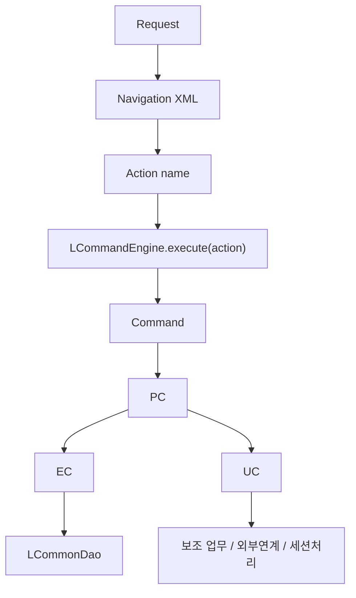
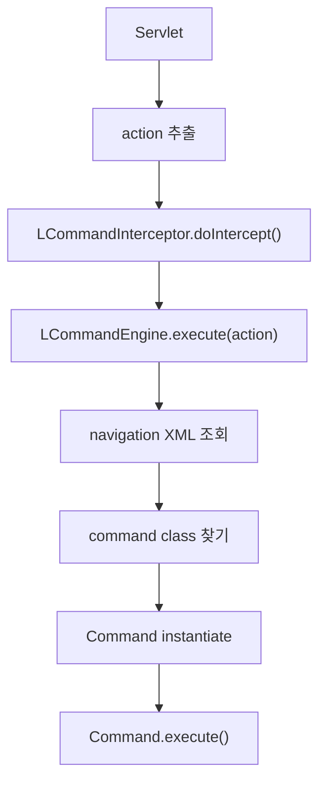
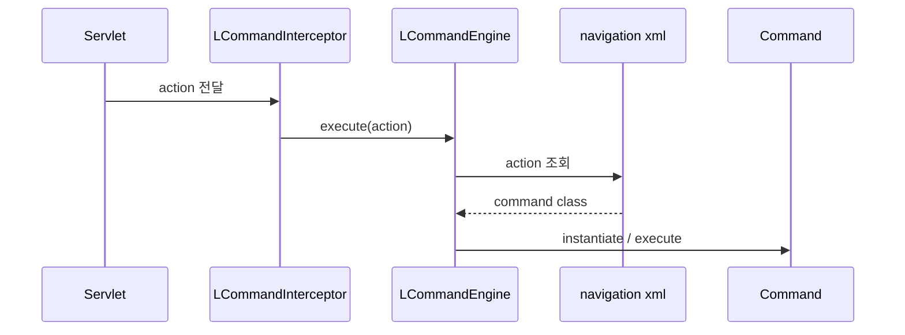
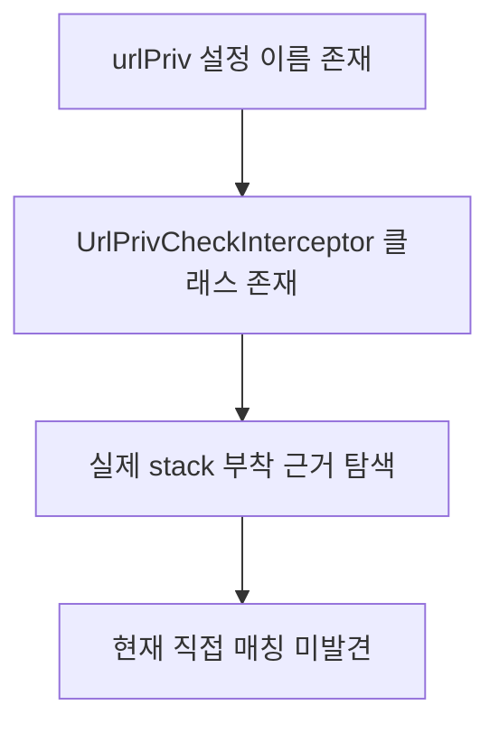
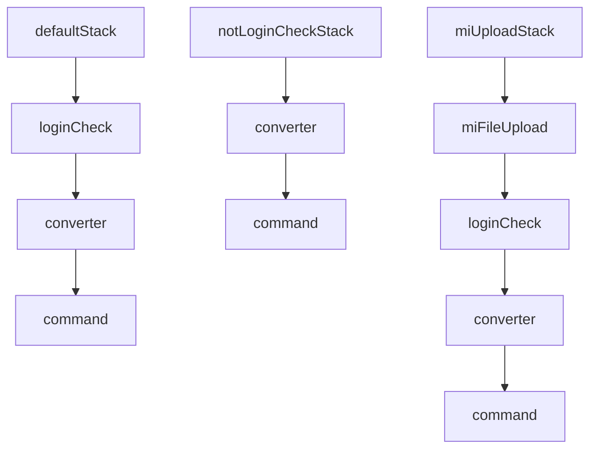
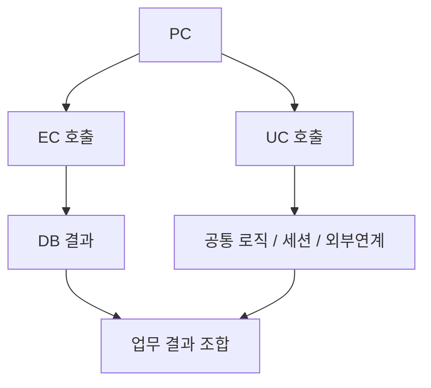
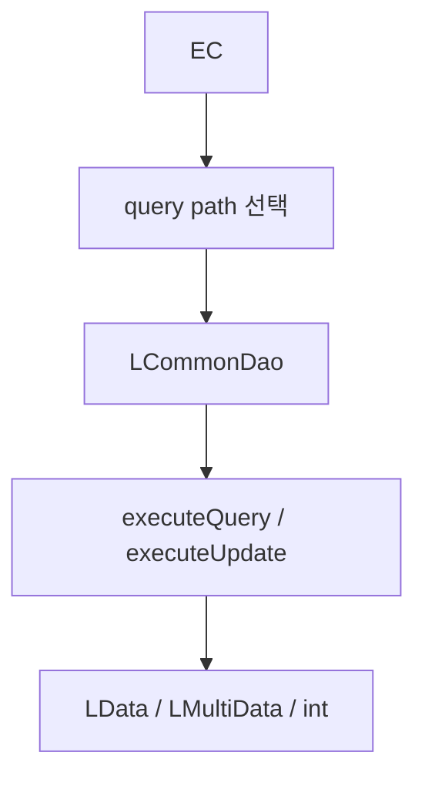
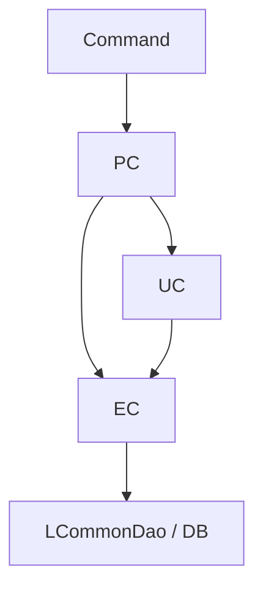
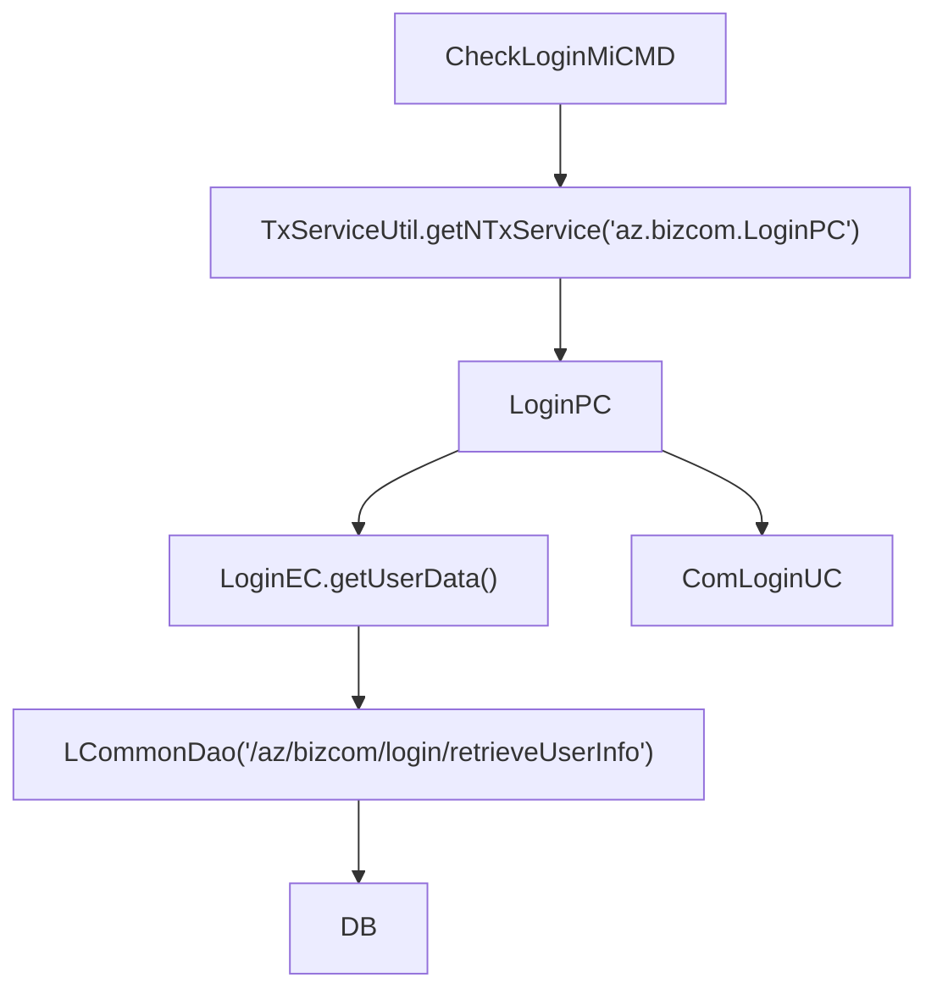
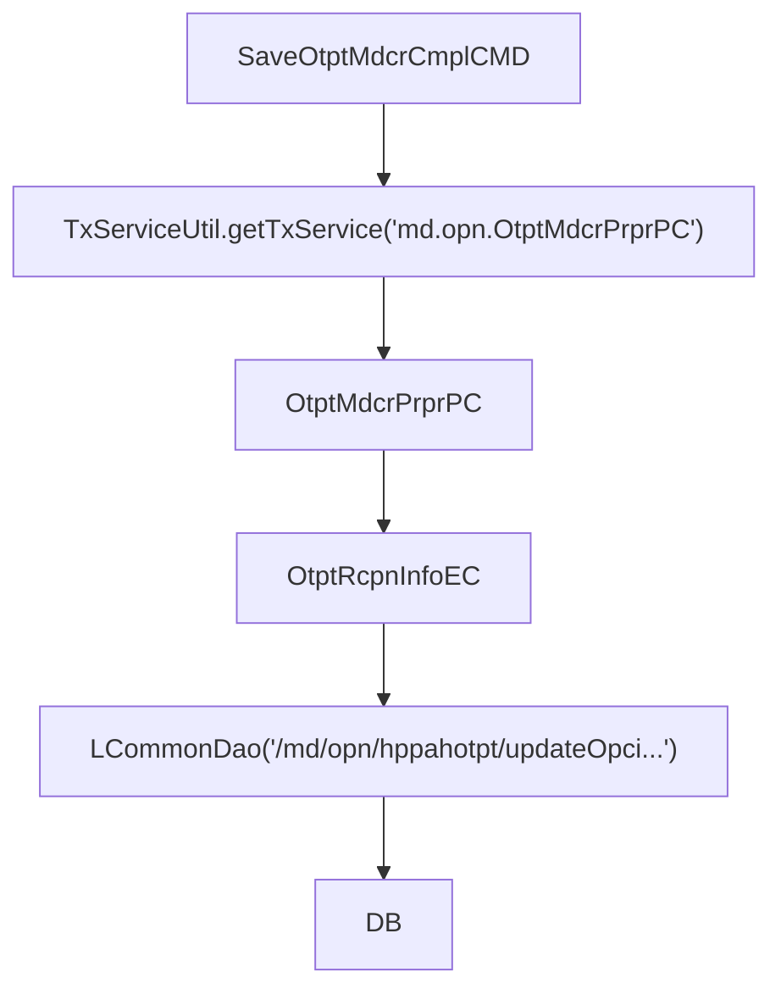

# DevOn Command / Navigation / PC-EC-UC 심층분석

> 분석 대상:
> - `devon-framework.jar`
> - `devon-framework_api`
> - `NPH_HIS/devonhome/navigation/**/*.xml`
> - `NPH_HIS/devonhome/conf/product/devon-framework.xml`
> - `COMMON/src/devonx/nph/system/servlet/*`
> - `COMMON/src/devonx/nph/system/cmd/AbstractMiplatformCommand.java`
> - `NPH_HIS/src/**/*.java`
>
> 목적:
> - `LCommandEngine`가 action을 어떻게 command로 해석하는지 정리
> - `urlPriv`가 실제 어디에 붙는지 확인
> - `PC / EC / UC` 계층이 어떤 역할로 나뉘는지 실코드 기준으로 정리
> - 다이어그램은 폭이 넓어지지 않도록 세로형/분할형으로 구성

---

## 1. 한눈 요약

### 1.1 결론

현재 백업셋 기준으로 front dispatch와 business 계층 분담은 아래처럼 이해하는 것이 가장 안전하다.



핵심 판단:

- `LCommandEngine`는 navigation XML에서 action에 매핑된 command를 실행하는 front dispatch 엔진
- `urlPriv`는 인터셉터 클래스와 설정 이름은 존재하지만, 현재 확인한 stack 부착 근거는 없음
- `PC`는 업무 조합자
- `EC`는 DB 접근 중심 실행자
- `UC`는 공통 업무/외부 연계/세션/보조 로직 담당이 강함

---

## 2. 다이어그램 폭 보완 원칙

이번 문서부터는 아래 기준을 적용한다.

1. 가로로 긴 한 장짜리 그림보다 세로형 `flowchart TD` 우선
2. 한 그림에 계층을 다 넣지 않고 `dispatch`, `business`, `role`로 분리
3. 시퀀스 다이어그램도 참여자 수를 줄여 작은 블록으로 나눔

즉 "한 장의 큰 구조도"보다 "작은 그림 여러 개"가 우선이다.

---

## 3. `LCommandEngine`와 navigation resolution

## 3.1 직접 확인된 클래스

API 문서 / jar 기준:

- `devonframework.front.command.LCommandEngine`
- `devonframework.front.channel.model.LActionModel`
- `devonframework.front.channel.model.LInterceptorStackModel`

### 3.2 `LCommandEngine`

API 문서에서 확인된 사실:

- 설명: Command를 처리하는 engine
- `execute(String action)` 제공
- 설명상 navigation XML에 정의된 command를 `LNavigationMapper`를 통해 찾아 실행

즉 핵심은 이것이다.

> `LCommandEngine`는 `action 문자열`을 받아
> navigation XML에서 command 목록을 찾고
> 해당 command를 instantiate / execute 하는 front dispatch 엔진이다.

### 3.3 dispatch 흐름



### 3.4 실제 navigation 예시

로그인:

```xml
<action name="CheckLoginUser">
  <command>nph.his.az.bizcom.auth.cmd.CheckLoginMiCMD</command>
</action>
```

외래 저장:

```xml
<action name="SaveOtptMdcrCmpl">
  <command>nph.his.md.opn.otptnrcr.cmd.SaveOtptMdcrCmplCMD</command>
</action>
```

즉 `action name`은 결국 command class로 resolve된다.

### 3.5 좁은 폭 기준 시퀀스



---

## 4. `urlPriv` 실제 부착 여부

## 4.1 직접 확인된 사실

설정 정의:

```xml
<interceptor name="urlPriv">nph.his.core.interceptor.UrlPrivCheckInterceptor</interceptor>
```

실제 클래스:

- `nph.his.core.interceptor.UrlPrivCheckInterceptor`
- `LAbstractInterceptor` 상속
- `doIntercept(LInterceptorChain chain)` 구현

실제 동작:

- `LActionContext.getHttpServletRequest()` 사용
- 권한 검사 후 `chain.doIntercept()`

### 4.2 그런데 중요한 점

현재 확인 범위에서는 아래가 발견되지 않았다.

- `defaultStack`에 `urlPriv` 포함
- `notLoginCheckStack`에 `urlPriv` 포함
- `miUploadStack`에 `urlPriv` 포함
- navigation XML에서 `urlPriv` 또는 url privilege 전용 stack 직접 지정

즉 현재 확인된 사실은 다음 두 개뿐이다.

1. `urlPriv`라는 interceptor 정의는 존재
2. 실제 클래스도 존재

하지만

3. **현재 백업셋에서 기본 stack 또는 action 매핑에 실제로 붙어 있다는 직접 근거는 아직 없음**

### 4.3 현재 시점의 안전한 결론



정리:

- `urlPriv`는 **죽은 설정일 수도 있고**
- **별도 환경/별도 stack/누락된 설정 파일에서 붙을 수도 있다**
- 현재 문서화는 `실존하지만 기본 체인 부착은 미확인`으로 적는 것이 맞다.

---

## 5. `defaultStack`, `notLoginCheckStack`, `miUploadStack` 재정리

### 5.1 stack 정의



### 5.2 실제 부착 지점

기본:

- `mhi/global.xml` -> `defaultStack`
- `his/global.xml` -> `defaultStack`

로그인 예외:

- `mhi/az/bizcom/authNavi.xml` 다수 action -> `notLoginCheckStack`

업로드:

- `mhi/az/fileMgrNavi.xml` 업로드 action -> `miUploadStack`
- `up/az/fileMgrNavi.xml` -> `miUploadStack`

즉 stack 적용은 “코드 안”이 아니라,
**navigation XML 수준에서 action마다 선택**된다.

---

## 6. `PC / EC / UC` 계층 분담 규칙

## 6.1 요약 표

| 계층 | 주 역할 | 실코드 특징 |
| --- | --- | --- |
| `PC` | 업무 절차 조합 | `EC`, `UC`를 함께 부름 |
| `EC` | DB 접근 실행 | `LCommonDao`가 매우 자주 나옴 |
| `UC` | 공통 업무 / 외부연계 / 세션 / 보조 로직 | `EC` 호출도 하고 상태 조작도 함 |

### 6.2 PC의 역할

대표 예시: `LoginPC`

직접 확인:

- `LoginEC` 호출
- `ComLoginUC` 호출
- `ComnCdUC` 호출
- `NoEamEC` 호출
- 여러 결과를 조합해 최종 반환

해석:

- `PC`는 한 번의 화면 요청에 필요한 업무 단계를 묶는다
- DB만 하지 않고, 세션/권한/메뉴/보조 로직까지 조합한다



### 6.3 EC의 역할

대표 예시: `LoginEC`

직접 확인:

- `new LCommonDao("/az/bizcom/login/retrieveUserInfo", input)`
- `executeQueryForSingle()`
- 같은 패턴 반복

대표 예시: `OtptRcpnInfoEC`

직접 확인:

- `new LCommonDao("/md/opn/hppahotpt/updateOpciStatDvsn", data)`
- `executeUpdate()`
- `new LCommonDao("/md/opn/hppahotpt/updateMedWtngNum", data)`
- `executeUpdate()`

해석:

- `EC`는 SQL 경로를 선택하고 실행하는 계층
- 실제로는 DAO wrapper에 가장 가까운 business-side adapter다



### 6.4 UC의 역할

대표 예시: `ComLoginUC`

직접 확인:

- `UserDeptMngmEC` 호출
- `LoginMenuEC` 호출
- 메뉴/권한/세션 관련 조합 처리

대표 예시: `KioskUC`

직접 확인:

- 생성자에서 여러 UC/EC를 함께 보유
- `MccsClclUC`, `MccsLastClclUC`, `MccsRcptUC`
- `KioskEC`, `CommonEC`, `OtptRcptEC`, `OtptRcpnInfoEC`, `NhicWsUC` 등 조합

해석:

- `UC`는 이름만 보면 단순 utility 같지만 실제로는 꽤 무겁다
- 공통 업무 로직
- 외부 연계
- 세션/메뉴/수납 계산
- 여러 EC/UC 조합

를 담당하는 경우가 많다

즉 UC는 “작은 유틸 메서드 모음”이라기보다
**공통 업무 시나리오를 묶는 재사용 계층**에 가깝다.

### 6.5 역할 경계의 실제 모습



이 구조가 뜻하는 바:

- `PC`가 꼭 `EC`만 부르는 것은 아니다
- `UC`도 `EC`를 부를 수 있다
- 따라서 계층은 완전히 수직적이라기보다
  `PC가 orchestration 중심`, `EC가 DB 중심`, `UC가 공통 시나리오 중심`
  정도로 이해하는 것이 맞다

---

## 7. 실제 예시 1: 로그인



핵심:

- CMD는 PC 선택
- PC는 EC/UC 조합
- EC는 DB 조회

---

## 8. 실제 예시 2: 외래 저장



핵심:

- 저장성 요청은 `defaultTx`
- PC가 반복/업무 절차를 관리
- EC가 실제 update query를 실행

---

## 9. 지금 시점에서 안전한 설명 문장

1. `LCommandEngine`는 navigation XML에서 action에 연결된 command를 찾고 실행하는 엔진이다.
2. `defaultStack`, `notLoginCheckStack`, `miUploadStack`는 navigation XML에서 action 단위로 선택된다.
3. `urlPriv`는 인터셉터 정의와 클래스는 존재하지만, 현재 백업셋에서 기본 stack 부착은 직접 확인하지 못했다.
4. `PC`는 업무 조합, `EC`는 DB 실행, `UC`는 공통 업무/외부연계/세션 보조 계층으로 이해하는 것이 가장 실용적이다.

---

## 10. 남은 열린 이슈

1. `LNavigationMapper` 실체와 실제 action lookup 내부 구현
2. `urlPriv`가 어느 설정 파일 또는 런타임 조건에서 붙는지
3. `UC`가 공통 계층인지, 도메인 서비스 계층인지 더 세밀한 분류 기준

---

## 11. 다음 순서 제안

1. `LNavigationMapper` / `LActionModel` / `LInterceptorStackModel` 추가 추적
2. `PC / EC / UC` naming 규칙과 실제 패키지 규칙 전수 통계
3. `CMD -> PC -> EC -> DAO` 대표 업무 흐름 3~5개를 패턴 문서로 정리

---

## 12. 참고 근거

- `NPH_HIS/webapp/api/devon-framework_api/devonframework/front/command/LCommandEngine.html`
- `NPH_HIS/webapp/api/devon-framework_api/devonframework/front/channel/model/LActionModel.html`
- `NPH_HIS/webapp/api/devon-framework_api/devonframework/front/channel/model/LInterceptorStackModel.html`
- `NPH_HIS/devonhome/conf/product/devon-framework.xml`
- `NPH_HIS/devonhome/navigation/mhi/global.xml`
- `NPH_HIS/devonhome/navigation/his/global.xml`
- `NPH_HIS/devonhome/navigation/mhi/az/bizcom/authNavi.xml`
- `NPH_HIS/devonhome/navigation/mhi/az/fileMgrNavi.xml`
- `NPH_HIS/devonhome/navigation/batch/navigation.xml`
- `NPH_HIS/src/nph/his/core/interceptor/UrlPrivCheckInterceptor.java`
- `NPH_HIS/src/nph/his/az/bizcom/auth/pc/LoginPC.java`
- `NPH_HIS/src/nph/his/az/zzaz/bizcom/auth/LoginEC.java`
- `NPH_HIS/src/nph/his/az/com/uc/ComLoginUC.java`
- `NPH_HIS/src/nph/his/hp/com/uc/KioskUC.java`
