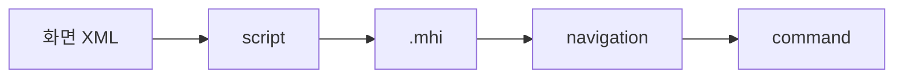

# Miplatform

약어/용어는 [030.index 용어집](../../030.index/0303.약어-용어집/약어-용어집.md)을 먼저 보면 빠르다.

이 문서는 `031.front-channel`에서 MiPlatform 채널을 해석하는 기준본이다. 초점은 제품 일반론이 아니라, NPH에서 화면 XML과 Dataset이 `.mhi` 요청으로 내려가는 실제 경로에 있다.

## 1. 이 문서를 어디에 두는가

- `031.front-channel`
  - 화면, 스크립트, Dataset, `.mhi`, JSP 접점을 본다.
- `032.framework-core`
  - `.mhi` 뒤에서 DevOn command, service, DAO가 어떻게 동작하는지 본다.
- `037.runtime-trace`
  - 실제 화면 사례를 따라가며 확인한다.

## 2. 가장 짧은 해석

NPH에서 MiPlatform은 단순 UI 기술이 아니라, `화면 XML + JavaScript + Dataset + .mhi` 패턴 전체를 묶어 보는 것이 맞다.

## 3A. 공식 MiPlatform 매뉴얼 기준으로 보면

Tobesoft MiPlatform 3.3 PID Developer 가이드의 `화면(Form) 개발` 문서는 Form을 `Design, Data, Event`를 함께 담는 사용자 인터페이스로 설명한다. NPH 화면 XML을 읽을 때도 이 기준이 유효하다.

현재 NPH에 직접 적용되는 해석은 아래와 같다.
- `Design`
  - XML 안의 Form 속성, Component 배치, Grid/Tab/Div 같은 화면 구성
- `Data`
  - Dataset 정의와 바인딩 대상
- `Event`
  - `OnLoadCompleted`, `OnClick` 등 이벤트와 script 함수

또한 매뉴얼에는 Form 생성 시 `Include Event Script` 옵션과 `Component & Dataset, Image Only` 옵션이 구분되어 있다.
- `Include Event Script`
  - 하나의 XML 파일에 Form 내용과 Script를 같이 저장
- `Component & Dataset, Image Only`
  - Form 내용은 XML, Script는 JS 파일로 분리

NPH의 대표 MiPlatform 화면(`Login3.xml`, `MD_ORD01001P.xml`, `HP_DMS02204M.xml`)은 첫 번째 패턴에 가깝다. 즉 XML 안에 이벤트와 script가 함께 들어 있어서, 화면 추적을 할 때 XML 파일 하나에서 `구성 + 이벤트 + .mhi 호출`을 같이 읽는 접근이 효과적이다.

## 3. 현재 코드에서 직접 확인된 기준점

### 3.1 애플리케이션 시작점
- `NPH_HIS/webapp/index330.jsp`
  - 브라우저 진입점이다.
  - 로그인 상태에 따라 런처 URL을 만든다.
- `NPH_HIS/webapp/ui/NPH_start.xml`
  - MiPlatform 세션 시작 설정 파일이다.
  - `SessionURL="com::Login3.xml"` 이 직접 확인된다.
  - `protocol Compress="True"`, `XmlFormat="False"`가 확인된다.
  - `AZ_COM`, `MD_ORD`, `HP_DMS` 등 다수 `AppGroup`가 여기서 선언된다.

### 3.2 대표 로그인 화면
- `NPH_HIS/webapp/ui/com/Login3.xml`
  - `OnLoadCompleted="G_Login_OnLoadCompleted"`
  - `Transaction("CheckUserInfo", "NPHSE::/az/bizcom/authNavi/CheckLoginUser-new1.mhi", ...)`
  - `var sSvcURL = "/az/bizcom/authNavi/RetirevePrivCodeList.mhi"`
- 즉 로그인 화면만 봐도 `화면 XML -> script -> .mhi` 패턴이 직접 보인다.

### 3.3 대표 업무 화면
- `NPH_HIS/webapp/ui/MD/ORD/MD_ORD01001P.xml`
  - `OnLoadCompleted="MD_ORD01001P_OnLoadCompleted"`
  - 다수 `fRetrieve...()` 함수가 `.mhi`를 호출한다.
  - `RetrievePtOrder`, `RetrievePtOrderPre`, `SavePtOrderPre`, `SavePtOrder`, `UpdateDurt`가 대표적이다.
- `NPH_HIS/webapp/ui/HP/DMS/HP_DMS02204M.xml`
  - `RetrieveDrgRevwPtList.mhi` 호출이 직접 확인된다.

## 4. 이 폴더에서 먼저 봐야 할 문서

- [B.MiPlatform-Transaction-패턴.md](./B.MiPlatform-Transaction-%ED%8C%A8%ED%84%B4.md)
  - `Transaction()` 호출 패턴과 `.mhi` 연결을 본다.
- [C.Dataset-입출력.md](./C.Dataset-%EC%9E%85%EC%B6%9C%EB%A0%A5.md)
  - Dataset이 입력/출력에서 어떻게 쓰이는지 본다.
- [B.화면XML-script-mhi-연결.md](../0313.ui-entry/B.%ED%99%94%EB%A9%B4XML-script-mhi-%EC%97%B0%EA%B2%B0.md)
  - 화면 XML과 script, `.mhi` 매핑을 화면 기준으로 본다.
- [C.JSP-브라우저-ActiveX-접점.md](../0313.ui-entry/C.JSP-%EB%B8%8C%EB%9D%BC%EC%9A%B0%EC%A0%80-ActiveX-%EC%A0%91%EC%A0%90.md)
  - JSP/브라우저/OCX 접점을 본다.

## 5. 다음에 바로 올라갈 문서

- [032.framework-core 개요](../../032.framework-core/0321.overview/A.Framework-%EA%B0%9C%EC%9A%94.md)
- [032 Command/Navigation 해석](../../032.framework-core/0321.overview/C.Architecture-overview.md)
- [037 MD_ORD01001P trace](../../037.runtime-trace/B.MD_ORD01001P-%EC%8B%A4%ED%96%89%EC%B2%B4%EC%9D%B8.md)

## 연결 문서

- [D.대표화면-공통코드조회-패턴.md](../0313.ui-entry/D.%EB%8C%80%ED%91%9C%ED%99%94%EB%A9%B4-%EA%B3%B5%ED%86%B5%EC%BD%94%EB%93%9C%EC%A1%B0%ED%9A%8C-%ED%8C%A8%ED%84%B4.md)

## 9A. 같이 볼 문서

- DevOn 코어 흐름은 [../../032.framework-core/0321.overview/A.Framework-개요.md](../../032.framework-core/0321.overview/A.Framework-개요.md)
- Data Access는 [../../032.framework-core/0322.data-access/A.Data-Access-개요.md](../../032.framework-core/0322.data-access/A.Data-Access-개요.md)
- DevOn 외부 솔루션은 [../../033.platform-services/README.md](../../033.platform-services/README.md)
- 의료업무 맥락은 [../../035.Biz-medical-Domain](../../035.Biz-medical-Domain)
- 실제 사례는 [../../037.runtime-trace/A.트레이스-읽는순서.md](../../037.runtime-trace/A.트레이스-읽는순서.md)
