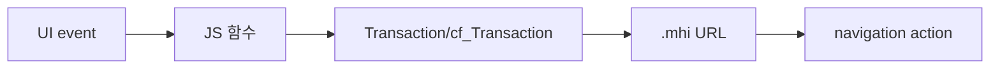

# MiPlatform Transaction 패턴

약어/용어는 [030.index 용어집](../../030.index/0303.약어-용어집/약어-용어집.md)을 먼저 보면 빠르다.

이 문서는 NPH MiPlatform 화면에서 `Transaction()` 호출이 어떤 식으로 `.mhi`와 연결되는지 빠르게 찾기 위한 기준본이다.

## 1. 가장 먼저 볼 패턴



유지보수에서 가장 먼저 찾을 것은 두 개다.
- 어떤 함수가 `Transaction()` 또는 `cf_Transaction()`을 호출하는가
- 그 함수가 어떤 `.mhi`를 때리는가

## 2. 로그인 화면 패턴

### 2.1 직접 확인된 소스
- 파일: `NPH_HIS/webapp/ui/com/Login3.xml`
- 확인값:
  - `OnLoadCompleted="G_Login_OnLoadCompleted"`
  - `Transaction("CheckUserInfo", "NPHSE::/az/bizcom/authNavi/CheckLoginUser-new1.mhi", ...)`
  - `var sSvcURL = "/az/bizcom/authNavi/RetirevePrivCodeList.mhi"`

### 2.2 해석
```mermaid
flowchart LR
    Login3[Login3.xml] --> GLogin[G_Login_OnLoadCompleted / btn_Login_OnClick]
    GLogin --> Tx[Transaction]
    Tx --> LoginMhi[/az/bizcom/authNavi/CheckLoginUser-new1.mhi]
    LoginMhi --> AuthNavi[authNavi.xml]
```

이 패턴은 가장 단순한 MiPlatform transaction 예시다.
- 화면 XML 안에 script가 같이 있고
- script가 바로 `.mhi`를 호출하고
- navigation에서 command로 연결된다.

## 3. 일반 업무 화면 패턴

### 3.1 처방 화면
- 파일: `NPH_HIS/webapp/ui/MD/ORD/MD_ORD01001P.xml`
- 직접 확인된 대표 호출:
  - `fRetrievePtOrder()` -> `/md/ord/ptmdcrNavi/RetrievePtOrder.mhi`
  - `fRetrievePtOrderPre()` -> `/md/ord/ptmdcrNavi/RetrievePtOrderPre.mhi`
  - `SavePtOrderPre` -> `/md/ord/ptmdcrNavi/SavePtOrderPre.mhi`
  - `SavePtOrder` -> `/md/ord/ptmdcrNavi/SavePtOrder.mhi`
  - `UpdateDurt` -> `/md/ord/ptmdcrNavi/UpdateDurt.mhi`

### 3.2 심사 화면
- 파일: `NPH_HIS/webapp/ui/HP/DMS/HP_DMS02204M.xml`
- 직접 확인된 대표 호출:
  - `RetrieveDrgRevwPtList` -> `/hp/dms/drgNavi/RetrieveDrgRevwPtList.mhi`
  - `UpdateDrgRcpnNo` -> `/hp/dms/drgNavi/UpdateDrgRcpnNo.mhi`

### 3.3 공통코드 조회 팝업
- 파일: `NPH_HIS/webapp/ui/AZ/UTL/AZ_UTL01002P.xml`
- 직접 확인된 대표 호출:
  - `fRetrieveComncd()` -> `/az/bizcom/comNavi/RetrieveComnCd.mhi`
- 의미:
  - `cf_Transaction()` 기반 일반 조회 팝업 패턴을 설명하기에 적합하다.

## 4. `Transaction()`과 `cf_Transaction()`의 실무 차이

현재 확인된 화면 기준으로 보면:
- 로그인/기초 예시는 `Transaction()`을 직접 호출하는 경우가 있다.
- 대형 업무 화면은 공통 wrapper인 `cf_Transaction()`을 통해 `.mhi`를 호출하는 경우가 많다.

즉 유지보수 관점에서는 이렇게 본다.
- `Transaction()`
  - MiPlatform 기본 호출 패턴을 직접 드러내는 경우
- `cf_Transaction()`
  - NPH 공통 규약이 얹힌 호출 패턴

## 5. 추적 절차

1. 화면 XML에서 `OnLoadCompleted`, `OnClick`, `OnChange`를 찾는다.
2. 해당 이벤트 함수에서 `Transaction(` 또는 `cf_Transaction(`을 찾는다.
3. `sSvcID`, `sSvcURL` 값을 확인한다.
4. `.mhi` URL에서 navigation XML을 찾는다.
5. navigation action에 연결된 command를 찾는다.

## 6. 연결 문서


- [로그인-체인-기준패턴.md](../0312.navigation-command/%EB%A1%9C%EA%B7%B8%EC%9D%B8-%EC%B2%B4%EC%9D%B8-%EA%B8%B0%EC%A4%80%ED%8C%A8%ED%84%B4.md)
- [화면XML-script-mhi-연결.md](../0313.ui-entry/%ED%99%94%EB%A9%B4XML-script-mhi-%EC%97%B0%EA%B2%B0.md)
- [Command-Navigation-Dispatch.md](../0312.navigation-command/Command-Navigation-Dispatch.md)
- [MD_ORD01001P trace](../../037.runtime-trace/MD_ORD01001P-%EC%8B%A4%ED%96%89%EC%B2%B4%EC%9D%B8.md)
- [대표화면-EDI-수신-패턴.md](../0313.ui-entry/%EB%8C%80%ED%91%9C%ED%99%94%EB%A9%B4-EDI-%EC%88%98%EC%8B%A0-%ED%8C%A8%ED%84%B4.md)


