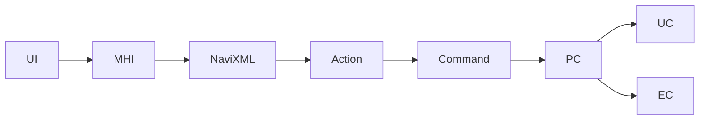
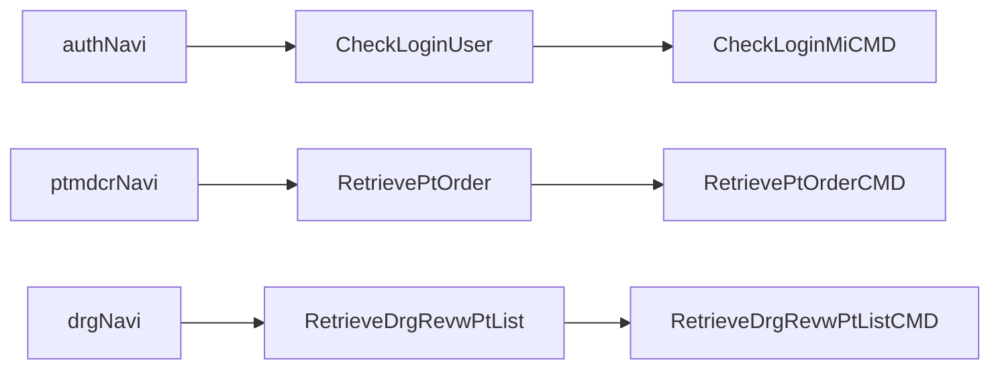
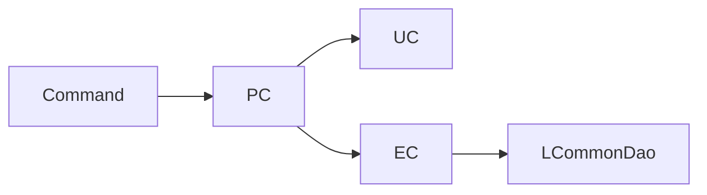

# Command Navigation Dispatch

약어/용어는 [030.index 용어집](../../030.index/0303.약어-용어집/약어-용어집.md)을 먼저 보면 빠르다.

이 문서는 `.mhi URL -> navigation XML -> command -> PC/UC/EC` 흐름을 현재 구조 기준으로 정리한 기준본이다. `031.front-channel`에서는 화면에서 `.mhi`까지 내려오는 입구를 보고, 이 문서에서는 `.mhi` 뒤에서 어떤 command가 붙는지 본다.

## 1. 기본 흐름

## 2. `.mhi`를 추적하는 실무 순서

1. 화면 XML 또는 JSP에서 `.mhi` URL을 찾는다.
2. URL 경로에 맞는 navigation XML을 찾는다.
3. action 이름을 확인한다.
4. action에 연결된 command 클래스를 찾는다.
5. command가 어떤 PC/UC/EC를 호출하는지 본다.

## 3. 대표 navigation 예

- 로그인
  - `authNavi.xml`
  - `CheckLoginUser -> CheckLoginMiCMD`
- 처방 화면
  - `ptmdcrNavi.xml`
  - `RetrievePtOrder -> RetrievePtOrderCMD`
  - `SavePtOrderPre -> SavePtOrderPreCMD`
- 심사후처리
  - `drgNavi.xml`
  - `RetrieveDrgRevwPtList -> RetrieveDrgRevwPtListCMD`
- EDI 수신
  - `clamNavi.xml`
  - `RetrieveEdiRecvRcpn -> RetrieveEdiRecvRcpnCMD`

## 4. 현재 확인된 navigation 근거

- `NPH_HIS/devonhome/navigation/mhi/az/bizcom/authNavi.xml`
  - `CheckLoginUser`, `CheckLoginUser-new`, `CheckLoginUser-new1`
  - 로그인 계열은 `notLoginCheckStack`이 붙는다.
- `NPH_HIS/devonhome/navigation/mhi/hp/dms/drgNavi.xml`
  - `RetrieveDrgRevwPtList -> nph.his.hp.dms.drg.cmd.RetrieveDrgRevwPtListCMD`

## 5. PC / UC / EC 역할 분담

현재 코드 기준으로 가장 안전한 해석은 아래다.
- `PC`
  - 업무 흐름 조합자
  - 여러 EC/UC 호출 순서를 묶는다.
- `UC`
  - 공통 업무, 외부 연계, 보조 시나리오 계층
- `EC`
  - DB 접근 중심 실행 계층
  - `LCommonDao`를 직접 사용하는 경우가 많다.

## 6. 연결 문서

- [A.Front-Channel-개요.md](../0313.ui-entry/A.Front-Channel-%EA%B0%9C%EC%9A%94.md)
- [B.MiPlatform-Transaction-패턴.md](../0311.miplatform/B.MiPlatform-Transaction-%ED%8C%A8%ED%84%B4.md)
- [032.framework-core overview](../../032.framework-core/0321.overview/C.Architecture-overview.md)
- [MD_ORD01001P trace](../../037.runtime-trace/B.MD_ORD01001P-%EC%8B%A4%ED%96%89%EC%B2%B4%EC%9D%B8.md)

## 연결 문서

- [D.공통코드조회-체인-기준패턴.md](./D.%EA%B3%B5%ED%86%B5%EC%BD%94%EB%93%9C%EC%A1%B0%ED%9A%8C-%EC%B2%B4%EC%9D%B8-%EA%B8%B0%EC%A4%80%ED%8C%A8%ED%84%B4.md)

- [C.로그인-체인-기준패턴.md](./C.%EB%A1%9C%EA%B7%B8%EC%9D%B8-%EC%B2%B4%EC%9D%B8-%EA%B8%B0%EC%A4%80%ED%8C%A8%ED%84%B4.md)

