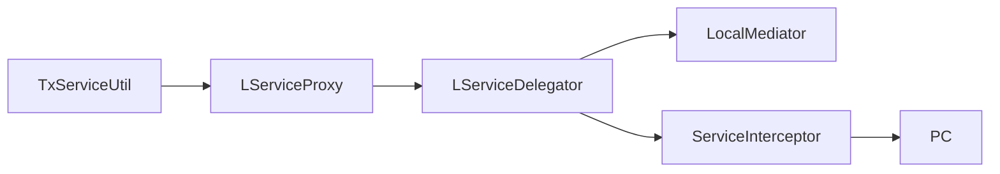
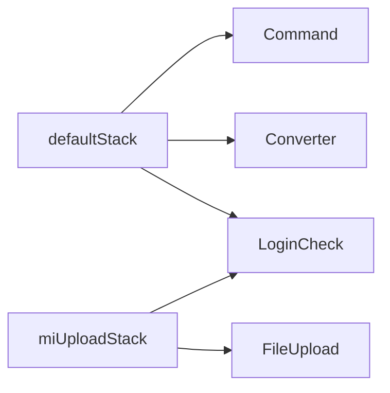

# ServiceProxy Interceptor

약어/용어는 [030.index 용어집](../../030.index/0303.약어-용어집/약어-용어집.md)을 먼저 보면 빠르다.

이 문서는 `LServiceProxy`, `LServiceDelegator`, service-interceptor, front interceptor stack을 현재 확인된 범위로 정리한 기준본이다. `.mhi`를 따라 command까지 내려간 뒤, service와 interceptor가 어떤 식으로 붙는지 이해할 때 읽는다.

## 1. service proxy 계층

직접 확인된 구성요소:
- `LServiceProxy`
  - service proxy 생성 진입점
- `LServiceDelegator`
  - CGLIB `MethodInterceptor`
- `LServiceInterceptorIF`
  - `preProcess()`, `postProcess()` hook 제공
- `LNullServiceInterceptor`
  - 기본 service-interceptor 구현

## 2. 실무 해석

- business 코드는 직접 PC/EC를 new 해서 호출하기보다
- `TxServiceUtil -> LServiceProxy -> LServiceDelegator` 경로로 proxy를 거쳐 들어간다.
- 이 구조는 트랜잭션과 공통 정책 weaving을 위해 존재한다.

## 3. service spec

현재 문서화에 안전한 spec 이름:
- `default`
- `defaultTx`
- `jtaTx`

실무 해석:
- `getNTxService()`
  - 비트랜잭션 또는 기본 local 호출 계열
- `getTxService()`
  - JDBC transaction 계열
- `getJTxService()`
  - JTA 계열

## 4. front interceptor stack

현재 확인된 주요 stack:
- `defaultStack`
- `notLoginCheckStack`
- `miUploadStack`

현재 확인된 실제 interceptor 클래스:
- `LoginCheckInterceptor`
- `UrlPrivCheckInterceptor`
- `FileUploadInterceptor`

## 5. 적용 사례

- `mhi/global.xml`, `his/global.xml`
  - 기본 stack 규칙의 기준점
- `authNavi.xml`
  - 로그인 예외 흐름 확인용

## 6. 연결 문서

- [Command-Navigation-Dispatch.md](./Command-Navigation-Dispatch.md)
- [032.framework-core 개요](../../032.framework-core/0321.overview/01.Framework-%EA%B0%9C%EC%9A%94.md)
- [032 Connection/Pool/TX](../../032.framework-core/0322.data-access/04.Connection-Pool-TX.md)

