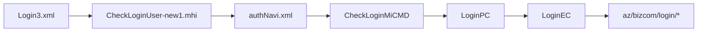

# 로그인-체인-기준패턴

약어/용어는 [030.index 용어집](../../030.index/0303.약어-용어집/약어-용어집.md)을 먼저 보면 빠르다.

이 문서는 `Login3.xml -> CheckLoginUser-new1.mhi` 흐름을 기준으로, `031.front-channel`에서 로그인형 command 체인을 가장 짧게 고정하기 위한 기준본이다.

## 1. 직접 확인된 파일

- 화면 XML
  - `NPH_HIS/webapp/ui/COM/Login3.xml`
- navigation
  - `NPH_HIS/devonhome/navigation/mhi/az/bizcom/authNavi.xml`
- command
  - `NPH_HIS/src/nph/his/az/bizcom/auth/cmd/CheckLoginMiCMD.java`
- PC
  - `NPH_HIS/src/nph/his/az/bizcom/auth/pc/LoginPC.java`
- EC
  - `NPH_HIS/src/nph/his/az/zzaz/bizcom/auth/LoginEC.java`

## 2. 전체 체인

## 3. 화면 -> navigation

### 3.1 Login3.xml
- 직접 확인된 호출:
  - `Transaction("CheckUserInfo", "NPHSE::/az/bizcom/authNavi/CheckLoginUser-new1.mhi", ...)`
- 입력 파라미터:
  - `usid`
  - `userPasswd`
- 출력 Dataset:
  - `ds_appgrpCdList`
  - `ds_userInfo`

### 3.2 authNavi.xml
- 직접 확인된 action:
  - `CheckLoginUser -> CheckLoginMiCMD`
  - `CheckLoginUser-new1 -> CheckLoginNew1CMD`
- `CheckLoginUser`는 `notLoginCheckStack`으로 설정되어 있다.

## 4. command -> PC

### 4.1 CheckLoginMiCMD
- `TxServiceUtil.getNTxService("az.bizcom.LoginPC")`
- `loginPC.retrieveUserInfo(data)`
- 비밀번호 암호화 비교 후
- `loginPC.doLogin(data)` 실행
- 성공 시:
  - `OUT_DS1`
  - `gds_privCodeList`
  를 `platformResponse`에 추가

해석:
- 로그인 command는 단순 조회 command보다 분기와 검증이 더 많다.
- 그래도 핵심 구조는 `command -> PC` 패턴을 그대로 따른다.

## 5. PC -> EC

### 5.1 LoginPC
- `retrieveUserInfo(LData data)`
  - `LoginEC loginEc = new LoginEC()`
  - `loginEc.getUserData(data)`
- `retrieveDeptInfo`, `retrieveMenuOnload` 등도 `LoginEC`를 통해 조회한다.

해석:
- `LoginPC`는 세션/부서/메뉴 초기화를 묶는 역할이 강하다.
- 공통코드 조회 패턴보다 `PC` 비중이 조금 더 크다.

## 6. EC -> query path

### 6.1 LoginEC
- `getUserData(LData input)`
  - `new LCommonDao("/az/bizcom/login/retrieveUserInfo", input)`
  - `executeQueryForSingle()`
- 추가 확인된 query path:
  - `/az/bizcom/login/retireveDeptInfo`
  - `/az/bizcom/login/retireveMenuOnload`
  - `/az/bizcom/login/retrieveDevDeptCd`
  - `/az/bizcom/login/retireveMbrsInfo`
  - `/az/bizcom/login/retrieveBatchUserInfo`

해석:
- 로그인형 체인은 단순 인증만 하지 않는다.
- 사용자, 부서, 메뉴, 권한 코드 초기화가 함께 따라붙는다.

## 7. 왜 이 문서가 필요한가

`공통코드조회-체인-기준패턴.md`가 가장 얇은 조회형 기준이라면,
이 문서는 로그인형처럼 `검증 + 초기화 + 권한`이 섞인 command 체인의 기준 패턴이다.

둘을 같이 보면 `031.front-channel`에서 자주 만나는 두 부류가 분리된다.

- 얇은 조회형
- 인증/초기화형

## 8. 연결 문서

- [Command-Navigation-Dispatch.md](./Command-Navigation-Dispatch.md)
- [공통코드조회-체인-기준패턴.md](./%EA%B3%B5%ED%86%B5%EC%BD%94%EB%93%9C%EC%A1%B0%ED%9A%8C-%EC%B2%B4%EC%9D%B8-%EA%B8%B0%EC%A4%80%ED%8C%A8%ED%84%B4.md)
- [MiPlatform-Transaction-패턴.md](../0311.miplatform/MiPlatform-Transaction-%ED%8C%A8%ED%84%B4.md)
- [화면XML-script-mhi-연결.md](../0313.ui-entry/%ED%99%94%EB%A9%B4XML-script-mhi-%EC%97%B0%EA%B2%B0.md)
- [02.LCommonDao-LQueryMaker.md](../../032.framework-core/0322.data-access/02.LCommonDao-LQueryMaker.md)
