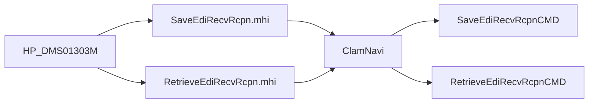

# 대표화면 EDI 수신 패턴

약어/용어는 [030.index 용어집](../../030.index/0303.약어-용어집/약어-용어집.md)을 먼저 보면 빠르다.

이 문서는 `HP_DMS01303M.xml`을 기준으로 `화면 XML -> .mhi -> navigation -> command`가 비교적 짧고 명확하게 이어지는 EDI 수신 화면 패턴을 정리한 문서다.

## 1. 왜 이 화면을 대표 사례로 보나

- 조회와 저장이 둘 다 있다.
- `.mhi`가 명확하다.
- `clamNavi.xml`로 바로 연결된다.
- `HP_DMS02204M`보다 화면 목적이 더 단순해서 front-channel 템플릿 학습에 적합하다.

## 2. 화면에서 직접 확인된 값

### 파일
- `NPH_HIS/webapp/ui/HP/DMS/HP_DMS01303M.xml`

### 직접 확인된 대표 호출
- `SaveEdiRecvRcpn`
  - `sSvcURL = "/hp/dms/clamNavi/SaveEdiRecvRcpn.mhi"`
- `RetrieveEdiRecvRcpn`
  - `sSvcURL = "/hp/dms/clamNavi/RetrieveEdiRecvRcpn.mhi"`
- callback
  - `fTrCallBack(sSvcID, nErrorCode, sErrorMsg)`
  - `case "SaveEdiRecvRcpn"`
  - `case "RetrieveEdiRecvRcpn"`

## 3. navigation에서 직접 확인된 값

### 파일
- `NPH_HIS/devonhome/navigation/mhi/hp/dms/clamNavi.xml`

### 직접 확인된 action
- `SaveEdiRecvRcpn`
  - `nph.his.hp.dms.clam.cmd.SaveEdiRecvRcpnCMD`
- `RetrieveEdiRecvRcpn`
  - `nph.his.hp.dms.clam.cmd.RetrieveEdiRecvRcpnCMD`

## 4. 가장 짧은 체인

## 5. 유지보수 관점 해석

이 화면은 다음 두 가지를 같이 보여준다.
- MiPlatform 화면이 `.mhi`를 어떻게 호출하는가
- DMS/EDI 업무 화면이 navigation에 어떻게 붙는가

즉 `031.front-channel`을 처음 읽는 사람이
- `Login3.xml`로는 너무 단순하고
- `MD_ORD01001P.xml`로는 너무 복잡할 때
이 화면을 중간 단계 템플릿으로 쓰기 좋다.

## 6. 다음에 내려갈 문서

- [A.Command-Navigation-Dispatch.md](../0312.navigation-command/A.Command-Navigation-Dispatch.md)
- [D.EdiMngmPC-분기구조.md](../../037.runtime-trace/D.EdiMngmPC-%EB%B6%84%EA%B8%B0%EA%B5%AC%EC%A1%B0.md)
- [035.Biz-medical-Domain EDI/보험심사 문서군](../../035.Biz-medical-Domain)

