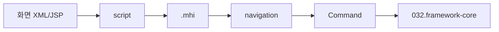

# Front Channel 개요

약어/용어는 [030.index 용어집](../../030.index/0303.약어-용어집/약어-용어집.md)을 먼저 보면 빠르다.

이 문서는 NPH에서 화면이 서버로 내려가는 입구를 가장 빠르게 잡기 위한 기준본이다. 목표는 `화면 XML / script / .mhi / navigation / command`까지를 가장 짧게 이어 보는 것이다.

## 1. 가장 짧은 체인

## 2. 화면 종류를 먼저 나눈다

### 2.1 MiPlatform 화면
- `webapp/ui/**/*.xml`
- 화면 XML 안에 이벤트와 script가 같이 있다.
- `Transaction()` 또는 `cf_Transaction()`을 통해 `.mhi`를 호출한다.

### 2.2 JSP 화면
- `webapp/**/*.jsp`
- 브라우저 기반 화면, eView, mobile JSP, 일부 ActiveX/OCX 접점이 여기 있다.
- 예: `index330.jsp`, `eView/EdViewer.jsp`, `jsp/md_mobile/emr/EdViewer.jsp`

## 2A. 공식 MiPlatform 매뉴얼 기준으로 보면

Tobesoft MiPlatform 3.3 매뉴얼은 Form을 `Design, Data, Event`가 포함된 인터페이스로 설명한다. NPH front-channel을 빨리 이해하려면 이 정의를 그대로 적용하는 편이 좋다.

- `Design`
  - 화면 XML의 Form/Component 구조
- `Data`
  - Dataset, 입력/출력 데이터, binding 대상
- `Event`
  - `OnLoadCompleted`, `OnClick`, `OnChange`, script 함수

NPH에서는 이 세 가지가 종종 한 XML 안에 같이 들어 있다. 그래서 화면 분석을 시작할 때는 `디자인 파일`, `이벤트 파일`, `데이터 정의 파일`을 따로 찾기보다 XML 하나 안에서 세 층을 같이 읽는 접근이 빠르다.

## 3. 유지보수 착수 순서

1. 화면 파일을 찾는다.
2. `OnLoadCompleted`, `OnClick`, `OnChange` 또는 JSP JavaScript를 찾는다.
3. `.mhi` URL을 찾는다.
4. navigation XML에서 action과 command를 찾는다.
5. 이후는 `032.framework-core`로 내려간다.

## 4. 대표 시작점

### 4.1 브라우저 시작점
- `index330.jsp`
  - 로그인 상태를 확인한 뒤 런처 URL을 만든다.

### 4.2 MiPlatform 시작점
- `NPH_start.xml`
  - `SessionURL="com::Login3.xml"`
  - protocol, AppGroup, 일부 공통 transaction 호출이 이 파일에 있다.

### 4.3 로그인 화면
- `Login3.xml`
  - 가장 단순한 `화면 XML -> Transaction -> .mhi` 패턴을 보여준다.

## 5. 이 폴더에서 이어 볼 문서

- [Miplatform.md](../0311.miplatform/Miplatform.md)
- [MiPlatform-Transaction-패턴.md](../0311.miplatform/MiPlatform-Transaction-%ED%8C%A8%ED%84%B4.md)
- [Dataset-입출력.md](../0311.miplatform/Dataset-%EC%9E%85%EC%B6%9C%EB%A0%A5.md)
- [화면XML-script-mhi-연결.md](./%ED%99%94%EB%A9%B4XML-script-mhi-%EC%97%B0%EA%B2%B0.md)
- [대표화면-EDI-수신-패턴.md](./%EB%8C%80%ED%91%9C%ED%99%94%EB%A9%B4-EDI-%EC%88%98%EC%8B%A0-%ED%8C%A8%ED%84%B4.md)
- [JSP-브라우저-ActiveX-접점.md](./JSP-%EB%B8%8C%EB%9D%BC%EC%9A%B0%EC%A0%80-ActiveX-%EC%A0%91%EC%A0%90.md)

- [로그인-체인-기준패턴.md](../0312.navigation-command/%EB%A1%9C%EA%B7%B8%EC%9D%B8-%EC%B2%B4%EC%9D%B8-%EA%B8%B0%EC%A4%80%ED%8C%A8%ED%84%B4.md)

