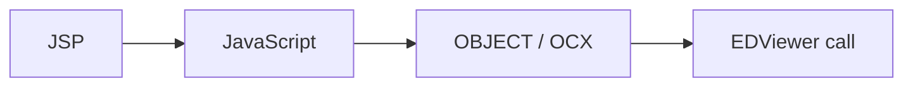

# JSP 브라우저 ActiveX 접점

약어/용어는 [030.index 용어집](../../030.index/0303.약어-용어집/약어-용어집.md)을 먼저 보면 빠르다.

이 문서는 MiPlatform XML 화면이 아닌 JSP/브라우저 계열 진입점과 ActiveX/OCX 접점을 정리한 문서다. `EDViewer` 자체 솔루션 분석 기준본은 `035.Biz-medical-Domain`에 두고, 여기서는 front 접점만 다룬다.

## 1. 어떤 때 이 문서를 보는가

- 화면이 `ui/*.xml`이 아니라 `jsp/*.jsp`, `eView/*.jsp`에서 시작할 때
- 브라우저 JavaScript와 OCX/OBJECT 연결을 확인할 때
- `EDViewer`, `ebookMain`, 브라우저 기반 외부 뷰어 계열을 추적할 때

## 2. 대표 접점

### 2.1 브라우저 진입
- `NPH_HIS/webapp/index330.jsp`
  - 로그인 상태를 확인하고 런처 URL을 만든다.
  - 브라우저 쪽 시작점이다.

### 2.2 EDViewer JSP
- `NPH_HIS/webapp/jsp/md_mobile/emr/EdViewer.jsp`
  - `ED_OBJ.FV_CommonCall(str)` 확인
  - `<OBJECT ID="edvA" classid="clsid:879DF37E-E2E1-4C52-979D-60E0806C6E97" ...>` 확인
- `NPH_HIS/webapp/eView/EdViewer.jsp`
  - 동일한 `FV_CommonCall` 패턴과 `OBJECT classid` 확인

## 3. 현재 안전한 해석

- 현재 확인된 것은 `OBJECT classid + FV_CommonCall` 패턴이다.
- 과거 일부 문서에 있던 `ActiveXObject("EDViewer.Control")`는 대표 예시 수준으로만 봐야 한다.
- 실제 NPH 확인값은 JSP 안의 `OBJECT` 태그와 OCX 호출 쪽이다.

## 4. 범위 경계

이 문서는 `접점`만 다룬다.
- 솔루션 자체 분석: `035.Biz-medical-Domain/0352.emr-viewer`
- 실제 화면 trace: `037.runtime-trace`

## 5. 연결 문서

- [Front-Channel-개요.md](./Front-Channel-%EA%B0%9C%EC%9A%94.md)
- [035 EMR viewer 문서군](../../035.Biz-medical-Domain/0352.emr-viewer)
