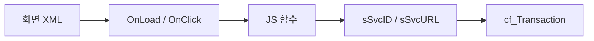

# 화면XML script mhi 연결

약어/용어는 [030.index 용어집](../../030.index/0303.약어-용어집/약어-용어집.md)을 먼저 보면 빠르다.

이 문서는 MiPlatform 화면 XML에서 script와 `.mhi` URL이 어떻게 연결되는지 실제 파일 기준으로 정리한 기준본이다.

## 1. 공통 패턴

## 1A. 공식 매뉴얼 기준으로 화면 XML을 읽는 법

MiPlatform 3.3 매뉴얼의 `화면(Form) 개발` 문서는 Form을 `Design + Data + Event`의 결합체로 본다. 이 관점은 NPH 화면 XML 분석에 직접 도움이 된다.

NPH 화면 XML을 읽을 때는 다음 순서가 가장 빠르다.
1. `Design`
   - Form ID, Title, 주요 Div/Grid/Tab 구조를 본다.
2. `Data`
   - Dataset 이름, 입력/출력 Dataset, 바인딩 대상을 본다.
3. `Event`
   - `OnLoadCompleted`, `OnClick`, `OnChange`와 연결된 함수명을 본다.
4. `Transaction`
   - 함수 안에서 `sSvcID`, `sSvcURL`, `cf_Transaction()` 호출을 본다.

즉 NPH 화면 XML은 단순 마크업이 아니라, 화면 구성과 데이터 흐름과 서버 호출이 한 파일 안에 같이 들어있는 경우가 많다. 이 점을 먼저 고정하면 대형 화면도 조금 덜 헷갈린다.

## 2. 로그인 화면 예시

### 직접 확인된 파일
- `NPH_HIS/webapp/ui/com/Login3.xml`

### 직접 확인된 값
- `OnLoadCompleted="G_Login_OnLoadCompleted"`
- `Transaction("CheckUserInfo", "NPHSE::/az/bizcom/authNavi/CheckLoginUser-new1.mhi", ...)`
- `var sSvcURL = "/az/bizcom/authNavi/RetirevePrivCodeList.mhi"`

### 해석
- 로그인 화면은 `.mhi`와 callback 흐름이 짧아서 첫 진입 분석에 가장 적합하다.

## 3. 처방 화면 예시

### 직접 확인된 파일
- `NPH_HIS/webapp/ui/MD/ORD/MD_ORD01001P.xml`

### 직접 확인된 연결
- `fRetrievePtOrder()`
  - `sSvcURL = "/md/ord/ptmdcrNavi/RetrievePtOrder.mhi"`
- `fRetrievePtOrderPre()`
  - `sSvcURL = "/md/ord/ptmdcrNavi/RetrievePtOrderPre.mhi"`
- `SavePtOrderPre`
  - `sSvcURL = "/md/ord/ptmdcrNavi/SavePtOrderPre.mhi"`
- `SavePtOrder`
  - `sSvcURL = "/md/ord/ptmdcrNavi/SavePtOrder.mhi"`
- `UpdateDurt`
  - `sSvcURL = "/md/ord/ptmdcrNavi/UpdateDurt.mhi"`

### 해석
- `MD_ORD01001P`는 한 화면 안에 조회/저장/사전조회/보조조회가 매우 많다.
- 따라서 이 화면은 `.mhi` 추적만 해도 업무 흐름의 절반이 보인다.

## 4. 심사 화면 예시

### 직접 확인된 파일
- `NPH_HIS/webapp/ui/HP/DMS/HP_DMS02204M.xml`

### 직접 확인된 연결
- `RetrieveDrgRevwPtList`
  - `sSvcURL = "/hp/dms/drgNavi/RetrieveDrgRevwPtList.mhi"`
- `UpdateDrgRcpnNo`
  - `sSvcURL = "/hp/dms/drgNavi/UpdateDrgRcpnNo.mhi"`

## 4A. 공통코드 조회 팝업 예시

### 직접 확인된 파일
- `NPH_HIS/webapp/ui/AZ/UTL/AZ_UTL01002P.xml`

### 직접 확인된 연결
- `div_search_btn_Search_OnClick()`
  - `fRetrieveComncd()`
- `fRetrieveComncd()`
  - `sSvcURL = "/az/bizcom/comNavi/RetrieveComnCd.mhi"`
- `fTrCallBack()`
  - `case "RetrieveComnCd"`

### 해석
- 이 화면은 `Design + Data + Event + Transaction`이 가장 짧게 묶인 일반 패턴이다.
- 로그인 화면보다 일반적인 조회 팝업이고, 대형 처방 화면보다 훨씬 단순하다.

## 5. 실무 팁

- `sSvcID`는 callback 분기 키다.
- `sSvcURL`은 navigation/action 추적 키다.
- 이벤트 함수 이름만 보고 추적하지 말고, `sSvcURL`이 바뀌는 지점을 기준으로 보는 편이 빠르다.

## 6. 연결 문서

- [로그인-체인-기준패턴.md](../0312.navigation-command/%EB%A1%9C%EA%B7%B8%EC%9D%B8-%EC%B2%B4%EC%9D%B8-%EA%B8%B0%EC%A4%80%ED%8C%A8%ED%84%B4.md)
- [Command-Navigation-Dispatch.md](../0312.navigation-command/Command-Navigation-Dispatch.md)
- [MD_ORD01001P trace](../../037.runtime-trace/MD_ORD01001P-%EC%8B%A4%ED%96%89%EC%B2%B4%EC%9D%B8.md)
- [HP_DMS02204M trace](../../037.runtime-trace/HP_DMS02204M-%EC%8B%A4%ED%96%89%EC%B2%B4%EC%9D%B8.md)
- [대표화면-EDI-수신-패턴.md](./%EB%8C%80%ED%91%9C%ED%99%94%EB%A9%B4-EDI-%EC%88%98%EC%8B%A0-%ED%8C%A8%ED%84%B4.md)

