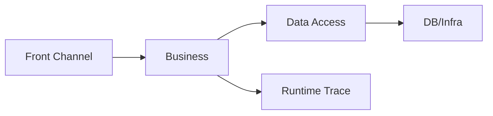
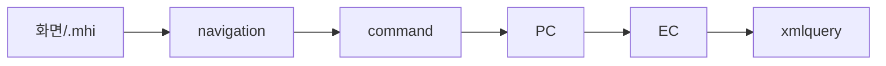

# Framework 개요

약어/용어는 [약어-용어집.md](../../030.index/0303.약어-용어집/약어-용어집.md) 를 먼저 보면 빠르다.

이 문서는 NPH의 DevOn/Framework 구조를 처음 읽는 사람이 가장 먼저 보는 기준본이다.

이 문서가 답하려는 질문은 네 가지다.

- DevOn이 무엇을 감싸는가
- 요청은 어디서 시작해 어디까지 내려가는가
- 왜 추적 비용이 큰가
- 어떤 문서를 다음에 읽어야 하는가

또한 이 폴더의 경계도 같이 고정한다.

- `031.front-channel`: 화면, MiPlatform, `.mhi` 진입
- `032.framework-core`: DevOn 코어 실행 구조
- `033.platform-services`: DevOn 바깥 솔루션/패키지

## 2. 한눈 요약

NPH의 Framework 구조는 크게 4층으로 보면 된다.

1. Front Channel
- Servlet
- Navigation
- Command
- Interceptor
- ServiceProxy

2. Business Layer
- PC
- UC
- EC

3. Data Access Layer
- LCommonDao
- LQueryMaker
- XML Query
- JDBC / DataSource / Transaction

4. Runtime Use Case
- 실제 화면별 실행체인
- 대표 화면: `MD_ORD01001P`, `HP_DMS02204M`, `HP_DMS01303M`

## 3. DevOn 코어 체인에서 먼저 고정할 것

1. `Servlet -> Navigation -> Command`
2. `PC / UC / EC` 역할 분담
3. `LCommonDao -> LQueryMaker -> XML Query -> TX/Pool`

이 세 축이 고정되면 나머지 화면 trace는 대부분 같은 방식으로 추적할 수 있다.

## 4. 실제로는 어떻게 읽어야 하나

- 개요만 보면 구조는 단순해 보인다.
- 실제 유지보수에서는 `.mhi -> navigation -> command -> PC/UC/EC -> xmlquery`까지 같이 봐야 한다.
- 따라서 이 폴더는 개요 문서와 실행체인 문서를 함께 읽도록 설계한다.

## 5. 핵심 해석

- 이 구조는 무질서하게 꼬인 코드라기보다, 오래된 엔터프라이즈/SI형 표준화를 강하게 적용한 구조에 가깝다.
- 다만 현재 유지보수 관점에서는 계층 수가 많고 숨은 규칙이 많아 추적 비용이 크다.
- 그래서 신규 기준본은 추상화 설명보다 실제 실행 경로를 먼저 보여주는 방향이 맞다.

## 6. 추천 읽기 순서

1. [../../031.front-channel/0313.ui-entry/A.Front-Channel-개요.md](../../031.front-channel/0313.ui-entry/A.Front-Channel-개요.md)
2. [../0322.data-access/A.Data-Access-개요.md](../0322.data-access/A.Data-Access-개요.md)
3. [../../037.runtime-trace/B.MD_ORD01001P-실행체인.md](../../037.runtime-trace/B.MD_ORD01001P-실행체인.md)
4. [../../037.runtime-trace/C.HP_DMS02204M-실행체인.md](../../037.runtime-trace/C.HP_DMS02204M-실행체인.md)
5. [../../037.runtime-trace/D.EdiMngmPC-분기구조.md](../../037.runtime-trace/D.EdiMngmPC-분기구조.md)
6. [../../95.추가 검토 사항 및 계획/953.refactoring-ideation/rep.대형화면3종-구조비교.md](../../95.추가%20검토%20사항%20및%20계획/953.refactoring-ideation/rep.대형화면3종-구조비교.md)

## 7. 다음 문서

- 구조를 먼저 알고 싶으면
  - [C.Architecture-overview.md](./C.Architecture-overview.md)
- 컴포넌트 트리로 보고 싶으면
  - [D.Tree-구성요소.md](./D.Tree-구성요소.md)
- Struts와 차이를 먼저 보고 싶으면
  - [B.DevOn-vs-Struts1.md](./B.DevOn-vs-Struts1.md)

## 8. 참고 원본

- `../../old Data/031.Architecture - Framework/old/0311.overview/*`
- `../../old Data/031.Architecture - Framework/old/0312.front-channel/*`
- `../../old Data/031.Architecture - Framework/old/0313.data-access/*`

