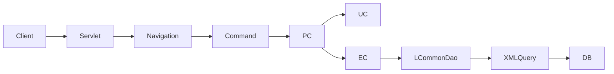
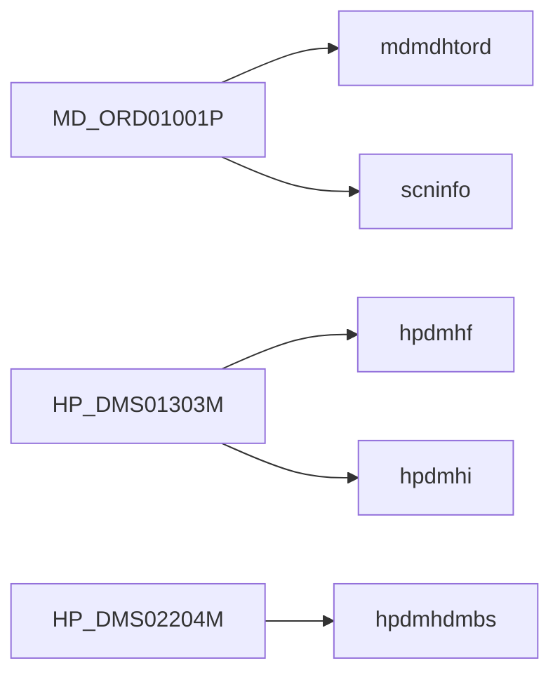

# Architecture Overview

약어/용어는 [약어-용어집.md](../../030.index/0303.약어-용어집/약어-용어집.md) 를 먼저 보면 빠르다.

이 문서는 NPH DevOn 구조를 실제 요청 흐름 기준으로 한 장에 요약한 기준본이다.

## 2. 기본 구조

MiPlatform 경로는 여기에 `MiplatformRequest`, `MiplatformConverter`, `MiplatformResponse`가 추가된다.

## 3. 계층별 역할

- Front Channel
  - 요청 수신, navigation 해석, command dispatch
- Business Layer
  - PC: 오케스트레이션
  - UC: 규칙/시나리오 처리
  - EC: query path 단위 DB 접근
- Data Access Layer
  - `LCommonDao`
  - `LQueryMaker`
  - `xmlquery/*.xml`
- Infra Layer
  - DataSource / JNDI / Pool
  - JDBC / TransactionManager

## 4. DevOn 코어를 볼 때 고정할 세 지점

- `navigation -> command` 매핑이 어디서 닫히는가
- `PC / UC / EC` 중 누가 실제 업무 분기를 품는가
- `query path -> xmlquery`가 어떤 family로 흩어지는가

## 5. NPH에서 중요한 포인트

- 화면의 `.mhi` URL만 봐서는 충분하지 않다.
- 같은 화면 안에서도 여러 query family가 동시에 섞인다.
- 대표 예:
  - `MD_ORD01001P`: `mdmdhtord.xml` + `scninfo.xml`
  - `HP_DMS01303M`: `hpdmhf* / hpdmhi* / hpdmht*`
  - `HP_DMS02204M`: `hpdmhdmbs.xml`

## 6. 왜 복잡하게 느껴지는가

- 화면, command, PC, UC, EC, xmlquery가 분리돼 있다.
- 표준화에는 유리하지만, 신규 유지보수자는 파일을 많이 따라가야 한다.
- 따라서 신규 기준본은 항상 실행체인 문서와 함께 읽는 것이 좋다.

## 7. 바로 이어서 볼 문서

- [../../031.front-channel/0312.navigation-command/A.Command-Navigation-Dispatch.md](../../031.front-channel/0312.navigation-command/A.Command-Navigation-Dispatch.md)
- [../0322.data-access/C.XML-Query-실행구조.md](../0322.data-access/C.XML-Query-실행구조.md)
- [../../037.runtime-trace/B.MD_ORD01001P-실행체인.md](../../037.runtime-trace/B.MD_ORD01001P-실행체인.md)
- 참고 원본: `../../old Data/031.Architecture - Framework/old/0311.overview/02.DevOn-Architecture-overview.md`

