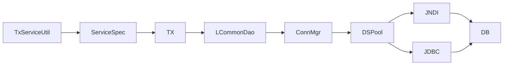

# Connection Pool TX

약어/용어는 [약어-용어집.md](../../030.index/0303.약어-용어집/약어-용어집.md) 를 먼저 보면 빠르다.

이 문서는 DataSource, Connection, Pool, Transaction 계층을 현재 근거 범위로 정리한 기준본이다.

## 2. 구조 요약

- DataSource
  - JNDI / JDBC / pool 추상화
- Connection
  - `LConnectionManager`, `LDataSourcePool` 계층을 통해 획득
- Transaction
  - `LJDBCTransactionManager`, `LJTATransactionManager`
- Service 진입
  - `TxServiceUtil.getTxService/getNTxService/getJTxService`

## 3. 현재 확인된 해석

- NPH는 JDBC를 직접 쓰지만 raw JDBC 한 줄로 끝나는 구조는 아니다.
- 프레임워크 wrapper가 두껍고, connection/pool/tx도 그 추상화 위에 있다.
- 운영 설정 해석으로는 JNDI 기반 자원 참조가 가장 강하다.

## 4. 현재 확인 범위의 한계

- LJndiDataSource, LJdbcDataSource, LDataSourcePool 내부 메서드 구현은 일부만 닫혀 있다.
- 따라서 pool 소유권과 반환 방식은 추정이 아니라 현재 근거 기준 해석으로만 서술한다.

## 5. 실무적으로 어떻게 보나

1. command에서 `TxServiceUtil` 사용 여부 확인
2. service spec이 `default`, `defaultTx`, `jtaTx` 중 무엇인지 확인
3. EC에서 `LCommonDao` 또는 connection 직접 제어가 있는지 확인
4. 설정에서 datasource spec과 transaction manager 연결을 확인

## 6. 중요한 판단

- `LDataSourcePool`은 단일 구현이 아니라 JNDI / JDBC / DBCP 경로를 수용하는 추상화 계층으로 보는 것이 안전하다.
- 현재 NPH 운영 문맥에서는 `프레임워크가 모든 pool을 직접 소유`한다기보다 `프레임워크 추상화 + WAS JNDI 자원 사용` 해석이 더 적절하다.
- 배치/저수준 코드에서는 connection 제어가 더 직접적으로 보일 수 있다.

## 7. 연결 문서

- [01.Data-Access-개요.md](./01.Data-Access-%EA%B0%9C%EC%9A%94.md)
- [../../031.front-channel/0312.navigation-command/ServiceProxy-Interceptor.md](../../031.front-channel/0312.navigation-command/ServiceProxy-Interceptor.md)
- 참고 보존본: `../../old Data/031.Architecture - Framework/old/0313.data-access/02.Connection-Pool-TX-내부동작.md`

