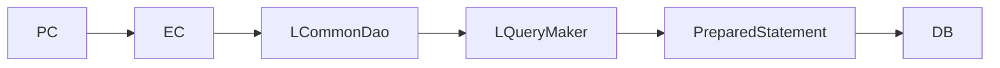
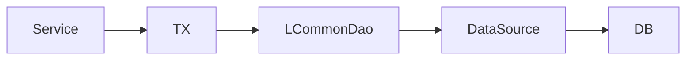

# Data Access 개요

약어/용어는 [약어-용어집.md](../../030.index/0303.약어-용어집/약어-용어집.md) 를 먼저 보면 빠르다.

이 문서는 NPH의 DB 접근 구조를 빠르게 이해하기 위한 기준본이다.

이 폴더는 `LCommonDao`, `LQueryMaker`, `XML Query`, `TX/Pool`까지를 묶어서 본다. 즉 `032` 안에서도 가장 실행 경로에 가까운 서버 코어 문서군이다.

## 2. 기본 체인



## 3. 핵심 해석

- NPH 업무 소스는 `LCommonDao`를 직접 광범위하게 사용한다.
- `LQueryMaker`는 업무 코드에서 직접 잘 안 보이지만, `LCommonDao` 내부에서 실제 호출되는 핵심 helper다.
- SQL은 주로 `devonhome/xmlquery/*.xml`에 있고, query path로 접근한다.

예:

```text
/md/ord/mdmdhtord/RetrievePtOrder
-> devonhome/xmlquery/md/ord/mdmdhtord.xml
-> statement name="RetrievePtOrder"
```

## 4. 직접 확인된 고정 사실

- NPH 업무 소스는 `LCommonDao`를 광범위하게 사용한다.
- `LQueryMaker`는 `devon-framework.jar` 및 API 문서에서 실존이 확인된다.
- query path 규칙은 여러 실제 사례에서 검증되었다.
- JDBC / DataSource / Transaction은 DevOn wrapper 위에 놓여 있다.

## 5. JDBC / TX / Pool 관점



- 이 구조는 ORM이 아니다.
- JDBC 기반이고, SQL은 XML Query에 있다.
- 다만 완전한 raw JDBC는 아니고, connection/pool/transaction은 프레임워크 wrapper 위에 있다.
- `LJDBCTransactionManager`, `LJTATransactionManager`, DataSource/JNDI 계층이 같이 엮여 있다.

## 6. 왜 `LQueryMaker`가 안 보이는가

- NPH 업무 코드는 `LCommonDao`만 직접 사용한다.
- `LQueryMaker`는 `LCommonDao` 내부에서 SQL 해석/파라미터 준비를 담당하도록 감춰져 있다.
- 즉 전면 비중은 낮지만, 런타임 내부 중요도는 높다.

## 7. 실무 추적 순서

1. EC에서 `new LCommonDao("/path", data)` 찾기
2. query path에서 xmlquery 파일 위치 계산
3. 대응 statement 찾기
4. 같은 EC가 다른 query family도 같이 치는지 확인
5. service/tx 경로까지 같이 봐야 connection과 commit 경계가 보인다

## 8. 연결 문서

- [B.LCommonDao-LQueryMaker.md](./B.LCommonDao-LQueryMaker.md)
- [C.XML-Query-실행구조.md](./C.XML-Query-실행구조.md)
- [D.Connection-Pool-TX.md](./D.Connection-Pool-TX.md)
- 참고 보존본: `../../old Data/031.Architecture - Framework/old/0313.data-access/*`


