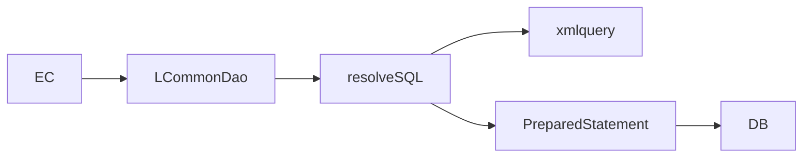

# XML Query 실행구조

약어/용어는 [약어-용어집.md](../../030.index/0303.약어-용어집/약어-용어집.md) 를 먼저 보면 빠르다.

이 문서는 query path가 실제 SQL 실행으로 이어지는 구조를 정리한 기준본이다.

## 2. 기본 체인



## 3. 중요한 점

- SQL 문자열은 코드에 직접 박혀 있지 않은 경우가 많다.
- query path와 xmlquery 파일 매핑을 같이 봐야 실제 동작이 보인다.
- 화면 하나가 여러 xmlquery 파일군을 같이 타면 유지보수 난이도가 빠르게 올라간다.

## 4. query path 매핑 규칙


```text
/path/to/file/queryId
-> devonhome/xmlquery/path/to/file.xml
-> statement name="queryId"
```

이 규칙은 NPH 코드에서 관찰된 여러 사례와 일치한다.

## 5. 일반 경로에서 실제로 보는 체인

`resolveSQL(...) -> getQuery() -> setPstmtParameter(...) -> PreparedStatement.execute*` 는 현재 근거 범위에서 가장 일반적인 경로다.

## 6. 대표 사례

- `MD_ORD01001P`
  - `mdmdhtord.xml`
  - `scninfo.xml`
- `HP_DMS01303M`
  - `hpdmhf*`, `hpdmhi*`, `hpdmht*`
- `HP_DMS02204M`
  - `hpdmhdmbs.xml`

## 7. 일반 경로와 특수 경로

- 일반 조회/수정 경로
  - `resolveSQL(...)`
  - `getQuery()`
  - `setPstmtParameter(...)`
  - `PreparedStatement.executeQuery/executeUpdate`
- 페이징/일부 특수 경로
  - `resolveRawSQL(...)`

즉 모든 경로가 완전히 동일하지는 않다. 그래서 query path만 보고도 일반 조회인지, 동적/raw 계열인지 구분할 필요가 있다.

## 8. 화면별 해석

- `MD_ORD01001P`
  - 문제의 핵심은 query 하나가 아니라 여러 조회/저장 시나리오가 한 화면에 같이 얹힌 점이다.
- `HP_DMS01303M`
  - 문제의 핵심은 `samFileId + version`에 따라 query family가 갈라지는 점이다.
- `HP_DMS02204M`
  - 조회처럼 보이지만 심사 후처리 파일군과 결합되어 있다.

## 9. 연결 문서

- [B.LCommonDao-LQueryMaker.md](./B.LCommonDao-LQueryMaker.md)
- [D.Connection-Pool-TX.md](./D.Connection-Pool-TX.md)
- [../../037.runtime-trace](../../037.runtime-trace)
- 참고 보존본: `../../old Data/031.Architecture - Framework/old/0313.data-access/03.XML-Query-내부동작.md`


