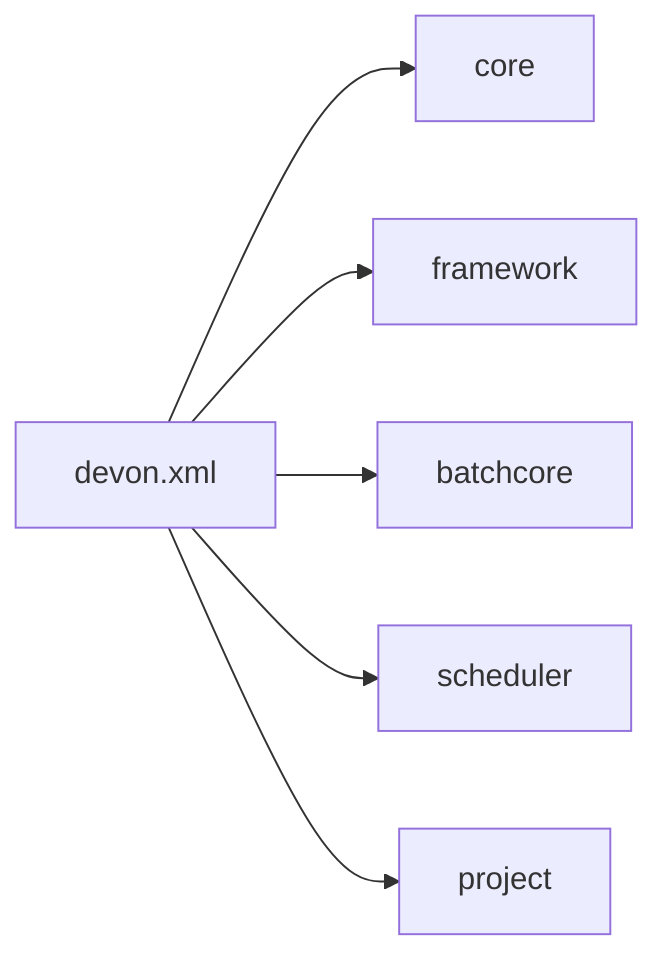

# DevOn Batch 컨테이너 개요

## 1. 목적

이 문서는 `devonhome_batch/conf/devon.xml`, `devon-batch-core.xml`, `devon-batch-scheduler.xml`을 기준으로 NPH의 DevOn Batch 컨테이너가 어떤 파일로 부팅되고 어떤 기능을 제공하는지 정리한다.

약어/용어는 [../../030.index/0303.약어-용어집/약어-용어집.md](../../030.index/0303.%EC%95%BD%EC%96%B4-%EC%9A%A9%EC%96%B4%EC%A7%91/%EC%95%BD%EC%96%B4-%EC%9A%A9%EC%96%B4%EC%A7%91.md)를 먼저 보면 빠르다.

## 2. 핵심 결론

- NPH의 배치 실행 틀은 `devonhome_batch/conf/devon.xml`이 묶는다.
- 여기서 `devon-core.xml`, `devon-framework.xml`, `devon-batch-core.xml`, `devon-batch-scheduler.xml`, 프로젝트 설정(`his.xml`, `nph_bat.xml`)을 함께 읽는다.
- 즉 배치 컨테이너는 DevOn 코어와 분리된 별도 제품이 아니라, DevOn 설정 집합 위에 올라가는 실행 컨테이너다.
- InnoRules는 이 컨테이너 안에서 붙을 수 있는 외부 Rule 엔진이지, 컨테이너 자체는 아니다.

## 3. 부팅 기준 파일

### 3.1 최상위 진입점

- 파일: `NPH_HIS/devonhome_batch/conf/devon.xml`
- 역할:
  - core 설정 포함
  - framework 설정 포함
  - batch-core 설정 포함
  - batch-scheduler 설정 포함
  - 프로젝트 설정 포함

### 3.2 실제 포함되는 설정

| 구분 | 포함 파일 | 의미 |
|---|---|---|
| core | `#home/conf/devon-core.xml` | DevOn 코어 |
| framework | `#home/conf/product/devon-framework.xml` | 일반 웹/서비스 프레임워크 |
| batch-core | `#home/conf/product/devon-batch-core.xml` | 배치 실행 코어 |
| batch-scheduler | `#home/conf/product/devon-batch-scheduler.xml` | 스케줄러/파라미터 처리 |
| project | `#home/../devonhome/conf/project/his.xml` | HIS 프로젝트 설정 |
| project | `#home/../devonhome/conf/project/nph_bat.xml` | 배치 프로젝트 설정 |

## 4. 컨테이너가 직접 맡는 것

### 4.1 Job Context 보관

`devon-batch-core.xml`에는 job-context의 data-storage가 `MemoryTypeStorage`로 설정되어 있다.

해석:
- 배치 실행 중 필요한 문맥 데이터는 메모리 기반 저장소에 올린다.
- Rule 엔진 저장소와는 별개다.

### 4.2 Job Delivery Buffer

`job-delivery-buffer` 설정에서 확인되는 것:
- `enabled=false`
- queue/session-pool/max-active=30
- JMS provider 예시는 주석 처리

해석:
- 현재 백업셋 기준 기본 운용은 메모리/내장형 배치 전달에 가깝다.
- JMS 기반 분산 전달은 설정 예시는 있지만 활성화 근거는 없다.

### 4.3 Status Report

`status-report` 설정에서 확인되는 것:
- `database-spec=default`
- `timestamp-format=yyyy-MM-dd HH:mm:ss.SSSSSS`
- `interval=1000`

해석:
- 배치 상태 기록은 DevOn spec 이름 `default`를 사용한다.
- 즉 별도 Rule 엔진 DB가 아니라 DevOn 배치 상태 기록용 spec을 우선 본다.

### 4.4 File Log

`file-log` 설정에서 확인되는 것:
- 로그 디렉토리
- 인코딩 `euc-kr`
- system-level / job-level / sub-log-level 구성

해석:
- 배치 컨테이너는 실행 로그를 파일 단위로 관리하는 자체 운영 모델을 갖는다.
- 이것도 InnoRules 로그와는 별도 층이다.

## 5. 컨테이너가 직접 설명하지 않는 것

이 문서에서 다루지 않는 것:
- InnoRules 저장소 구조
- Rule 코드 체계(`#S00000327`, `DMS00001`, `SEPSIS` 등)
- IRL 문법
- InnoRules Java API 세부

위 내용은 [../../033.platform-services/0334.InnoRules](../../033.platform-services/0334.InnoRules)에서 다룬다.

## 6. 해석

이 폴더의 핵심은 `배치를 돌리는 틀`이다.

즉:
- Job은 어디서 시작되는가
- 상태는 어디에 기록되는가
- 로그는 어디에 쌓이는가
- 스케줄러는 어떤 설정을 읽는가
- 외부 엔진은 어디서 붙는가

를 설명하는 것이 목적이다.

반대로 InnoRules는 이 틀에 붙는 외부 솔루션이다. 그래서 InnoRules 상세 문서를 이 폴더에 계속 두면 `배치 컨테이너 설명`과 `룰 엔진 설명`이 섞여 읽히게 된다.

## 7. 다음에 읽을 문서

- [B.DevOn-Batch-스케줄러-파이프라인.md](./B.DevOn-Batch-%EC%8A%A4%EC%BC%80%EC%A4%84%EB%9F%AC-%ED%8C%8C%EC%9D%B4%ED%94%84%EB%9D%BC%EC%9D%B8.md)
- [C.Rule-Engine-연동지점.md](./C.Rule-Engine-%EC%97%B0%EB%8F%99%EC%A7%80%EC%A0%90.md)
- [../../033.platform-services/0334.InnoRules/README.md](../../033.platform-services/0334.InnoRules/README.md)

