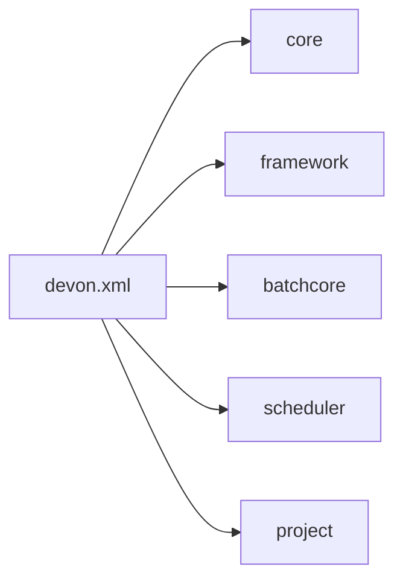

# DevOn Batch 컨테이너 개요

## 1. 목적

이 문서는 `devonhome_batch/conf/devon.xml`, `devon-batch-core.xml`, `devon-batch-scheduler.xml`, `his.xml`, `BatchExecutor.cmd`를 기준으로 NPH의 DevOn Batch 컨테이너가 어떤 파일로 부팅되고 실제 실행은 어디서 시작되는지 정리한다.

약어/용어는 [../../030.index/0303.약어-용어집/약어-용어집.md](../../030.index/0303.%EC%95%BD%EC%96%B4-%EC%9A%A9%EC%96%B4%EC%A7%91/%EC%95%BD%EC%96%B4-%EC%9A%A9%EC%96%B4%EC%A7%91.md)를 먼저 보면 빠르다.

## 2. 핵심 결론

- NPH의 배치 실행 틀은 `devonhome_batch/conf/devon.xml`이 묶는다.
- 여기서 `devon-core.xml`, `devon-framework.xml`, `devon-batch-core.xml`, `devon-batch-scheduler.xml`, `his.xml`, `nph_bat.xml`을 함께 읽는다.
- 실제 운영 실행기는 `his.xml`의 `online-batch-executor/command`가 가리키는 `BatchExecutor.cmd`다.
- 따라서 컨테이너를 이해할 때는 단순 설정 파일 집합이 아니라 `설정 + 외부 실행 스크립트 + 로그 디렉토리`를 같이 봐야 한다.

## 3. 부팅 기준 파일

### 3.1 최상위 진입점

- 파일: `NPH_HIS/devonhome_batch/conf/devon.xml`
- 역할:
  - core 설정 포함
  - framework 설정 포함
  - batch-core 설정 포함
  - batch-scheduler 설정 포함
  - HIS/NPH 배치 프로젝트 설정 포함

### 3.2 실제 포함되는 설정

| 구분 | 포함 파일 | 의미 |
|---|---|---|
| core | `#home/conf/devon-core.xml` | DevOn 코어 |
| framework | `#home/conf/product/devon-framework.xml` | 일반 웹/서비스 프레임워크 |
| batch-core | `#home/conf/product/devon-batch-core.xml` | 배치 실행 코어 |
| batch-scheduler | `#home/conf/product/devon-batch-scheduler.xml` | 스케줄러/파라미터 처리 |
| project | `#home/../devonhome/conf/project/his.xml` | HIS 프로젝트 설정 |
| project | `#home/../devonhome/conf/project/nph_bat.xml` | 배치 프로젝트 설정 |

## 4. 실제 실행 진입점

### 4.1 온라인 배치 실행기

`his.xml`에는 다음 설정이 있다.

- `online-batch-executor/command = C:\AADEV_NPH\workspace\NPH_HIS\cmd\BatchExecutor.cmd`

`BatchExecutor.cmd`의 실제 역할:
- 대량 JAR classpath 구성
- `-Ddevon.home=C:\AADEV_NPH\workspace\NPH_HIS\devonhome_batch`
- main class `devon.batch.core.shell.JobGroupExecutor` 실행

해석:
- 운영 배치는 WAS 안에서만 도는 것이 아니라, 별도 실행 스크립트를 통해 JobGroupExecutor를 기동한다.
- `devonhome_batch`는 배치 전용 `devon.home`다.

### 4.2 온라인 실행 요청 체인

직접 확인된 실행 체인:
- `BatchOnlineExecuteCMD`
- `BatchInfoPC.executeOnlineBatch(...)`
- `BatchInfoUC.executeOnlineBatch(...)`
- `BatchExecutor.cmd -groupId ... -override ...`

## 5. 컨테이너가 직접 맡는 것

### 5.1 Job Context 보관

`devon-batch-core.xml`에는 job-context의 data-storage가 `MemoryTypeStorage`로 설정되어 있다.

해석:
- 배치 실행 중 필요한 문맥 데이터는 메모리 기반 저장소에 올린다.
- Rule 저장소와는 별개다.

### 5.2 Job Delivery Buffer

`job-delivery-buffer` 설정에서 확인되는 것:
- `enabled=false`
- `queue/session-pool/max-active=30`
- JMS provider 예시는 주석 처리

해석:
- 현재 백업셋 기준 기본 운용은 JMS 기반 분산 전달이 아니라 비활성 상태다.
- 즉 기본 전제는 분산 큐 기반보다 단일 실행기/내장 실행기 쪽이다.

### 5.3 Status Report / File Log

확인된 설정:
- `database-spec=default`
- 배치 상태 보고 주기 `interval=1000`
- 파일 로그 디렉토리 `C:\AADEV_NPH\workspace\NPH_HIS\devonhome\logs\batch-file-log`
- 인코딩 `euc-kr`

해석:
- 배치 컨테이너는 DB 상태 보고와 파일 로그를 둘 다 사용한다.
- 실제 로그 파일(`devon-batch-syslog`, `batchLog`)도 백업셋에 남아 있어 운영 흔적이 확인된다.

## 6. 이 문서가 설명하지 않는 것

이 문서에서 다루지 않는 것:
- InnoRules 저장소 구조
- Rule 코드 체계(`#S00000327`, `DMS00001`, `SEPSIS` 등)
- IRL 문법
- InnoRules Java API 세부

위 내용은 [../../033.platform-services/0334.InnoRules](../../033.platform-services/0334.InnoRules)에서 다룬다.

## 7. 리뷰

기존 `0323.batch-rule`은 InnoRules 상세가 섞여 있어서 배치 컨테이너 설명이 흐려졌다.

현재 설정 기준으로 다시 보면, 컨테이너 문서가 먼저 답해야 할 질문은 다음이다.
- 배치는 어디서 부팅되는가
- 어떤 `devon.home`를 보는가
- 어떤 명령으로 실행되는가
- 로그와 상태는 어디에 남는가
- 온라인 배치 실행은 어느 코드가 호출하는가

이 관점이 잡혀야 이후 JobGroup/스케줄/Rule 연동도 제대로 읽힌다.

## 8. 다음에 읽을 문서

- [B.DevOn-Batch-스케줄러-파이프라인.md](./B.DevOn-Batch-%EC%8A%A4%EC%BC%80%EC%A4%84%EB%9F%AC-%ED%8C%8C%EC%9D%B4%ED%94%84%EB%9D%BC%EC%9D%B8.md)
- [D.현행-스케줄-운영방식.md](./D.%ED%98%84%ED%96%89-%EC%8A%A4%EC%BC%80%EC%A4%84-%EC%9A%B4%EC%98%81%EB%B0%A9%EC%8B%9D.md)
- [C.Rule-Engine-연동지점.md](./C.Rule-Engine-%EC%97%B0%EB%8F%99%EC%A7%80%EC%A0%90.md)
