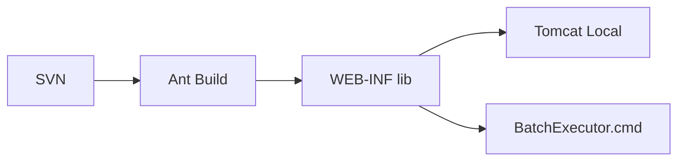

# 버전관리·배포관리 Draft

## 1. 목적
약어/용어는 [약어-용어집.md](/home/forsylph/ollama/NPH/03.analysis_results/030.index/0303.%EC%95%BD%EC%96%B4-%EC%9A%A9%EC%96%B4%EC%A7%91/%EC%95%BD%EC%96%B4-%EC%9A%A9%EC%96%B4%EC%A7%91.md)를 먼저 보면 빠르다.

이 문서는 현재 확보된 소스, 설정, 배치 스크립트, 로컬 서버 설정을 기준으로 NPH의 버전관리와 배포관리 방식을 초안 수준으로 정리한 기준본이다.

## 2. 초안 결론

1. 소스 버전관리는 `SVN` 기반 흔적이 강하다.
2. 애플리케이션 빌드는 `Ant + JAR 생성 + 수동/반수동 복사` 방식 흔적이 강하다.
3. 개발/검증 배포는 `Eclipse Tomcat 로컬 서버 설정` 기반 흔적이 보인다.
4. 배치 실행은 `DevOn Batch 컨테이너 + BatchExecutor.cmd + batchMgr UI` 조합으로 이해하는 편이 맞다.
5. `instance_*.properties`는 단순 참고 파일이 아니라 런타임 PC 매핑이므로, 배포 산출물의 일부로 봐야 한다.

## 3. 버전관리 관점

### 3.1 현재 가장 강한 결론
- `Git 기반 운영 흔적`보다 `SVN 기반 운영 흔적`이 훨씬 강하다.
- 단순히 라이브러리만 포함된 수준이 아니라, 애플리케이션 내부에 `SVN 로그 조회 기능`이 구현되어 있다.

### 3.2 직접 확인 근거 파일
| 구분 | 파일 | 확인 내용 |
|---|---|---|
| 라이브러리 | [svnkit-1.8.14.jar](N:/99.SourceCode%20Backup/NPH/AADEV_NPH/workspace/NPH_HIS/webapp/WEB-INF/lib/svnkit-1.8.14.jar) | SVNKit 실물 존재 |
| CMD | [RetrieveSvnLogCMD.java](N:/99.SourceCode%20Backup/NPH/AADEV_NPH/workspace/NPH_HIS/src/nph/his/az/com/comn/cmd/RetrieveSvnLogCMD.java) | 화면 요청을 받아 `SvnLogPC` 호출 |
| PC | [SvnLogPC.java](N:/99.SourceCode%20Backup/NPH/AADEV_NPH/workspace/NPH_HIS/src/nph/his/az/com/comn/pc/SvnLogPC.java) | SVN 저장소 직접 접속 후 로그 조회 |
| Interface | [SvnLogIFPC.java](N:/99.SourceCode%20Backup/NPH/AADEV_NPH/workspace/NPH_HIS/src/nph/his/az/com/comn/pc/SvnLogIFPC.java) | SVN 로그 조회 PC 인터페이스 |
| Navigation | [comnNavi.xml](N:/99.SourceCode%20Backup/NPH/AADEV_NPH/workspace/NPH_HIS/devonhome/navigation/mhi/az/com/comnNavi.xml) | `RetrieveSvnLog` action 정의 |
| 화면 | [AZ_SYS03100M.xml](N:/99.SourceCode%20Backup/NPH/AADEV_NPH/workspace/NPH_HIS/webapp/ui/AZ/SYS/AZ_SYS03100M.xml) | `RetrieveSvnLog.mhi` 호출 |
| 인스턴스 | [instance_az.properties](N:/99.SourceCode%20Backup/NPH/AADEV_NPH/workspace/NPH_HIS/devonhome/instance/instance_az.properties:214) | SVN 조회 관련 PC 매핑 흔적 |

### 3.3 SvnLog 체인

세부 확인값:
- 화면 함수:
  - [`AZ_SYS03100M.xml:965`](N:/99.SourceCode%20Backup/NPH/AADEV_NPH/workspace/NPH_HIS/webapp/ui/AZ/SYS/AZ_SYS03100M.xml:965)
  - `fRetrieveMaster2()`
- 화면 호출 URL:
  - [`AZ_SYS03100M.xml:975`](N:/99.SourceCode%20Backup/NPH/AADEV_NPH/workspace/NPH_HIS/webapp/ui/AZ/SYS/AZ_SYS03100M.xml:975)
  - `/az/com/comnNavi/RetrieveSvnLog.mhi`
- navigation action:
  - [`comnNavi.xml:149`](N:/99.SourceCode%20Backup/NPH/AADEV_NPH/workspace/NPH_HIS/devonhome/navigation/mhi/az/com/comnNavi.xml:149)
  - `action name="RetrieveSvnLog"`
- command:
  - [`RetrieveSvnLogCMD.java:25`](N:/99.SourceCode%20Backup/NPH/AADEV_NPH/workspace/NPH_HIS/src/nph/his/az/com/comn/cmd/RetrieveSvnLogCMD.java:25)
  - `TxServiceUtil.getNTxService("az.comn.SvnLogPC")`
- PC:
  - [`SvnLogPC.java:39`](N:/99.SourceCode%20Backup/NPH/AADEV_NPH/workspace/NPH_HIS/src/nph/his/az/com/comn/pc/SvnLogPC.java:39)
  - `svn://svn.nph.go.kr/nph/trunk/NPH_HIS/`

판단:
- 이 기능은 단순 참고용이 아니라, 운영 시스템 안에서 `SVN 변경 이력`을 조회하는 용도로 설계된 흔적이다.
- 따라서 적어도 특정 시점의 버전관리 문화는 `SVN 저장소 접근`을 전제로 했다.

### 3.4 아직 닫히지 않은 점
- 실제 운영 브랜치 전략
- 태그/릴리스 규칙
- 운영서버가 동일 SVN을 직접 참조했는지 여부
- 개발/검증/운영 환경별 저장소 분리 여부

## 4. 빌드 관점

### 4.1 직접 확인 근거 파일
| 구분 | 파일 | 확인 내용 |
|---|---|---|
| Ant 프로젝트 | [NPH_BUILD/build.xml](N:/99.SourceCode%20Backup/NPH/AADEV_NPH/workspace/NPH_BUILD/build.xml) | 별도 Ant 컴파일 프로젝트 |
| COMMON 빌드 | [COMMON/ant/build.xml](N:/99.SourceCode%20Backup/NPH/AADEV_NPH/workspace/COMMON/ant/build.xml) | `nphCom.jar` 생성 후 `WEB-INF/lib` 복사 |
| 배치 런처 | [BatchExecutor.cmd](N:/99.SourceCode%20Backup/NPH/AADEV_NPH/workspace/NPH_HIS/cmd/BatchExecutor.cmd) | CLASSPATH 수동 구성 후 `JobGroupExecutor` 실행 |

### 4.2 해석
- `COMMON`은 독립적으로 JAR을 만든다.
- 만들어진 JAR은 [`COMMON/ant/build.xml:12`](N:/99.SourceCode%20Backup/NPH/AADEV_NPH/workspace/COMMON/ant/build.xml:12) 기준으로 `NPH_HIS\\webapp\\WEB-INF\\lib`로 직접 복사된다.
- 이 방식은 통합 빌드 파이프라인보다는 `모듈별 Ant 작업 + 산출물 복사`에 가깝다.

## 5. 배포 관점

### 5.1 직접 확인 근거 파일
| 구분 | 파일 | 확인 내용 |
|---|---|---|
| 로컬 WAS | [server.xml](N:/99.SourceCode%20Backup/NPH/AADEV_NPH/workspace/Servers/Tomcat%20v9.0%20Server%20at%20localhost-config/server.xml) | Eclipse Tomcat 로컬 서버 설정 |
| 배치 코어 | [devon-batch-core.xml](N:/99.SourceCode%20Backup/NPH/AADEV_NPH/workspace/NPH_HIS/devonhome_batch/conf/product/devon-batch-core.xml) | 배치 컨테이너 기본 설정 |
| 배치 스케줄러 | [devon-batch-scheduler.xml](N:/99.SourceCode%20Backup/NPH/AADEV_NPH/workspace/NPH_HIS/devonhome_batch/conf/product/devon-batch-scheduler.xml) | `scheduler-enable=false` |
| batchMgr navigation | [navigation.xml](N:/99.SourceCode%20Backup/NPH/AADEV_NPH/workspace/NPH_HIS/devonhome/navigation/batch/navigation.xml) | JobGroup/Job 관리 UI 액션 |

### 5.2 해석
- 개발/검증 단계는 `Servers/Tomcat ...` 설정이 같이 남아 있어 IDE 서버 배포 흔적이 강하다.
- 배치는 `cmd`와 `devonhome_batch` 설정을 별도로 가진다.
- 현재 백업 기준으로는 상주형 스케줄러보다 `UI/DB 메타데이터/스크립트 조합`이 더 강하다.

### 5.3 배포 단위 초안
이 프로젝트에서 실제 배포 단위로 같이 움직였을 가능성이 높은 것은 아래 조합이다.

1. `WEB-INF/lib` 의 JAR 묶음
2. `webapp/ui`, `jsp` 등 화면/웹 자원
3. `devonhome/conf`, `devonhome/navigation`, `devonhome/xmlquery`
4. `devonhome/instance/instance_*.properties`
5. 배치용 `devonhome_batch/conf/*`
6. 운영용 스크립트(`cmd`)

## 6. instance_*.properties와 배포 산출물의 관계

### 6.1 직접 확인 근거 파일
| 파일 | 확인 내용 |
|---|---|
| [instance_app.properties](N:/99.SourceCode%20Backup/NPH/AADEV_NPH/workspace/NPH_HIS/devonhome/instance/instance_app.properties) | APP 계열 PC 매핑 |
| [instance_az.properties](N:/99.SourceCode%20Backup/NPH/AADEV_NPH/workspace/NPH_HIS/devonhome/instance/instance_az.properties) | AZ 계열 PC 매핑 |
| [instance_hp.properties](N:/99.SourceCode%20Backup/NPH/AADEV_NPH/workspace/NPH_HIS/devonhome/instance/instance_hp.properties) | HP 계열 PC 매핑 |
| [instance_md.properties](N:/99.SourceCode%20Backup/NPH/AADEV_NPH/workspace/NPH_HIS/devonhome/instance/instance_md.properties) | MD 계열 PC 매핑 |

### 6.2 해석
- 이 파일들은 단순 메모가 아니라 `문자열 키 -> PC 구현체 클래스` 매핑이다.
- 예:
  - [`instance_app.properties:6`](N:/99.SourceCode%20Backup/NPH/AADEV_NPH/workspace/NPH_HIS/devonhome/instance/instance_app.properties:6) `pat.auth.LoginPC = ...`
  - [`instance_az.properties:97`](N:/99.SourceCode%20Backup/NPH/AADEV_NPH/workspace/NPH_HIS/devonhome/instance/instance_az.properties:97) `az.comn.BatchInfoPC = ...`
  - [`instance_hp.properties:24`](N:/99.SourceCode%20Backup/NPH/AADEV_NPH/workspace/NPH_HIS/devonhome/instance/instance_hp.properties:24) `hp.dms.PostRevwMngmPC = ...`
  - [`instance_md.properties:24`](N:/99.SourceCode%20Backup/NPH/AADEV_NPH/workspace/NPH_HIS/devonhome/instance/instance_md.properties:24) `md.ord.PrscMngmPC = ...`

### 6.3 배포 관점에서 왜 중요한가
- 코드만 바뀌고 `instance_*.properties`가 같이 안 바뀌면, 새 PC 구현체가 런타임에서 안 보일 수 있다.
- 즉 이 파일들은 `설정`이면서 동시에 `런타임 wiring 산출물`이다.
- 배포 관점에서 보면, `JAR + devonhome 설정 + instance_*.properties`는 같은 묶음으로 다뤄야 한다.

## 7. 현재까지의 초안 판단

### 7.1 사실로 볼 수 있는 것
- 버전관리 흔적은 `SVN`이 강하다.
- 빌드는 `Ant` 중심 흔적이 강하다.
- 배포는 `IDE/Tomcat 로컬 설정 + 산출물 직접 반영` 흔적이 강하다.
- 배치 실행은 `DevOn Batch 컨테이너 + BatchExecutor.cmd + batchMgr UI` 조합으로 봐야 한다.
- `instance_*.properties`는 배포 산출물의 일부로 취급하는 것이 맞다.

### 7.2 아직 미확인인 것
- 운영 브랜치/릴리스 정책
- 운영서버 실제 배포 절차서
- 자동배포 도구 존재 여부
- 운영 DB 메타데이터 기반 배치 스케줄 전체표

## 8. 같이 볼 문서
- 화면 진입과 `.mhi` 연결은 [A.Front-Channel-개요.md](/home/forsylph/ollama/NPH/03.analysis_results/031.front-channel/0313.ui-entry/A.Front-Channel-%EA%B0%9C%EC%9A%94.md)
- DevOn 코어 구조는 [A.Framework-개요.md](/home/forsylph/ollama/NPH/03.analysis_results/032.framework-core/0321.overview/A.Framework-%EA%B0%9C%EC%9A%94.md)
- 배치 컨테이너는 [A.DevOn-Batch-컨테이너-개요.md](/home/forsylph/ollama/NPH/03.analysis_results/032.framework-core/0323.batch-rule/A.DevOn-Batch-%EC%BB%A8%ED%85%8C%EC%9D%B4%EB%84%88-%EA%B0%9C%EC%9A%94.md)
- 현행 배치 운영은 [D.현행-스케줄-운영방식.md](/home/forsylph/ollama/NPH/03.analysis_results/032.framework-core/0323.batch-rule/D.%ED%98%84%ED%96%89-%EC%8A%A4%EC%BC%80%EC%A4%84-%EC%9A%B4%EC%98%81%EB%B0%A9%EC%8B%9D.md)
