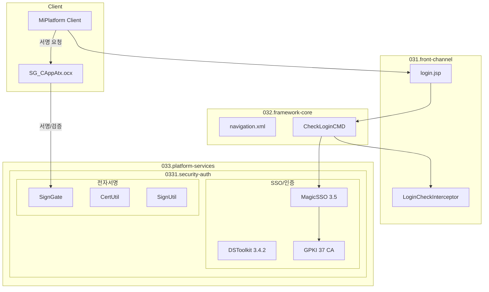

# security-auth 개요

> 최종 수정: 2026-03-07

---

## 1A. 상위 연결

- 이 폴더의 기준 설명은 [../README.md](../README.md) 를 먼저 본다.
- DevOn 코어는 [../../032.framework-core/0321.overview/A.Framework-개요.md](../../032.framework-core/0321.overview/A.Framework-개요.md) 와 같이 본다.
- 의료업무 맥락은 [../../035.Biz-medical-Domain](../../035.Biz-medical-Domain) 으로 이어진다.
- 실제 사례는 [../../037.runtime-trace/A.트레이스-읽는순서.md](../../037.runtime-trace/A.트레이스-읽는순서.md) 를 본다.

이 문서는 `033.platform-services` 중 보안/인증 계열 솔루션을 정리하는 기준본이다.

---

## 2. 분석 현황

| 솔루션 | 상태 | 문서 |
|--------|------|------|
| **MagicSSO** | ✅ 분석 완료 | [B.MagicSSO-인증흐름.md](./B.MagicSSO-인증흐름.md) |
| **DSToolkit** | ✅ 분석 완료 | MagicSSO 문서에 포함 |
| **MagicSAML** | ✅ 분석 완료 | [C.OpenSAML-MagicSAML.md](./C.OpenSAML-MagicSAML.md) |
| **OpenSAML** | ✅ 분석 완료 | [C.OpenSAML-MagicSAML.md](./C.OpenSAML-MagicSAML.md) |
| **GPKI** | ✅ 분석 완료 | MagicSSO 문서에 포함 (37개 CA) |
| **SignGate** | ✅ 분석 완료 | [D.SignGate-전자서명.md](./D.SignGate-전자서명.md) |
| **Lucy XSS Filter** | ✅ 분석 완료 | [E.Lucy-XSS-Filter.md](./E.Lucy-XSS-Filter.md) |
| **OWASP ESAPI** | ✅ 미사용 확인 | [F.OWASP-ESAPI-미사용.md](./F.OWASP-ESAPI-미사용.md) |

---

## 3. 기술 스택 요약

### 3.1 인증/SSO

| 기술 | 버전 | 공급사 | 비고 |
|------|------|--------|------|
| **MagicSSO** | 3.5 | 드림시큐리티 | SSO 핵심 솔루션 ✅ |
| **DSToolkit** | 3.4.2.0 | 드림시큐리티 | 인증 툴킷 ✅ |
| **MagicSAML** | 1.3.3 | 드림시큐리티 | SAML SP ✅ |
| **OpenSAML** | 2.6.4 | Shibboleth | SAML 라이브러리 |
| **GPKI** | - | KISA | 공인인증서 (37개 CA) ✅ |
| **SignGate** | - | KIS | 전자서명 ✅ |
| **SsoEam** | 1.0.6 | - | EAM 연동 ✅ |

### 3.2 보안

| 기술 | 버전 | 공급사 | 비고 |
|------|------|--------|------|
| **Lucy XSS Filter** | 1.1.2 | 네이버 | XSS 방어, NPH_ECS 사용 확인 |
| **OWASP ESAPI** | 2.0.1 | OWASP | JAR만 존재, 미사용 |
| **Bouncy Castle** | 1.51 | - | 암호화 라이브러리 |

---

## 4. 아키텍처 위치



---

## 5. 인증 경로

NPH는 세 가지 인증 경로를 제공한다:

### 5.1 SSO + EAM 인증 (일반 사용자)

```
사용자 → CheckLoginNewCMD → SSO.verifyToken() → EAM.getRoleList() → 세션 설정
```

### 5.2 DB 직접 인증 (개발자/테스트)

```
개발자 → CheckLoginNewCMD → DB 사용자 조회 → 세션 설정
```

### 5.3 EAM OFF 폴백 (장애 시)

```
사용자 → CheckLoginNewCMD → NoEamEC.retrieveNoEamRoleList() → 세션 설정
```

---

## 6. 전자서명 흐름

### 6.1 SignGate 구조

```
Client (ActiveX)          Server (Java)
     │                        │
     │ LoadUserKeyCertDlg    │
     │ ────────────────────> │
     │                        │
     │ GetUserSignCert       │
     │ ────────────────────> │
     │                        │
     │ GenerateSignature     │
     │ ────────────────────> │
     │                        │
     │      <──────────────── │
     │     serverCert.jsp    │
     │                        │
     │      <──────────────── │
     │   PublicCertUC 검증    │
     │                        │
```

### 6.2 SignGate 컴포넌트

| 컴포넌트 | 위치 | 용도 |
|----------|------|------|
| `signgateCrypto.jar` | WEB-INF/lib | 서버 암호화 |
| `signgate_common.jar` | WEB-INF/lib | 공통 모듈 |
| `SG_CAppAtx.ocx` | EMR_DATA/script | ActiveX 컨트롤 |
| `sg_basic.js` | EMR_DATA/script | API 래퍼 |
| `Certification.java` | core/cert | 인증서 관리 |
| `PublicCertUC.java` | az/com/uc | 사용자 검증 |

### 6.3 인증서 등록 절차

```
1. 인증서 파일 배치
   └─> CertKit/cert/ 에 DER/KEY 파일 배치

2. 비밀번호 암호화
   └─> passwdEnc.sh 실행 → encPasswd 생성

3. 설정 파일 구성
   └─> his.xml: 인증서 경로, 정책 OID
   └─> DSToolkitV30.conf: CA LDAP URL

4. 애플리케이션 재시작
   └─> Certification.java 싱글톤 초기화

5. 사용자 인증서 등록
   └─> RegistUserCertKeyCMD → AZCMHKMIL 테이블
```

### 6.4 지원 인증기관 (37개 CA)

- KISA RootCA (한국인증원)
- signGATE CA (한국정보인증)
- yessign CA (금융결제원)
- CrossCert CA (교차인증)
- TradeSign CA (무역인증)
- GPKI RootCA (행정전자서명)
- 기타 (DSToolkitV30.conf 참조)

---

## 7. 설정 위치

| 설정 파일 | 경로 | 용도 |
|-----------|------|------|
| `his.xml` | `/devonhome/conf/project/` | EAM-SSO, 인증서 설정 |
| `DSToolkitV30.conf` | `/WEB-INF/homepath/cfg/` | CA 정보 37개 |
| `agent.xml` | `/WEB-INF/homepath/config/application/` | SSO Agent 설정 |
| `magic-sso-agent.sh/bat` | `/WEB-INF/homepath/config/` | 환경 변수 |
| `CertKit/cert/` | `/CertKit/cert/` | 서버 인증서 |

---

## 8. 주요 클래스

### 8.1 SSO/인증

| 클래스 | 패키지 | 용도 |
|--------|--------|------|
| `LoginPC` | `nph.his.az.bizcom.auth.pc` | 로그인 처리 PC |
| `ComLoginUC` | `nph.his.az.com.uc` | 로그인 공통 UC |
| `CheckLoginNewCMD` | `nph.his.az.bizcom.auth.cmd` | 로그인 체크 Command |
| `UserManager` | `nph.his.core.user` | 세션 사용자 관리 |
| `SSO` | `WiseAccess` | SSO API 래퍼 |
| `LoginCheckInterceptor` | `nph.his.core.interceptor` | 로그인 인터셉터 |

### 8.2 전자서명

| 클래스 | 패키지 | 용도 |
|--------|--------|------|
| `Certification` | `nph.his.core.cert` | 인증서 관리 싱글톤 |
| `PublicCertUC` | `nph.his.az.com.uc` | 사용자 인증서 검증 |
| `CertUtil` | `signgate.crypto.util` | 인증서 처리 |
| `SignUtil` | `signgate.crypto.util` | 전자서명/검증 |
| `CipherUtil` | `signgate.crypto.util` | 암호화/복호화 |

---

## 9. 관련 문서

### 9.1 분석 문서

- [B.MagicSSO-인증흐름.md](./B.MagicSSO-인증흐름.md) - MagicSSO 인증 흐름 상세 분석
- [C.OpenSAML-MagicSAML.md](./C.OpenSAML-MagicSAML.md) - OpenSAML/MagicSAML SAML SP 분석
- [D.SignGate-전자서명.md](./D.SignGate-전자서명.md) - SignGate 전자서명 분석
- [E.Lucy-XSS-Filter.md](./E.Lucy-XSS-Filter.md) - Lucy XSS Filter 분석
- [F.OWASP-ESAPI-미사용.md](./F.OWASP-ESAPI-미사용.md) - OWASP ESAPI 미사용 확인

### 9.2 연결 문서

- [Tech-Stack-개요.md](../../030.index/0307.Tech%20Stack/Tech-Stack-개요.md)
- [A.Command-Navigation-Dispatch.md](../../031.front-channel/0312.navigation-command/A.Command-Navigation-Dispatch.md)

---

## 10. 분석 필요 항목

### 10.1 SignPad 하드웨어

- [ ] SignPad 하드웨어 모델명 및 드라이버 확인
- [ ] 서명패드 연동 방식 상세 분석
- [ ] EMR 문서 서명 처리 흐름
- [ ] painter.jar / signedpainter.jar 연동

### 10.2 ESAPI JAR 제거 검토

- DSToolkit/DEVON Framework 의존성 확인
- JAR 제거 후 기능 테스트

### 10.3 운영 환경 점검

- [ ] 인증서 갱신 절차 확인
- [ ] CRL 업데이트 주기
- [ ] 인증기관 LDAP 연결 상태

---

## 11. 다음 단계

1. SignPad 하드웨어 연동 분석
2. ESAPI JAR 제거 검토 (의존성 확인 후)
3. `035.Biz-medical-Domain`의 의료업무 인증 시나리오와 링크


