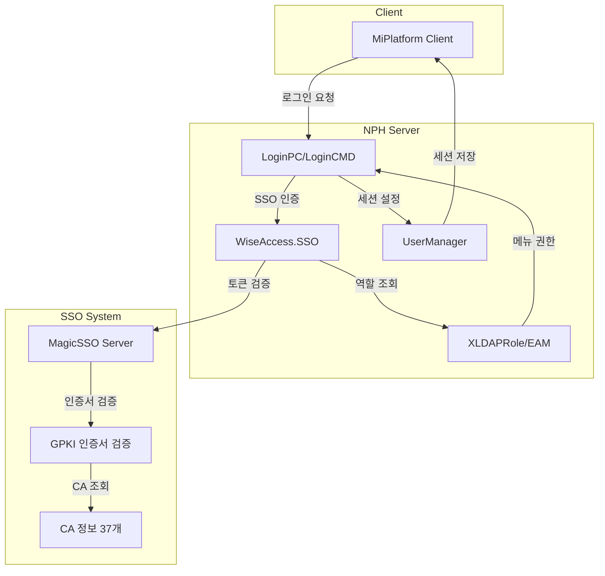
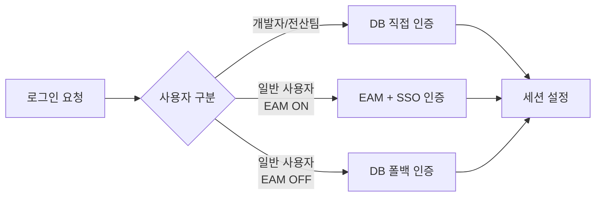

# MagicSSO 인증 흐름 분석

> 분석일: 2026-03-07
> 분석 대상: `/mnt/n/99.SourceCode Backup/NPH/AADEV_NPH/workspace`

---

## 1. 개요

NPH 시스템은 **드림시큐리티 MagicSSO**를 기반으로 한 통합 인증 시스템을 사용한다. MagicSSO는 SSO(Single Sign-On)와 GPKI 공인인증서 기반 인증을 결합한 솔루션이다.

### 1.1 관련 솔루션

| 솔루션 | 버전 | 용도 |
|--------|------|------|
| **MagicSSO** | 3.5 | SSO 인증 |
| **DSToolkit** | 3.4.2.0 | 인증 툴킷 |
| **MagicSAML** | 1.3.3 | SAML SP |
| **OpenSAML** | 2.6.4 | SAML 라이브러리 |
| **SsoEam** | 1.0.6 | EAM 연동 |

### 1.2 주요 JAR 파일

```
WEB-INF/lib/
├── DSToolkit-v3.4.2.0.jar      # 인증 툴킷
├── SsoEam_v1.0.6.jar           # EAM 연동
├── magicsaml-sp-v1.3.3.jar     # SAML SP
└── wiseone-shared-common-3.3.0.01.jar
```

---

## 2. 아키텍처

### 2.1 전체 인증 흐름



### 2.2 인증 경로 구분

NPH는 세 가지 인증 경로를 지원한다:



---

## 3. 설정 파일

### 3.1 DSToolkit 설정 (DSToolkitV30.conf)

GPKI 공인인증서 검증을 위한 CA 정보 37개를 설정한다:

```ini
[VALIDATOIN_OPTION]
CA_INFO_COUNT = 37

[IVS]
IP = ivs.gpki.go.kr
PORT = 8080
SVR_KM_CERT_URL = ldap://ldap.gcc.go.kr:389/cn=IVS1310386001,...

# 주요 CA 정보
[CA_INFO1]
CA_DN = cn=KISA RootCA 4,ou=Korea Certification Authority Central,o=KISA,c=KR
DIR_URL = ldap://dir.signkorea.com:389

[CA_INFO7]
CA_DN = cn=GPKIRootCA,ou=GPKI,o=government of korea,c=kr
DIR_URL = ldap://cen.dir.go.kr:389
```

### 3.2 Agent 설정 (agent.xml)

```xml
<agent>
    <mode>dev</mode>
    <config>
        <dreamsecurity-home-path>D:\Source\SAMLSSO\SAMLSSO_SP2\homepath</dreamsecurity-home-path>
    </config>

    <repository type="db" isSync="false">
        <base-dn>o=Government of Korea\,c=KR</base-dn>
        <connection-pool external="true">
            <name>REPOSITORY_POOL</name>
        </connection-pool>
    </repository>

    <service>
        <sso>
            <user>
                <source-attribute>ID, NAME, DEPT_CODE, DEPT_NAME, SSN, ...</source-attribute>
            </user>
        </sso>
    </service>
</agent>
```

### 3.3 EAM-SSO 설정 (his.xml)

```xml
<eam-sso>
    <sApiKey>보안인증키</sApiKey>
    <sNoSSOId>개발자ID접두사</sNoSSOId>
    <eam-switch>OFF</eam-switch>  <!-- ON: EAM, OFF: DB -->
</eam-sso>
```

---

## 4. 핵심 클래스

### 4.1 클래스 구조

```
nph.his.az.bizcom.auth/
├── pc/
│   └── LoginPC.java          # 로그인 처리 PC
├── cmd/
│   ├── CheckLoginCMD.java    # 로그인 체크 Command
│   ├── CheckLoginNewCMD.java # 로그인 체크 (신규)
│   └── MenuInfoCMD.java      # 메뉴 정보 Command
└── uc/
    └── ComLoginUC.java       # 로그인 공통 UC

WiseAccess/
├── SSO.java                  # SSO 메인 클래스
└── SsoParser.java            # SSO 응답 파서

com.eam.object.xldap/
└── XLDAPRole.java            # EAM LDAP 역할 조회
```

### 4.2 LoginPC 핵심 메서드

| 메서드 | 설명 |
|--------|------|
| `retrieveUserInfo()` | 사용자 정보 조회 |
| `retrieveUserRoleList()` | 사용자 역할 목록 조회 (SSO) |
| `retrieveMenuInfo()` | 메뉴 정보 조회 |
| `doLogin()` | 개발자 로그인 |
| `setSessionUserData()` | 세션 사용자 정보 설정 |

### 4.3 SSO API (WiseAccess.SSO)

```java
// SSO 클래스 주요 메서드
SSO sso = new SSO(sApiKey);

// 토큰 검증
int nResult = sso.verifyToken(stoken, sRemoteAddr);

// 역할 목록 조회
String sDSDRole = sso.getRoleList(stoken, sRemoteAddr);

// 서비스 목록 조회
String sServiceList = sso.getDSDRoleServiceList("/SVC/" + depthOne, "SUB", stoken, sRemoteAddr, roleID);

// 에러 확인
int lastError = sso.getLastError();
```

---

## 5. 인증 흐름 상세

### 5.1 로그인 프로세스

```
1. 사용자 로그인 요청
   └─> CheckLoginNewCMD.execute()
       └─> SSO 토큰 검증 (verifyToken)
           └─> EAM 역할 조회 (getRoleList)
               └─> DB 부서 정보 조회
                   └─> 세션 설정 (UserManager.setUserData())
```

### 5.2 인증 경로 분기 (LoginPC.retrieveUserRoleList)

```java
// LoginPC.java:208-254

String sID = userInfo.getString("usid");
String sNoSSSOId = conf.getString("/devon/his/eam-sso/sNoSSOId","");
String sEamSwitch = conf.getString("/devon/his/eam-sso/eam-switch","");

if (sNoSSSOId.equals(sID.substring(0, subLen))) {
    // 1. 개발자/테스트 사용자: DB 직접 인증
    roleList = comnCdUC.retrieveAppgrpCd(userInfo);
}
else if (!sAccsCon.equals("0")) {
    // 2. 전산정보팀: DB 직접 인증
    roleList = comnCdUC.retrieveAppgrpCd(userInfo);
}
else {
    if ("OFF".equals(sEamSwitch.toUpperCase())) {
        // 3a. EAM OFF: DB 폴백 인증
        roleList = noeamEC.retrieveNoEamRoleList(userInfo);
    } else {
        // 3b. EAM ON: SSO 인증
        SSO sso = new SSO(sApiKey);
        roleList = loginUC.retrieveUserRoleList(sso, sRemoteAddr, stoken, usid);
    }
}
```

### 5.3 세션 관리 (UserManager)

```java
// UserManager.java

public static void setUserData(LData queryUserData) {
    UserData userData = new UserData();
    userData.setUserIp(getClientIp());
    userData.setUsid(queryUserData.getString("usid"));
    userData.setUserNm(queryUserData.getString("userNm"));
    userData.setStoken(queryUserData.getString("stoken"));
    userData.setPrivCodes((List) queryUserData.get("privCodes"));
    // ... 기타 사용자 정보

    setUserData(userData);
}

public static boolean isLogin() {
    UserData userData = getUserData();
    return userData.isLogin();
}
```

---

## 6. 로그인 인터셉터

### 6.1 LoginCheckInterceptor

```java
// LoginCheckInterceptor.java

public void doIntercept(LInterceptorChain chain) throws Exception {
    if (!UserManager.getUserData().isLogin()) {
        throw new BizException(Constants.NO_SESSION_STATUS, "nph.err.com.notLogin");
    }
    chain.doIntercept();
}
```

### 6.2 필터 체인 (web.xml)

```
LogFilter → CharsetEncodingFilter → LocaleFilter → BatchLoginCheckFilter
                                ↓
                        LoginCheckInterceptor (navigation.xml)
```

---

## 7. SSO JSP 파일

### 7.1 SSO 처리 경로

| 파일 | 용도 |
|------|------|
| `/sso/CreateRequest.jsp` | SAML 요청 생성 |
| `/sso/Response.jsp` | SAML 응답 처리 |
| `/sso/Session-view.jsp` | 세션 확인 |
| `/sso/SPLogout.jsp` | SAML 로그아웃 |
| `/sso/TimeoutLogout.jsp` | 타임아웃 로그아웃 |

### 7.2 Response.jsp 핵심 로직

```jsp
<%
// SAML 응답 처리
Map sessionAttrMap = new HashMap();
sessionAttrMap.put(SSOToken.PROP_NAME_ID, "SSO_ID");
sessionAttrMap.put(SSOToken.PROP_NAME_NAME, "SSO_NAME");
sessionAttrMap.put(SSOToken.PROP_NAME_TOKEN_VALUE, ServiceProvider.SESSION_TOKEN);

boolean result = ((ServiceProvider) ProviderFactory.getProvider())
    .readResponse(request, response, sessionAttrMap, pm);

if (result) {
    String relayState = URLDecoder.decode(
        request.getParameter(TEMPLETE_PARAM_RELAYSTATE), "UTF-8");
    response.sendRedirect(relayState);
}
%>
```

---

## 8. SAML 연동

### 8.1 SAML Service Provider

MagicSAML을 통한 SAML SP(Service Provider) 역할 수행:

```
magicsaml-sp-v1.3.3.jar
├── ServiceProvider        # SP 구현
├── ProviderFactory        # Provider 팩토리
├── SSOToken              # SSO 토큰
└── SsoParser             # 응답 파서
```

### 8.2 SAML 흐름

```
1. CreateRequest.jsp
   └─> SAML AuthnRequest 생성
       └─> IdP 리다이렉트

2. IdP 인증 (GPKI/공인인증서)
   └─> SAML Response 생성

3. Response.jsp
   └─> SAML Response 검증
       └─> 세션 속성 설정
           └─> RelayState로 리다이렉트
```

---

## 9. CA 정보 (37개)

DSToolkitV30.conf에 설정된 CA 정보:

| 번호 | CA | 용도 |
|------|-----|------|
| 1-6 | KISA, yessign, SignKorea, CrossCert, signGATE, TradeSign | 민간 인증서 |
| 7-13 | GPKI RootCA, CA131000001/002 | 행정망 공인인증 |
| 14-20 | KISA RootCA 1, CrossCert, signGATE, SignKorea, yessign, TradeSign | 민간 인증서 |
| 21-22 | 국방부 MND CA | 국방망 |
| 23-31 | GPKI CA | 행정망 공인인증 |
| 32-37 | 테스트 CA | 개발/테스트 |

---

## 10. 환경 설정

### 10.1 EAM-SSO 설정 (/devon/his/eam-sso/)

| 설정 | 설명 |
|------|------|
| `sApiKey` | SSO 보안 인증키 |
| `sNoSSOId` | SSO 인증 제외 ID 접두사 (개발자용) |
| `sNoSSODeptCd` | SSO 인증 제외 부서 코드 |
| `eam-switch` | EAM 사용 여부 (ON/OFF) |

### 10.2 DS_HOME 환경 변수

```bash
# magic-sso-agent.sh
export DS_HOME=/dreamsecurity/sso/agent/v35
export DS_CLASSPATH=$DS_HOME/lib/dsagent-v35.jar:$DS_HOME/lib/DSToolkit.jar:...
export LD_LIBRARY_PATH=$DS_HOME/lib:$LD_LIBRARY_PATH
```

---

## 11. 보안 고려사항

### 11.1 인증서 검증

- GPKI IVS(인증유효서버)를 통한 실시간 인증서 검증
- 37개 CA에 대한 LDAP/CRL 검증 지원
- SHA256 with RSA2048 서명 알고리즘

### 11.2 세션 보안

- 세션 기반 사용자 정보 관리 (`UserData`)
- IP 기반 접근 제어
- 토큰 기반 SSO 세션 관리

### 11.3 접근 제어

- EAM 기반 역할(Role) 기반 메뉴 권한
- 부서/직종별 세분화된 권한 관리
- 개발자/전산팀 별도 인증 경로

---

## 12. 연결 문서

- [A.security-auth-개요.md](./A.security-auth-개요.md)
- [Tech-Stack-개요.md](../../030.index/0307.Tech%20Stack/Tech-Stack-개요.md)
- [LoginPC.java](/mnt/n/99.SourceCode%20Backup/NPH/AADEV_NPH/workspace/NPH_HIS/src/nph/his/az/bizcom/auth/pc/LoginPC.java)
- [ComLoginUC.java](/mnt/n/99.SourceCode%20Backup/NPH/AADEV_NPH/workspace/NPH_HIS/src/nph/his/az/com/uc/ComLoginUC.java)

---

*분석 완료: 2026-03-07*
