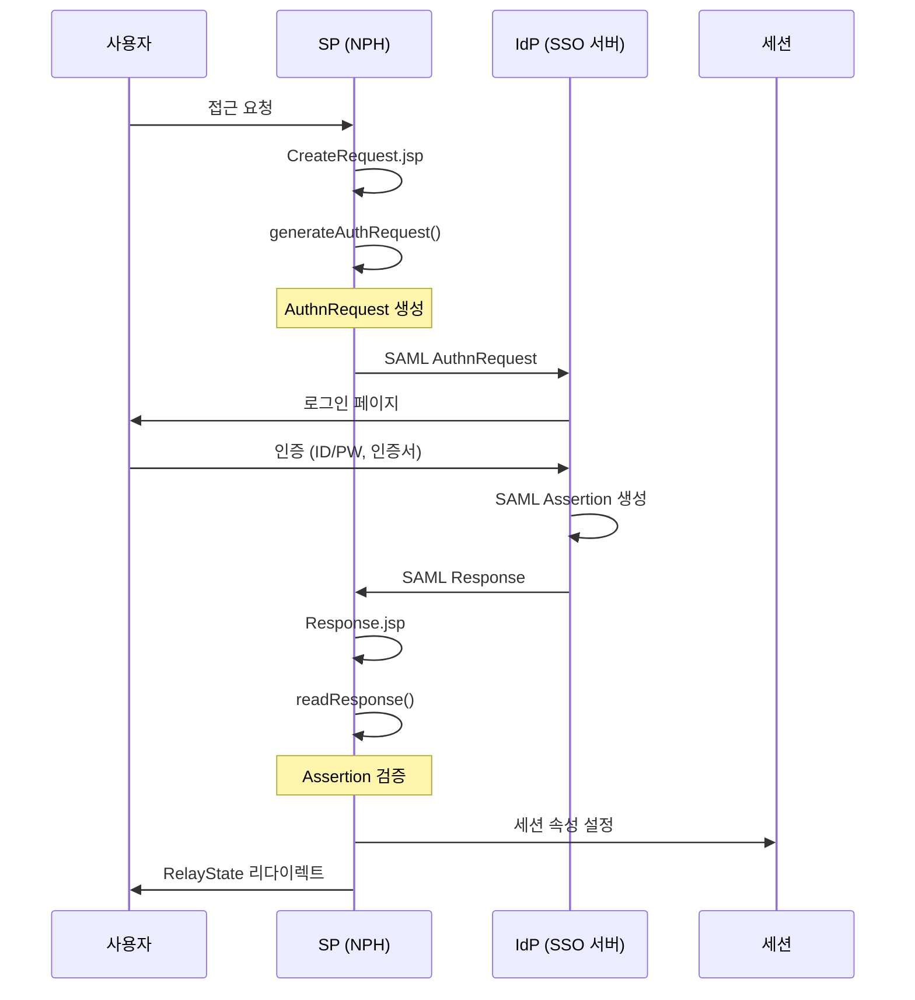
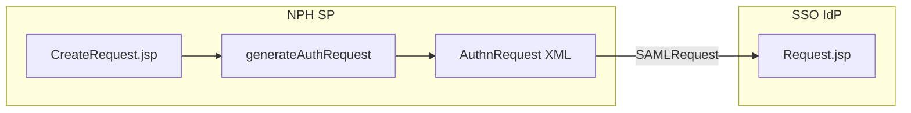
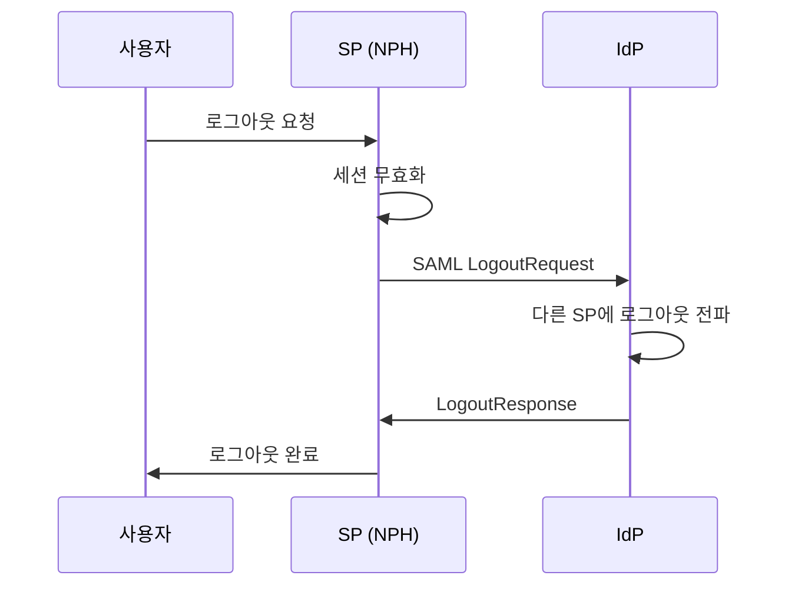

# OpenSAML / MagicSAML 분석

> 분석일: 2026-03-07
> 분석 대상: `/mnt/n/99.SourceCode Backup/NPH/AADEV_NPH/workspace`

---

## 1. 개요

NPH 시스템은 **드림시큐리티 MagicSAML**과 **OpenSAML**을 함께 사용하여 SAML 2.0 기반 SSO를 구현한다. OpenSAML은 MagicSAML의 하위 라이브러리로 작동한다.

### 1.1 관련 솔루션

| 솔루션 | 버전 | 공급사 | 용도 |
|--------|------|--------|------|
| **MagicSAML** | 1.3.3 | 드림시큐리티 | SAML SP 구현 |
| **OpenSAML** | 2.6.4 | Shibboleth | SAML 2.0 라이브러리 |

### 1.2 설치 위치

```
NPH_HIS/webapp/WEB-INF/lib/
├── magicsaml-sp-v1.3.3.jar    # MagicSAML SP
└── opensaml-2.6.4.jar          # OpenSAML 라이브러리

NPH_HIS/webapp/WEB-INF/homepath/
├── cfg/
│   ├── metadata.xml           # SAML 메타데이터
│   └── dsagent.properties     # SSO Agent 설정
└── config/
    └── agent.xml               # Agent 설정
```

---

## 2. 아키텍처

### 2.1 SAML SP 흐름



### 2.2 컴포넌트 구조

```
MagicSAML (magicsaml-sp-v1.3.3.jar)
├── com.naru.provider
│   ├── ServiceProvider        # SP 구현
│   ├── ProviderFactory        # Provider 팩토리
│   └── CommonProvider         # 공통 Provider
├── com.naru.config
│   └── SSOConfig              # SSO 설정
├── com.naru.token
│   └── SSOToken               # SSO 토큰
└── com.dreamsecurity.common
    ├── MStatus                 # 상태 관리
    └── ProcMsg                 # 처리 메시지

OpenSAML (opensaml-2.6.4.jar)
└── org.opensaml.saml2.core
    ├── AuthnRequest            # 인증 요청
    ├── Response                # SAML 응답
    ├── Assertion               # SAML Assertion
    └── ...
```

---

## 3. 설정

### 3.1 SAML 메타데이터 (metadata.xml)

```xml
<md:EntitiesDescriptor Name="DREAM">
    <!-- IdP (Identity Provider) 설정 -->
    <md:EntityDescriptor entityID="IDP">
        <md:IDPSSODescriptor>
            <md:KeyDescriptor use="encryption">
                <ds:X509Certificate>
                    <!-- IdP 인증서 -->
                </ds:X509Certificate>
            </md:KeyDescriptor>
            <md:SingleLogoutService
                Location="http://sso.nph.go.kr:40001/sso/IDPLogout.jsp"/>
            <md:SingleSignOnService
                Location="http://sso.nph.go.kr:40001/sso/Request.jsp"/>
        </md:IDPSSODescriptor>
    </md:EntityDescriptor>

    <!-- SP (Service Provider) 설정 -->
    <md:EntityDescriptor entityID="TEST">
        <md:SPSSODescriptor
            AuthnRequestsSigned="true"
            WantAssertionsSigned="true">
            <md:KeyDescriptor use="encryption">
                <ds:X509Certificate>
                    <!-- SP 인증서 -->
                </ds:X509Certificate>
            </md:KeyDescriptor>
            <md:SingleLogoutService
                Location="http://test.nph.go.kr/sso/SPLogout.jsp"/>
            <md:AssertionConsumerService
                Location="http://test.nph.go.kr/sso/Response.jsp"
                isDefault="true"/>
        </md:SPSSODescriptor>
    </md:EntityDescriptor>
</md:EntitiesDescriptor>
```

### 3.2 SSO Agent 설정 (dsagent.properties)

```properties
# 사이트 설정
site.name=TEST
site.acl=true
site.applcode=APPLDEFAULT

# 메타데이터 경로
repository.metadata.path=cfg/metadata.xml

# 암호화 설정
crypto.type=JCAOS
license.path=license/MagicSAMLSSO.lic
cerfificate.type=NPKI

# 서버 인증서
certificate.server.keystore.path=cert/SSOAgent_KM.key
certificate.server.password.encrypt=false
certificate.server.password=AAAAAg9mAC9HekANfYa/U1xS1STmIc0SYP3Ncy12W7lj9zIqH3sTk21J3LPJDxlUBkzFjQ==

# 루트 인증서
cerfificates.server.rootcert.path=cert/ROOT.der

# 암호화 대상 필드
info.encrypt.id=0
info.encrypt.passwd=0
info.encrypt.ssn=0
info.encrypt.empno=1

# 인증 페이지
authpage.password=/sso/index.html
authpage.cert=/sso/index.html

# 로깅 설정
log4j.conf=config/logging/log4j.properties

# 세션 설정
sessid.key=JSESSIONID
valid.time=2

# SGR (SSO Gateway Relay) 설정
sgr.ip=127.0.0.1
sgr.port=40040
sgr.timeout=3000
sgr.buffersize=512
```

### 3.3 인증서 경로

```
NPH_HIS/webapp/WEB-INF/homepath/
├── cfg/
│   ├── metadata.xml
│   └── cert/
│       ├── ROOT.der              # 루트 인증서
│       └── SSOAgent_KM.key       # SP 키관리 키
└── license/
    └── MagicSAMLSSO.lic         # 라이선스
```

---

## 4. 핵심 JSP 파일

### 4.1 SSO 처리 파일 목록

| 파일 | 용도 |
|------|------|
| `CreateRequest.jsp` | SAML AuthnRequest 생성 |
| `CreateRequestAuth.jsp` | 인증 요청 생성 (대체) |
| `Response.jsp` | SAML Response 처리 |
| `SPLogout.jsp` | SP 로그아웃 |
| `PostSPLogout.jsp` | POST 방식 로그아웃 |
| `Session-view.jsp` | 세션 확인 |
| `index.jsp` | SSO 진입점 |

### 4.2 AuthnRequest 생성 (CreateRequest.jsp)

```jsp
<%@ page import="org.opensaml.saml2.core.AuthnRequest"%>
<%@ page import="com.naru.provider.ServiceProvider"%>
<%@ page import="com.naru.provider.ProviderFactory"%>

<%
// SSO 설정 초기화
SSOConfig.setHomeDir(getServletConfig().getServletContext(), DEFAULT_SET_PATH);

// ServiceProvider 획득
ServiceProvider sp = (ServiceProvider) ProviderFactory.getProvider();

// SAML AuthnRequest 생성
AuthnRequest authrequest = sp.generateAuthRequest(
    session.getId(),
    SSOConfig.getApplCode(),
    pm
);

// RelayState 설정
String relayState = request.getQueryString();
session.setAttribute("relayState", relayState);
session.setAttribute("userIP", request.getRemoteAddr());

// SAML 요청 전송
String xmlString = sp.getSAMLRequestAuth_NO_Velocity(authrequest, relayState);
out.println(xmlString);
%>
```

### 4.3 SAML Response 처리 (Response.jsp)

```jsp
<%@ page import="com.naru.provider.ServiceProvider"%>
<%@ page import="com.naru.provider.ProviderFactory"%>
<%@ page import="com.naru.token.SSOToken"%>

<%
// 세션 속성 매핑
Map sessionAttrMap = new HashMap();
sessionAttrMap.put(SSOToken.PROP_NAME_ID, "SSO_ID");
sessionAttrMap.put(SSOToken.PROP_NAME_NAME, "SSO_NAME");
sessionAttrMap.put(SSOToken.PROP_NAME_TOKEN_VALUE, ServiceProvider.SESSION_TOKEN);
sessionAttrMap.put("ACL_LIST", "ACL_LIST");
sessionAttrMap.put("POLLING_TIME", "POLLING_TIME");

// SAML Response 읽기
boolean result = ((ServiceProvider) ProviderFactory.getProvider())
    .readResponse(request, response, sessionAttrMap, pm);

if (result) {
    // RelayState로 리다이렉트
    String relayState = URLDecoder.decode(
        request.getParameter(TEMPLETE_PARAM_RELAYSTATE), "UTF-8");
    response.sendRedirect(relayState);
}
%>
```

---

## 5. SAML 2.0 흐름

### 5.1 인증 요청 (AuthnRequest)



**AuthnRequest 구조:**
```xml
<samlp:AuthnRequest xmlns:samlp="urn:oasis:names:tc:SAML:2.0:protocol"
                    ID="_id"
                    Version="2.0"
                    IssueInstant="timestamp"
                    Destination="IdP URL">
    <saml:Issuer>SP EntityID</saml:Issuer>
    <samlp:NameIDPolicy AllowCreate="true"/>
</samlp:AuthnRequest>
```

### 5.2 인증 응답 (Response)


**SAML Response 구조:**
```xml
<samlp:Response xmlns:samlp="urn:oasis:names:tc:SAML:2.0:protocol">
    <saml:Issuer>IdP EntityID</saml:Issuer>
    <samlp:Status>
        <samlp:StatusCode Value="urn:oasis:names:tc:SAML:2.0:status:Success"/>
    </samlp:Status>
    <saml:Assertion>
        <saml:Subject>
            <saml:NameID>사용자ID</saml:NameID>
        </saml:Subject>
        <saml:AttributeStatement>
            <saml:Attribute Name="ACL_LIST">...</saml:Attribute>
        </saml:AttributeStatement>
    </saml:Assertion>
</samlp:Response>
```

---

## 6. 세션 속성

### 6.1 SAML Response에서 추출하는 속성

| 속성 | 매핑 | 설명 |
|------|------|------|
| `PROP_NAME_ID` | `SSO_ID` | 사용자 ID |
| `PROP_NAME_NAME` | `SSO_NAME` | 사용자 이름 |
| `PROP_NAME_TOKEN_VALUE` | `SESSION_TOKEN` | 세션 토큰 |
| `ACL_LIST` | `ACL_LIST` | 권한 목록 |
| `POLLING_TIME` | `POLLING_TIME` | 폴링 시간 |

### 6.2 세션 저장

```java
// Response.jsp
Map sessionAttrMap = new HashMap();
sessionAttrMap.put(SSOToken.PROP_NAME_ID, "SSO_ID");
sessionAttrMap.put(SSOToken.PROP_NAME_NAME, "SSO_NAME");
sessionAttrMap.put(SSOToken.PROP_NAME_TOKEN_VALUE, ServiceProvider.SESSION_TOKEN);
sessionAttrMap.put("ACL_LIST", "ACL_LIST");

ServiceProvider.readResponse(request, response, sessionAttrMap, pm);
```

---

## 7. 로그아웃 흐름

### 7.1 SP 로그아웃 (SPLogout.jsp)



### 7.2 Single Logout

```xml
<!-- SP 메타데이터 -->
<md:SingleLogoutService Location="http://test.nph.go.kr/sso/SPLogout.jsp"/>
```

---

## 8. OpenSAML vs MagicSAML

### 8.1 역할 분담

| 라이브러리 | 역할 |
|------------|------|
| **MagicSAML** | SP 구현, 설정 관리, 드림시큐리티 통합 |
| **OpenSAML** | SAML 2.0 프로토콜 구현, XML 처리 |

### 8.2 의존 관계

```
NPH Application
      │
      ▼
MagicSAML (magicsaml-sp-v1.3.3.jar)
      │
      ├── com.naru.provider.ServiceProvider
      ├── com.naru.config.SSOConfig
      └── com.naru.token.SSOToken
            │
            ▼
OpenSAML (opensaml-2.6.4.jar)
      │
      └── org.opensaml.saml2.core.AuthnRequest
```

### 8.3 MagicSAML 주요 기능

| 기능 | 설명 |
|------|------|
| `generateAuthRequest()` | AuthnRequest 생성 |
| `readResponse()` | SAML Response 처리 |
| `getSAMLRequestAuth_NO_Velocity()` | SAML 요청 XML 생성 |
| `redirectAuthnRequest()` | IdP 리다이렉트 |

---

## 9. 보안 설정

### 9.1 서명 설정

```properties
# 메타데이터
AuthnRequestsSigned="true"      # 요청 서명
WantAssertionsSigned="true"    # Assertion 서명 요구

# 서버 인증서
certificate.server.keystore.path=cert/SSOAgent_KM.key
certificate.server.password=encrypted_password
cerfificates.server.rootcert.path=cert/ROOT.der
```

### 9.2 암호화 설정

```properties
# 필드별 암호화 여부
info.encrypt.id=0       # ID: 평문
info.encrypt.passwd=0   # 비밀번호: 평문
info.encrypt.ssn=0      # 주민번호: 평문
info.encrypt.empno=1    # 사번: 암호화
```

### 9.3 인증서 타입

```properties
# 인증서 타입
cerfificate.type=NPKI   # NPKI 공인인증서
crypto.type=JCAOS      # JCAOS 암호화
```

---

## 10. SSO 엔드포인트

### 10.1 IdP (Identity Provider)

| 엔드포인트 | URL |
|------------|-----|
| SingleSignOnService | `http://sso.nph.go.kr:40001/sso/Request.jsp` |
| SingleLogoutService | `http://sso.nph.go.kr:40001/sso/IDPLogout.jsp` |

### 10.2 SP (Service Provider)

| 엔드포인트 | URL |
|------------|-----|
| AssertionConsumerService | `http://test.nph.go.kr/sso/Response.jsp` |
| SingleLogoutService | `http://test.nph.go.kr/sso/SPLogout.jsp` |

---

## 11. 파일 구조

### 11.1 설정 파일

```
NPH_HIS/webapp/WEB-INF/homepath/
├── cfg/
│   ├── metadata.xml              # SAML 메타데이터
│   ├── metadata.xml.20130910     # 메타데이터 백업
│   ├── metadata.xml.20150209     # 메타데이터 백업
│   ├── metadata.xml.20160905    # 메타데이터 백업
│   ├── dsagent.properties       # SSO Agent 설정
│   └── cert/
│       ├── ROOT.der             # 루트 인증서
│       └── SSOAgent_KM.key      # SP 키
│
├── config/
│   ├── application/
│   │   └── agent.xml            # Agent 설정 (MagicSSO)
│   └── logging/
│       └── log4j.properties      # 로깅 설정
│
└── license/
    └── MagicSAMLSSO.lic         # 라이선스
```

### 11.2 JSP 파일

```
NPH_HIS/webapp/sso/
├── index.jsp                 # SSO 진입점
├── CreateRequest.jsp         # AuthnRequest 생성
├── CreateRequestAuth.jsp    # 인증 요청 (대체)
├── Response.jsp              # SAML Response 처리
├── Response.db.jsp           # DB 기반 응답 처리
├── Response.ldap.jsp        # LDAP 기반 응답 처리
├── SPLogout.jsp              # SP 로그아웃
├── PostSPLogout.jsp          # POST 로그아웃
├── Session-view.jsp          # 세션 확인
└── SPCommon.jsp               # 공통 설정
```

---

## 12. 연결 문서

- [A.security-auth-개요.md](./A.security-auth-개요.md)
- [B.MagicSSO-인증흐름.md](./B.MagicSSO-인증흐름.md)
- [Tech-Stack-개요.md](../../030.index/0307.Tech%20Stack/Tech-Stack-개요.md)

---

## 13. 분석 필요 항목

### 13.1 SAML 메시지 상세

- AuthnRequest XML 구조 상세 분석
- Assertion XML 구조 상세 분석
- 서명/암호화 알고리즘 확인

### 13.2 IdP 연동

- SSO 서버 연동 방식
- 다중 IdP 지원 여부
- 인증서 갱신 절차

---

*분석 완료: 2026-03-07*
