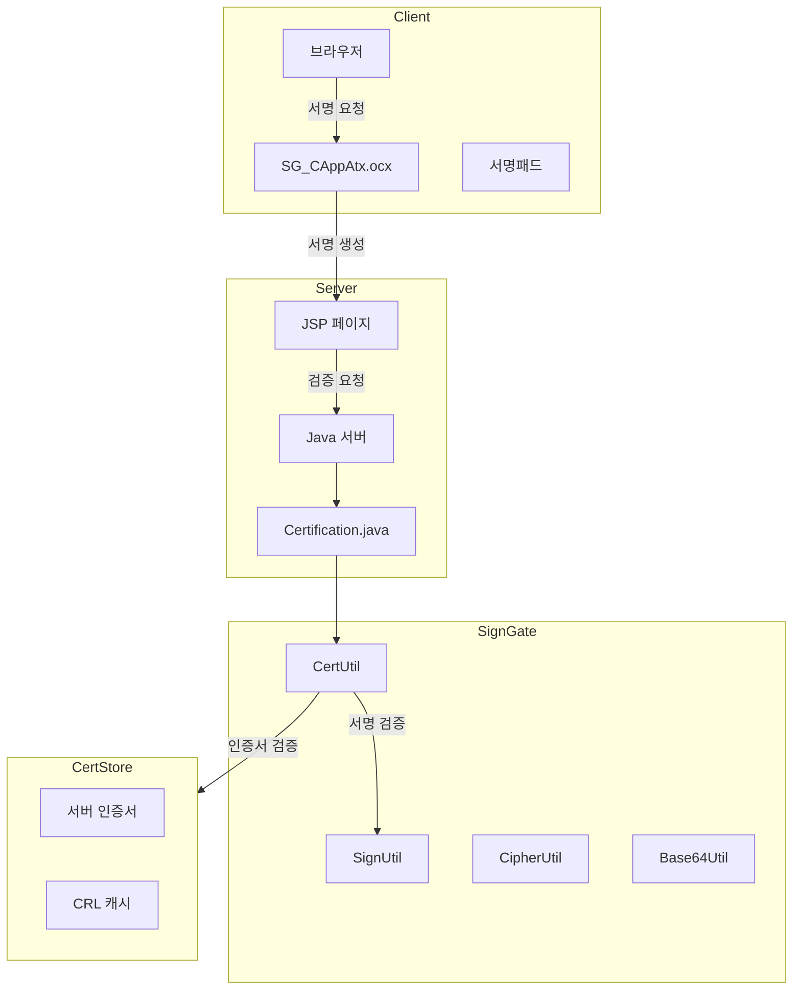

# SignGate 전자서명 분석

> 분석일: 2026-03-07
> 분석 대상: `/mnt/n/99.SourceCode Backup/NPH/AADEV_NPH/workspace`

---

## 1. 개요

NPH 시스템은 공인인증서/전자서명 계열 구성요소를 포함하고 있으며, `signgateCrypto.jar`, `signgate_common.jar`, `DSToolkit` 계열 설정과 네이티브 라이브러리, ActiveX/스크립트 자원이 함께 존재한다. 다만 **현재 로컬 코드/설정만으로 `SignGate`와 `DSToolkit`의 경계를 완전히 분리해서 닫기는 어렵다.** 이 문서는 전자서명/인증서 처리 스택을 통합적으로 설명하는 문서로 읽는 것이 더 정확하다.

### 1.0 리뷰 메모

- `signgateCrypto.jar`, `signgate_common.jar` 실물은 확인된다.
- 설정과 운영 흔적은 `DSToolkitV30.conf`, `DSToolkitJni.dll`, `DSToolkitV30-v3.4.2.0.dll` 쪽이 더 직접적이다.
- 따라서 현재 단계에서는 `KIS SignGate 단일 제품 설명`보다 `전자서명/인증서 스택 설명`으로 읽는 편이 안전하다.

### 1.1 관련 솔루션

| 솔루션 | 용도 |
|--------|------|
| **signgateCrypto.jar** | 암호화/서명 관련 라이브러리 |
| **signgate_common.jar** | SignGate 계열 공통 라이브러리 |
| **SG_CAppAtx.ocx** | ActiveX 클라이언트 컨트롤 |
| **DSToolkitJni.dll** | JNI 네이티브 라이브러리 |
| **BCQREConRX** | 바코드/QR 암호화 모듈 |

### 1.2 설치 위치

```
NPH_HIS/webapp/WEB-INF/lib/
├── signgateCrypto.jar      # 암호화 라이브러리 (388KB)
└── signgate_common.jar     # 공통 모듈 (80KB)

NPH_HIS/webapp/WEB-INF/homepath/
├── lib/
│   ├── DSToolkitJni-v3.4.2.0.dll     # JNI 라이브러리
│   └── DSToolkitV30-v3.4.2.0.dll     # DSToolkit DLL
└── license/
    └── DSToolkit32.lic               # 라이선스 파일

NPH_HIS/webapp/EMR_DATA/script/sg_scripts/
├── sg_basic.js          # ActiveX 기본 API
├── sg_cert.js           # 인증서 관리
├── sg_sign.js           # 서명 생성/검증
├── sg_pkcs7.js          # PKCS7 메시지
├── sg_encrypt.js        # 암호화
├── sg_error.js          # 에러 처리
├── sg_util.js           # 유틸리티
├── sg_hash.js           # 해시 함수
└── sg_base64.js         # Base64 인코딩

NPH_HIS/CertKit/cert/
├── signCert.der        # 서버 서명 인증서
├── signPri.key         # 서버 서명 개인키
├── kmCert.der          # 키관리 인증서
├── kmPri.key           # 키관리 개인키
├── encPasswd           # 암호화 비밀번호
├── passwdEnc.sh         # 비밀번호 암호화 스크립트 (Linux)
├── passwdEnc.bat        # 비밀번호 암호화 스크립트 (Windows)
├── CaPubs              # CA 공개키 모음
└── crl/SignGATE/       # CRL 캐시 디렉토리

NPH_ECS/webapp/signgate/
├── sample.jsp          # 서명 검증 샘플
├── serverCert.jsp      # 서버 인증서 PEM 변환
├── cert/               # ECS용 인증서
└── js/
    ├── kica_min.js
    ├── kica_websign_interface.js
    ├── license.js
    └── lazyload.js

NPH_HIS/webapp/sga/      # 바코드 서명 모듈
├── config/
│   ├── config.xml       # SGA 설정
│   └── configEmr.xml    # EMR용 설정
├── cert/
│   ├── signCert.der
│   └── signPri.key
├── license/
│   └── license.issuer
├── js/
│   └── bcqre.js         # 바코드 QR 암호화
├── BCQREConRX.cab       # ActiveX 설치
└── BCQREConRX.exe
```

---

## 1A. 직접 확인 근거 파일

| 구분 | 직접 확인 근거 |
|------|----------------|
| JAR | `signgateCrypto.jar`, `signgate_common.jar` |
| 네이티브/라이선스 | `DSToolkitJni-v3.4.2.0.dll`, `DSToolkitV30-v3.4.2.0.dll`, `DSToolkit32.lic` |
| ActiveX/스크립트 | `SG_CAppAtx.ocx`, `sg_basic.js`, `sg_cert.js`, `sg_sign.js` |
| 서버 설정 | `DSToolkitV30.conf`, `his.xml`, `CertKit/cert/*` |
| 서버 측 예시 | `serverCert.jsp`, `Certification.java`, `PublicCertUC.java` |

---

## 2. 아키텍처

### 2.1 전자서명 흐름

> 이 흐름도는 현재 확인된 JAR/설정/스크립트 배치 기준의 통합 해석이다. `SignGate 단일 제품 흐름`으로 읽기보다 `전자서명/인증서 처리 스택` 흐름으로 읽는 것이 안전하다.



### 2.2 컴포넌트 구조

```
signgate.crypto.util 패키지
├── CertUtil        # 인증서 처리
├── SignUtil        # 전자서명/검증
├── CipherUtil      # 암호화/복호화
├── Base64Util      # Base64 인코딩
├── FileUtil        # 파일 I/O
└── KicaUtil        # KICA 유틸리티

signgate.core.provider
└── SignGATE        # Provider 등록

signgate.core.crypto 패키지 (MANIFEST.MF)
├── asn1            # ASN.1 인코딩
├── pkcs            # PKCS 표준
├── pkcs7           # PKCS#7 서명
├── x509            # X.509 인증서
│   ├── ext         # 확장 필드
│   ├── ocsp        # OCSP 검증
│   ├── tsp         # 타임스탬프
│   └── valid       # 유효성 검증
└── util            # 유틸리티

signgate.provider 패키지
├── kcdsa           # KCDSA 서명
├── oid             # OID 정의
└── rsa             # RSA 암호화
```

---

## 3. 인증서 등록 절차

### 3.0 현재 해석 한계

- `SignGate`와 `DSToolkit`의 경계를 현재 로컬 근거만으로 완전히 분리할 수는 없다.
- 현재 더 직접적인 운영 흔적은 `DSToolkitV30.conf`, `DSToolkit*.dll`, `CertKit/cert`, `serverCert.jsp` 쪽이다.
- 따라서 이 문서는 `SignGate 단일 제품 분석`보다 `전자서명/인증서 처리 스택` 문서로 읽는 것이 맞다.

### 3.1 서버 인증서 등록 스크립트

**비밀번호 암호화 스크립트:**

```bash
# passwdEnc.sh (Linux)
java -classpath .:../lib/signgate.jar signgate.apps.PasswdEnc a123456A encPasswd

# passwdEnc.bat (Windows)
java -classpath .;../lib/signgate.jar signgate.apps.PasswdEnc a123456A encPasswd
```

**실행 결과:**
- 입력: 평문 비밀번호 (`a123456A`)
- 출력: `encPasswd` 파일 (암호화된 비밀번호 저장)
- 실제 값: `BNEEuFJq5JID/PqWqESWbQ==`

### 3.2 인증서 등록 절차

```
┌─────────────────────────────────────────────────────────────────┐
│                    서버 인증서 등록 절차                          │
├─────────────────────────────────────────────────────────────────┤
│ 1. 인증서 파일 준비                                              │
│    - signCert.der (서명용 인증서)                                │
│    - signPri.key (서명용 개인키)                                 │
│    - kmCert.der (키관리용 인증서)                                │
│    - kmPri.key (키관리용 개인키)                                 │
│                                                                 │
│ 2. 비밀번호 암호화                                                │
│    $ ./passwdEnc.sh                                              │
│    → encPasswd 파일 생성                                         │
│                                                                 │
│ 3. 설정 파일 구성 (his.xml)                                      │
│    <cert-path>CertKit/cert/</cert-path>                         │
│    <sign-cert-file>signCert.der</sign-cert-file>                │
│    <enc-passwd-file>encPasswd</enc-passwd-file>                 │
│                                                                 │
│ 4. DSToolkit 설정 (DSToolkitV30.conf)                           │
│    - CA LDAP URL 설정                                            │
│    - IVS(인증서검증서버) 설정                                     │
│                                                                 │
│ 5. 애플리케이션 재시작                                            │
│    → Certification.java 초기화                                    │
│    → 서버 인증서 로드                                             │
└─────────────────────────────────────────────────────────────────┘
```

### 3.3 사용자 인증서 등록 (DB)

**테이블:** `AZCMHKMIL`

**등록 SQL (azcmhkmil.xml):**
```xml
<query id="registUserCertKey">
    MERGE INTO AZCMHKMIL
    USING DUAL
    ON (USID = ${usid} AND DSCL_KEY_VALU = ${dsclKeyValu})
    WHEN NOT MATCHED THEN
    INSERT (
        USID,              -- 사용자 ID
        KMI_UPDT_DT,       -- 갱신일시
        STR_DY,            -- 시작일
        END_DY,            -- 종료일
        DSCL_KEY_VALU,     -- 공개키 값
        DN_INFO,           -- DN 정보
        REGI_ID,           -- 등록자
        RGST_DT,           -- 등록일시
        AMEN_ID,           -- 수정자
        UPDT_DT            -- 수정일시
    ) VALUES (
        ${usid}, SYSDATE, ${strDy}, ${endDy},
        ${dsclKeyValu}, ${dnInfo}, ${usid}, SYSDATE, ${usid}, SYSDATE
    )
</query>
```

**Java 호출 흐름:**
```
RegistUserCertKeyCMD.java
    └─> CertInfoPC.registUserCertKey()
        └─> UserCertInfoEC.registUserCertKey()
            └─> AZCMHKMIL 테이블 INSERT/MERGE
```

---

## 4. 설정

### 4.1 DSToolkitV30.conf (인증기관 설정)

**파일:** `NPH_HIS/webapp/WEB-INF/homepath/cfg/DSToolkitV30.conf`

```ini
# 인증서 검증 서버 (IVS)
[IVS]
IP = ivs.gpki.go.kr
PORT = 8080
SVR_KM_CERT_URL = ldap://ldap.gcc.go.kr:389/cn=IVS1310386001,...

# 인증기관 설정 (37개 CA)
[CA_INFO1]
CA_DN = cn=KISA RootCA 4,ou=Korea Certification Authority Central,o=KISA,c=KR
DIR_URL = ldap://dir.signkorea.com:389

[CA_INFO5]
CA_DN = cn=signGATE CA4,ou=AccreditedCA,o=KICA,c=KR
DIR_URL = ldap://ldap.signgate.com:389

[CA_INFO6]
CA_DN = cn=yessign CA,o=KFTC,c=KR
DIR_URL = ldap://ds.yessign.or.kr:389

[CA_INFO7]
CA_DN = cn=CrossCert CA,o=CrossCert,c=KR
DIR_URL = ldap://dir.crosscert.com:389

[CA_INFO10]
CA_DN = cn=TradeSign CA,o=TradeSign,c=KR
DIR_URL = ldap://dir.tradesign.co.kr:389

# GPKI (정부인증서)
[GPKI_CA]
CA_DN = cn=GPKI RootCA,o=Government,c=KR
DIR_URL = ldap://cen.dir.go.kr:389
```

### 4.2 SGA 설정 (바코드 서명)

**파일:** `NPH_HIS/webapp/sga/config/config.xml`

```xml
<Module sitecode="BCQRE1234" version="2.3.0.9" processlevel="2"
        license="C:\AADEV_NPH\workspace\NPH_HIS\webapp\sga\license\license.issuer">
    <CryptoModule toolkitcode="1"
        certPath="C:\AADEV_NPH\workspace\NPH_HIS\webapp\sga\cert\signCert.der"
        keyPath="C:\AADEV_NPH\workspace\NPH_HIS\webapp\sga\cert\signPri.key"
        passwd="88888888"/>
</Module>
```

### 4.3 his.xml 인증서 설정

```xml
<cert-info>
    <cert-domain>@nph.or.kr</cert-domain>
    <crl-cache-dir>C:\AADEV_NPH\workspace\NPH_HIS\CertKit\cert\crl\</crl-cache-dir>
    <cert-path>C:\AADEV_NPH\workspace\NPH_HIS\CertKit\cert\</cert-path>

    <sign-cert-file>signCert.der</sign-cert-file>
    <sign-key-file>signPri.key</sign-key-file>

    <km-cert-file>kmCert.der</km-cert-file>
    <km-key-file>kmPri.key</km-key-file>

    <enc-passwd-file>encPasswd</enc-passwd-file>

    <allow-policy-oids>
        1.2.410.200004.5.2.1.1,    <!-- 한국정보인증(법인) -->
        1.2.410.200004.5.2.1.2,    <!-- 한국정보인증(개인) -->
        1.2.410.200004.5.1.1.5,    <!-- 증권전산(개인) -->
        1.2.410.200004.5.1.1.7,    <!-- 증권전산(법인) -->
        1.2.410.200005.1.1.1,      <!-- 금융결제원(개인) -->
        1.2.410.200005.1.1.5,      <!-- 금융결제원(법인) -->
        1.2.410.200004.5.3.1.9,    <!-- 한국전산원(개인) -->
        1.2.410.200004.5.3.1.2,    <!-- 한국전산원(법인) -->
        1.2.410.200004.5.3.1.1,    <!-- 한국전산원(기관) -->
        1.2.410.200004.5.4.1.1,    <!-- 전자인증(개인) -->
        1.2.410.200004.5.4.1.2,    <!-- 전자인증(법인) -->
        1.2.410.200012.1.1.1,      <!-- 한국무역정보통신(개인) -->
        1.2.410.200012.1.1.3,      <!-- 한국무역정보통신(법인) -->
        1.2.410.200004.5.2.1.6.141 <!-- 기타 -->
    </allow-policy-oids>
</cert-info>
```

### 4.4 허용 인증서 정책 OID (his.xml)

| OID | 발급기관 | 유형 |
|-----|----------|------|
| 1.2.410.200004.5.2.1.1 | 한국정보인증 | 법인 |
| 1.2.410.200004.5.2.1.2 | 한국정보인증 | 개인 |
| 1.2.410.200004.5.1.1.5 | 증권전산 | 개인 |
| 1.2.410.200004.5.1.1.7 | 증권전산 | 법인 |
| 1.2.410.200005.1.1.1 | 금융결제원 | 개인 |
| 1.2.410.200005.1.1.5 | 금융결제원 | 법인 |
| 1.2.410.200004.5.3.1.9 | 한국전산원 | 개인 |
| 1.2.410.200004.5.3.1.2 | 한국전산원 | 법인 |
| 1.2.410.200004.5.3.1.1 | 한국전산원 | 기관 |
| 1.2.410.200004.5.4.1.1 | 전자인증 | 개인 |
| 1.2.410.200004.5.4.1.2 | 전자인증 | 법인 |
| 1.2.410.200012.1.1.1 | 한국무역정보통신 | 개인 |
| 1.2.410.200012.1.1.3 | 한국무역정보통신 | 법인 |
| 1.2.410.200004.5.2.1.6.141 | SignGATE CA | - |

### 4.5 DSToolkit 지원 인증기관 (37개 CA)

| CA 명 | LDAP URL | 용도 |
|-------|----------|------|
| KISA RootCA | `ldap://dir.signkorea.com:389` | 한국인증원 |
| signGATE CA | `ldap://ldap.signgate.com:389` | 한국정보인증 |
| yessign CA | `ldap://ds.yessign.or.kr:389` | 금융결제원 |
| CrossCert CA | `ldap://dir.crosscert.com:389` | 교차인증 |
| TradeSign CA | `ldap://dir.tradesign.co.kr:389` | 무역인증 |
| GPKI RootCA | `ldap://cen.dir.go.kr:389` | 행정전자서명 |

---

## 5. 핵심 클래스

### 5.1 Certification.java (서버 인증서 관리)

```java
public class Certification {
    // 서버 인증서 정보
    private byte[] serverSignCert;     // 서버 서명 인증서
    private byte[] serverKmCert;        // 키관리 인증서

    // 외부 제공용 PEM 형식
    private String serverSignCertPem;
    private String serverKmCertPem;

    // 허용된 정책 OID
    private ArrayList<String> allowPolicyOid;

    // 싱글톤 패턴
    public static Certification getInstance() {
        return instance;
    }

    // 초기화: his.xml에서 설정 로드
    private void initialize() {
        // 인증서 파일 읽기
        serverSignCert = FileUtil.readBytesFromFileName(serverSignCertFile);
        serverKmCert = FileUtil.readBytesFromFileName(serverKmCertFile);

        // PEM 변환
        serverSignCertPem = CertUtil.derToPem(serverSignCert);
        serverKmCertPem = CertUtil.derToPem(serverKmCert);
    }
}
```

### 4.2 PublicCertUC.java (사용자 인증서 검증)

```java
public class PublicCertUC {

    // 인증서 정보 조회
    public LData getUserCertInfo() throws LException {
        CertUtil certUtil = new CertUtil(userCert.getBytes());

        lUserCertInfo.setString("userDn", certUtil.getSubjectDN());
        lUserCertInfo.setString("publisherDn", certUtil.getIssuerDN());
        lUserCertInfo.setString("certSerialNm", certUtil.getSerialNumber());
        lUserCertInfo.setString("certEffStartDt", certUtil.getNotBefore());
        lUserCertInfo.setString("certEffEndDt", certUtil.getNotAfter());
        lUserCertInfo.setString("certPolicyOid", certUtil.getPolicyOid());

        return lUserCertInfo;
    }

    // 정책 OID 검증
    public boolean isAllowPolicy() {
        String certPolicy = lUserCertInfo.getString("certPolicyOid");
        ArrayList<String> oids = cert.getAllowPolicyOids();
        for(int i=0; i<oids.size(); i++){
            if(oids.get(i).equals(certPolicy)) return true;
        }
        return false;
    }

    // 본인 확인
    public boolean isValidUser(String ssn) throws LException {
        CertUtil certUtil = new CertUtil(userCert.getBytes());
        return certUtil.isValidUser(ssn, certSerialNm);
    }

    // 서명 검증
    public boolean isVerifySignature(String userCertKey, String orgMsg, String certValue) {
        SignUtil sign = new SignUtil();
        sign.verifyInit(userCertKey.getBytes());
        sign.verifyUpdate(orgMsg.getBytes());
        return sign.verifyFinal(Base64Util.decode(certValue));
    }
}
```

---

## 5. JavaScript API (sg_basic.js)

### 5.1 ActiveX 컨트롤

```javascript
// ActiveX 객체 생성 (버전 4.0.1.39)
document.write('<object classid="clsid:9FC84F7D-D177-4A75-A7BB-429DA5BD0A3E"
    style="display: none;" id="SG_ATL"
    codeBase="http://download.signgate.com/download/2048/ews/ewsinstaller_full.cab#version=4,0,1,39">
</object>');

```javascript
// ActiveX 객체 생성
document.write('<object classid="clsid:9FC84F7D-D177-4A75-A7BB-429DA5BD0A3E"
    style="display: none;" id="SG_ATL"> </object>');

// 초기화
function initCryptoApi() {
    bUseKMCert = true;
    strHashAlg = "";
    strEncryptAlg = "ARIA-CBC";  // 또는 SEED-CBC
    szEncryptKeyLen = 16;        // SEED(16), ARIA(16/24/32)
}
```

### 5.2 주요 함수

| 함수 | 설명 |
|------|------|
| `LoadUserKeyCertDlg(UseKMCert)` | 인증서 선택 대화상자 |
| `GetUserSignCert()` | 서명용 인증서 획득 |
| `GetUserKMCert()` | 키관리용 인증서 획득 |
| `GenerateDigitalSignatureSG(hashAlg, data)` | 전자서명 생성 |
| `VerifyDigitalSignatureSG(hashAlg, data, sign, cert)` | 전자서명 검증 |
| `CheckCertOwner(cert, ssn, rNumber)` | 인증서 소유자 확인 |
| `ValidateCert(cert)` | 인증서 유효성 검증 |
| `GenPKCS7SignedMsg(data)` | PKCS#7 서명 메시지 생성 |
| `VrfPKCS7Msg(data)` | PKCS#7 서명 메시지 검증 |

### 5.3 암호화 함수

```javascript
// 대칭키 암호화
function EncryptDataSG(strKeyID, strInData) {
    return SG_ATL.EncryptDataSG(strKeyID, strInData, 1);
}

function DecryptDataSG(strKeyID, strInData) {
    return SG_ATL.DecryptDataSG(strKeyID, strInData, 1);
}

// 비대칭키 암호화
function GenPKCS7EnvelopedMsg(InData, MyCert, RcvCert) {
    return SG_ATL.GenPKCS7EnvelopedMsg(InData, MyCert, RcvCert);
}
```

---

## 6. 서버 측 처리 (sample.jsp)

### 6.1 서명 검증 흐름

```jsp
<%
// 1. SignGate Provider 등록
SignGATE.addProvider();

// 2. 서버 인증서 로드
byte[] keyBytes = FileUtil.readBytesFromFileName(kmPriPath);
String certpasswd = "a123456A";

// 3. 인증서 유틸리티 생성
CertUtil certutil = new CertUtil(Base64Util.decode(signCert));

// 4. 서명 검증
SignUtil signverify = new SignUtil(sigAlgName);
signverify.verifyInit(certutil.getCertBytes());
signverify.verifyUpdate(orgMessage.getBytes());
boolean result = signverify.verifyFinal(Base64Util.decode(signMessage));

// 5. 본인 확인
CipherUtil deccipher = new CipherUtil("RSA");
deccipher.decryptInit(keyBytes, certpasswd);
byte[] decdata = deccipher.decryptUpdate(Base64Util.decode(R));
boolean isValid = certutil.isValidUser(ssn, Base64Util.encode(decdata));

// 6. 정책 OID 검증
boolean isOid = false;
for (int i = 0; i < AllowedPolicyOIDs.length; i++) {
    if (certutil.getPolicyOid().equals(AllowedPolicyOIDs[i]))
        isOid = true;
}

// 7. CRL 검증
boolean isValidCert = certutil.isValid(true, crlPath);
%>
```

---

## 7. 암호화 알고리즘

### 7.1 지원 알고리즘

| 알고리즘 | 용도 | 키 길이 |
|----------|------|---------|
| **SHA1withRSA** | 서명 (레거시) | - |
| **SHA256withRSA** | 서명 (권장) | - |
| **SEED-CBC** | 대칭 암호화 | 128-bit |
| **ARIA-CBC** | 대칭 암호화 | 128/192/256-bit |
| **RSA** | 비대칭 암호화 | 2048-bit |

### 7.2 PKCS#7 메시지 타입

| 타입 | 설명 |
|------|------|
| Signed | 서명 메시지 |
| Enveloped | 봉투 암호화 메시지 |
| SignedAndEnveloped | 서명+암호화 메시지 |

---

## 8. 사용 시나리오

### 8.1 의료 문서 서명

```
1. 사용자 인증서 선택 (ActiveX)
   └─> LoadUserKeyCertDlg()
2. 서명용 인증서 획득
   └─> GetUserSignCert()
3. 서명 생성
   └─> GenerateDigitalSignatureSG(SHA256, documentData)
4. 서버 전송
   └─> signMessage, signCert, userId
5. 서버 검증
   └─> PublicCertUC.isVerifySignature()
6. 본인 확인
   └─> PublicCertUC.isValidUser(ssn)
7. 인증서 정책 검증
   └─> PublicCertUC.isAllowPolicy()
```

### 8.2 서버 인증서 제공

```jsp
<!-- serverCert.jsp -->
<%
// 서버 인증서 PEM 형식으로 제공
String certFilePath = "/apps/src/HISECS/webapp/signgate/cert/kmCert.der";
byte[] certBytes = FileUtil.readBytesFromFileName(certFilePath);
CertUtil certutil = new CertUtil(certBytes);
out.println(URLEncoder.encode(certutil.derToPem()));
%>
```

---

## 9. 보안 고려사항

### 9.1 인증서 검증

- **정책 OID 검증**: 허용된 CA에서 발급한 인증서만 승인
- **CRL 검증**: 인증서 폐기 목록 확인
- **유효기간 검증**: 인증서 만료일 확인
- **본인 확인**: 주민등록번호와 인증서 매칭

### 9.2 서버 보안

- **서버 인증서**: signCert.der, kmCert.der
- **개인키 보호**: signPri.key, kmPri.key
- **비밀번호 암호화**: encPasswd 파일

### 9.3 ActiveX 의존성

- SG_CAppAtx.ocx는 ActiveX 기반
- IE 브라우저 전용
- 최신 브라우저에서는 지원되지 않음

---

## 10. 파일 구조

### 10.1 서버 파일

```
NPH_HIS/
├── CertKit/cert/
│   ├── signCert.der      # 서버 서명 인증서 (DER)
│   ├── signPri.key       # 서버 서명 개인키
│   ├── kmCert.der        # 키관리 인증서
│   ├── kmPri.key         # 키관리 개인키
│   ├── encPasswd         # 암호화 비밀번호
│   └── crl/              # CRL 캐시 디렉토리
│
├── src/nph/his/core/cert/
│   └── Certification.java    # 인증서 관리 싱글톤
│
├── src/nph/his/az/com/uc/
│   └── PublicCertUC.java      # 사용자 인증서 검증 UC
│
└── webapp/WEB-INF/lib/
    ├── signgateCrypto.jar
    └── signgate_common.jar
```

### 10.2 클라이언트 파일

```
NPH_HIS/webapp/EMR_DATA/script/sg_scripts/
├── sg_basic.js           # ActiveX 기본 API
├── sg_cert.js            # 인증서 관리
├── sg_sign.js            # 서명 생성/검증
├── sg_pkcs7.js           # PKCS7 메시지
├── sg_encrypt.js         # 암호화
├── sg_error.js           # 에러 처리
├── sg_util.js            # 유틸리티
├── sg_hash.js            # 해시 함수
└── sg_base64.js          # Base64 인코딩

NPH_HIS/webapp/ui/LIBs/
└── certLib.js            # MiPlatform용 인증서 라이브러리

NPH_ECS/webapp/signgate/
├── sample.jsp            # 샘플 서명 검증
├── serverCert.jsp        # 서버 인증서 제공
├── cert/                 # ECS용 인증서
│   ├── signCert.der
│   ├── signPri.key
│   ├── kmCert.der
│   ├── kmPri.key
│   └── CaPubs
└── js/
    ├── kica_min.js
    ├── kica_websign_interface.js
    ├── license.js
    └── lazyload.js
```

### 10.3 SSO 인증서 파일

```
NPH_HIS/webapp/WEB-INF/homepath/cert/
├── ROOT.der              # Root CA 인증서
├── SSOAgent_KM.der       # SSO Agent 키관리 인증서
├── SSOAgent_Sign.der     # SSO Agent 서명 인증서
└── idp_cert/
    └── SSOServer_KM.der  # SSO Server 키관리 인증서
```

### 10.4 ActiveX/설치 파일

```
NPH_HIS/webapp/Miplatform330/install/etc/
├── ewsinstaller_full.cab    # SignGATE Toolkit 설치 (3.5MB)
├── SKCommAX.cab             # SK 커뮤니케이션 ActiveX
└── BKActiveXManager.cab     # BK ActiveX 관리자

NPH_HIS/webapp/sga/
├── BCQREConRX.cab           # 바코드/QR ActiveX
├── BCQREConRX.exe           # 바코드/QR 실행파일
└── js/bcqre.js              # 바코드 QR 암호화 JS
```

**ActiveX ClassID:**
```
SG_CAppAtx.ocx: {9FC84F7D-D177-4A75-A7BB-429DA5BD0A3E}
```

---

## 11. SignPad (서명패드) 연동

### 11.1 SignPad Applet

```html
<!-- SignPad.html -->
<APPLET id='Signpad' CODE='SignPad.class' ARCHIVE='SignPad.jar'>
    <PARAM NAME='CODEBASE' VALUE='/EMR_DATA/applet/' />
    <PARAM NAME='WIDTH' VALUE='500' />
    <PARAM NAME='HEIGHT' VALUE='200' />
    <PARAM NAME='LINEWEIGHT' VALUE='5' />
</APPLET>
```

### 11.2 SignPad 기능

| 메서드 | 설명 |
|--------|------|
| `getImageBase64Data()` | 서명 이미지 Base64 반환 |
| `getImagePointData()` | 서명 좌표 데이터 반환 |
| `clearImage()` | 서명 지우기 |
| `saveImage()` | 서명 저장 |

### 11.3 서명 처리 흐름

```
1. 사용자 서명패드에서 서명
   └─> SignPad.getImageBase64Data()
2. 서명 이미지 Base64 인코딩
3. 공인인증서로 서명
   └─> SG_ATL.GenerateDigitalSignatureSG()
4. 서버 전송 및 검증
5. DB 저장 (EMR 문서)
```

---

## 12. 매뉴얼 및 문서

### 12.1 문서 현황

| 항목 | 상태 | 비고 |
|------|------|------|
| SignGate 설치 매뉴얼 | ❌ 없음 | 소스코드 주석으로 대체 |
| 인증서 등록 가이드 | ⚠️ 일부 | passwdEnc.sh, PDF 참조 |
| API 레퍼런스 | ⚠️ 부분 | sg_basic.js 주석 |
| 설정 파일 설명 | ✅ 있음 | his.xml, DSToolkitV30.conf |

### 12.2 매뉴얼 파일 (소스코드 참조)

코드에서 발견된 매뉴얼 파일 경로:

| 파일 | URL | 용도 |
|------|-----|------|
| SigngateNew.pdf | `http://isis.nph/manual/SigngateNew.pdf` | 신청 및 등록방법 |
| SigngateUpdate.pdf | `http://isis.nph/manual/SigngateUpdate.pdf` | 갱신방법 |
| SignGate 갱신 | `https://renew.signgate.com/` | 온라인 갱신 사이트 |

**발견 위치:** `MR_RCH01009M.xml` (원무/수납 화면)
```javascript
// 갱신방법 버튼
function btn_Signgate_OnClick(obj) {
    ExecBrowser("http://isis.nph/manual/SigngateUpdate.pdf");
}

// 신청 및 등록방법 버튼
function btn_SigngateNew_OnClick(obj) {
    ExecBrowser("http://isis.nph/manual/SigngateNew.pdf");
}
```

### 12.2 주요 설정 파일

| 파일 | 위치 | 설명 |
|------|------|------|
| his.xml | devonhome/conf/project/ | 인증서 경로, 정책 OID |
| DSToolkitV30.conf | WEB-INF/homepath/cfg/ | CA LDAP 설정 |
| config.xml | webapp/sga/config/ | SGA 바코드 서명 설정 |
| dsagent.properties | WEB-INF/homepath/cfg/ | SSO 인증서 설정 |

---

## 13. 라이선스 및 키

### 13.1 라이선스 파일

| 파일 | 설명 |
|------|------|
| `DSToolkit32.lic` | DSToolkit 라이선스 |
| `license.issuer` | SGA 라이선스 |
| `license.js` | JavaScript 라이선스 코드 |

### 13.2 라이선스 코드 (license.js)

```javascript
var licenseCode = "D3x6TwYRVlctZok6yQhQOJaq+sjleJLGITAFxB3aGQk=";
```

### 13.3 비밀번호 정보

| 항목 | 값 | 위치 |
|------|-----|------|
| 인증서 비밀번호 (평문) | `a123456A` | sample.jsp 하드코딩 |
| 암호화된 비밀번호 | `BNEEuFJq5JID/PqWqESWbQ==` | encPasswd 파일 |
| SGA 비밀번호 | `88888888` | config.xml |

---

## 14. 연결 문서

- [README.md](./README.md)
- [B.MagicSSO-인증흐름.md](./B.MagicSSO-인증흐름.md)
- [Tech-Stack-개요.md](../../030.index/0307.Tech%20Stack/Tech-Stack-개요.md)

---

## 15. 분석 필요 항목

### 15.1 SignPad 하드웨어

- [ ] SignPad 하드웨어 모델명 및 드라이버 확인
- [ ] SignPad.jar 세부 API 분석
- [ ] 서명 좌표 데이터 포맷 확인

### 15.2 EMR 문서 서명

- [ ] EMR_DATA 문서 서명 처리 흐름
- [ ] painter.jar / signedpainter.jar 연동 방식
- [ ] 서명 이미지와 전자서명 결합 방식

### 15.3 운영 환경

- [ ] 인증서 갱신 절차
- [ ] CRL 업데이트 주기
- [ ] 인증기관 LDAP 연결 상태 점검

---

## 16. 요약

### 16.1 인증키 등록 절차

```
1. 인증서 파일 배치
   └─> CertKit/cert/ 에 signCert.der, signPri.key 등 배치

2. 비밀번호 암호화
   └─> passwdEnc.sh 실행 → encPasswd 생성

3. 설정 파일 구성
   └─> his.xml에 인증서 경로 및 정책 OID 설정
   └─> DSToolkitV30.conf에 CA LDAP 설정

4. 애플리케이션 재시작
   └─> Certification.java 싱글톤 초기화
   └─> 서버 인증서 로드

5. 사용자 인증서 등록 (런타임)
   └─> RegistUserCertKeyCMD → AZCMHKMIL 테이블
```

### 16.2 매뉴얼 현황

- **별도 매뉴얼 없음**: 소스코드와 설정 파일에 정보가 포함됨
- **passwdEnc.sh/bat**: 인증서 비밀번호 암호화 스크립트 존재
- **sample.jsp**: SignGate API 사용 예제 포함

### 16.3 주요 발견

| 항목 | 발견 내용 |
|------|-----------|
| 인증서 등록 스크립트 | passwdEnc.sh/bat 존재 |
| 지원 CA | 37개 인증기관 (DSToolkitV30.conf) |
| 라이선스 | DSToolkit32.lic, license.issuer |
| ActiveX 설치 | ewsinstaller_full.cab (3.5MB) |
| SSO 연동 | SSOAgent_KM.der, SSOServer_KM.der |

---

*분석 완료: 2026-03-07*


