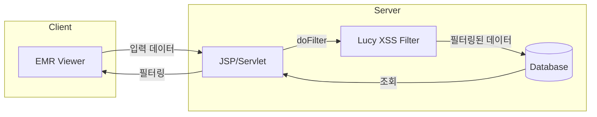

# Lucy XSS Filter 분석

> 분석일: 2026-03-07
> 분석 대상: `/mnt/n/99.SourceCode Backup/NPH/AADEV_NPH/workspace`

---

## 1. 개요

NPH 시스템은 **네이버 Lucy XSS Filter 1.1.2**를 사용하여 XSS(Cross-Site Scripting) 공격을 방어한다. 주로 EMR(전자의무기록) 데이터 저장 및 조회 시 입력값 필터링에 사용된다.

### 1.1 관련 솔루션

| 솔루션 | 버전 | 공급사 | 용도 |
|--------|------|--------|------|
| **lucy-xss** | 1.1.2 | 네이버 | XSS 방어 |

### 1.2 설치 위치

```
NPH_HIS/webapp/WEB-INF/lib/
└── lucy-xss-1.1.2.jar

NPH_ECS/webapp/WEB-INF/lib/
└── lucy-xss-1.1.2.jar
```

---

## 2. 아키텍처

### 2.1 XSS 방어 흐름



### 2.2 사용 패턴

```
입력값 → 기본 이스케이프 → XssFilter.doFilter() → DB 저장
        (&, <, >, ", ')
```

---

## 3. 핵심 API

### 3.1 XssFilter 클래스

```java
import com.nhncorp.lucy.security.xss.XssFilter;

// 싱글톤 인스턴스 획득
XssFilter lucyFilter = XssFilter.getInstance();

// XSS 필터링 수행
String safeString = lucyFilter.doFilter(inputString);
```

### 3.2 주요 메서드

| 메서드 | 설명 |
|--------|------|
| `XssFilter.getInstance()` | 싱글톤 인스턴스 반환 |
| `doFilter(String str)` | XSS 필터링 수행 |

---

## 4. 사용 패턴 분석

### 4.1 JSP/Servlet 표준 패턴

NPH에서 사용하는 표준 XSS 필터링 패턴:

```jsp
<%@ page import="com.nhncorp.lucy.security.xss.XssFilter"%>

<%!
// XSS 필터링 함수
String GetParamXSSFilter(String name) {
    XssFilter lucyFilter = null;
    if (name != null && !"".equals(name)) {
        lucyFilter = XssFilter.getInstance();

        // 1. 기본 HTML 이스케이프
        name = name.replaceAll("&", "&amp;");
        name = name.replaceAll("\"", "&quot;");
        name = name.replaceAll("\'", "&apos;");
        name = name.replaceAll("/", "&#x2F;");
        name = name.replaceAll("<", "&lt;");
        name = name.replaceAll(">", "&gt;");

        // 2. Lucy XSS Filter 적용
        if (lucyFilter != null) {
            name = lucyFilter.doFilter(name);
        }
    }
    return name;
}
%>

<%
// 사용 예
String ptid = GetParamXSSFilter(request.getParameter("ptid"));
String department = GetParamXSSFilter(request.getParameter("department"));
%>
```

### 4.2 Java Servlet 패턴

```java
// SaveRecord.java
import com.nhncorp.lucy.security.xss.XssFilter;

public class SaveRecord extends HttpServlet {

    protected String GetParamXSSFilter(String name) {
        XssFilter lucyFilter = null;
        if (name != null && !"".equals(name)) {
            lucyFilter = XssFilter.getInstance();
            name = name.replaceAll("&", "&amp;");
            name = name.replaceAll("\"", "&quot;");
            name = name.replaceAll("\'", "&apos;");
            name = name.replaceAll("/", "&#x2F;");
            name = name.replaceAll("<", "&lt;");
            name = name.replaceAll(">", "&gt;");
            if (lucyFilter != null) {
                name = lucyFilter.doFilter(name);
            }
        }
        return name;
    }

    protected String GetPathFilter(String name) {
        if (name != null && !"".equals(name)) {
            name = name.replaceAll("/", "");
            name = name.replaceAll("\\\\", "");
        }
        return name;
    }
}
```

---

## 5. 적용 범위

### 5.1 NPH_ECS (전자처방)

| 파일 | 용도 |
|------|------|
| `SaveRecord.java` | EMR 레코드 저장 |
| `SaveRecord_All.java` | EMR 레코드 일괄 저장 |
| `save_image.java` | 이미지 저장 |
| `save_document.java` | 문서 저장 |
| `save_xml.java` | XML 저장 |
| `DeleteRecord.java` | 레코드 삭제 |

### 5.2 NPH_HIS (EMR Viewer)

**eView JSP 파일 (11개):**
- `summary.jsp`
- `record_eView.jsp`
- `eddocument_eView.jsp`
- `MainPage.jsp`
- `mainRecInside.jsp`

**EMR_DATA JSP 파일 (11개):**
- `SaveRecord.jsp`
- `SaveRecord_All.jsp`
- `SaveImage.jsp`
- `SaveMedia.jsp`
- `save_xml.jsp`
- `dbAccess.jsp`
- `SelectSql.jsp`

### 5.3 적용 대상

```
총 22개 파일에서 사용 (NPH_ECS: 11개, NPH_HIS: 11개)
```

---

## 6. XSS 방어 메커니즘

### 6.1 이중 필터링

NPH는 **이중 필터링** 방식을 사용한다:

**1단계: 기본 HTML 이스케이프**
```java
name = name.replaceAll("&", "&amp;");      // & → &amp;
name = name.replaceAll("\"", "&quot;");    // " → &quot;
name = name.replaceAll("\'", "&apos;");    // ' → &apos;
name = name.replaceAll("/", "&#x2F;");      // / → &#x2F;
name = name.replaceAll("<", "&lt;");        // < → &lt;
name = name.replaceAll(">", "&gt;");        // > → &gt;
```

**2단계: Lucy XSS Filter**
```java
name = lucyFilter.doFilter(name);
```

### 6.2 방어 대상

| 공격 패턴 | 필터링 결과 |
|-----------|-------------|
| `<script>alert('xss')</script>` | `&lt;script&gt;alert('xss')&lt;/script&gt;` |
| `` | `&lt;img src=x onerror=alert('xss')&gt;` |
| `javascript:alert('xss')` | 필터링됨 |
| `<a href="javascript:...">` | 필터링됨 |

### 6.3 경로 필터링

```java
// 경로 조작 방지
protected String GetPathFilter(String name) {
    if (name != null && !"".equals(name)) {
        name = name.replaceAll("/", "");      // / 제거
        name = name.replaceAll("\\\\", "");   // \ 제거
    }
    return name;
}
```

---

## 7. Lucy XSS Filter 기능

### 7.1 기본 기능

Lucy XSS Filter는 네이버에서 개발한 오픈소스 XSS 방어 라이브러리다:

**주요 기능:**
- 화이트리스트 기반 HTML 태그 필터링
- 악성 스크립트 제거
- 이벤트 핸들러 제거 (onclick, onerror 등)
- URL 스킴 필터링 (javascript:, vbscript: 등)

### 7.2 지원 모드

| 모드 | 설명 |
|------|------|
| `XssFilter` | 일반 XSS 필터 |
| `XssSaxFilter` | SAX 파서 기반 필터 (대용량) |

NPH에서는 `XssFilter` 모드를 사용한다.

---

## 8. 보안 고려사항

### 8.1 적용 위치

```
입력 → JSP/Servlet → GetParamXSSFilter() → DB 저장
                                                    ↓
                                              DB 조회 → 화면 출력
```

**특징:**
- **입력 시점 필터링**: 저장 전에 XSS 필터링 수행
- **이중 방어**: 기본 이스케이프 + Lucy XSS Filter
- **경로 조작 방지**: 경로 문자(/, \) 제거

### 8.2 적용 범위 제한

Lucy XSS Filter는 **EMR 데이터 처리 영역**에만 적용되어 있다:

```
적용됨:
- EMR_DATA/*.jsp (NPH_HIS, NPH_ECS)
- eView/*.jsp (NPH_HIS)
- NPH_ECS/src/*.java (SaveRecord, save_image 등)

미적용:
- 일반 MiPlatform 화면 (Dataset 전송)
- 일반 비즈니스 로직
```

### 8.3 한계점

1. **입력 시점만 필터링**: 저장 시에만 필터링, 출력 시 미적용
2. **JSP/Servlet만 적용**: MiPlatform Dataset 전송에는 미적용
3. **화이트리스트 설정 없음**: 기본 설정만 사용

---

## 9. 파일 구조

### 9.1 NPH_HIS

```
NPH_HIS/webapp/
├── EMR_DATA/
│   ├── SaveRecord.jsp          # EMR 레코드 저장
│   ├── SaveRecord_All.jsp      # 일괄 저장
│   ├── SaveImage.jsp           # 이미지 저장
│   ├── SaveMedia.jsp           # 미디어 저장
│   ├── save_xml.jsp            # XML 저장
│   ├── dbAccess.jsp            # DB 접근
│   └── ...
├── eView/
│   ├── summary.jsp             # 요약 뷰
│   ├── record_eView.jsp        # 레코드 뷰
│   ├── eddocument_eView.jsp    # 문서 뷰
│   └── popup/*.jsp              # 팝업들
└── WEB-INF/lib/
    └── lucy-xss-1.1.2.jar
```

### 9.2 NPH_ECS

```
NPH_ECS/
├── src/
│   ├── SaveRecord.java         # EMR 레코드 저장
│   ├── SaveRecord_All.java     # 일괄 저장
│   ├── save_image.java         # 이미지 저장
│   ├── save_document.java      # 문서 저장
│   ├── save_xml.java           # XML 저장
│   └── ...
└── webapp/WEB-INF/lib/
    └── lucy-xss-1.1.2.jar
```

---

## 10. 코드 예시

### 10.1 EMR 레코드 저장 (SaveRecord.java)

```java
@WebServlet("/EMR_DATA/SaveRecord")
public class SaveRecord extends HttpServlet {

    protected void doPost(HttpServletRequest request,
                          HttpServletResponse response)
            throws ServletException, IOException {

        // XSS 필터링
        String ptid = GetParamXSSFilter(request.getParameter("ptid"));
        String docCode = GetParamXSSFilter(request.getParameter("docCode"));
        String content = GetParamXSSFilter(request.getParameter("content"));

        // DB 저장
        // ...
    }

    protected String GetParamXSSFilter(String name) {
        XssFilter lucyFilter = null;
        if (name != null && !"".equals(name)) {
            lucyFilter = XssFilter.getInstance();
            name = name.replaceAll("&", "&amp;");
            name = name.replaceAll("\"", "&quot;");
            // ... 기타 이스케이프
            if (lucyFilter != null) {
                name = lucyFilter.doFilter(name);
            }
        }
        return name;
    }
}
```

### 10.2 JSP 요약 페이지 (summary.jsp)

```jsp
<%@ page import="com.nhncorp.lucy.security.xss.XssFilter"%>

<%!
String GetParamXSSFilter(String name) {
    XssFilter lucyFilter = null;
    if (name != null && !"".equals(name)) {
        lucyFilter = XssFilter.getInstance();
        name = name.replaceAll("&", "&amp;");
        name = name.replaceAll("\"", "&quot;");
        name = name.replaceAll("\'", "&apos;");
        name = name.replaceAll("/", "&#x2F;");
        name = name.replaceAll("<", "&lt;");
        name = name.replaceAll(">", "&gt;");
        if (lucyFilter != null) {
            name = lucyFilter.doFilter(name);
        }
    }
    return name;
}
%>

<%
String ptid = GetParamXSSFilter(request.getParameter("ptid"));
String department = GetParamXSSFilter(request.getParameter("department"));

// DB 조회 및 출력
// ...
%>
```

---

## 11. 연결 문서

- [security-auth-개요.md](./security-auth-개요.md)
- [Tech-Stack-개요.md](../../030.index/0307.Tech%20Stack/Tech-Stack-개요.md)

---

## 12. 분석 필요 항목

### 12.1 XSS Filter 설정

- Lucy XSS Filter 화이트리스트 설정 확인
- lucy-xss.xml 설정 파일 존재 여부

### 12.2 MiPlatform Dataset

- MiPlatform Dataset 전송 시 XSS 필터링 방식
- MiplatformConverter 필터링 여부

---

*분석 완료: 2026-03-07*