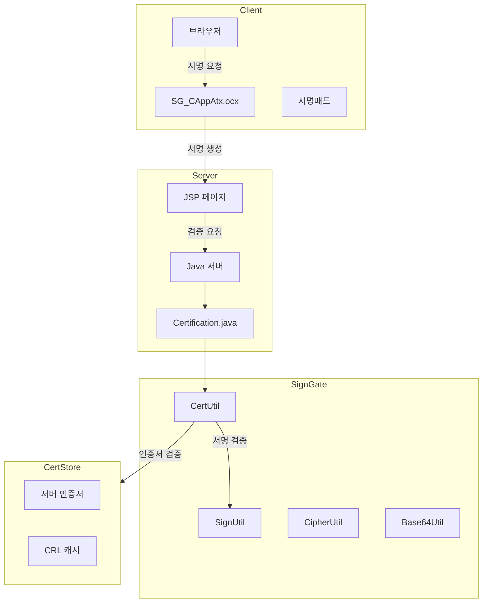

# SignGate 전자서명 분석

> 분석일: 2026-03-07
> 분석 대상: `/mnt/n/99.SourceCode Backup/NPH/AADEV_NPH/workspace`

---

## 1. 개요

NPH 시스템은 **KIS(한국정보인증) SignGate** 솔루션을 사용하여 공인인증서 기반 전자서명 기능을 제공한다. SignGate는 의료 문서의 전자서명, 본인 확인, 데이터 암호화 등에 활용된다.

### 1.1 관련 솔루션

| 솔루션 | 용도 |
|--------|------|
| **signgateCrypto.jar** | 암호화/서명 유틸리티 |
| **signgate_common.jar** | SignGate 공통 모듈 |
| **SG_CAppAtx.ocx** | ActiveX 클라이언트 컨트롤 |
| **signgateCrypto.jar** | Java 서버용 암호화 라이브러리 |

### 1.2 설치 위치

```
NPH_HIS/webapp/WEB-INF/lib/
├── signgateCrypto.jar
└── signgate_common.jar

NPH_HIS/webapp/EMR_DATA/script/sg_scripts/
└── sg_basic.js          # ActiveX API 래퍼

NPH_HIS/CertKit/cert/
├── signCert.der        # 서버 서명 인증서
├── signPri.key         # 서버 서명 개인키
├── kmCert.der          # 키관리 인증서
├── kmPri.key           # 키관리 개인키
├── encPasswd           # 암호화 비밀번호
└── crl/                # CRL 캐시 디렉토리
```

---

## 2. 아키텍처

### 2.1 전자서명 흐름



### 2.2 컴포넌트 구조

```
signgate.crypto.util 패키지
├── CertUtil        # 인증서 처리
├── SignUtil        # 전자서명/검증
├── CipherUtil      # 암호화/복호화
├── Base64Util      # Base64 인코딩
└── FileUtil        # 파일 I/O

signgate.core.provider
└── SignGATE        # Provider 등록
```

---

## 3. 설정

### 3.1 his.xml 인증서 설정

```xml
<cert-info>
    <cert-domain>@nph.or.kr</cert-domain>
    <crl-cache-dir>C:\AADEV_NPH\workspace\NPH_HIS\CertKit\cert\crl\</crl-cache-dir>
    <cert-path>C:\AADEV_NPH\workspace\NPH_HIS\CertKit\cert\</cert-path>

    <sign-cert-file>signCert.der</sign-cert-file>
    <sign-key-file>signPri.key</sign-key-file>

    <km-cert-file>kmCert.der</km-cert-file>
    <km-key-file>kmPri.key</km-key-file>

    <enc-passwd-file>encPasswd</enc-passwd-file>

    <allow-policy-oids>
        1.2.410.200004.5.2.1.1,    <!-- 한국정보인증(법인) -->
        1.2.410.200004.5.2.1.2,    <!-- 한국정보인증(개인) -->
        1.2.410.200004.5.1.1.5,    <!-- 증권전산(개인) -->
        1.2.410.200004.5.1.1.7,    <!-- 증권전산(법인) -->
        1.2.410.200005.1.1.1,      <!-- 금융결제원(개인) -->
        1.2.410.200005.1.1.5,      <!-- 금융결제원(법인) -->
        1.2.410.200004.5.3.1.9,    <!-- 한국전산원(개인) -->
        1.2.410.200004.5.3.1.2,    <!-- 한국전산원(법인) -->
        1.2.410.200004.5.3.1.1,    <!-- 한국전산원(기관) -->
        1.2.410.200004.5.4.1.1,    <!-- 전자인증(개인) -->
        1.2.410.200004.5.4.1.2,    <!-- 전자인증(법인) -->
        1.2.410.200012.1.1.1,      <!-- 한국무역정보통신(개인) -->
        1.2.410.200012.1.1.3,      <!-- 한국무역정보통신(법인) -->
        1.2.410.200004.5.2.1.6.141 <!-- 기타 -->
    </allow-policy-oids>
</cert-info>
```

### 3.2 허용 인증서 정책 OID

| OID | 발급기관 | 유형 |
|-----|----------|------|
| 1.2.410.200004.5.2.1.1 | 한국정보인증 | 법인 |
| 1.2.410.200004.5.2.1.2 | 한국정보인증 | 개인 |
| 1.2.410.200004.5.1.1.5 | 증권전산 | 개인 |
| 1.2.410.200004.5.1.1.7 | 증권전산 | 법인 |
| 1.2.410.200005.1.1.1 | 금융결제원 | 개인 |
| 1.2.410.200005.1.1.5 | 금융결제원 | 법인 |
| 1.2.410.200004.5.3.1.9 | 한국전산원 | 개인 |
| 1.2.410.200012.1.1.1 | 한국무역정보통신 | 개인 |

---

## 4. 핵심 클래스

### 4.1 Certification.java (서버 인증서 관리)

```java
public class Certification {
    // 서버 인증서 정보
    private byte[] serverSignCert;     // 서버 서명 인증서
    private byte[] serverKmCert;        // 키관리 인증서

    // 외부 제공용 PEM 형식
    private String serverSignCertPem;
    private String serverKmCertPem;

    // 허용된 정책 OID
    private ArrayList<String> allowPolicyOid;

    // 싱글톤 패턴
    public static Certification getInstance() {
        return instance;
    }

    // 초기화: his.xml에서 설정 로드
    private void initialize() {
        // 인증서 파일 읽기
        serverSignCert = FileUtil.readBytesFromFileName(serverSignCertFile);
        serverKmCert = FileUtil.readBytesFromFileName(serverKmCertFile);

        // PEM 변환
        serverSignCertPem = CertUtil.derToPem(serverSignCert);
        serverKmCertPem = CertUtil.derToPem(serverKmCert);
    }
}
```

### 4.2 PublicCertUC.java (사용자 인증서 검증)

```java
public class PublicCertUC {

    // 인증서 정보 조회
    public LData getUserCertInfo() throws LException {
        CertUtil certUtil = new CertUtil(userCert.getBytes());

        lUserCertInfo.setString("userDn", certUtil.getSubjectDN());
        lUserCertInfo.setString("publisherDn", certUtil.getIssuerDN());
        lUserCertInfo.setString("certSerialNm", certUtil.getSerialNumber());
        lUserCertInfo.setString("certEffStartDt", certUtil.getNotBefore());
        lUserCertInfo.setString("certEffEndDt", certUtil.getNotAfter());
        lUserCertInfo.setString("certPolicyOid", certUtil.getPolicyOid());

        return lUserCertInfo;
    }

    // 정책 OID 검증
    public boolean isAllowPolicy() {
        String certPolicy = lUserCertInfo.getString("certPolicyOid");
        ArrayList<String> oids = cert.getAllowPolicyOids();
        for(int i=0; i<oids.size(); i++){
            if(oids.get(i).equals(certPolicy)) return true;
        }
        return false;
    }

    // 본인 확인
    public boolean isValidUser(String ssn) throws LException {
        CertUtil certUtil = new CertUtil(userCert.getBytes());
        return certUtil.isValidUser(ssn, certSerialNm);
    }

    // 서명 검증
    public boolean isVerifySignature(String userCertKey, String orgMsg, String certValue) {
        SignUtil sign = new SignUtil();
        sign.verifyInit(userCertKey.getBytes());
        sign.verifyUpdate(orgMsg.getBytes());
        return sign.verifyFinal(Base64Util.decode(certValue));
    }
}
```

---

## 5. JavaScript API (sg_basic.js)

### 5.1 ActiveX 컨트롤

```javascript
// ActiveX 객체 생성
document.write('<object classid="clsid:9FC84F7D-D177-4A75-A7BB-429DA5BD0A3E"
    style="display: none;" id="SG_ATL"> </object>');

// 초기화
function initCryptoApi() {
    bUseKMCert = true;
    strHashAlg = "";
    strEncryptAlg = "ARIA-CBC";  // 또는 SEED-CBC
    szEncryptKeyLen = 16;        // SEED(16), ARIA(16/24/32)
}
```

### 5.2 주요 함수

| 함수 | 설명 |
|------|------|
| `LoadUserKeyCertDlg(UseKMCert)` | 인증서 선택 대화상자 |
| `GetUserSignCert()` | 서명용 인증서 획득 |
| `GetUserKMCert()` | 키관리용 인증서 획득 |
| `GenerateDigitalSignatureSG(hashAlg, data)` | 전자서명 생성 |
| `VerifyDigitalSignatureSG(hashAlg, data, sign, cert)` | 전자서명 검증 |
| `CheckCertOwner(cert, ssn, rNumber)` | 인증서 소유자 확인 |
| `ValidateCert(cert)` | 인증서 유효성 검증 |
| `GenPKCS7SignedMsg(data)` | PKCS#7 서명 메시지 생성 |
| `VrfPKCS7Msg(data)` | PKCS#7 서명 메시지 검증 |

### 5.3 암호화 함수

```javascript
// 대칭키 암호화
function EncryptDataSG(strKeyID, strInData) {
    return SG_ATL.EncryptDataSG(strKeyID, strInData, 1);
}

function DecryptDataSG(strKeyID, strInData) {
    return SG_ATL.DecryptDataSG(strKeyID, strInData, 1);
}

// 비대칭키 암호화
function GenPKCS7EnvelopedMsg(InData, MyCert, RcvCert) {
    return SG_ATL.GenPKCS7EnvelopedMsg(InData, MyCert, RcvCert);
}
```

---

## 6. 서버 측 처리 (sample.jsp)

### 6.1 서명 검증 흐름

```jsp
<%
// 1. SignGate Provider 등록
SignGATE.addProvider();

// 2. 서버 인증서 로드
byte[] keyBytes = FileUtil.readBytesFromFileName(kmPriPath);
String certpasswd = "a123456A";

// 3. 인증서 유틸리티 생성
CertUtil certutil = new CertUtil(Base64Util.decode(signCert));

// 4. 서명 검증
SignUtil signverify = new SignUtil(sigAlgName);
signverify.verifyInit(certutil.getCertBytes());
signverify.verifyUpdate(orgMessage.getBytes());
boolean result = signverify.verifyFinal(Base64Util.decode(signMessage));

// 5. 본인 확인
CipherUtil deccipher = new CipherUtil("RSA");
deccipher.decryptInit(keyBytes, certpasswd);
byte[] decdata = deccipher.decryptUpdate(Base64Util.decode(R));
boolean isValid = certutil.isValidUser(ssn, Base64Util.encode(decdata));

// 6. 정책 OID 검증
boolean isOid = false;
for (int i = 0; i < AllowedPolicyOIDs.length; i++) {
    if (certutil.getPolicyOid().equals(AllowedPolicyOIDs[i]))
        isOid = true;
}

// 7. CRL 검증
boolean isValidCert = certutil.isValid(true, crlPath);
%>
```

---

## 7. 암호화 알고리즘

### 7.1 지원 알고리즘

| 알고리즘 | 용도 | 키 길이 |
|----------|------|---------|
| **SHA1withRSA** | 서명 (레거시) | - |
| **SHA256withRSA** | 서명 (권장) | - |
| **SEED-CBC** | 대칭 암호화 | 128-bit |
| **ARIA-CBC** | 대칭 암호화 | 128/192/256-bit |
| **RSA** | 비대칭 암호화 | 2048-bit |

### 7.2 PKCS#7 메시지 타입

| 타입 | 설명 |
|------|------|
| Signed | 서명 메시지 |
| Enveloped | 봉투 암호화 메시지 |
| SignedAndEnveloped | 서명+암호화 메시지 |

---

## 8. 사용 시나리오

### 8.1 의료 문서 서명

```
1. 사용자 인증서 선택 (ActiveX)
   └─> LoadUserKeyCertDlg()
2. 서명용 인증서 획득
   └─> GetUserSignCert()
3. 서명 생성
   └─> GenerateDigitalSignatureSG(SHA256, documentData)
4. 서버 전송
   └─> signMessage, signCert, userId
5. 서버 검증
   └─> PublicCertUC.isVerifySignature()
6. 본인 확인
   └─> PublicCertUC.isValidUser(ssn)
7. 인증서 정책 검증
   └─> PublicCertUC.isAllowPolicy()
```

### 8.2 서버 인증서 제공

```jsp
<!-- serverCert.jsp -->
<%
// 서버 인증서 PEM 형식으로 제공
String certFilePath = "/apps/src/HISECS/webapp/signgate/cert/kmCert.der";
byte[] certBytes = FileUtil.readBytesFromFileName(certFilePath);
CertUtil certutil = new CertUtil(certBytes);
out.println(URLEncoder.encode(certutil.derToPem()));
%>
```

---

## 9. 보안 고려사항

### 9.1 인증서 검증

- **정책 OID 검증**: 허용된 CA에서 발급한 인증서만 승인
- **CRL 검증**: 인증서 폐기 목록 확인
- **유효기간 검증**: 인증서 만료일 확인
- **본인 확인**: 주민등록번호와 인증서 매칭

### 9.2 서버 보안

- **서버 인증서**: signCert.der, kmCert.der
- **개인키 보호**: signPri.key, kmPri.key
- **비밀번호 암호화**: encPasswd 파일

### 9.3 ActiveX 의존성

- SG_CAppAtx.ocx는 ActiveX 기반
- IE 브라우저 전용
- 최신 브라우저에서는 지원되지 않음

---

## 10. 파일 구조

### 10.1 서버 파일

```
NPH_HIS/
├── CertKit/cert/
│   ├── signCert.der      # 서버 서명 인증서 (DER)
│   ├── signPri.key       # 서버 서명 개인키
│   ├── kmCert.der        # 키관리 인증서
│   ├── kmPri.key         # 키관리 개인키
│   ├── encPasswd         # 암호화 비밀번호
│   └── crl/              # CRL 캐시 디렉토리
│
├── src/nph/his/core/cert/
│   └── Certification.java    # 인증서 관리 싱글톤
│
├── src/nph/his/az/com/uc/
│   └── PublicCertUC.java      # 사용자 인증서 검증 UC
│
└── webapp/WEB-INF/lib/
    ├── signgateCrypto.jar
    └── signgate_common.jar
```

### 10.2 클라이언트 파일

```
NPH_HIS/webapp/EMR_DATA/script/sg_scripts/
└── sg_basic.js           # ActiveX API 래퍼

NPH_ECS/webapp/signgate/
├── sample.jsp            # 샘플 서명 검증
├── serverCert.jsp        # 서버 인증서 제공
├── js/license.js         # 라이선스
└── css/jquery.mobile-*.css
```

---

## 11. 연결 문서

- [security-auth-개요.md](./security-auth-개요.md)
- [MagicSSO-인증흐름.md](./MagicSSO-인증흐름.md)
- [Tech-Stack-개요.md](../../030.index/0307.Tech%20Stack/Tech-Stack-개요.md)

---

## 12. 분석 필요 항목

### 12.1 SignPad 연동

- 서명패드 하드웨어와 SignGate 연동 방식
- EMR 문서 서명 처리 흐름

### 12.2 EMR 문서 서명

- EMR_DATA 문서 서명 처리
- painter.jar / signedpainter.jar 연동

---

*분석 완료: 2026-03-07*