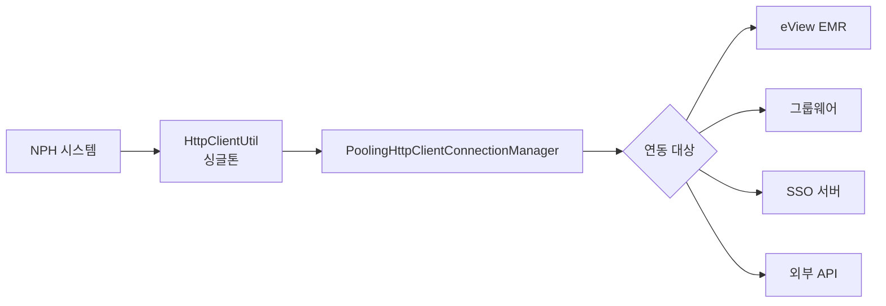

# HTTP/REST 클라이언트

> 최종 수정: 2026-03-08

---

## 1. 개요

NPH 시스템은 Apache HttpClient와 Jersey를 사용한다. 현재 소스 기준으로는 `Jersey = 내부 REST 서버/API`, `Apache HttpClient = 외부/내부 HTTP 호출 클라이언트` 역할이 직접 확인된다.

## 1A. 직접 확인 근거 파일

| 구분 | 직접 확인 근거 |
|------|----------------|
| Jersey/JAX-RS | `NPH_HIS/src/com/rest/api/*`, `NPH_HIS/webapp/WEB-INF/web.xml` |
| HttpClient 공통 유틸 | `NPH_HIS/src/com/rest/util/HttpClientUtil.java` |
| 실제 호출 | `NPH_HIS/src/nph/his/hp/com/uc/PolNetUC.java`, `LstUC.java`, `RegistImgnExmnRsltPacsToDb.java`, `SaveGwCMD.java`, `SaveSgCMD.java` |

---

## 2. JAR 파일

### 2.1 Apache HttpClient

| 파일명 | 버전 | 용도 |
|--------|------|------|
| **httpclient-4.5.3.jar** | 4.5.3 | HTTP 클라이언트 (최신) |
| **httpcore-4.4.6.jar** | 4.4.6 | HTTP 코어 |
| **commons-httpclient-3.1.jar** | 3.1 | HTTP 클라이언트 (구버전) |

### 2.2 Jersey (JAX-RS)

| 파일명 | 버전 | 용도 |
|--------|------|------|
| **jersey-bundle-1.19.4.jar** | 1.19.4 | JAX-RS 구현체 |

---

## 3. 주요 클래스

### 3.1 HttpClientUtil.java

```java
package com.rest.util;

import org.apache.http.client.methods.CloseableHttpResponse;
import org.apache.http.client.methods.HttpGet;
import org.apache.http.client.methods.HttpPost;
import org.apache.http.impl.client.CloseableHttpClient;
import org.apache.http.impl.conn.PoolingHttpClientConnectionManager;

/**
 * 외부기관 / 내부 API 서버 호출용 공통 HttpClient 유틸
 * - 싱글톤
 * - PoolingHttpClientConnectionManager 사용
 * - 타임아웃 설정
 * - 멀티스레드 안전
 */
public class HttpClientUtil {
    // HTTP GET/POST 요청 처리
    // 커스텀 CA 인증서 지원
}
```

### 3.2 연동 사례

| 파일 | 연동 대상 | URL |
|------|----------|-----|
| **RegistImgnExmnRsltPacsToDb.java** | eView EMR | `http://10.60.210.27/eView/document_interface.jsp` |
| **SaveGwCMD.java** | 그룹웨어 메신저 | `http://10.60.210.29:12555` |
| **SaveSgCMD.java** | SSO 인증 | `http://sso.nph.go.kr:40001/sso/kmich.jsp` |

---

## 4. 연동 대상

### 4.1 외부 기관 연동

| 구분 | 용도 |
|------|------|
| **eView** | EMR 결과기록지 연동 |
| **그룹웨어** | 메신저 연동 |
| **SSO** | 단일 로그인 인증 |

### 4.2 내부 API

| 구분 | 용도 |
|------|------|
| **REST 서비스** | 내부 REST API 제공 및 일부 HTTP 연동 |
| **마이플랫폼 연동** | 화면 간 데이터 통신 |

---

## 5. 기술 스택

| 기술 | 버전 | 상태 |
|------|------|------|
| **Apache HttpClient** | 4.5.3 | HTTP 클라이언트 (주 사용) |
| **Commons HttpClient** | 3.1 | 구버전 (레거시) |
| **Jersey** | 1.19.4 | JAX-RS 서버/API 구현 및 필터 |

---

## 6. 아키텍처



---

## 7. 관련 문서

- [README.md](./README.md)
- [C.FTP-SSH-클라이언트.md](./C.FTP-SSH-클라이언트.md)
- [E.SOAP-웹서비스.md](./E.SOAP-웹서비스.md)
